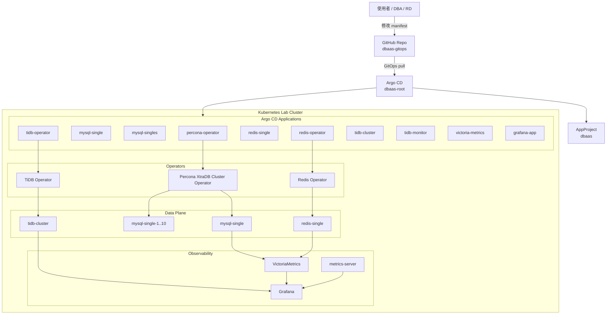

# 適用 104Corp 的 DBaaS 概念

## 簡報目標
- 說明目前 Lab 已實作的 DBaaS 骨架與服務邊界
- 展示 GitOps pull mode、Operator 與資料庫服務的關聯
- 盤點現階段已完成能力、已知限制與下一步
- 釐清正式環境仍需補齊的治理、資安與高可用項目

## 架構總覽
- 目前實作核心為 `Argo CD + GitHub + Kubernetes + Operator`
- 採 GitOps pull mode，由 `dbaas-root` 向下同步各 DB 與監控元件
- 已落地元件包含 MySQL、Redis、TiDB、VictoriaMetrics、Grafana
- 目前仍屬 lab / POC 架構，目標是先驗證可交付性，不是正式版控制平面

## Mermaid 架構圖

## 目前目錄與元件對應
- `dbaas-gitops/bootstrap/`：root application bootstrap
- `dbaas-gitops/projects/`：Argo CD AppProject 與 namespace 邊界
- `dbaas-gitops/clusters/lab/apps/`：各 Application 定義，含 `mysql-single`、`mysql-singles`、`redis-single`、`tidb-cluster`、`victoria-metrics`、`grafana`
- `dbaas-gitops/clusters/lab/operators/`：Percona Operator 等 operator 級資源
- `dbaas-gitops/clusters/lab/services/`：各 DB service 實際 manifest 與 instance 定義
- `Makefile`：重建、檢查、驗證入口，例如 `make mysql-check`、`make redis-check`、`make tidb-info-short`

## 入口層與存取路徑
- 目前對外入口以 Lab NodePort 為主，尚未實作正式 API Gateway / Portal
- 管理入口為 Argo CD：`https://172.24.40.17:31559`
- 監控入口為 Grafana：`http://172.24.40.17:30300`
- Metrics 查詢入口為 VictoriaMetrics：`http://172.24.40.17:30428`
- 資料庫對外入口目前已驗證 MySQL `30306`、Redis `30379`、TiDB `30400`

## 資料平面現況
- MySQL 採 `Percona XtraDB Cluster Operator`，已完成 `mysql-single` 與 `mysql-single-1..10`
- Redis 採 `OT-CONTAINER-KIT redis-operator`，已完成 `redis-single + redis-exporter`
- TiDB 採 `PingCAP tidb-operator`，已完成 `tidb-cluster` 與 `tidb-monitor`
- 儲存目前使用 `local-path`，對應各 node `/data`，僅適合 Lab 驗證
- 目前已實作的是 DB workload 與 endpoint 暴露，不是完整多租戶 DBaaS 產品介面

## 已完成的實作能力
- MySQL 已完成建庫、建表、寫入、查詢與外部連線驗證
- Redis 已完成 `PING`、資訊查詢與 exporter metrics 暴露
- TiDB 已完成 `select version(); show databases;` 與 Monitor 健康檢查
- `mysql-singles` 已驗證同一套 CRD / 不同 namespace / 不同 NodePort 的多產品接入模型

## 資料流與操作流程現況
- 現況流程為：修改 Git manifest -> push GitHub -> Argo CD sync -> Operator 建置 DB -> Service / NodePort 暴露 -> 驗證連線
- `private-demo` 已驗證 root app 可自 GitHub 拉取 child app 並建立 namespace / deployment / service
- `mysql-singles` 代表未來多產品申請模型，目前以 `mysql-single-1..10` 模擬 10 個 application 各自獨立 DB endpoint
- 這一段可在簡報中直接畫成 GitOps 時序圖，而不是傳統 API workflow

## 監控與維運現況
- 已落地 `VictoriaMetrics + Grafana + metrics-server`
- MySQL 已接 `mysqld-exporter`，VictoriaMetrics 可查 `mysql_up=1`
- Redis 已接 `redis-exporter`，可查 `redis_up`
- `metrics-server` 已安裝，可用 `kubectl top nodes/pods`
- 維運入口以 `Makefile` 為主，已有重建、檢查與資訊查詢指令

## 高可用、災難復原與現況差距
- 簡報需明講：目前完成的是 Lab MVP，不是正式可承諾 SLA 的 DBaaS 平台
- MySQL 雖使用 PXC/operator，但簡報內容不應過度宣稱正式 HA 治理已完成
- Redis 目前為 `redis-single`，`redis-sentinel / redis-ha` 尚未補齊
- 備份、還原、跨區 DR、RPO / RTO 與自動故障切換流程，目前多數仍停留在規劃層
- 若要對 104Corp 說明，建議把「已驗證」與「規劃中」分成兩欄呈現

## 目前已知問題與待辦事項
- DB Service Provision 規格設計規劃
- 節省多少費用 / 節省多少工時
  - 使用配額與 CRD 設定的差異
- 哪些資料使用屬性不適合進入 K8s DBaaS 環境
- 效能損耗比（比較 VM 與 K8s Pods）
- `local-path` storage 不適合正式高可用與災難復原場景；接入 shared storage 對效能的影響仍需評估
- K8s 叢集需要與現行 workers 同住或獨立部署（需蒐集 HVM 與 K8s 維運團隊意見）
  - 如果需要獨立存在，預算範圍需要哪些考量？
  - 可分階段上線，初期叢集資源不必過多，後續再擴張。

- 資料可攜與容災規劃設計
  - Active/Standby、Active/Passive 採哪一種？
  - 若資料同步不依賴原生 replica，下階段的非同步資料處理方式為何？
    - CDC

- GitOps pull 策略
  - 建議於上班日 19:00 到 20:00 合併 PR，以觸發部署。

- 其他
  - 使用 Operators，或自行設計 CRD、Config 與 RBAC
  - `tidb-operator` 目前停用 `tidb-scheduler`，僅保留與 `Kubernetes 1.29` 相容的最小組態
  - 大型 CRD 套件已有特殊處理，例如 Redis Operator 使用 `ServerSideApply=true`
  - 現況對外入口以 NodePort 為主，正式版仍需收斂 ingress、LB、private endpoint 策略
    - Database Service 的 NodePort 會隨機產生；需規劃不經 A10 也能降低服務建立依賴與耦合的設計方式

- Scale 策略設計及規劃
- 計費模型
- 升級作業方式呈現

## 下一步與演進方向
- 各服務 HA 架構閉環
- 若要進入真正 DBaaS，下一階段需補自助申請入口、審核流程、配額與標準規格模型
- 之後才適合擴展到 Backup / Restore / Upgrade / Decommission 的標準化工作流

## 已完成
- 已建立 `Argo CD + GitHub` 的 GitOps 交付骨架，可自動同步 DB 與監控元件
- 已驗證三類資料庫服務可運作：MySQL、Redis、TiDB
- 已建立監控基線：`VictoriaMetrics + Grafana + metrics-server`
- 已驗證多產品接入模型：`mysql-single-1..10` 可模擬 10 個產品各自獨立 DB endpoint
- 已具備 Lab 重建、狀態檢查與基本驗證指令，可重複展示 POC 能力

## 未完成
- 目前對外連線模式偏工程實驗用途，尚未收斂成企業標準接入方案
- 若未先補齊治理與流程，平台容易變成「可部署 DB」而非「可治理的 DBaaS」
- 尚未建立正式 DBaaS 入口，例如 Portal、申請 API、審批流程與配額控管
- 尚未完成正式等級 HA / DR 閉環，特別是 Redis HA、備份還原與跨區災難復原
- 尚未完成正式資安治理，包括 Secret 管理、細緻 RBAC、NetworkPolicy 與審計
- 尚未完成正式對外入口策略，目前仍以 Lab NodePort 為主
- 尚未把所有維運元件完全納入 GitOps 與標準 Runbook
