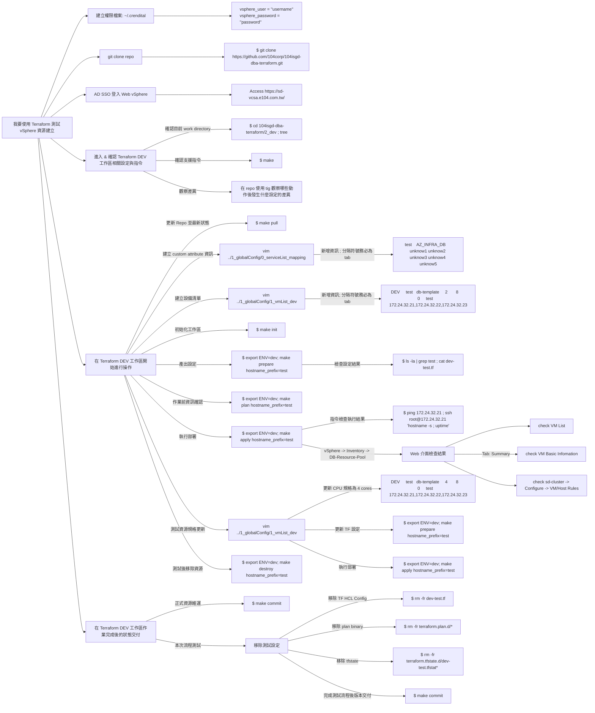

# 104isgd-dba-terraform

## Outline
- [Definitions and Objectives](#Definitions-and-Objectives)
- [Repo: 104isgd-dba-terraform 使用說明書](#Repo-104isgd-dba-terraform--Github-使用說明書)
- [Demo 流程說明](#Demo-流程說明)
- [Environment Information](#Environment-Information)
- [vSphere hierarchy / 權限架構](#vSphere-hierarchy--權限架構)
- [資源操作 Workflow](#資源操作-Workflow)
- [資源操作目前支援操作](#資源操作目前支援操作)
- [Apply 作業風險列表](#Apply-作業風險列表)

~~- [Tepmlate / VM Resourve Modify Workflow (EX: 當 CPU 從 4 -> 8 ; /dev/sdb 從 100 -> 200)]()~~

~~- [其他外部介面操作 vSphere (govc)]()~~

## Definitions and Objectives

- IaC Objectives 實踐
    - 可預測結果
    - 可重複流程
    - 可版本控制的程式碼/設定檔
    - 不同作業人員產出相同結果

## Environment Information

### Lab / Staging: [sd-vcsa.e104.com.tw](https://sd-vcsa.e104.com.tw)
```
Username: dbtf@vsphere.local / AD User for DBA Group
Password: 
```

### Prodution: [idc-vcsa.e104.com.tw](https://idc-vcsa.e104.com.tw)
```
Username: dbtf@vsphere.local / AD User for DBA Group
Password: 
```

### DR Site: [edc-vcsa.e104.com.tw](https://edc-vcsa.e104.com.tw)
```
Username: dbtf@vsphere.local / AD User for DBA Group
Password: 
```

---
## Repo [104isgd-dba-terraform @ Github](https://github.com/104corp/104isgd-dba-terraform) 使用說明書

```
├── 0_orig         (TF HCL Config pattern 存放處)
├── 1_globalConfig (設備單位從屬 & 設備清單存放處)
├── 2_dev          (Env: DEV      vSphere 工作區)
├── 3_staging      (Env: STAGING  vSphere 工作區)
├── 4_prod         (Env: PROD     vSphere 工作區)
├── 5_drsite       (Env: DR       vSphere 工作區)
├── README.md      (本份說明文件)
└── a_githook      (版本控制檢查機制 ; 避免 Makefile 以外的流程控制將機敏資訊 commit 進 Repo)
```

## Demo 流程說明


## vSphere hierarchy / 權限架構

### vSphere

- Inventories
    - 備註
        - 所有 DB VM 請建立在 DB-Resource-Pool 內
    - 實際圖示
        - 

- Folder for VMs and Templates
    - 備註: 對應目錄功能
        - Templates
            - 建立 VM 的 Template 參照存放位置
            - 所有 Template 將不含網路介面，開立 VM 時由 Terraform 建立時指定
        - testing
            - 所有 vSphere 操作測試區
        - VM-DEV
            - DEV VM 存放位置
        - VM-STAGING
            - STAGING VM 存放位置
    - 實際圖示
        - 

- Datastore for Storage
    - 備註
        - 在現有 data store 建立 VM 均需設定 Disk Type: Thin Provision
        - 自動回收機制說明: 
            - hypervisor team 對回收政策目前無額外調整需求，故以預設設定  "Enabled at Low priority: Deleted or unmapped blocks are reclaimed on the LUN at low priority" 處理為主 ; 由 vSphere 機制自主處理
        - 現有 data store naming 由現存 VM & 產品名稱規劃建立
        - 如有新產品 & Service Group 建立時，請向 Hypervisor Team 確認 Data Store 是否已建立
        - DataStore & Service Group Naming Policy
            - DEV/STAGING
                - ENV: (D: DEV / S:STAGING)
                - D1_\${ENV}_\${[lowercase]Serevice_Group}
                    - EX: D1_D_pxc-b
                    - EX: D1_D_mgc-jbb
                    - EX: D1_S_pxc-b
                    - EX: D1_S_mgc-jbb
            - PROD
                - S_DBA_\${[lowercase]Serevice_Group}
                    - EX: S_DBA_pxc-b
                    - EX: S_DBA_mgc-jbb
    - 實際圖示
        - 
        - 

- Networking
    - 備註
        - DB VM 需要開立的網段設定
        - DEV: VLAN241-172.24.32.0/20
        - STAGING: VLAN2132-172.21.32.0/20
        - PROD: VLAN20-172.30.32.0/20
        - DR Site: ${FIXME}
        - 如果在 vSpuere in-guest VM 有 virtualization 需求時，需在所有 ESXi Hosts 的 vNIC 開通 Security 設定
            - Promiscuous mode
            - MAC address changes
            - Forged transmits
    - 實際圖示
        - 

- Custom Attribute
    - Prefix: AZ_
    - 環境：LAB / STG / PROD / DR / OA
    - 管理單位：NET / WEB / DB
    - 提供給MIS串接時，需過濾環境為OA的用戶端設備

### 權限架構
- 
- 
- 

---

## Apply 作業風險列表

### [高風險] Apply Resource recreate item

### [低風險] Resource config apply immediately

## 資源操作 Workflow

### Workflow Diagram [Raw Content](#Workflow-Raw-Content-Link-Back)


### 環境參數檢查 Workflow Diagram [Raw Content](#環境參數檢查-Workflow-Raw-Content-Link-Back)


### Terraform Resource Deploy Workflow Diagram [Raw Content]()
- 依序建立資源
    - resource "vsphere_virtual_machine"
      - VM 隸屬的 Metadata 與 IP 設定
    - resource "vsphere_compute_cluster_vm_anti_affinity_rule"
      - 每一個 Service Group 將被歸類在 VM Group 內 ; 由 DRS 統一管理資源配置

---

~~## Tepmlate / VM Resourve Modify Workflow (EX: 當 CPU 從 4 -> 8 ; /dev/sdb 從 100 -> 200)~~

~~### 123~~

~~### 123~~

~~### 123~~

---

## 資源操作目前支援操作
### 建立 VM 的必備設定 @ vSphere
### 新增 VM
### 刪除 VM
### VM 更新 (CPU/Memory) 資源設定
### VM 新增 (Data Volumn) 資源設定
### VM 增加 (Data Volumn) 資源設定
### VM 縮減 (Data Volumn) 資源設定

### UI 對 DB VM 操作提醒
- 關機
    - Power Off: 
        - **Powers off a virtual machine. Powering off a virtual machine might cause loss of data within the guest operating system.**
    - Reset: 
        - **Restarts the guest operating system. By using this operation, the virtual machine powers off and then powers on. By resetting a virtual machine, you might lose all unsaved information within the guest operating system.**
    - Hard Stop
        - **You can use this operation only when you cannot power off a virtual machine or if a virtual machine becomes unresponsive. When you hard stop a virtual machine, all processes are ended and the virtual machine is powered off. By using this operation, you might lose all unsaved information.**
    - Shut Down Guest OS: 
        - **Graceful shutdown this VM.**
    - Restart Guest OS: 
        - **Graceful reset this VM.**
- Migrate
    - Compute Resource
    - Data Store

~~- Snapshot~~

~~- 123~~

~~- 123~~

---

~~## 其他外部介面操作 vSphere (govc)~~

~~### 123~~

~~### 123~~

~~### 123~~

---

# Backlog

## Workflow Raw Content [Link](https://showme.redstarplugin.com/s/rqjhwKn8) [Back](#Workflow-Diagram-Raw-Content)

```
graph LR
    A[我要開 VM]
    B[確認作業權限需求]
    B1[Terraform]
    B2[GOVC]
    A --> B
    B --> B1
    B --> B2
    C[Environment]
    C --> D[Dev/Staging]
    C --> P[Prod]
    C --> Q[DR Site]
    D --> E[需要準備哪些資訊]
    E --> J1[確認可用 IP]
    E --> J2[確認 Data Store 位置]
    E --> J3[確認 Service Group 名稱]
    E --> J4[建立設備清單]
    E --> J5[Precheck]
    J5 --> L1[確認 IP 是否正在使用]
    L1 --> M1[如果 IP 已被使用, 終止程序]
    J5 --> L2[確認 ENV 參數確認作業環境]
    J5 --> L3[確認 Service Group 設定相符合]
    E --> J6[Execute Steps]
    J6 --> K1["**make** # for echo help message
    **make init** # init env config
    **make prepare** # TF HCL Config
    **make plan** # Verify TF HCL Config
    **make apply** # for deploy resource
    **make destroy** # for destroy resource"]
    K1 --> F[建立 TF 設定]
    K1 --> G[確認 TF 設定 Plan 狀態]
    K1 --> H[執行 Apply 部署環境]
    K1 --> I[確認 vSphere UI 資源狀態符合預期]

style K1 text-align:left
```

## 環境參數檢查 Workflow Raw Content [Link](https://showme.redstarplugin.com/s/rqjhwKn8) [Back](#環境參數檢查-Workflow-Diagram-Raw-Content)
```
graph LR
A[Environment Check]
A --> B[Credential]
A --> C[Resource 作業用參數]
B --> BA[Terraform]
BA --> BA1[".crendital: vsphere_user = ''username''
.crendital: vsphere_password = ''password''"]
B --> BB[GOVC]
BB --> BB1[".$shellrc:
GOVC_URL=''sd-vcsa.e104.com.tw''
GOVC_USERNAME=''dbtf username''
GOVC_PASSWORD=''dbtf password''
GOVC_INSECURE=''true''
GOVC_DATACENTER=''sd-datacenter''
GOVC_FOLDER=''/sd-datacenter/vm/DBA/VM''
GOVC_DATASTORE=''dev_db01''
GOVC_RESOURCE_POOL=''DB-Resource-Pool''
GOVC_NETWORK=''VLAN19-172.19.0.0/16''"]

C[Resource 作業用參數]
C --> CA[ENV/Service Group Name]
CA --> CA1[ENV: dev/staging/prod/drsite]
CA --> CA2["Usage: 
export ENV=dev; make prepare hostname_prefix=dbhvm
export ENV=dev; make plan hostname_prefix=dbhvm
export ENV=dev; make apply hostname_prefix=dbhvm
export ENV=dev; make destroy hostname_prefix=dbhvm"]
C --> CB[DataStore Name & Resource 清單格式說明]
CB --> CC1[1_globalConfig/0_serviceList_mapping Custom Attribute 用, 定義設備出帳用]
CB --> CC2[1_globalConfig/1_vmList_*, 定義設備清單用]
CC1 --> CC11["service_name
AZ 非 AZ_INFRA_\*、AZ_OA_\* VM 將被歸類為設備出帳清單
BillDomain
BillUnit
DeveloperOwner
Group
SystemOwner"]
CC2 --> CC21["environment dev/staging/prod/drsite
hostname Prefix EX: pxc-b / proxysql-b
template_name 目前僅一 Almalinux 8.7 版本為主
cpu Unit: cores ; EX: 8 cores
memory Unit: GB ; EX: 16 GB
data_volumn Unit: GB ; EX: 0 [VM 不需要 data volumn] ; EX: 100 VM 需要 100GB /dev/sdb data column
data_store 參考 datastore 說明 / #vSphere
IP_List 幾個 IP 表示建立幾個相同規格的 VM ; EX: 172.30.32.1,172.30.32.2"]

style BB1 text-align:left
style BA1 text-align:left
style CA2 text-align:left
style CC11 text-align:left
style CC21 text-align:left
```
