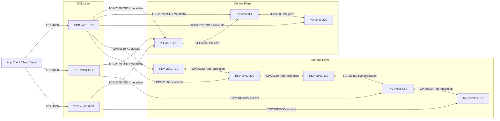
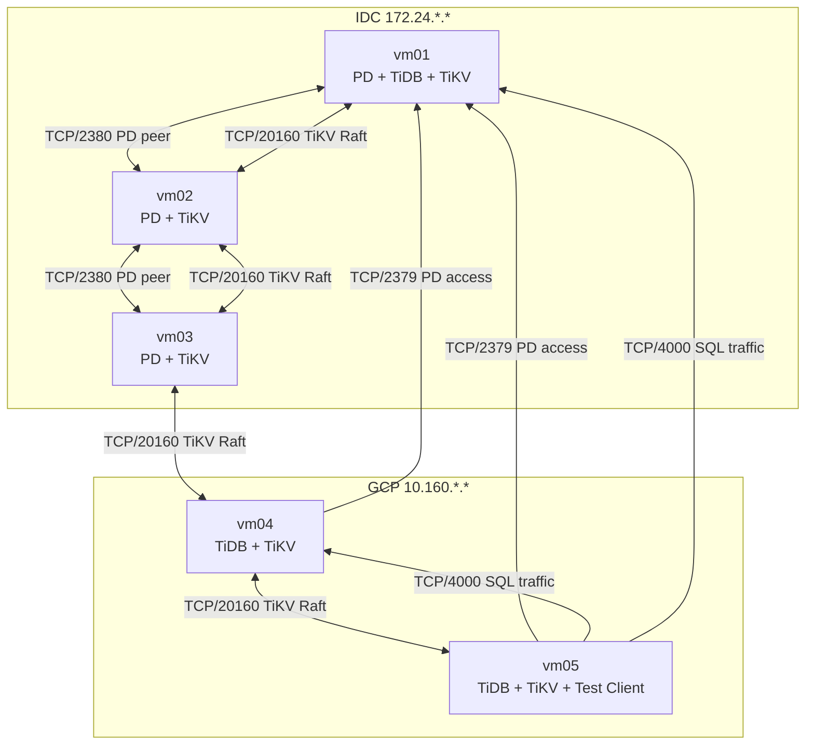

# TiDB IDC-GCP Mermaid Draft

## 1. Logical Architecture

## 2. Physical Deployment

## 3. Drawing Notes

- PD quorum in IDC
- SQL entry in IDC and GCP
- Cross-site TiKV replication between IDC and GCP
- PoC mixed-role deployment, not production best practice
- No dedicated monitoring / bastion / automation node
