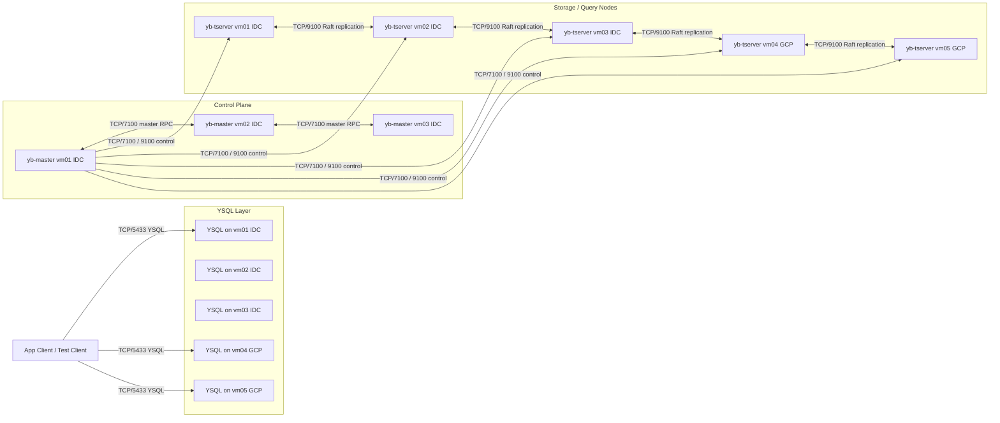
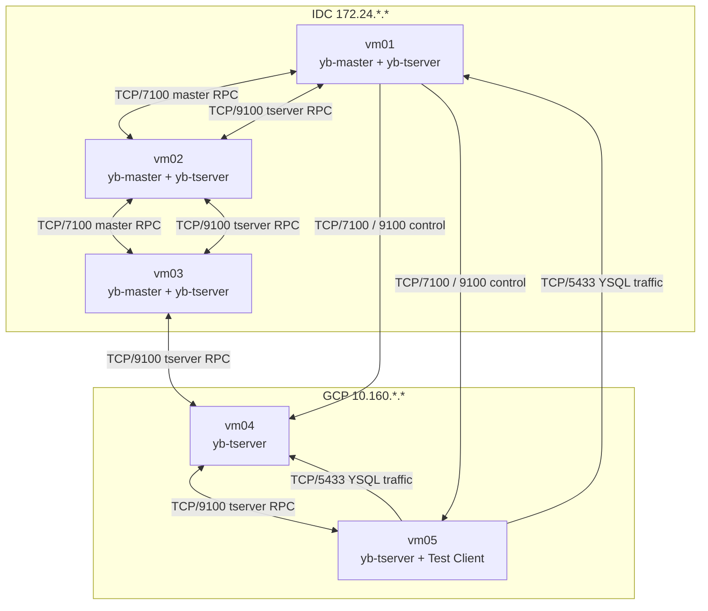

# YugabyteDB IDC-GCP Mermaid Draft

## 1. Logical Architecture

## 2. Physical Deployment

## 3. Drawing Notes

- Master quorum in IDC
- TServer distributed across IDC and GCP
- Cross-site Raft replication between IDC and GCP
- Placement policy directly affects failover and write latency
- PoC mixed-role deployment, not production best practice
