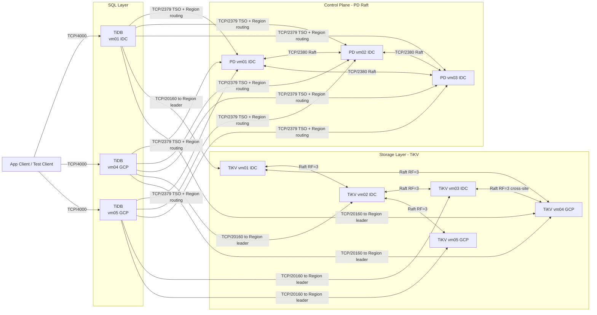
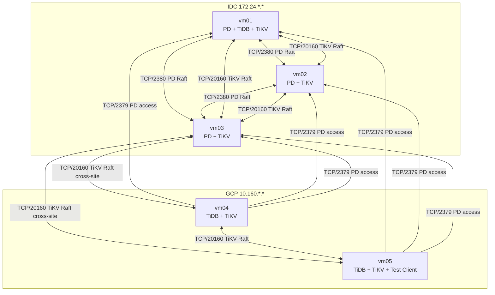

# TiDB IDC-GCP Architecture

## 1. Logical Architecture

**Notes:**
- TiDB uses PD to locate Region leader; any TiDB can reach any TiKV — cross-site connections shown are representative
- Each Region Raft group has RF=3 replicas; PD schedules placement across IDC and GCP to ensure cross-site quorum
- All TiDB nodes must connect to all PD nodes for TSO and Region routing

## 2. Physical Deployment

## 3. Drawing Notes

- PD quorum in IDC (3 nodes); GCP TiDB access all PD nodes for TSO
- Any TiDB can route to any TiKV Region leader regardless of site
- Each TiKV Raft group spans IDC and GCP nodes (RF=3); cross-site Raft write latency is expected
- PoC mixed-role deployment, not production best practice
- No dedicated monitoring / bastion / automation node
