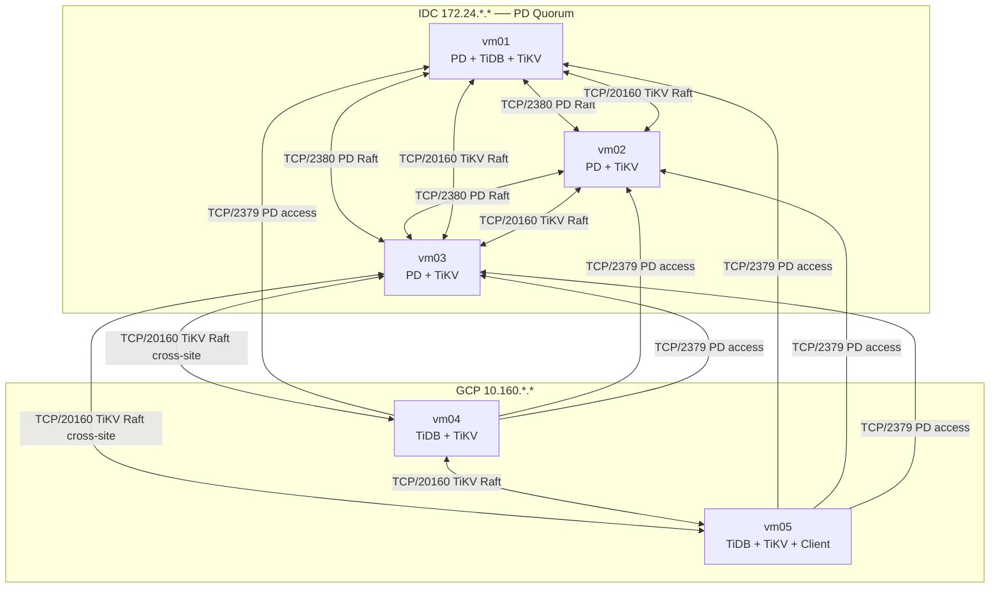
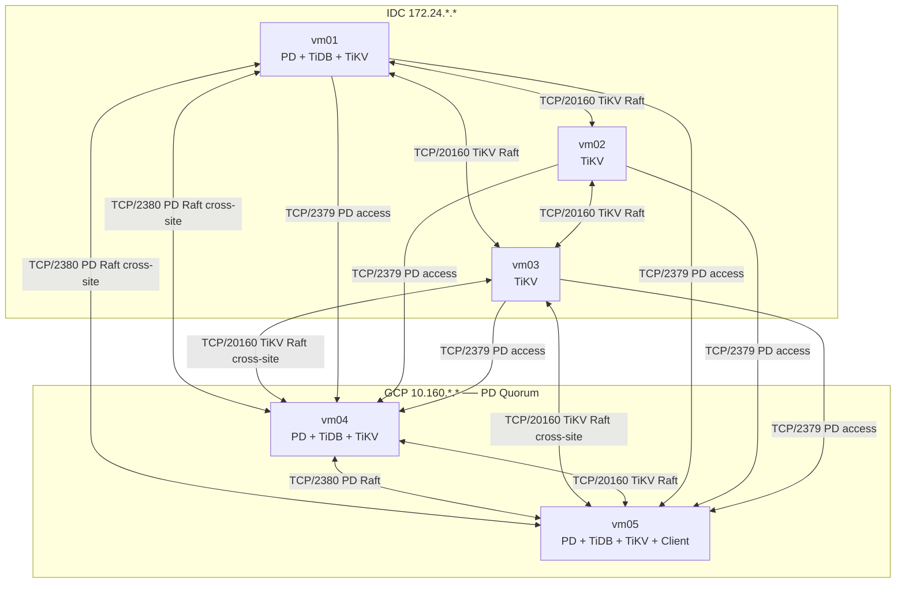
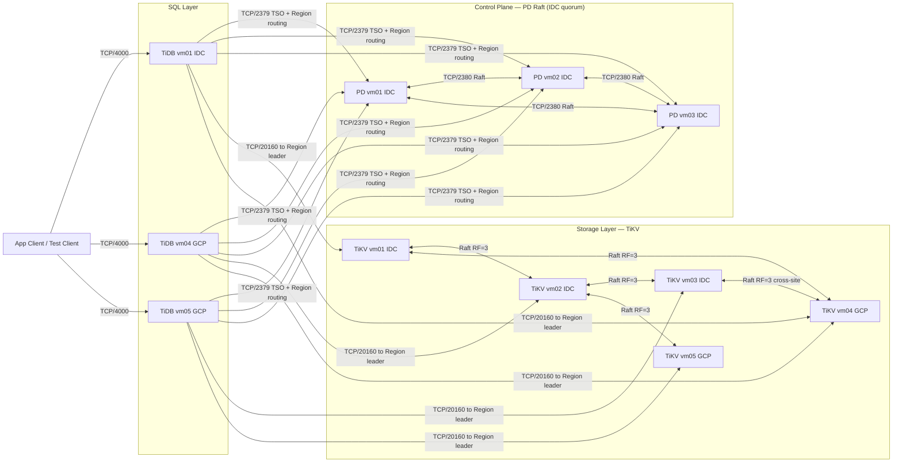
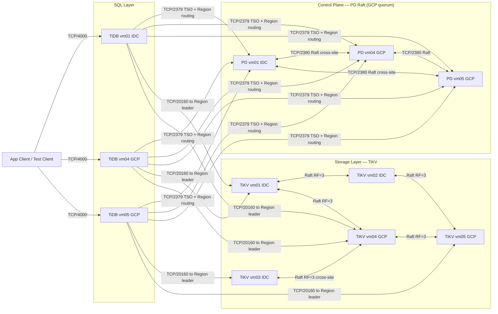

# TiDB IDC-GCP Architecture

## 1. Scenario Analysis

四個驗證情境與對架構的技術要求：

| # | 專線 | 流量 | PD quorum 需求 | TiKV replica 需求 |
|---|------|------|---------------|-----------------|
| S1 | 正常 | IDC 50% / GCP 50% | 兩站皆可達任一 PD | 跨站皆有 replica |
| S2 | 正常 | 全切至 GCP（計劃性） | GCP TiDB 可達 IDC PD（link OK） | 跨站皆有 replica |
| S3 | 中斷 | 流量維持在 IDC | **IDC 需有 PD quorum（≥2/3）** | IDC TiKV ≥2 replica per Region |
| S4 | 中斷 | 流量維持在 GCP | **GCP 需有 PD quorum（≥2/3）** | GCP TiKV ≥2 replica per Region |

**S3 與 S4 在 5 VM（3 IDC + 2 GCP）下互斥**
PD 3 節點只能讓一個 site 持有多數；TiKV RF=3 的 replica 也只能偏向一個 site。
要同時支援 S3 + S4，須擴充至每站 ≥3 PD 與 ≥3 TiKV（見 Route C）。

---

## 2. Route A — IDC Primary（支援 S1, S2, S3）

### 節點配置

| VM | Site | 角色 | 備註 |
|----|------|------|------|
| vm01 | IDC | PD + TiDB + TiKV | PD quorum 節點 |
| vm02 | IDC | PD + TiKV | PD quorum 節點 |
| vm03 | IDC | PD + TiKV | PD quorum 節點 |
| vm04 | GCP | TiDB + TiKV | 無 PD |
| vm05 | GCP | TiDB + TiKV + Client | 無 PD |

TiKV placement rule：每個 Region 強制 **2 IDC + 1 GCP** replica

### 斷線行為

| 對象 | 結果 | 原因 |
|------|------|------|
| IDC TiDB | ✅ 繼續運作 | IDC PD quorum 完整 |
| GCP TiDB | ❌ 停止寫入 | 無法跨站取得 TSO |

### Physical Deployment



---

## 3. Route B — GCP Primary（支援 S1, S2, S4）

### 節點配置

| VM | Site | 角色 | 備註 |
|----|------|------|------|
| vm01 | IDC | PD + TiDB + TiKV | PD quorum 節點 |
| vm02 | IDC | TiKV | 無 PD |
| vm03 | IDC | TiKV | 無 PD |
| vm04 | GCP | PD + TiDB + TiKV | PD quorum 節點 |
| vm05 | GCP | PD + TiDB + TiKV + Client | PD quorum 節點 |

TiKV placement rule：每個 Region 強制 **1 IDC + 2 GCP** replica

### 斷線行為

| 對象 | 結果 | 原因 |
|------|------|------|
| GCP TiDB | ✅ 繼續運作 | GCP PD quorum 完整（2/3） |
| IDC TiDB | ❌ 停止寫入 | 僅剩 1 PD 節點，無法維持 quorum |

### Physical Deployment



---

## 4. Route C — 兩站皆可獨立（S3 + S4 同時支援）

需要每站各自形成 quorum，超出 5 VM 限制，需額外資源：

| 層級 | 最小需求 | 說明 |
|------|---------|------|
| PD | 3 IDC + 3 GCP（共 6） | 各站 3 節點才能獨立維持 quorum |
| TiKV | 3 IDC + 3 GCP（共 6），RF=3 | 各站 3 個 replica 才能在斷線後獨立服務 |
| 或：見證節點 | 任一第三站 1 個 PD | 作為 tie-breaker，不需各站對稱擴充 |

---

## 5. Logical Architecture

SQL Layer 與 Storage Layer 兩種 Route 相同；Control Plane 的 PD 位置依 Route 不同。

### Route A Logical（PD quorum in IDC）



### Route B Logical（PD quorum in GCP）



---

## 6. Placement Configuration

### TiKV Node Labels

```toml
# tikv.toml — IDC nodes (vm01, vm02, vm03)
[server]
labels = { region = "idc" }

# tikv.toml — GCP nodes (vm04, vm05)
[server]
labels = { region = "gcp" }
```

PD 需設定 `location-labels = ["region"]` 以啟用 label-aware 排程。

### PD Placement Rules

Route A（IDC primary：2 IDC + 1 GCP per Region）

```json
[
  {
    "group_id": "pd", "id": "idc-voter",
    "role": "voter", "count": 2,
    "label_constraints": [{"key": "region", "op": "in", "values": ["idc"]}]
  },
  {
    "group_id": "pd", "id": "gcp-voter",
    "role": "voter", "count": 1,
    "label_constraints": [{"key": "region", "op": "in", "values": ["gcp"]}]
  }
]
```

Route B（GCP primary：1 IDC + 2 GCP per Region）

```json
[
  {
    "group_id": "pd", "id": "idc-voter",
    "role": "voter", "count": 1,
    "label_constraints": [{"key": "region", "op": "in", "values": ["idc"]}]
  },
  {
    "group_id": "pd", "id": "gcp-voter",
    "role": "voter", "count": 2,
    "label_constraints": [{"key": "region", "op": "in", "values": ["gcp"]}]
  }
]
```

套用指令：
```bash
pd-ctl config placement-rules rule-bundle set pd --in=rules.json
```

---

## 7. Drawing Notes

- 任何 TiDB 節點都可路由到任意 TiKV Region leader，跨站連線為代表性標示
- 每個 Region Raft group 為 RF=3，replica 位置依 placement rule 決定
- PD quorum 決定哪個 site 在斷線後可獨立存活；Route A / B 為互斥選擇
- PoC mixed-role deployment，非 production 最佳實務
