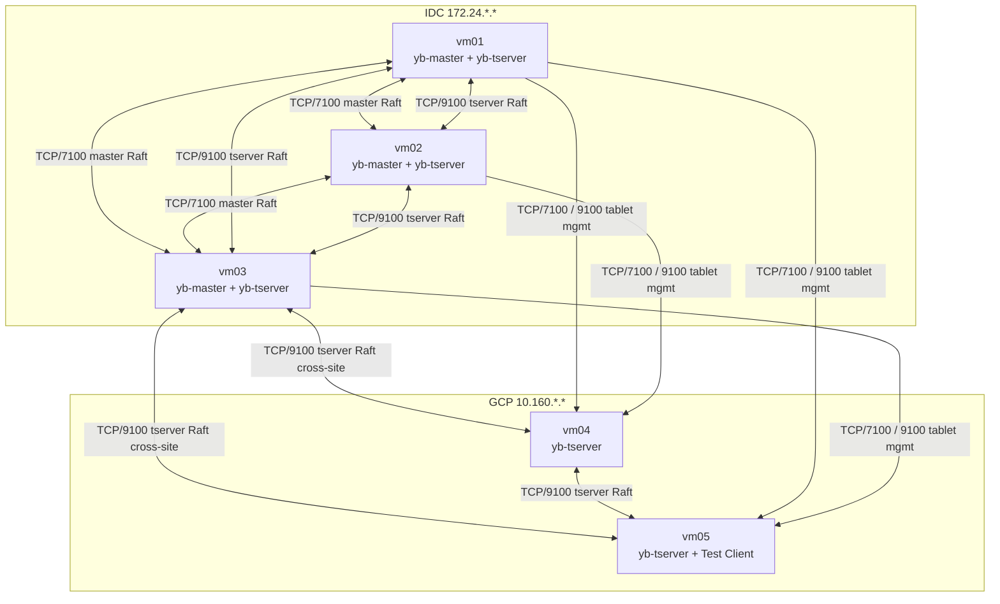

# YugabyteDB IDC-GCP Architecture

## 1. Logical Architecture

**Notes:**
- YSQL is the PostgreSQL-compatible SQL engine running **inside** yb-tserver; it is not a separate process or layer
- Any yb-tserver can accept client connections (TCP/5433); cross-site connections shown are representative
- yb-master leader handles tablet placement and load balancing; all masters participate in Raft and heartbeat with tservers
- Each tablet Raft group has RF=3 replicas; with geo-placement policy, replicas span IDC and GCP

## 2. Physical Deployment

## 3. Drawing Notes

- Master quorum in IDC (3 nodes); master leader manages tablet placement across all tservers
- YSQL runs inside yb-tserver — no separate SQL proxy process
- Tablet Raft groups (RF=3) span IDC and GCP; cross-site replication latency directly affects commit latency
- Placement policy (tablespace) controls which sites hold tablet leaders, affecting write latency distribution
- PoC mixed-role deployment, not production best practice
