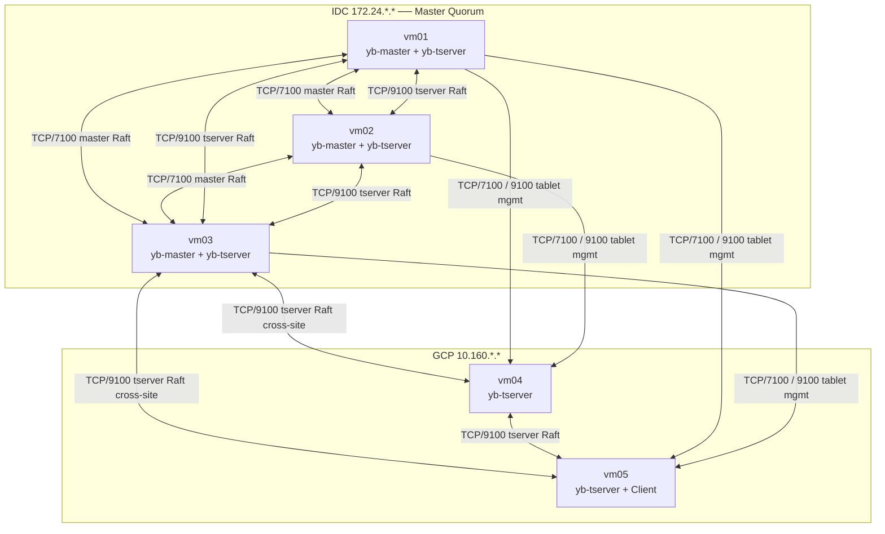
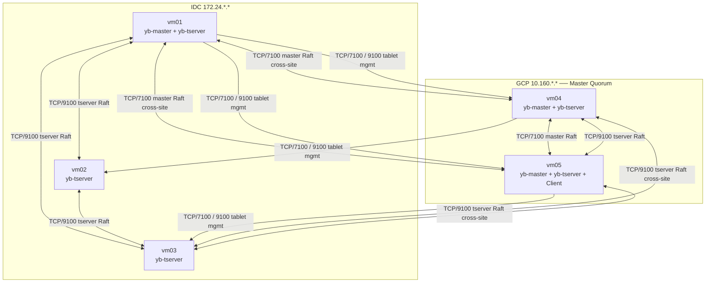
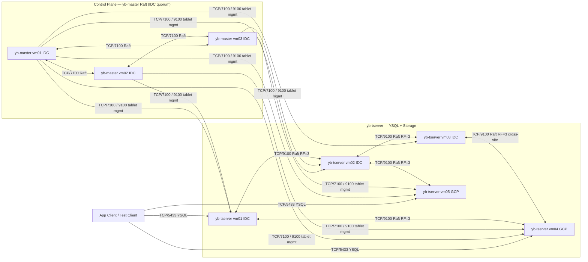
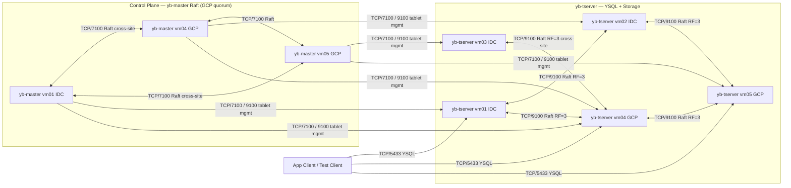

# YugabyteDB IDC-GCP Architecture

## 1. Scenario Analysis

四個驗證情境與對架構的技術要求：

| # | 專線 | 流量 | yb-master quorum 需求 | Tablet replica 需求 |
|---|------|------|----------------------|-------------------|
| S1 | 正常 | IDC 50% / GCP 50% | 兩站皆可達任一 master | 跨站皆有 replica |
| S2 | 正常 | 全切至 GCP（計劃性） | GCP tserver 可達 IDC master（link OK） | 跨站皆有 replica |
| S3 | 中斷 | 流量維持在 IDC | **IDC 需有 master quorum（≥2/3）** | IDC tserver ≥2 replica per tablet |
| S4 | 中斷 | 流量維持在 GCP | **GCP 需有 master quorum（≥2/3）** | GCP tserver ≥2 replica per tablet |

**S3 與 S4 在 5 VM（3 IDC + 2 GCP）下互斥**
yb-master 3 節點只能讓一個 site 持有多數；Tablet RF=3 的 replica 也只能偏向一個 site。
要同時支援 S3 + S4，須擴充至每站 ≥3 master 與 ≥3 tserver（見 Route C）。

---

## 2. Route A — IDC Primary（支援 S1, S2, S3）

### 節點配置

| VM | Site | 角色 | 備註 |
|----|------|------|------|
| vm01 | IDC | yb-master + yb-tserver | master quorum 節點 |
| vm02 | IDC | yb-master + yb-tserver | master quorum 節點 |
| vm03 | IDC | yb-master + yb-tserver | master quorum 節點 |
| vm04 | GCP | yb-tserver | 無 master |
| vm05 | GCP | yb-tserver + Client | 無 master |

Tablet placement policy：每個 tablet 強制 **2 IDC + 1 GCP** replica

### 斷線行為

| 對象 | 結果 | 原因 |
|------|------|------|
| IDC tserver (YSQL) | ✅ 繼續運作 | IDC master quorum 完整 |
| GCP tserver (YSQL) | ❌ 停止寫入 | 無法跨站取得 tablet lease / txn status |

### Physical Deployment



---

## 3. Route B — GCP Primary（支援 S1, S2, S4）

### 節點配置

| VM | Site | 角色 | 備註 |
|----|------|------|------|
| vm01 | IDC | yb-master + yb-tserver | master quorum 節點 |
| vm02 | IDC | yb-tserver | 無 master |
| vm03 | IDC | yb-tserver | 無 master |
| vm04 | GCP | yb-master + yb-tserver | master quorum 節點 |
| vm05 | GCP | yb-master + yb-tserver + Client | master quorum 節點 |

Tablet placement policy：每個 tablet 強制 **1 IDC + 2 GCP** replica

### 斷線行為

| 對象 | 結果 | 原因 |
|------|------|------|
| GCP tserver (YSQL) | ✅ 繼續運作 | GCP master quorum 完整（2/3） |
| IDC tserver (YSQL) | ❌ 停止寫入 | 僅剩 1 master 節點，無法維持 quorum |

### Physical Deployment



---

## 4. Route C — 兩站皆可獨立（S3 + S4 同時支援）

需要每站各自形成 quorum，超出 5 VM 限制，需額外資源：

| 層級 | 最小需求 | 說明 |
|------|---------|------|
| yb-master | 3 IDC + 3 GCP（共 6） | 各站 3 節點才能獨立維持 quorum |
| yb-tserver | 3 IDC + 3 GCP（共 6），RF=3 | 各站 3 個 replica 才能在斷線後獨立服務 |
| 或：見證節點 | 任一第三站 1 個 master | 作為 tie-breaker，不需各站對稱擴充 |

---

## 5. Logical Architecture

SQL Layer（YSQL 運行於 yb-tserver 內）與 Storage Layer 兩種 Route 相同；
Control Plane 的 yb-master 位置依 Route 不同。

**注意：YSQL 不是獨立 process，client 直接連 yb-tserver TCP/5433。**

### Route A Logical（master quorum in IDC）



### Route B Logical（master quorum in GCP）



---

## 6. Placement Configuration

### yb-master / yb-tserver 啟動參數

```bash
# IDC nodes (vm01, vm02, vm03)
--placement_cloud=on-prem
--placement_region=idc
--placement_zone=idc-a

# GCP nodes (vm04, vm05)
--placement_cloud=gcp
--placement_region=gcp-region
--placement_zone=gcp-a
```

### Tablespace Placement Policy

Route A（IDC primary：2 IDC + 1 GCP per tablet）

```sql
CREATE TABLESPACE idc_primary WITH (
  replica_placement = '{
    "num_replicas": 3,
    "placement_blocks": [
      {"cloud": "on-prem", "region": "idc",        "zone": "idc-a",  "min_num_replicas": 2},
      {"cloud": "gcp",     "region": "gcp-region", "zone": "gcp-a",  "min_num_replicas": 1}
    ]
  }'
);
```

Route B（GCP primary：1 IDC + 2 GCP per tablet）

```sql
CREATE TABLESPACE gcp_primary WITH (
  replica_placement = '{
    "num_replicas": 3,
    "placement_blocks": [
      {"cloud": "on-prem", "region": "idc",        "zone": "idc-a",  "min_num_replicas": 1},
      {"cloud": "gcp",     "region": "gcp-region", "zone": "gcp-a",  "min_num_replicas": 2}
    ]
  }'
);
```

建立測試表時指定 tablespace：

```sql
CREATE TABLE account (
  id         BIGINT PRIMARY KEY,
  tenant_id  BIGINT NOT NULL,
  balance    BIGINT NOT NULL,
  version    BIGINT NOT NULL,
  updated_at TIMESTAMP NOT NULL
) TABLESPACE gcp_primary;  -- 依 Route 選擇
```

### Master 數量異動操作（Route 切換時）

新增 GCP master：
```bash
yb-admin -master_addresses <existing-masters> change_master_config ADD_SERVER <new-master-ip>:7100
```

移除 IDC master（Route A → Route B）：
```bash
yb-admin -master_addresses <existing-masters> change_master_config REMOVE_SERVER <old-master-ip>:7100
```

---

## 7. Drawing Notes

- YSQL 不是獨立 process，client 直接連 yb-tserver TCP/5433
- yb-master leader 負責 tablet 分配與 load balancing；所有 master 皆參與 Raft heartbeat
- Tablet Raft group 為 RF=3，replica 位置依 tablespace placement policy 決定
- yb-master quorum 決定哪個 site 在斷線後可獨立存活；Route A / B 為互斥選擇
- Placement policy 直接影響斷線後的可寫性與 write latency
- PoC mixed-role deployment，非 production 最佳實務
