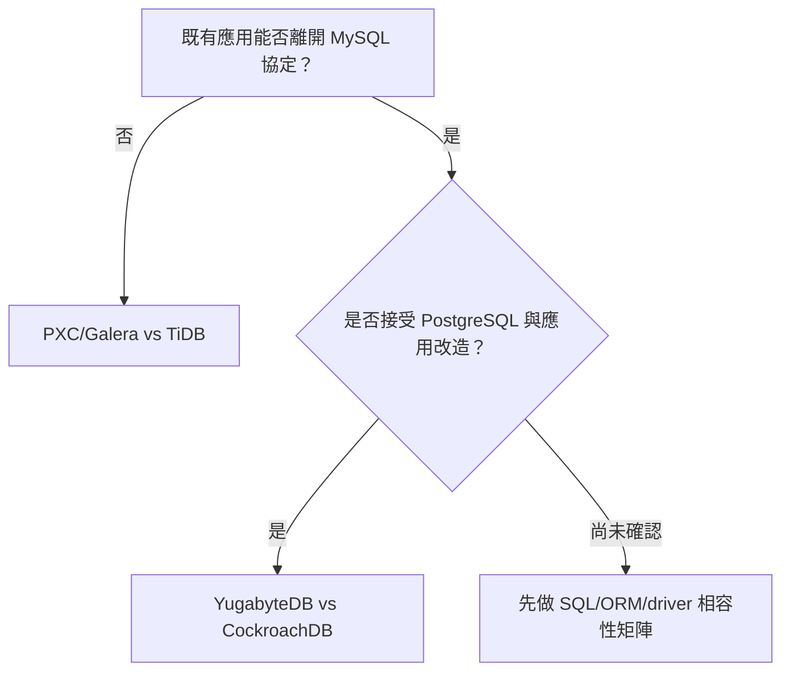

# 分散式資料庫 PoC 評分導讀與決策摘要

> 本文件作為快速理解 PoC 相關資訊及導讀依據。
> 完整評分規則、公式、原始數字、Fact/Inference 分析與結果檔案連結，一律以 [`DISTRIBUTED-DB-SCORING.md`](./DISTRIBUTED-DB-SCORING.md) 為準；本檔任何數字都可回查該檔對應章節。
> 評分資料基準：目前工作樹的 `DISTRIBUTED-DB-SCORING.md`；資料快照日期：2026-08-14。正式提交後再鎖定 commit hash。
>
> 本 PoC 是 stress benchmark / TPC-C-derived workload（go-tpc）作為架構選型參考，**不是** audited TPC-C 認證結果，不可與官方 TPC-C 排名直接比較。

## 給誰看、要回答什麼問題

- **管理層**：目前的實際測試依據夠不夠支持後續階段推進？
- **產品開發端**：現有產品架構更換資料庫協定，需要多少產品開發調整量能？
- **架構端**：跨機房節點延遲、水平擴展、故障模式，各自的取捨是什麼？
- **維運端**：部署、備份 / PITR、Online DDL、維運工具，還缺哪些驗證？

分散式資料庫的選型**不該只由維運端推動**。建議順序：由產品需求定義協定、RTO/RPO、一致性與跨區工作負載，再據此篩選資料庫架構、產品及部署模式。

## 先選遷移路線，再選產品

- 協定相容性是**選型門檻**，不是普通權重項目——換協定代表應用改造成本。

## 一頁結論

- 目前 [MySQL](http://pmm.104.com.tw/graph/d/prod-db-mysql/prod-db-mysql-mariadb-pxc) / [PostgreSQL](http://pmm.104.com.tw/graph/d/prod-db-pgpool2/prod-db-pgpool-ii) 叢集數比例: 28 / 4 ; 實際商務邏輯營運趨近 95% / 5%
   - 統計日期: 2026/08/14
   - 單位：資料庫叢集、產品、服務別
   - 來源：現行 Prod 資料庫相關監控彙整
- 下面兩條相容路線的分數是**部分加權試算**：MySQL 群組只把已計分 62% 權重、PostgreSQL 群組只把已計分 82% 權重重新正規化，再依 1-5 星（離散、帶判斷成分的相對評級）換算而來——不是完整產品分數，也不是 confidence-adjusted score，小數點不代表量測精度。

| 相容路線 | 產品 | 部分加權試算 | 目前判讀 |
|---|---|---:|---|
| MySQL | TiDB | 75.5 | 水平擴展與高併發穩定性領先；Failover 待重新評估 |
| MySQL | Percona XtraDB Cluster 8.4（PXC，Galera） | 44.5 | 單節點延遲領先；Failover 待重新評估 |
| PostgreSQL | YugabyteDB | 87.1 | 與 CockroachDB 同分，不排名 |
| PostgreSQL | CockroachDB | 87.1 | 與 YugabyteDB 同分，不排名 |

- 兩組分數不可互相比較，星等僅在群組內部有意義。
- 多數測試案例為 `N=1`；若決策需要更高信心，再對代表案例補 `N=3`，用來提高重現性信心，不預設結果必然一致。
- `▶ 下一階段：相容性、PITR、Online DDL 驗證`
- `▶ 最終產品選型：多方採集意見後再進行下一階段結論`

## 目前證據覆蓋率

| 路線 | 群組權重上限 | 已計分 | 尚未計分／不適用 |
|---|---:|---:|---:|
| MySQL 相容群組（[§2.1](./DISTRIBUTED-DB-SCORING.md#21-mysql-相容群組mysql-galera-cluster-vs-tidb)） | 100% | 62% | 38% |
| PostgreSQL 相容群組（[§2.2](./DISTRIBUTED-DB-SCORING.md#22-postgresql-相容群組yugabytedb-vs-cockroachdb)） | 100% | 82% | 18% |

- MySQL 群組：已計分 62% = `#2 單節點延遲` ＋ `#3 水平擴展` ＋ `#4 高併發穩定性`。
   > #5 已有原始數據但比較口徑不等價，暫不計分；連同 #1／#6／#7／#8，尚未計分共 38%。PXC/Galera 的 #8 HTAP 為 n/a。
- PostgreSQL 群組：已計分 82% = `#2 單節點延遲` ＋ `#3 水平擴展` ＋ `#4 高併發穩定性` ＋ `#5 Failover`；
   > 尚未計分 18% = #1 PostgreSQL 相容性＋#6 PITR＋#7 Online DDL＋#8 Geo-Distribution。

### 評分總表節錄（星等對照，完整版見 [§2](./DISTRIBUTED-DB-SCORING.md#2-評分總表依協定架構分組)）

**MySQL 相容群組**（[§2.1](./DISTRIBUTED-DB-SCORING.md#21-mysql-相容群組mysql-galera-cluster-vs-tidb)）：

| # | 項目 | 權重 | PXC/Galera | TiDB |
|---|---|---:|:---:|:---:|
| 1 | MySQL 協定相容性 | 20% | 待測 | 待測 |
| 2 | 單節點/低併發延遲 | 19% | ⭐⭐⭐⭐⭐ | ⭐☆☆☆☆ |
| 3 | 水平擴展能力 | 24% | ⭐☆☆☆☆ | ⭐⭐⭐⭐⭐ |
| 4 | 高併發穩定性 | 19% | ⭐☆☆☆☆ | ⭐⭐⭐⭐⭐ |
| 5 | Failover RTO／RPO | 5% | 待重新評估 | 待重新評估 |
| 6 | PITR／備份還原 | 3% | 待測 | 待測 |
| 7 | Online DDL 與維運工具 | 5% | 待測 | 待測 |
| 8 | HTAP／TiFlash | 5% | n/a | 待測 |
| | **合計** | **100%** | | |

**PostgreSQL 相容群組**（[§2.2](./DISTRIBUTED-DB-SCORING.md#22-postgresql-相容群組yugabytedb-vs-cockroachdb)）：

| # | 項目 | 權重 | YugabyteDB | CockroachDB |
|---|---|---:|:---:|:---:|
| 1 | PostgreSQL 協定相容性 | 5% | 待測 | 待測 |
| 2 | 單節點/低併發延遲 | 24% | ⭐⭐⭐⭐⭐ | ⭐⭐⭐☆☆ |
| 3 | 水平擴展能力 | 29% | ⭐⭐⭐⭐☆ | ⭐⭐⭐⭐⭐ |
| 4 | 高併發穩定性 | 24% | ⭐⭐⭐⭐☆ | ⭐⭐⭐⭐⭐ |
| 5 | Failover RTO／RPO | 5% | ⭐⭐⭐⭐⭐ | ⭐⭐⭐⭐☆ |
| 6 | PITR／備份還原 | 3% | 待測 | 待測 |
| 7 | Online DDL 與維運工具 | 5% | 待測 | 待測 |
| 8 | Geo-Distribution | 5% | 待測 | 待測 |
| | **合計** | **100%** | | |

> 星等只在同一張表內比較（同群組）；跨表（MySQL 表 vs PostgreSQL 表）不可比較，見上方一頁結論。

---

## PoC 實驗相關規格與平台

本 PoC 以相同硬體、工作負載及資料彙整方式觀察架構差異；測試數字只適用於已執行的版本、拓樸與參數，不代表產品在其他環境的能力上限。完整設計與例外以 [`results/PoC-DESIGN.md`](./results/PoC-DESIGN.md) 為準。

| 維度 | S-BASE 同機房對照 | X-CROSS 跨區探索 |
|---|---|---|
| 平台 | AlmaLinux 8.10；每個 DB 節點 4 vCPU、16 GB RAM、100 GB disk | 3 個 IDC DB 節點＋3 個 GCP DB 節點；IDC／GCP 各有就近 client 與 HAProxy |
| 資料庫 | TiDB 8.5.x、CockroachDB v26.2、YugabyteDB 2025.2；另補 PXC 8.4／Galera 作 MySQL 相容路線對照 | TiDB、CockroachDB、YugabyteDB；PXC／Galera 另以適用其複寫模型的情境補測 |
| 工作負載 | go-tpc TPC-C-derived stress workload，128 warehouses | 沿用 128 warehouses，依 A-S／A-A-RO／A-A 改變 client 位置及交易組合 |
| 隔離級 | 主對標為 READ COMMITTED；單節點另測 RR／各家可用的最嚴格隔離級 | READ COMMITTED，避免隔離級差異污染 Placement／WAN 觀察 |
| Placement P-A | 不適用 | policy 目標是將 leader／leaseholder／tablet leader 集中 IDC；prepare-time 有限樣本 gate 實測為 IDC 100%，用來觀察 IDC 主辦與跨區複寫成本 |
| Placement P-B | 不適用 | policy 目標是將協調角色分散至 IDC／GCP；prepare-time 有限樣本 gate 要求 IDC 比例落在 30%～70%，用來觀察跨 WAN 協調與 locality 效應 |
| 壓測程序 | 1 次 cold reset；20 分鐘 warmup（64 threads）；16／32／64／128 threads；每水位 5 round × 5 分鐘 | 同一套 threads／rounds；雙 client 情境另做 chrony drift、就近端點及 WAN gate |
| 主要指標 | tpmC、P50／P95／P99、交易錯誤率、round range／mean、DB-host 資源 | 另加 IDC／GCP 分側吞吐與延遲、WAN、Placement gate、RTO／RPO 及故障證據 |
| 結果資格 | `baseline_family=vm`，可在相同 family 與口徑內比較 | `baseline_family=crossregion`、`baseline_eligible=false`，只作跨區方向性與機制觀察 |

P-A／P-B 的 gate 是 prepare-time 有限樣本，不是所有資料的完整 Placement ground truth；兩批也非同時執行的 paired control。正式數據採 warmup 後 R1–R5 mean；不使用 think time／keying time，因此是持續滿載壓力測試，不可與 audited TPC-C 結果比較。執行狀態及可引用結果由 [`results/README.md`](./results/README.md) 與 [`results/x-cross/README.md`](./results/x-cross/README.md) 索引。

## 各 DB 架構

四個產品的 SQL、資料切分、複寫與控制平面不同；同一個 tpmC 或 RTO 數字背後不一定是相同路徑。下表只說明本 PoC 需要辨識的架構角色，不直接代表優劣。

| DB | 主要元件與資料單位 | 寫入／複寫路徑 | 本 PoC 主要觀察點 |
|---|---|---|---|
| TiDB | TiDB Server（無狀態 SQL）、PD（TSO／Placement／排程）、TiKV（Region） | TiDB Server 協調交易，TiKV Region 透過 Raft 複寫 | SQL 層能否獨立擴展、Region Leader 放置、PD 排程、TiKV 熱點，以及儲存層健康到 SQL 可寫之間的差距 |
| PXC 8.4／Galera | 每個節點皆為 MySQL／InnoDB 完整資料副本，透過 wsrep 組成 Primary Component | 採 virtually synchronous writeset replication；多主寫入先做 certification，再依全域順序套用 writeset；HAProxy 決定 client 寫到哪個節點 | certification conflict、flow control、完整副本成本；沒有 Range／Region shard，也沒有 Raft leader／leaseholder 概念 |
| CockroachDB | 對稱節點；每個 node 同時承擔 SQL、交易協調與 KV；資料單位為 Range | Range Replica 透過 Raft 複寫，Leaseholder 協調一致讀寫 | Range／Leaseholder 分布、admission、load-based split／rebalance，以及單一節點同時承擔多角色的資源競爭 |
| YugabyteDB | YB-Master 管 metadata／Placement／Load Balancer；YSQL PostgreSQL backend 經 YB-TServer 存取 DocDB Tablet | Tablet Replica 透過 Raft 複寫，Tablet Leader 處理一致讀寫 | YSQL 到 DocDB 的 RPC、Tablet Leader 分布、Master／Load Balancer、tablet split 與 compaction |

架構角色的圖解與官方來源見 [`gitbook/04-architecture-comparison.md`](./gitbook/04-architecture-comparison.md)；實際測試設定與觀察應回到各 DB 的 [`pipeline-log.md`](./results/README.md#資料庫說明)。官方文件只能證明產品設計或支援能力，不能取代本 PoC 的實測結果。

## 跨區後 Placement / Workload 規劃說明

X-CROSS 使用 3 個 IDC＋3 個 GCP DB 節點，將「資料／leader 放置」與「client 如何產生工作負載」拆成兩個正交維度。完整決策與實作 gate 見 [`phase-crossregion/decisions-2026-06-08.md`](./phase-crossregion/decisions-2026-06-08.md) 及 [`phase-crossregion/manifest.yaml`](./phase-crossregion/manifest.yaml)。

### Placement：資料與一致性路徑

| Placement | 設計目的 | 重要限制 |
|---|---|---|
| P-A | 多數副本／主要寫入協調者偏向 IDC，先取得較保守的 IDC 主辦基準 | 正常狀態下多數寫入可由 IDC quorum 完成，但 GCP 副本仍持續同步；IDC 整區故障後不保證 GCP 具備 quorum |
| P-B | 將 leader／leaseholder／tablet leader 分散到兩區，放大跨 WAN 協調與 locality 效應 | 分散 leader 不等於整區故障後必然可用；RF=3 且只有兩個 failure domain 時，任一 shard 仍可能因失去兩個 voter 而無法 commit |

Placement Policy 只能影響副本與協調者位置，不能保證「IDC request 永不離開 IDC」或「GCP request 永不離開 GCP」。強一致寫入、leader 不在本地、metadata 查詢、故障重選或副本落後時仍可能跨越專線。P-A／P-B 的實測比較以 [`XCROSS-PA-VS-PB-FINAL-COMPARISON.md`](./phase-crossregion/XCROSS-PA-VS-PB-FINAL-COMPARISON.md) 為準，不引用早期預估值。

### Workload：應用如何使用兩區

| Profile | IDC client | GCP client | 本輪目的與判讀 |
|---|---|---|---|
| A-S | W=128 standard mix，讀寫皆由 IDC 發起 | 平時不執行 workload | 觀察 IDC 主辦及跨區複寫成本；不是已完成的自動 DR 承諾 |
| A-A-RO | W=128 standard mix | 同 W=128，但只執行 ORDER_STATUS／STOCK_LEVEL | 觀察就近／follower read、讀取延遲與資料新鮮度；各 DB 的 follower-read 語意不同 |
| A-A | 兩端皆對完整 W=128 執行 standard mix | 兩端同步讀寫相同 warehouse 範圍 | 刻意製造最大 contention，觀察跨區 lock／retry／abort 的最壞情境；不是一般 production workload 的預測 |

正式矩陣為 3 DB × 2 Placement × 3 Profile，共 18 個 cell；每個 cell 原則上獨立重建。A-S 是 X-CROSS 的主要穩態候選，A-A-RO／A-A 是 exploratory observed envelope，均不得與 S-BASE 混成同一排名口徑。PXC／Galera 的 P-A／P-B 主要代表 client routing（單區寫或雙區寫），不是上述三家 Raft-based DB 的 server-side Placement Policy，必須分開解讀。

## Chaos Engineering / Failover 情境規劃說明

穩態 benchmark 回答正常運作時的吞吐與延遲；Chaos／Failover 則觀察故障注入是否真實發生、client 是否看見中斷、寫入結果是否可判定，以及服務如何恢復。方法論見 [`RTO-RPO-methodology.md`](./phase-crossregion/failover/RTO-RPO-methodology.md)，三家結果與限制見 [`XCROSS-CHAOS-FAILOVER-3DB-COMPARISON.md`](./phase-crossregion/XCROSS-CHAOS-FAILOVER-3DB-COMPARISON.md)。

| 情境 | 注入方式 | 回答的問題 | 目前量測限制 |
|---|---|---|---|
| F1／C4 | 對 leader／follower 或對應節點做 graceful／ungraceful stop | 單節點故障是否造成 client 可見中斷；角色差異是否影響恢復 | `outage_observed=false` 只代表中斷短於探測能力，不等於零中斷；不同 DB 的探測間隔不完全對稱 |
| F2 | 同時停止 3 個 IDC DB process，隨即由腳本重啟 | quorum 遺失時寫入是否正確拒絕；從重啟到首次成功寫入的時間 | 這是「停止＋operator 重啟」恢復力測試，不是 GCP 自動接手的區域 Failover；RPO 為簡化 high-water-mark 量測 |
| C1 | 阻斷 IDC↔GCP 網路 | 網路分區時 quorum、寫入拒絕與解除後恢復是否符合設計 | 既有 probe 主要由 IDC client 連 IDC endpoint，不能代表 GCP client 體驗，也未完整量到 incident 期間 tpmC |
| C7 | 以 fio 製造磁碟競爭／延遲 | 磁碟變慢時節點是否失聯，以及系統資源反應 | 已確認注入執行，但缺完整 pre／during／post DB 效能與無注入對照，不可宣稱三家耐受度相同 |

RTO 以真實 incident 後的第一筆成功探測或寫入定義；沒有觀測到失敗時，應回報 `rto_sec=null`，不可把下一個 probe 時刻偽裝成 RTO。RPO 需同時檢查已確認交易是否遺失、寫入是否被乾淨拒絕或回報 ambiguous；「叢集健康」也不能直接等同「應用已恢復可寫」。

PXC／Galera 沒有 leader／follower，因此另設 G1 單節點 kill、G2 quorum-loss、G3 雙寫衝突、G4 網路分區、G5 disk-slow，不能直接套用 F1／C4 星等語意。G2 的 22.169 秒是從 kill 到 quorum 重建及首次寫入成功，包含 operator 重啟 IDC 節點與 rejoin；不是 GCP 獨立接手。它與 TiDB F2 所列「重啟開始到首次寫入」39.1～44.3 秒不是相同計時起點，不可直接排名。完整設計與證據入口見 [`GALERA-EXECUTION-PLAN.md`](./phase-crossregion/GALERA-EXECUTION-PLAN.md) 與 [`results/x-cross/README.md`](./results/x-cross/README.md)。

---

## 關鍵觀察：MySQL 相容路線

1. **單節點延遲**
   - Fact：`PXC/Galera` t=32 p99 37.7 ms vs `TiDB` t=128 p99 597 ms（[§3.2.1](./DISTRIBUTED-DB-SCORING.md#321-單節點低併發延遲vm-1node-rc)）——代表點不同（thread 數不同），非同 thread 直接對照；若改用 Galera 自己 t=128 的數字（p99=182.8 ms），仍遠優於 TiDB 的 597 ms，方向未變。
   - 解讀：PXC/Galera 單節點模式下 wsrep 幾乎無遠端複寫成本，接近單機 MySQL/InnoDB；這是 inference，非官方保證機制。
   - 決策影響：延遲敏感但併發不高的場景可參考此項；不能單獨當作整體優劣依據，此優勢在水平擴展/高併發情境下完全反轉（見下方兩項）。

2. **水平擴展**
   - Fact：先看公平的同 t=128 檢查——`PXC/Galera` 51,527.8 → 26,166.2（約 0.51×）、`TiDB` 13,064 → 26,947（約 2.06×），兩者同 thread 對照，方向一致。評分 SSOT 實際採用的是各自代表點倍率 `PXC/Galera` 0.49× vs `TiDB` 2.06×（[§3.2.2](./DISTRIBUTED-DB-SCORING.md#322-水平擴展能力vm-1node--vm-3node-haproxy-3s3r) ／ evidence: [Galera vm-1node](./results/galera-tc1/S-BASE/vm-1node-rc/galera-vm-1node-rc-20260813T073744+0800/summary.json)、[vm-3node](./results/galera-tc1/S-BASE/vm-3node-haproxy-3s3r-rc/galera-vm-3node-haproxy-3s3r-rc-20260813T112044+0800/summary.json)），不是完全同口徑的直接對照，但不是代表點錯覺。
   - 解讀：Galera 是 HAProxy round-robin 多寫入節點架構，TiDB 是分散式儲存（TiKV Region）擴展機制，兩者擴展模型本質不同。
   - 決策影響：此數字只代表本次 HAProxy round-robin naive multi-writer 拓樸，不是 Galera 產品的普遍擴展上限；若改用單寫或 shard key 分流，結果可能不同（見 §3.6）。預期靠加節點提升吞吐的場景，需先確認架構是否支援真正水平擴展。

3. **高併發穩定性**
   - Fact：t=128 時 5-round range/mean，`PXC/Galera` 43.2% vs `TiDB` 7.4%（[§3.2.3](./DISTRIBUTED-DB-SCORING.md#323-高併發穩定性t1285-round-rangemean-與-error-rate)）。
   - 解讀：Galera 在高併發下波動明顯較大；兩家皆為 `N=1`，尚未確認是否穩定重現。
   - 決策影響：對併發穩定性要求高的場景需留意此差異，但單次重跑不足以下定論。

4. **Failover / 跨區**
   - Fact：`PXC/Galera` G2 的 22.169 秒是 `t_kill` 到 `t_first_write_ok`，包含 operator 重啟 IDC 節點；從 `t_restart_start` 到首次寫入約 8.240 秒。`TiDB` F2 的 39.1～44.3 秒是 `t_restart_start` 到 `t_first_write_ok`；若從 `t_kill` 起算則為 198.4～201.7 秒（[§3.3.1a](./DISTRIBUTED-DB-SCORING.md#331a-mysql-相容群組galerapxc-84chaosfailover-實測2026-08-13) ／ evidence: [Galera](./results/x-cross/smoke/early-runs/20260813T213018+0800/galera-vm-6node-rc-20260813T213018+0800-scenarioG2-quorumloss/rto-rpo.json)、[TiDB P-A](./results/x-cross/chaos/tidb-vm-6node-P-A-rc-20260808T075957+0800-scenarioF2/rto-rpo.json)、[TiDB P-B](./results/x-cross/chaos/tidb-vm-6node-P-B-aa-rc-20260808T101720+0800-scenarioF2/rto-rpo.json)）。Galera 故障窗內另有一筆需人工複核的異常成功寫入（[evidence](./results/x-cross/smoke/early-runs/20260813T213018+0800/galera-vm-6node-rc-20260813T213018+0800-scenarioG2-quorumloss/write-reject-validation.txt)）。
   - 解讀：兩個情境都包含 operator 重啟 IDC 節點，均未驗證 GCP 自動接手；計時起點也不同。Galera 在本次 3+3、majority=4 架構下，GCP 3 節點無法獨立形成 Primary Component，屬部署限制；但不能因此把 TiDB F2 解讀成已證明自動區域接手。
   - 決策影響：第 5 項保留原始證據但撤出 MySQL 群組星等與加權分數，待統一故障邊界、人工介入規則、探測位置及 RTO／RPO 口徑後重測。跨區 P-A／P-B 穩態吞吐（[§3.6](./DISTRIBUTED-DB-SCORING.md#36-mysql-相容群組percona-xtradb-cluster-84pxcgalera跨區-p-ap-b-穩態吞吐量實測2026-08-12)）仍屬 exploratory scope，不計分。

## 關鍵觀察：PostgreSQL 相容路線

- **部分加權總分**：`YugabyteDB` 87.1 分、`CockroachDB` 87.1 分；兩家同分，但各項星等組成不同，不能解讀為能力完全相同。
- **Failover 代表點**：F2（3 台 IDC DB process 同時停止，再由 operator 重啟，到首次成功寫入）——`YugabyteDB` 約 2.99s/3.65s、`CockroachDB` 約 7.01s/7.12s（[§3.3.1](./DISTRIBUTED-DB-SCORING.md#331-failover-rtorpo--2026-08-11-真實重跑完成)）。兩者各有兩次獨立執行互相印證，但 2026-08-11 CockroachDB 重跑為 W=4、YugabyteDB 為 W=128；這是方向性評分，不是自動區域 Failover、正式 SLA 或精確倍率。
- **未測缺口**：PostgreSQL 相容性、PITR、Online DDL、正式 Geo-Distribution 排名等 18% 權重仍待驗證，不能只看已計分 82% 就下結論。

## 分數能說什麼、不能說什麼

| 可以支持 | 不能支持 |
|---|---|
| 同一群組、已測 workload、已測拓樸下的方向性比較 | 跨群組直接排名（MySQL 相容 vs PostgreSQL 相容分數不可比） |
| 指出哪類架構的擴展/穩定性成本需要應用端或維運端承擔 | 把 `N=1` 當統計顯著結果 |
| 標示哪些權重項目已有實測證據、哪些仍是空白 | 把官方能力宣稱（docs/whitepaper）當作實測結果 |
| 作為下一輪驗證（N=3、相容性矩陣、PITR）的優先順序依據 | 把 stress benchmark（go-tpc）當作正式 TPC-C 認證 |
| 在同群組內比較不同拓樸（單節點 vs 三節點）的擴展方向 | 只看部分加權總分而忽略尚未計分的權重（MySQL 38%、PostgreSQL 18%） |

## 決策前必補的驗證

1. **實際 application SQL/ORM/driver 相容性矩陣**
   完成後可解除：「協定改造成本未知」的風險，才能判斷是否值得跨出 MySQL 協定。

2. **PITR、備份還原與 RPO 實測**
   完成後可解除：「災難復原能力未驗證」的風險——這是兩組都尚未量測的項目（各佔 3%）。

3. **Online DDL 對前台 throughput/latency 的影響**
   完成後可解除：「線上變更 schema 是否可承受」的風險（兩組各佔 5%）。

4. **代表性 cell 補 `N=3`**
   完成後可解除：「單次重跑波動被誤讀為架構差異」的風險。本輪統一以 `N=1` 為基礎方向性觀察，`N=3` 可提高重現性信心，但不是本輪完成條件。

5. **依 104 產品情境確認 A/S、A/A Read Only、A/A 是否真有需求**
   完成後可解除：「為不存在的需求付出跨區成本」的風險，避免在未確認需求前就投入跨區部署。

6. **TCO / 維運人力 / 授權 / 跨區網路成本**
   原檔沒有數字的項目一律標「待建立」，不可補估值；完成後可解除：「總持有成本未知就啟動專案」的風險。

## 建議閱讀路徑

| 想回答的問題 | 前往原評分表 |
|---|---|
| 評分規則與兩群組如何分組 | [§2 評分總表（依協定/架構分組）](./DISTRIBUTED-DB-SCORING.md#2-評分總表依協定架構分組) |
| 單節點延遲 / 水平擴展 / 高併發穩定性細節 | [§3.2.1](./DISTRIBUTED-DB-SCORING.md#321-單節點低併發延遲vm-1node-rc)、[§3.2.2](./DISTRIBUTED-DB-SCORING.md#322-水平擴展能力vm-1node--vm-3node-haproxy-3s3r)、[§3.2.3](./DISTRIBUTED-DB-SCORING.md#323-高併發穩定性t1285-round-rangemean-與-error-rate) |
| Failover 完整數據 | [§3.3.1](./DISTRIBUTED-DB-SCORING.md#331-failover-rtorpo--2026-08-11-真實重跑完成)、[§3.3.1a](./DISTRIBUTED-DB-SCORING.md#331a-mysql-相容群組galerapxc-84chaosfailover-實測2026-08-13) |
| 跨區穩態吞吐（exploratory，不計分） | [§3.6](./DISTRIBUTED-DB-SCORING.md#36-mysql-相容群組percona-xtradb-cluster-84pxcgalera跨區-p-ap-b-穩態吞吐量實測2026-08-12) |
| 部分加權分數怎麼算出來 | [§4.1](./DISTRIBUTED-DB-SCORING.md#41-mysql-相容群組mysql-galera-cluster-vs-tidb)、[§4.2](./DISTRIBUTED-DB-SCORING.md#42-postgresql-相容群組yugabytedb-vs-cockroachdb) |
| 結論與下一步建議 | [§5.1](./DISTRIBUTED-DB-SCORING.md#51-mysql-相容群組percona-xtradb-cluster-84pxcgaleravs-tidb)、[§5.2](./DISTRIBUTED-DB-SCORING.md#52-postgresql-相容群組yugabytedb-vs-cockroachdb)、[§5.3](./DISTRIBUTED-DB-SCORING.md#53-兩組共通的下一步建議依風險與可行性排序) |
| 原始測試證據索引 | [`results/README.md`](./results/README.md)、[`results/x-cross/README.md`](./results/x-cross/README.md) |

## 文件限制

現在仍然有效的限制（不是已修好的歷史）：

- 部分加權分數只覆蓋 MySQL 已計分 62%／PostgreSQL 已計分 82% 權重；尚未計分的 38%（MySQL，含口徑待重評的 #5）／18%（PostgreSQL）不能忽略。
- S-BASE 多數 cell 為 `N=1`；PostgreSQL 群組的 F2 為 `N=2`（兩次獨立執行互相印證），仍未達 `N=3`。
- 代表點的併發（thread 數）可能不同，只有明示「同 t=128」的比較才是同口徑，其餘代表點比較是「各自最佳」而非直接對照。
- Failover 秒數的探測解析度、探測發起位置（皆從 IDC 側）與情境語意（quorum-loss vs 區域 failover）三家不完全相同，不可只比較秒數。
- 官方文件（docs/whitepaper）是機制推論的輔助來源，不等於本 PoC 實測結果，兩者不可混用。

歷史修正（已完成，不影響現在使用本檔）：`DISTRIBUTED-DB-SCORING.md` 曾有舊權重與數處 Galera 補測前的過期敘述，已於原檔一併修正；目前兩個群組均以 100% 權重為基準。
