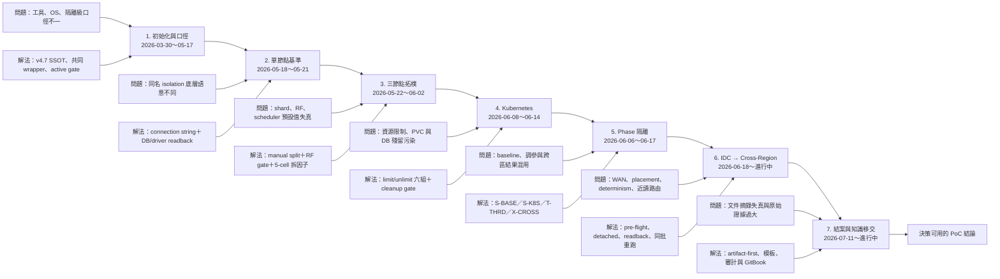
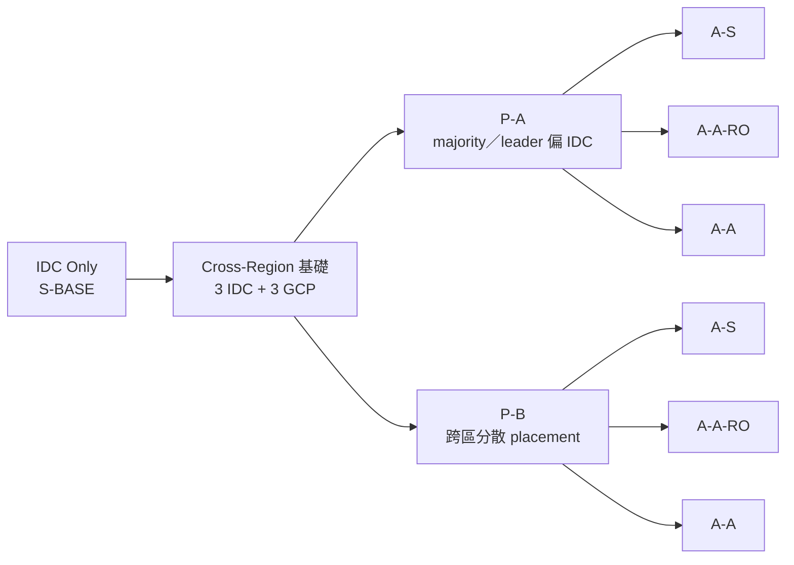

# 分散式資料庫 PoC 專案歷程與里程碑

> 更新日：2026-07-24
> 專案起點：2026-03-30（分散式資料庫 PoC 實質研究與環境建置開始）
> 證據截止：目前 `master` 可追溯 commit；未提交的執行結果不列為正式完成

## 文件目的

本文件提供管理階層與技術審查者共同閱讀的專案全貌，回答四個問題：

1. PoC 從初始化至今完成了哪些里程碑？
2. 每個階段遇到什麼問題，如何確認根因並解決？
3. 哪些結果已有證據，哪些仍是規劃或單次觀察？
4. 下一階段需要哪些證據才能作決策？

詳細數據不在此重複抄錄，改由連結回到結果、流程紀錄、原始結果或 commit。

## 證據規則

發生說法不一致時，依下列順序判定：

1. 原始測試結果、marker 與實際 readback
2. 實際程式碼、設定及目前分支可達的 commit
3. `pipeline-log`、結案報告與分析紀錄
4. `PoC-DESIGN.md`、決策與會議紀錄
5. GitBook 摘要
6. 原廠文件只佐證機制，不代替實測

無法互相印證的內容標為待確認，不用規劃文件推定已完成。

> 本 PoC 使用 go-tpc 執行 TPC-C-derived stress benchmark，不是 audited TPC-C。
> `N=1` 代表一次獨立 suite／環境生命週期，不等於每個併發只有一輪。

## 狀態圖例

| 標記 | 定義 |
|---|---|
| ✅ | 已完成，且有結果或驗證證據 |
| 🟡 | 已執行，但仍有缺口或修正後待重跑 |
| 🔄 | 正在修正或重跑 |
| ⚪ | 待執行 |
| ➖ | 已決議不執行 |
| ⚠️ | 有結果，但不可作正式比較 |

## 專案魚骨圖

魚頭代表本專案要形成的最終成果：**可追溯、可比較、可供決策的分散式資料庫 PoC 結論**。

## 專案時程

| 時間 | 專案階段 | 主要里程碑 | 狀態 |
|---|---|---|---|
| 03-30～04-10 | 前期研究 | 定義分散式 SQL、跨區寫入、follower read、HA/DR 與評估面向 | ✅ |
| 04-21～04-27 | IaC 與測試鏈 v1 | 建立 VM、Kubernetes、HAProxy 與獨立壓測 client | ✅ |
| 04-28～05-05 | YugabyteDB 首輪除錯 | 解決資料載入、snapshot、RF 與 schema packing 問題 | ⚠️ 已由 v4.7 取代 |
| 05-06～05-17 | 三資料庫框架 | 納入 TiDB、CockroachDB、YugabyteDB，統一 go-tpc 與結果結構 | ✅ |
| 05-18～05-21 | 單節點 v4.7 | 三家 × RC/RR/strict 對標與 active isolation gate | ✅ |
| 05-22～06-02 | 三節點 controlled experiment | 三家完成 1s1r、1s3r、3s1r、3s3r、HAProxy 3s3r | ✅ `N=1` |
| 05-20～06-04 | 文件與數據治理 | 建立模板、summary、來源鏈與 AI 交叉審計 | ✅ |
| 06-06～06-07 | Phase isolation | 分離四種結果 scope，建立 manifest、guard、metrics fan-out | ✅ |
| 06-06～目前 | Thread control | T-THRD 隔離框架完成，正式調參 benchmark 尚未執行 | ⚪ |
| 06-08～06-14 | Kubernetes v4.7 | 三資料庫 × limit/unlimit 六組 suite | ✅ 6/6 |
| 06-08～06-17 | 跨區框架 | 完成 GCP 5 VM、六節點部署、placement、WAN 與 pre-flight | ✅ 框架 |
| 06-18～06-22 | 跨區 smoke 與 determinism | 三家 P-A smoke；辨識 W=4 高變異並改採 W=128 | 🟡 |
| 07-02～07-09 | 執行鏈收斂 | 三家 P-A×A-S smoke 全鏈完成，修復 freeze、gate、quorum 等問題 | ✅ |
| 07-11～07-18 | P-A×A-S 正式輪 | 同批三家 W=128 全輪完成並形成結案報告 | ✅ `N=1` |
| 07-18～07-21 | P-A×A-A-RO 首輪 | 三家 W=128 雙端全輪完成；發現近讀未生效 | ⚠️ 執行鏈有效，近讀口徑失效 |
| 07-21～07-23 | 近讀修正與補驗 | 修正三家近讀條件、go-tpc read-only 行為與 fail-closed 檢查 | 🟡 |
| 07-23～目前 | A-A-RO 第二輪 | TiDB 已完成；YugabyteDB、CockroachDB 尚無已提交完成證據 | 🔄 |
| 待排程 | P-A×A-A | 雙端讀寫與同 warehouse contention | ⚪ |
| 待排程 | P-B 全 workload | A-S、A-A-RO、A-A | ⚪ |
| 待排程 | Chaos／failover | C1、C4、C7 與 F1 RTO/RPO | ⚪ |

前半段詳細 commit 與技術歷程見
[2026-06-22 技術里程碑](./1_MeetingMinutes/2026-06-22-milestone.md)。

## 七階段里程碑

### 1. 專案初始化與測試口徑

**目標**

- 從產品功能比較，轉為可驗證的一致性、延遲、可用性、擴充性與維運性 PoC。
- 固定硬體、工作負載、隔離級、durability、warmup、round 與統計口徑。

**完成證據**

- [PoC 設計 SSOT](./results/PoC-DESIGN.md)
- [結果索引](./results/README.md)
- [早期需求與交付範圍](./0_projectFor104/README.md)
- [2026-06-22 技術里程碑](./1_MeetingMinutes/2026-06-22-milestone.md)

**重要轉折**

- YugabyteDB 2025.2 無法沿用 AlmaLinux 10.1，環境統一回到 AlmaLinux 8.10。
- BenchmarkSQL 與早期 YugabyteDB 結果封存，三家統一改採 go-tpc。
- 長跑工作移至 `.31` detached 執行，Mac 只負責觸發與取回結果。

### 2. 單節點三隔離級基準

**里程碑**

- TiDB、CockroachDB、YugabyteDB 的 RC、RR、strict 均完成。
- TiDB 不支援原生 SERIALIZABLE，strict 以 RR 代表並明列限制。
- 以 connection string 設 isolation，同時驗 DB session、driver 與 YugabyteDB effective isolation。

**證據**

- [目前已驗證結果](./results/README.md#已驗證結果)
- [TiDB 流程紀錄](./results/tidb-tc1/S-BASE/pipeline-log.md)
- [CockroachDB 流程紀錄](./results/crdb-tc1/S-BASE/pipeline-log.md)
- [YugabyteDB 流程紀錄](./results/yuga-tc1/S-BASE/pipeline-log.md)

**效度邊界**

- 無 think time／keying time，屬 stress benchmark。
- 三家同名 isolation 不代表底層實作完全相同。

### 3. 三節點 shard、replica 與 HAProxy

**實驗拆解**

| Cell | 控制變數 | 觀察目的 |
|---|---|---|
| 1s1r | 1 shard、RF=1 | 最小基準 |
| 1s3r | 1 shard、RF=3 | replica 成本 |
| 3s1r | 3 shards、RF=1 | shard 成本 |
| 3s3r | 3 shards、RF=3 | 分片與複寫疊加成本 |
| HAProxy 3s3r | 3 shards、RF=3、多入口 | SQL／gateway 入口分流效應 |

**完成狀態**

- 三家五個 cell 均完成 RC 正式輪，現階段皆為 `N=1`。
- shard 由 schema/table split 鎖定，replica 由 cluster 設定與 actual gate 驗證。

**證據**

- [三節點結果表](./results/README.md)
- [Shard／Replica 說明](./1_MeetingMinutes/0606-sharding-desc.md)

### 4. Kubernetes limit／unlimit

**里程碑**

- TiDB、CockroachDB、YugabyteDB × limit/unlimit 六個 cell 完成。
- 固定 RC、HAProxy 3s3r、W=128 與共同 round 口徑。
- 以 expected/actual/diff、namespace 與 storage cleanup 控制跨 cell 污染。

**證據**

- [TiDB S-K8S](./results/tidb-tc1/S-K8S/pipeline-log.md)
- [CockroachDB S-K8S](./results/crdb-tc1/S-K8S/pipeline-log.md)
- [YugabyteDB S-K8S](./results/yuga-tc1/S-K8S/pipeline-log.md)
- [Kubernetes 分析](./1_MeetingMinutes/analytics-S-K8S-2026-06-15.md)

**殘留風險**

- YugabyteDB limit 組保留特定 round caveat。
- Kubernetes 與 VM 不可只用單一 retention 比率推論架構優劣。

### 5. Phase 隔離與文件治理

| Scope | 用途 | 可否混入 VM baseline |
|---|---|---:|
| `S-BASE` | VM 單節點與三節點基準 | 是 |
| `S-K8S` | Kubernetes limit/unlimit | 否，獨立家族 |
| `T-THRD` | process/thread/admission 調參 | 否 |
| `X-CROSS` | IDC–GCP 跨區實驗 | 否 |

**完成證據**

- [Phase Registry](./results/PHASES.md)
- [Pipeline-log 模板](./results/pipeline-log-template.md)
- [README 模板](./results/README-template.md)
- [GitBook 證據地圖](./gitbook/appendices/evidence-map.md)

**工程價值**

- path、marker、runtime guard 防止結果混用。
- `summary.json`、TPCC_TS、manifest hash 與來源目錄形成 lineage。
- Codex／Claude Code 互相審計，文件結論不得高於 artifact 證據。

### 6. IDC Only 到 Cross-Region

#### 6.1 架構路徑

#### 6.2 Placement × workload 進度

| Placement | Workload | TiDB | CockroachDB | YugabyteDB | 判讀 |
|---|---|---|---|---|---|
| P-A | A-S | ✅ | ✅ | ✅ | 同批 W=128、`N=1`；可作 X-CROSS 探索性結論 |
| P-A | A-A-RO 初輪 | ⚠️ | ⚠️ | ⚠️ | 雙端全輪完成，但近讀設定未實際生效 |
| P-A | A-A-RO 修正後 | ✅ TiDB | 🔄 | 🔄 | 以目前可達 commit 判定；三家完成後才更新結案數字 |
| P-A | A-A | ⚪ | ⚪ | ⚪ | 尚無正式結果 |
| P-B | A-S | ⚪ | ⚪ | ⚪ | gate／腳本準備不等於 workload 完成 |
| P-B | A-A-RO | ⚪ | ⚪ | ⚪ | 尚無正式結果 |
| P-B | A-A | ⚪ | ⚪ | ⚪ | 尚無正式結果 |

X-CROSS 的 `baseline_eligible=false`；這些結果用於跨區能力與機制觀察，不進
S-BASE 正式跨家排名。

**主要證據**

- [跨區決策](./phase-crossregion/decisions-2026-06-08.md)
- [Pre-flight 計畫](./phase-crossregion/PRE-FLIGHT-TEST-PLAN-2026-06-17.md)
- [P-A×A-S 結案報告](./phase-crossregion/XCROSS-CLOSING-REPORT-DRAFT.md)
- [P-A×A-A-RO 結案草稿](./phase-crossregion/XCROSS-AARO-CLOSING-REPORT-DRAFT.md)
- [Cross-region 執行歷史](./phase-crossregion/SESSION-HISTORY.md)
- [X-CROSS 結果索引](./results/x-cross/README.md)

### 7. 結案、決策與知識移交

**已完成**

- GitBook 決策與移交手冊。
- PoC 驗證報告、可落地執行計畫、預算評估報告的文件骨架與目前證據。
- 問題、修正、效度邊界與決策狀態分層。

**入口**

- [GitBook 首頁](./gitbook/README.md)
- [PoC 對照驗證報告](./gitbook/deliverables/poc-validation-report.md)
- [可落地執行計畫](./gitbook/deliverables/implementation-plan.md)
- [預算評估報告](./gitbook/deliverables/budget-assessment.md)
- [條件式決策框架](./gitbook/16-decision-framework.md)

**尚未完成**

- P-B 與 A-A 正式結果。
- Chaos／failover 真實演練與 RTO/RPO。
- 三節點與跨區 `N=3` 獨立環境重現性。
- 可供正式專案啟動的實際報價、維運人力與遷移演練數據。

## 問題與解法閉環

| 現象 | 根因 | 解法 | 驗證 | 殘留風險 |
|---|---|---|---|---|
| YugabyteDB 無法在既有 OS 安裝 | 2025.2 與 AlmaLinux 10.1 相依不符 | 統一 AlmaLinux 8.10 | 三家 v4.7 重跑完成 | 舊結果只可備查 |
| 長跑因 Mac 闔蓋或換網路中斷 | 執行生命週期綁在工作設備 | `.31` detached driver＋marker | 多批 20-round suite 完成 | 遠端 driver 仍需 watchdog |
| isolation 設定與實際不同 | DB default、driver、session 三層可能覆蓋 | connection string＋active readback | 三家 gate 均保留證據 | 同名 isolation 機制仍不同 |
| shard／RF 與設計值不一致 | 自動分裂、預設 RF、placement 背景行為 | manual split＋actual count＋RF gate | 三家 5-cell 完成 | 動態 split 仍需標示 |
| TiDB RF 或 leader 分布退化 | PD schedule limit 被錯誤鎖為 0 | 恢復 leader／replica 調度並保留 gate | l4r4 重跑 | N=1，分布仍可能不均 |
| CockroachDB shard gate 失效 | v26.2 限制部分 `crdb_internal` 存取 | 改用 `SHOW RANGES FROM TABLE` | 5-cell suite 通過 | 版本升級需重驗 SQL |
| Kubernetes cell 互相污染 | namespace、PVC/PV、CRD 與 local-path 殘留 | 獨立 namespace＋cleanup gate | 六組 suite 完成 | cleanup 需持續 fail-closed |
| W=4 跨 run 變異過大 | warehouse 過少、鎖競爭與 cluster state 主導 | 改 W=128、正式 warmup、同批執行 | 7 月正式 W=128 收斂 | 仍多為 `N=1` |
| CRDB／YBDB GCP 零副本 | placement、join 與 replica gate 不完整 | 修 placement＋GCP replica fail-closed | 修正後 W=128 正式 cell | P-B 尚未驗證 |
| YugabyteDB master quorum race | cold reset 後 master/tserver flags 與 catalog 尚未收斂 | quorum gate＋catalog wait＋live flag readback | Stage 1 smoke 通過 | 長距離故障時仍需 DR 測試 |
| A-A-RO 第一輪近讀未生效 | 三家「功能啟用」不等於 query 實際走 follower | 各家 session／transaction 修法＋執行面檢查 | smoke／補驗完成 | 修法後三家正式全輪未全數完成 |
| go-tpc read-only patch 誤傷 TiDB | 三家共用 binary，patch 未限制 driver | 只對 postgres 套 ReadOnly transaction | TiDB 第二輪 cell 通過 | patch 升級需三家回歸 |
| `while read` 只處理第一筆 | 迴圈內 SSH 讀走 stdin | SSH stdin 導向 `/dev/null` | artifact checker 攔截並重生 summary | 同類 shell pattern 需掃描 |
| 同 TS 重跑讀到 stale marker | 舊 marker 與新程序競態 | 清除 marker、重試與 lineage 斷言 | 後續 detached batch 通過 | 中斷恢復仍需明確 runbook |
| 報告與原始結果不一致 | 人工摘錄、placeholder、舊 trial 混入 | artifact-first、template、link verifier、交叉審計 | 多輪審計修正 | 大型 artifact 保存策略未完全定案 |

## 目前可下與不可下的結論

### 可下結論

- 三家均已建立單節點、三節點與 Kubernetes 的共同執行與證據鏈。
- shard、replica、isolation、placement 等設計值必須由 active/readback gate 驗證。
- 跨區長跑需要 detached orchestration、雙 client 時序、GCP 副本與 query routing 證據。
- P-A×A-S 三家 W=128 已完成一次同批正式執行，可作探索性架構觀察。
- A-A-RO 第一輪證明雙端執行鏈可運作，也證明「設定存在」不足以證明就近讀。

### 不可下結論

- 不可用 `N=1` 宣稱跨環境穩定重現。
- 不可把 X-CROSS 數字放入 S-BASE 正式跨家排名。
- 不可由 P-A 推論 P-B，也不可由 A-S 推論 A-A-RO 或 A-A。
- 不可在 P-B、A-A、chaos、failover 尚未實跑前宣稱全矩陣或 HA/DR 完成。
- 不可只靠原廠功能文件宣稱應用查詢已走預期資料路徑。

## 下一決策門檻

| 決策 | 必要證據 | 目前狀態 |
|---|---|---|
| A-A-RO 修法後結案 | 三家同批 W=128、雙側 summary、近讀執行面證據 | 🔄 TiDB 完成，其餘待證據 |
| 是否進 P-B | P-B placement gate、故障域模型、先行單家 smoke | ⚪ |
| 是否進 A-A | 衝突模型、雙端寫入錯誤率、commit latency 與 rollback | ⚪ |
| HA/DR 可用性 | C1/C4/C7、F1、RTO/RPO、資料一致性與回復紀錄 | ⚪ |
| 三節點候選配置 | 候選 cell `N=3` 獨立重建與變異分析 | ⚪ |
| Thread control 是否補測 | 先以單一 tuning profile、`N=1` 探索；不得混入 baseline | ⚪ |
| 正式專案啟動 | 應用 owner、SLO、遷移演練、安全審查、報價與人力 | 🟡 文件框架完成 |

## 主要證據入口

- [結果總覽](./results/README.md)
- [PoC 設計](./results/PoC-DESIGN.md)
- [Phase Registry](./results/PHASES.md)
- [X-CROSS 結果索引](./results/x-cross/README.md)
- [Cross-region 執行歷史](./phase-crossregion/SESSION-HISTORY.md)
- [問題與經驗](./gitbook/10-problems-and-lessons.md)
- [證據來源地圖](./gitbook/appendices/evidence-map.md)
- [2026-06-22 技術里程碑](./1_MeetingMinutes/2026-06-22-milestone.md)
