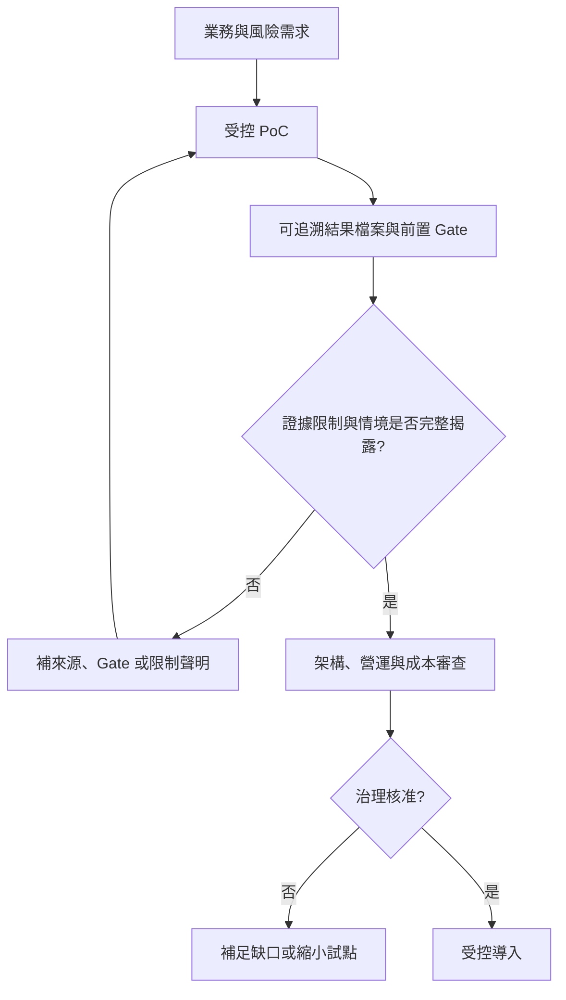

# 執行摘要

## 本章回答什麼

本章界定這個 PoC 目前可以支持哪些內部決策，以及哪些決策仍不可做。文件採供應商中立立場：比較的是部署條件、交易語意、可維運性與驗證成熟度，不產生產品勝負、排名或採購結論。

**最後驗證日期：2026-07-11**

## 結論摘要

- [決策] 以分階段驗證取代一次性選型。現階段可繼續投入「受控試點與補測」，不可據此核准正式採用、淘汰候選系統或宣稱效能優劣。
- [本 PoC 實測｜N=1] 已有單節點、三節點、容器化與跨區路徑的可追溯結果檔案；三節點候選配置與現有跨區觀察仍受獨立重跑數不足、scope 不可混比等限制。
- [機制推論] 分散式交易的可用性與尾端延遲同時受副本仲裁、資料放置、熱點、連線路由與控制平面收斂影響；僅比較單一吞吐數字不能支持採用決策。
- [待驗證] 目前可用證據統一為 `N=1`；採用審查必須揭露此限制，並以故障/還原演練、業務相容性及營運成本共同判讀。時間允許時再補 `N=3`，比較數據差異與結論是否翻轉。

**圖解判讀：** PoC 的輸出不是採購結論，而是將假設轉成可追溯證據。第一版以 `N=1` 支援條件式判讀；治理審查必須同步看限制、風險與未完成項目，不能把單次數字直接變成導入決策。

## 決策護欄

- [官方能力] 候選系統都以多副本一致性、資料放置及交易隔離等能力為設計基礎；能力存在不等於特定業務語意、版本與部署條件下已驗證。官方能力整理與本 PoC 的對齊邊界見 [`results/PoC-DESIGN.md`](../results/PoC-DESIGN.md)。
- [本 PoC 實測｜N=1] `S-BASE` 的三節點資料、`S-K8S` 的容器化資料與 `X-CROSS` 的跨區資料各有自己的實驗家族。`X-CROSS` 與調校 scope 明確不具 baseline 資格，不能與其他家族混成單一結論，見 [`results/PHASES.md`](../results/PHASES.md)。
- [決策] 對內報告必須同時呈現工作負載、隔離級、拓撲、樣本數、失敗或排除原因與來源路徑；不能只摘錄峰值或成功輪次。

## 決策影響或待驗證

- [決策] 啟動條件以可回退的小範圍試點為準，不把本 PoC 視為全量遷移核准。
- [待驗證] 選定代表性生產工作負載，以現有 `N=1` 建立試行邊界；時間允許時再補獨立 `N=3`，檢查跨 run 差異、錯誤率與尾端延遲。
- [待驗證] 補齊相容性、備份還原、升級、監控、故障切換、授權與總持有成本，再提交治理決策。既有商業與治理缺口見 [`1_MeetingMinutes/2026-06-09-distributed-db-adoption-non-technical.md`](../1_MeetingMinutes/2026-06-09-distributed-db-adoption-non-technical.md)。

## 參考依據

- [`results/README.md`](../results/README.md)：已追蹤結果索引、樣本限制與候選配置說明。
- [`1_MeetingMinutes/2026-06-22-milestone.md`](../1_MeetingMinutes/2026-06-22-milestone.md)：里程碑、重現性問題與後續門檻。
