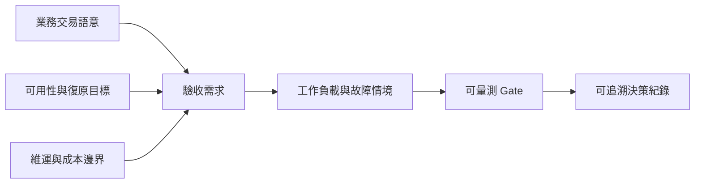

# 背景與需求

## 本章回答什麼

本章把「要不要導入分散式資料庫」拆成可驗證的需求，而非把單次壓測結果當成需求本身。它定義比較的共同語言與不可接受的風險。

**最後驗證日期：2026-07-11**

## 問題定義

[決策] 本次評估的目標是判定是否存在符合業務一致性、可用性、維運與成本邊界的導入路徑；不是尋找抽象意義上的最快系統。壓測採用的是 TPC-C-derived 壓力工作負載，不是經稽核的 TPC-C 成績，不能對外宣稱合規或與官方結果直接比較，見 [`results/PoC-DESIGN.md`](../results/PoC-DESIGN.md)。

**圖解判讀：** 效能只是驗收需求的一部分。先固定交易語意、可接受資料陳舊度、RPO/RTO 與營運責任，才能判斷量測數字是否有意義。

## 需求框架

- [決策] **正確性優先。** 每個交易類型須定義提交成功的語意、重試是否冪等、衝突如何處理，以及哪些讀取可接受過期資料。
- [決策] **可用性可驗證。** 故障範圍、服務恢復時間、資料遺失上限、用戶端路由與切回程序都要有演練證據，而不只依架構圖推定。
- [決策] **可維運。** 監控應能分辨時鐘偏移、複寫延遲、重試/中止、鎖等待、熱點與仲裁故障；備份、還原、升級及擴縮容要納入同一運行模型。
- [決策] **可遷移。** SQL 方言、驅動、ORM、交易隔離與管理工具的差異，需要按應用逐項盤點，不可由協定相容性推導為零改造。
- [決策] **可負擔。** 總持有成本至少涵蓋基礎設施、授權/支援、監控、備份、演練與人力，不以基準吞吐代替成本比較。

CAP、ACID、交易隔離與複寫一致性分屬不同責任層；跨區服務模式與 isolation 的選擇順序見[從 CAP 到交易隔離](04a-cap-and-isolation.md)。

## 證據與限制

- [官方能力] 多副本仲裁、讀取一致性模式與資料放置是分散式資料庫的常見能力類型；實際行為依系統、版本及設定而不同。本 PoC 已將隔離級與拓撲對齊原則寫入 [`results/PoC-DESIGN.md`](../results/PoC-DESIGN.md)。
- [待驗證] 已建立三類跨區工作負載規格：主備、雙區讀取與雙區讀寫；規格存在不構成正式跨區比較結論，見 [`phase-crossregion/workload-profiles/`](../phase-crossregion/workload-profiles/)。
- [機制推論] 同一 key 的跨區同時寫入會把網路往返、領導者位置、鎖或重試成本疊加，因此應視為業務衝突處理的驗證題，而非單純的網路壓測。
- [待驗證] 各應用的資料模型、尖峰流量、錯誤預算、法遵與復原目標尚未完全映射到測試矩陣。

## 決策影響或待驗證

- [決策] 將需求簽核拆成「交易語意」、「可用性/復原」、「營運」與「成本」四項，不允許用單一吞吐指標代簽。
- [待驗證] 由應用與營運負責人為關鍵交易定義讀寫一致性、冪等重試與資料陳舊度 SLA。
- [待驗證] 以已定義的服務等級目標回推故障演練、備份還原與容量情境，形成可執行的驗收清單。風險檢核項見 [`a_Distributed-SQL-database/0-issues-for-check.md`](../a_Distributed-SQL-database/0-issues-for-check.md)。
