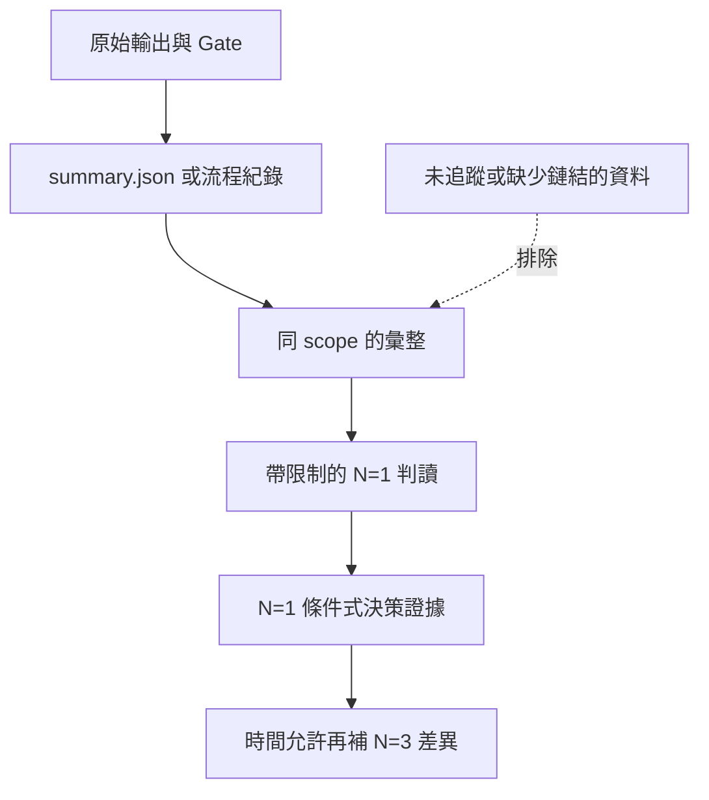

# 範圍與證據

## 本章回答什麼

本章說明哪些資料可用於何種判讀、證據如何追溯，以及如何避免不同環境與不同成熟度的結果被誤合併。

**最後驗證日期：2026-07-11**

## 證據分層

**圖解判讀：** 只有能回溯到原始輸出、環境 Gate 與明確 scope 的資料才可進入判讀。彙整文件是索引，不是取代結果檔案的第二真相。

## Scope 規則

- [決策] `S-BASE`、`S-K8S`、`T-THRD` 與 `X-CROSS` 是不同的實驗家族。前兩者只可在各自家族內對照；調校與跨區資料不具 baseline 資格，詳見 [`results/PHASES.md`](../results/PHASES.md)。
- [本 PoC 實測｜N=1] 三節點結果以「完整重建、部署、prepare、run、collect」計數為一次 `N`；同一次內的多個 round 不能替代獨立重跑。定義與限制見 [`results/README.md`](../results/README.md)。
- [本 PoC 實測｜N=1] 跨區 smoke、dry-run、時間同步檢查與 W=4 determinism 資料只支持 framework 或重現性觀察；它們不能混入一般 VM baseline。目錄判讀規則見 [`results/x-cross/README.md`](../results/x-cross/README.md)。
- [決策] 本章及其他 GitBook 章節不引用未追蹤結果；未納入版本控制且未完成來源鏈結的資料，不作為證據。

## 證據標籤使用方式

- [官方能力] 指官方文件或官方支援邊界；只證明能力宣告，不證明本環境表現。
- [本 PoC 實測｜N=1] 指本 repo 已追蹤結果檔案的單次完整實驗；可用於條件式判讀、找問題和形成假設。
- [機制推論] 指由指標、錯誤訊息或架構機制導出的合理解釋；必須保留替代原因。
- [待驗證] 指尚無足夠結果檔案支持的主張、條件或例外。
- [決策] 指目前採用的流程或使用限制；它不是效能比較結果。

## 可引用與不可引用的界線

- [官方能力] 官方能力描述可作設計前提，但需要以目標版本與設定重核。
- [本 PoC 實測｜N=1] 已追蹤的 `summary.json`、流程紀錄、dry-run 結果與 dispatch 分析可回鏈；數字引用時必須同列工作負載、拓撲、隔離級與 `N`。
- [機制推論] 若結論僅依 OS 指標或錯誤訊息推估，不能寫成內部路徑的已證實因果。現有歸因限制已記於 [`results/README.md`](../results/README.md)。
- [待驗證] 缺 DB 內部 trace、跨節點完整 metrics 或失敗復現時，應標記為待驗證而非刪除 caveat。

## 決策影響或待驗證

- [決策] 決策文件只鏈結 repo-relative 的已追蹤來源，並保留範圍、日期與 `N`；不複製大段原始表格。
- [待驗證] 第一版統一採 `N=1`；時間允許時為代表性案例補 `N=3`，沿用相同結果鏈並比較數據差異，不覆寫既有 `N=1`。
- [待驗證] 跨區若要量化成本，需設計同節點數、同仲裁模型與同工作負載的 paired control；目前不可用不同 scope 的算術差值推導。
