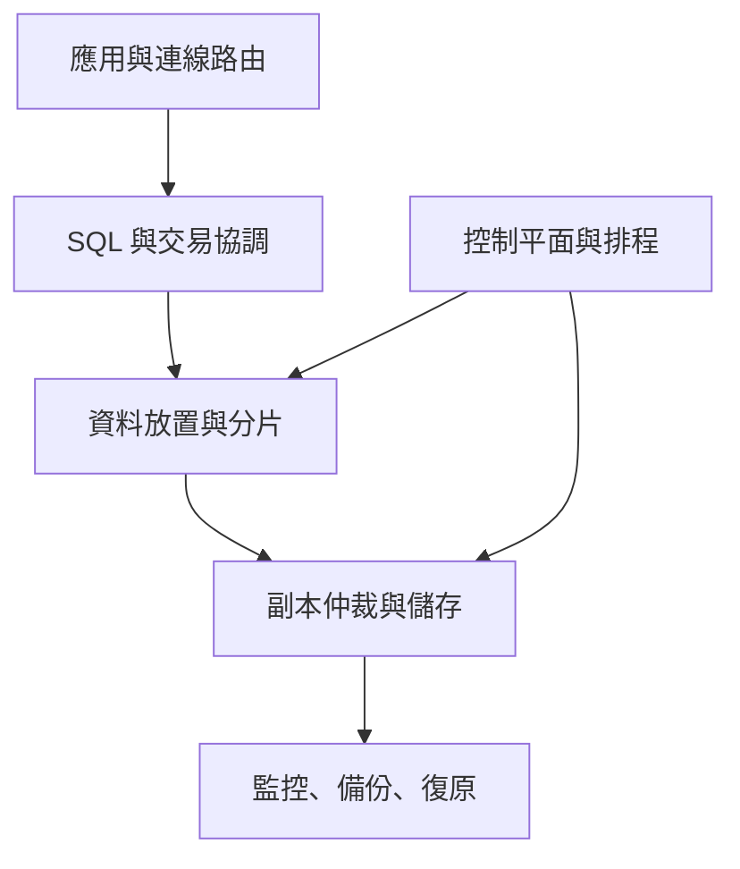
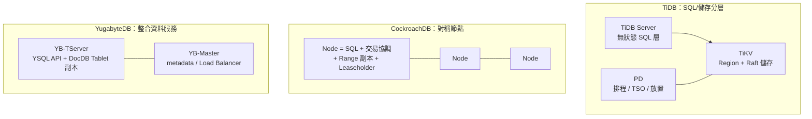

# 架構比較

## 本章回答什麼

本章以架構型態比較候選系統的決策影響，說明哪些因素需要實測驗證。它不對產品做排名，也不將架構差異直接等同於效能優劣。

**最後驗證日期：2026-07-13**

## 比較模型

**圖解判讀：** 所有候選架構都要處理 SQL、交易、分片、副本與控制平面；差異在於它們是否分層、是否由對稱節點同時承擔多種角色，以及資料與控制責任如何拆分。評估應追問故障域、擴容路徑與觀測點，而非假設其中一種排列天然較佳。

## 架構型態與檢查點

| 候選系統 | 主要元件 | 資料單位與共識 | PoC 應關注的操作面 |
|---|---|---|---|
| TiDB | TiDB Server、TiKV、PD | Region 與 Raft；SQL 與儲存分層 | SQL 入口分布、Region/Leader 放置、PD 排程與 TiKV 資源 |
| CockroachDB | 對稱 CockroachDB nodes | Range、Replica、Leaseholder 與 Raft | SQL 入口、Range/Leaseholder 熱點、admission 與再平衡 |
| YugabyteDB | YB-TServer（YSQL/DocDB）、YB-Master | Tablet、Replica 與 Raft | YSQL backend、Tablet Leader、Master/Load Balancer 與 compaction |

**圖解判讀：** 三種排列的差異決定了「哪裡會出現熱點、故障時哪一層先受影響、擴容時搬的是什麼」。TiDB 的 SQL 層可獨立擴縮但多一個控制平面（PD）要驗證；CockroachDB 單一 binary 部署最簡但每個節點同時承擔全部角色；YugabyteDB 的資料節點同時服務 API 與儲存、另有 Master 管 metadata。這張圖只描述角色拆分，不隱含優劣。

- [官方能力] **SQL/儲存分層型：** SQL 接入與主要資料儲存可獨立擴縮，另有叢集 metadata、時間戳或排程控制元件。應驗證 SQL 層路由、儲存副本、控制平面可用性與擴縮時的資料平衡。
- [官方能力] **對稱節點型：** 每個資料節點可接收 SQL、協調交易、路由資料並保存副本。應驗證連線是否均衡進入有效節點、資料範圍與租約/領導者位置是否形成熱點。
- [官方能力] **整合資料服務型：** 資料服務節點同時承擔 SQL API 與儲存/副本工作，另有 metadata 管理元件。應驗證 API 路徑、資料分片、tablet/range 佈局與背景協調是否互相影響。
- [決策] 三種型態都必須把「資料平面」與「控制平面」分開驗收；前者可跑通不代表後者在故障、再平衡或時間同步異常時仍滿足服務目標。

## 實驗觀察應如何解讀

- [本 PoC 實測｜N=1] 三節點受控實驗固定分片、副本、隔離級與工作負載，再比較直連與代理路徑。結果只能用於該設定下的候選配置假設，見 [`results/README.md`](../results/README.md) 與 [`results/PoC-DESIGN.md`](../results/PoC-DESIGN.md)。
- [機制推論] 若加入連線代理後指標改變，可能涉及連線分散、入口節點負載或用戶端路徑；未取得代理統計與逐節點證據前，不可歸因為資料庫核心效率。
- [機制推論] 寫入尾端延遲隨副本或跨區放置增加，通常與仲裁等待、領導者位置或跨區往返相關；仍需以 transaction trace、領導者分布及網路量測排除其他原因。
- [待驗證] 背景重平衡、熱點、線上 DDL、節點故障與版本升級下的行為尚未形成完整的跨型態對照。

## 決策影響或待驗證

- [決策] 架構審查以「角色責任、故障域、容量擴展、操作面與觀測性」作比較維度，不採單一 benchmark 排行。
- [決策] TiDB 要採單一或多 Cluster，需再依控制平面、RPO/RTO、維護與 OS/storage 隔離判斷，見[資源控制：一個或多個 TiDB Cluster](08-resource-control.md#一個-tidb-cluster-還是多個)。
- [待驗證] 對每個候選系統補齊控制平面故障、資料放置收斂、連線路由和背景作業的量測與復原程序。
- [待驗證] 在目標部署版本重新確認官方支援邊界與營運限制；官方能力來源索引與本地實作對齊見 [`results/PoC-DESIGN.md`](../results/PoC-DESIGN.md)。

## 官方能力來源

- [官方能力] [TiDB Architecture](https://docs.pingcap.com/tidb/stable/tidb-architecture/) 說明 TiDB Server、PD 與 TiKV 的角色。
- [官方能力] [CockroachDB Transaction Layer](https://www.cockroachlabs.com/docs/stable/architecture/transaction-layer) 說明 SQL 交易如何映射到分散式 KV 層。
- [官方能力] [YugabyteDB Architecture](https://docs.yugabyte.com/stable/architecture/) 說明 YB-Master、YB-TServer、YSQL 與 DocDB。

以上連結只證明原廠描述的能力與架構；本環境是否正確部署、效能如何及故障時能否復原，仍以本 PoC 結果與演練為準。
