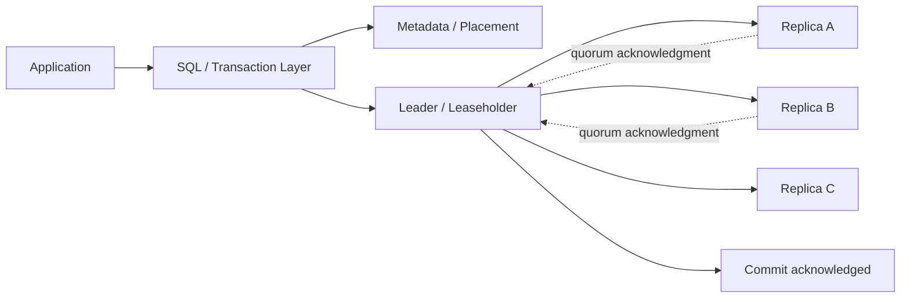
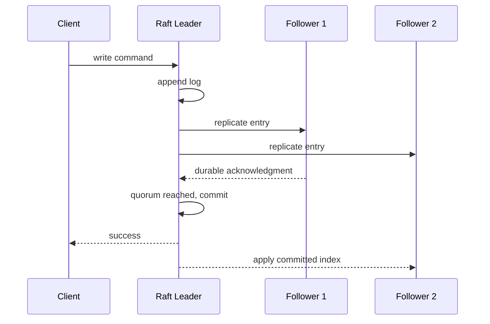
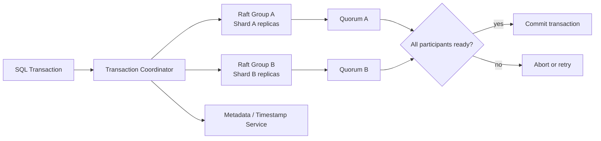
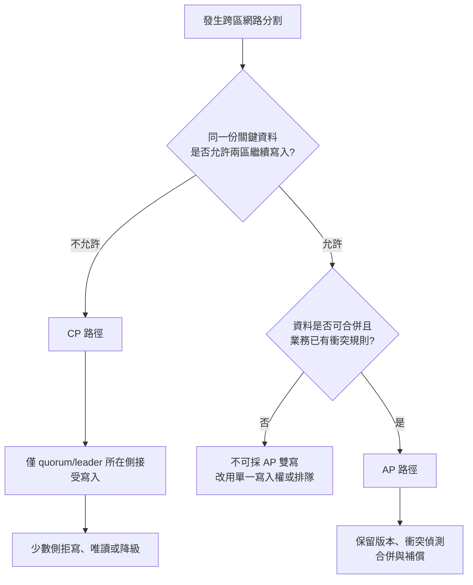
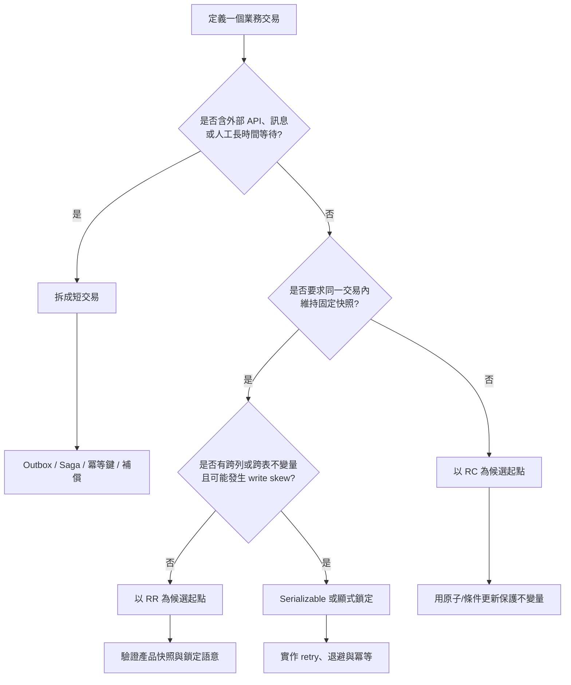
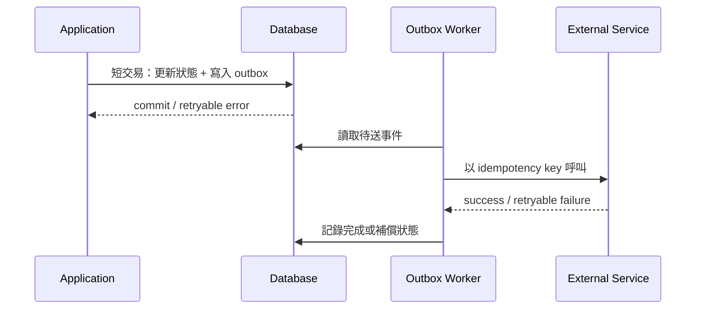

# 從 CAP 到交易隔離

> 最後驗證：2026-07-15｜本章是架構與應用決策指引；產品實際行為仍須以指定版本、設定與測試結果驗證。

## 本章回答什麼

分散式資料庫沒有把 ACID「轉換」成 CAP。兩者處理不同問題：CAP 決定網路分割期間系統保留一致性或可用性；交易隔離級決定多個交易同時執行時，可以觀察哪些資料與如何處理衝突。

正確順序是先決定資料放置、複寫、仲裁、leader 與路由，再依業務不變量選擇足夠的交易隔離級。反向操作會讓應用誤以為提高 isolation 就能解決跨區資料分歧。

## 四種一致性不可混用

| 概念 | 回答的問題 | 不負責處理 |
|---|---|---|
| CAP Consistency | 網路分割時，所有可成功存取的節點是否仍呈現單一、最新的資料狀態？ | 交易內的業務規則 |
| ACID Consistency | 交易前後是否維持資料庫與業務不變量？ | 跨副本的可用性取捨 |
| Transaction Isolation | 併發交易彼此能看到什麼，衝突如何排序或中止？ | split-brain、複寫落後與跨區路由 |
| Replication Consistency | 副本何時收斂、讀取可能多舊、寫入何時算提交？ | 應用冪等與外部副作用 |

[決策] 分散式部署無法假設網路永不分割，因此 P 不是日常可自由捨棄的選項。真正的 CAP 取捨發生在分割期間：保留 C，部分請求必須失敗或等待；保留 A，則必須接受並處理資料分歧。

[機制推論] 即使沒有網路分割，跨區仍存在延遲與一致性的取捨。PACELC 可用來補充判讀：分割時看 Availability/Consistency，正常時看 Latency/Consistency。

## 從單體到多地多中心

「分散式」描述資料與運算由多個節點共同完成；「跨區」與「多地多中心」描述地理位置。兩者是不同維度：同一機房可以部署分散式叢集，跨區也可能只是兩套獨立的單體資料庫做非同步複寫。

| 架構 | 資料路徑 | 常見目的 | 一致性與設計重點 |
|---|---|---|---|
| 單體資料庫 | 應用連到單一 DB instance | 簡化部署與交易管理 | 本機 ACID 清楚，但 instance、儲存與機房故障需另做 HA/DR |
| 單區叢集 | 多節點位於同一資料中心或低延遲網域 | 節點 HA、容量與讀寫擴充 | quorum 延遲較低；仍需驗證 leader、failover、split 與 rebalance |
| 單區分散式資料庫 | SQL、metadata、storage 分散於多節點 | 水平擴充、容錯與資料分片 | transaction、shard 與 replica 同時影響延遲；熱點不會因「分散式」自動消失 |
| 跨區單一叢集 | 同一 quorum 橫跨 IDC/GCP 或多 region | 跨機房容錯與單一資料真值 | 同步提交受跨區 RTT 與 quorum placement 影響；少數側通常不可寫 |
| 多地多中心單一叢集 | 三個以上 failure domain 共用同一分散式叢集 | 區域級 HA、就近讀取 | 必須設計 voter 數、leader/lease、資料放置、讀取新鮮度與故障域 |
| 多地多叢集 | 每地獨立 cluster，再做同步、非同步或應用層複寫 | 隔離故障、在地自治或 DR | 不天然具有全域交易；雙寫需要 ownership、衝突解決、去重與切換 fencing |



圖中是常見的同步 quorum 提交流程，不代表所有產品都採相同角色或協定。應用送出的寫入通常由 leader/leaseholder 排序並寫入日誌，取得多數具投票權 replica 的 durable acknowledgment 後才回覆成功。等待的是 quorum，不一定是所有副本。

## 同步複寫不等於一致性模型

同步複寫描述「提交前要等哪些副本確認」；一致性模型描述「讀寫者可以觀察到哪些順序與資料」。兩者相關但不能互換：

- quorum 同步提交可保護已提交資料，但 follower 若允許 stale read，讀取仍可能不是最新值。
- 等待所有副本雖可縮小副本落後，卻會讓任一慢節點拖慢或阻斷提交。
- 非同步複寫可做到最終收斂，但主站故障時可能遺失尚未送達的寫入。
- linearizable read 除了複寫方式，還需要正確 leader、quorum/read-index 或等價的讀取協定。

| 複寫方式 | 提交條件 | 優點 | 主要代價與風險 | 適用規劃 |
|---|---|---|---|---|
| 單節點提交 | 本機 durable write | 延遲最低、流程簡單 | 節點或機房故障可能中斷服務 | 開發、可重建資料或外部已有 HA |
| 同區同步 quorum | 多數副本 durable acknowledgment | 節點故障下保留已提交資料 | write latency 包含同區網路與慢 quorum 成員 | 核心交易的單區 HA |
| 跨區同步 quorum | 跨 failure domain 組成多數確認 | 可承受指定區域故障且維持單一真值 | commit latency 至少承擔 quorum 路徑 RTT；分割時少數側停寫 | RPO 接近 0、可接受跨區寫入延遲的關鍵交易 |
| 非同步跨區複寫 | 主站本地提交後再傳送 | 主交易延遲較低、適合 DR | 有 replication lag 與非零 RPO；切換需防止雙主 | 可接受明確 RPO 的 A/S、報表或災備 |
| 多主/應用層複寫 | 各站可本地提交 | 分割時仍可接受寫入 | 衝突、順序與補償轉移到應用或資料模型 | 可合併資料，且已具 ownership/CRDT/衝突規則 |

[決策] 跨專線設計不能只寫「同步」。至少要明確列出 voter/replica placement、quorum 數、哪一側可寫、讀取路徑、提交 acknowledgment 條件、故障時降級方式，以及量測到的 RTT、replication lag、RPO/RTO。

## 從傳統複寫到 Raft 與分散式交易

一致性模型描述應用能觀察到的結果；複寫與共識協議則是實現這些結果的部分機制。不能只看到產品採用 Raft，就推定整個 SQL database 已具備 linearizability、Serializable 或跨 shard 原子性。

### 傳統資料庫複寫

傳統主從架構通常由 primary 先寫入 WAL、redo log 或 binlog，再把變更傳給 standby/replica 重播：

- **非同步複寫：** primary 本地提交後即回覆，延遲低，但故障切換可能遺失尚未送達的交易。
- **同步複寫：** primary 等待指定 standby 收到或 durable write 後才回覆，可降低 RPO，但 commit latency 受最慢必要副本影響。
- **半同步複寫：** 至少等待一個副本 acknowledgment；確認的是收到、寫入或套用，須依產品設定判讀。

這類架構可提供 HA/DR，但 primary 的選舉、fencing、同步狀態與 stale read 仍要另外控制。若故障後兩側都能接受寫入，單靠 WAL/binlog 不會自動解決衝突。

### Raft／Paxos 共識

Raft、Paxos 類協議讓一組 replica 對 log 順序與 leader 達成共識。以 Raft 為例：

1. client 將寫入送到 leader，或由其他節點轉送。
2. leader 將操作附加到自己的 replicated log。
3. 多數 voter durable acknowledgment 後，該 log entry 才能 commit。
4. follower 依相同順序套用已提交 entry。
5. leader 故障時，只有包含足夠新 log 的 quorum 能選出新 leader 並繼續服務。



[機制推論] 三副本不代表每次提交都等待三份完成；常見規則是任兩個 voter 組成 quorum。若 quorum 必須跨專線，正常提交延遲會包含跨區 RTT；若多數 voter 都在 IDC，IDC 與 GCP 分割時通常由 IDC 側繼續服務，GCP 少數側停止寫入。

### 一個 database 可能有多個共識群組

分散式資料庫通常不會讓整個 database 共用單一 Raft log。每個 shard、region、range 或 tablet 可能各自形成共識群組，metadata 也可能有獨立群組：



因此，「Shard A 的 Raft entry 已提交」不代表跨 shard SQL transaction 已完整提交。系統還需要 transaction coordinator、timestamp、lock/MVCC 與 commit protocol 協調所有參與者。

### Raft、MVCC、2PC 與 isolation 的責任

| 機制 | 主要責任 | 不能單獨保證 |
|---|---|---|
| WAL／redo log／binlog | 記錄、傳送與重播資料變更 | leader 共識、跨 shard 原子性 |
| Raft／Paxos | 同一 replica group 的 log 順序、quorum commit 與 leader election | 整個 SQL transaction 的 isolation |
| MVCC | 保存多個版本，依 timestamp/snapshot 決定可見資料 | 跨 shard 全成或全敗 |
| 2PC 或等價 commit protocol | 協調跨 shard transaction 全部提交或全部中止 | 正確的副本 placement 與讀取新鮮度 |
| Isolation level | 限制交易間的可見性、衝突與允許的 anomaly | split-brain、複寫落後與應用冪等 |
| Placement policy | 決定 replica、voter、leader preference 與 failure domain | transaction concurrency semantics |
| Read protocol | 決定 leader、quorum、follower 或 stale read 路徑 | 寫入原子性與外部副作用 |

跨 shard、跨區交易的延遲通常會疊加多層成本：transaction coordination、各 shard quorum replication、跨區 RTT、lock/MVCC conflict，以及失敗後 retry。這也是本 PoC 必須同時保存 topology、placement、isolation、retry/abort 與 p95/p99，而不能只報 tpmC 的原因。

> **判讀原則：** Raft 是資料庫一致性實作的一部分，不是完整答案。只有在共識、MVCC、分散式提交、讀取協議、placement 與應用重試契約共同成立時，產品才能對外提供可驗證的 SQL 一致性保證。

## 五種資料一致性模型

以下強弱順序是概念導讀，不表示所有模型都能簡單排成單一線性階梯。特別是 causal 與 sequential 關注的順序約束不同，實際保證須讀產品定義。

### 1. 嚴格一致性（Strict Consistency）

所有讀取都立即看到絕對時間上最近完成的寫入，等同假設全系統存在完美全域時鐘與瞬時傳播。這是理論上的最強模型，在有非零網路延遲的真實分散式系統中通常不能直接實現，也不應把產品宣稱的「strong consistency」自動解讀為 strict consistency。

**適用方式：** 作為理論比較上界，不作一般跨區系統的可交付需求。實務需求應改寫為可驗證的 linearizable、read-your-writes、bounded staleness 或 RPO 指標。

### 2. 強一致性／線性一致性（Strong Consistency / Linearizability）

每個操作看起來都在呼叫與回覆之間的某一瞬間原子完成，且遵守真實時間先後：若寫入 A 已回覆成功，之後開始的讀取不能回到 A 以前的值。本章使用「強一致性」時特指 linearizability；業界也可能把 strong consistency 當成較模糊的統稱，文件必須寫出精確保證。

**適合：** 餘額、庫存、唯一名稱、權限、鎖與 leader election 等不能接受舊值的操作。

**設計：** 讀寫走 leader/quorum 或產品提供的 linearizable read；網路分割時拒絕無法取得 quorum 的請求。跨區部署要接受 RTT 與可用性代價。

### 3. 順序一致性（Sequential Consistency）

所有節點看到相同的全域操作順序，而且每個 client 自己的操作順序被保留；但這個全域順序不必符合真實時間。寫入雖已在現實時間較早完成，另一 client 隨後開始的讀取仍不一定受 real-time ordering 約束。

**適合：** 需要所有參與者看到相同事件順序，但不要求以牆鐘時間立即反映的協作狀態、部分佇列或狀態機場景。

**限制：** 對「成功回覆後，任何新讀取必須立即看到」的業務契約不夠；不能拿來替代 linearizability。

### 4. 因果一致性（Causal Consistency）

有因果關係的操作在所有觀察者眼中維持相同順序；互不相關的並行操作可以在不同副本以不同順序出現。例如先發布文章再回覆文章，所有人都必須先看到文章；兩篇彼此無關的文章則不必有唯一全域順序。

**適合：** 社群互動、協作編輯、訊息串與可容忍短暫跨區差異的使用者內容。

**設計：** 傳遞 session/token/version 等 causal context，並確認 client 切換 region 後仍能維持 read-your-writes 與因果鏈。沒有 context propagation 時不能只靠「就近讀取」推定具備 causal consistency。

### 5. 最終一致性（Eventual Consistency）

停止新增更新且網路恢復後，所有副本最終會收斂；它本身不保證何時收斂、讀取多舊、是否單調，也不定義並行更新衝突如何解決。

**適合：** 快取、搜尋索引、分析副本、遙測，以及已明確容許 stale read 的非關鍵資料。

**設計：** 必須另定 replication lag SLA、版本/衝突規則、read-your-writes 需求、回源方式與監控告警。「最終」若沒有時間上界，就不能作為可驗收 SLA。

## 一致性模型的選擇順序

1. 先寫出業務可觀察契約：是否要求 read-your-writes、單調讀、全域順序或 real-time ordering。
2. 將資料分類，不要求整個資料庫都採最強模型；核心交易與快取/索引可以不同。
3. 決定單 cluster 或多 cluster、同步或非同步、voter 與 leader placement。
4. 決定讀取走 leader、quorum、follower 或 bounded-staleness 路徑。
5. 用網路分割、leader 故障、replica lag 與 client 跨區切換驗證，不只看正常狀態。
6. 最後才選 RC/RR/Serializable，保護單一資料真值內的交易不變量。

## 第一層：網路分割時如何服務



### 適合 CP 的情境

- 餘額、庫存、訂單狀態、權限與唯一性約束。
- 同一業務 key 不允許兩區獨立提交相互矛盾的結果。
- 可以接受少數側暫停寫入，以換取單一正確狀態。

### AP 只能用在明確可合併的資料

- 可重建的快取、遙測、部分計數或非關鍵 session metadata。
- 業務已定義版本、去重、衝突合併及補償責任。
- 讀到舊值或短暫分歧不會破壞核心不變量。

[決策] 「A/A」只是流量與部署模式，不代表同一筆資料可以安全雙寫。若兩個獨立 cluster 都能寫同一業務資料，還需要資料所有權、全域冪等鍵、衝突解決及復原流程。

## 第二層：選擇足夠的交易隔離級

完成 CAP、quorum、leader、replication 與 request routing 設計後，才進入 isolation 選擇。



### READ COMMITTED：短交易的候選起點

適合一般短 CRUD、單列狀態轉換，以及能用原子或條件式 SQL 表達的不變量。它不是所有 OLTP 的固定答案；仍需依資料庫語意與業務規則驗證。

```sql
UPDATE inventory
SET available_qty = available_qty - :qty
WHERE product_id = :product_id
  AND available_qty >= :qty;
```

應用必須檢查 affected rows：`1` 代表扣庫存成功，`0` 代表條件不成立。不要先 `SELECT`、在應用計算、再無條件 `UPDATE`；這種 read-modify-write 可能在併發下使用過期判斷。

其他可用模式包括：

- 以 `WHERE status = 'pending'` 保護狀態機轉換。
- 以 version 欄位做 optimistic locking。
- 以唯一鍵與冪等鍵避免重複建立或扣款。

### REPEATABLE READ：固定快照

適合同一短交易內需要多次讀取同一快照的報表、對帳或一致性檢查。它能避免交易內讀取視圖改變，但不代表讀到全系統最新資料，也不等同 Serializable。

RR 不能單獨解決：

- 副本落後或錯誤讀取路由。
- split-brain 或兩個 cluster 同時寫入。
- 跨列條件在 snapshot isolation 下可能發生的 write skew。

### Serializable：保護跨列與跨表不變量

當兩個交易各自讀取多列或多表，且各自寫入後可能共同破壞規則時，Serializable 或顯式鎖定才是合理候選。例如兩位值班人員不能同時下線：兩個交易都看到「尚有另一人在線」，然後各自更新不同資料列，單看每筆更新都合法，合併後卻無人在線。

採用 Serializable 時，應用必須把 serialization failure 視為正常控制流程：

- 交易可安全重試且具冪等性。
- retry 有次數、總時間與退避上限。
- 外部 API、訊息發布或付款不放在可重試交易內直接執行。
- 量測 abort/retry rate 與 p95/p99，不只看成功吞吐。

[機制推論] 更高 isolation 可能增加等待、中止或重試，但實際代價依產品實作、資料模型與競爭程度而定，不能只靠官方能力說明推定。

## Isolation 解決不了的問題

提高 isolation 不會自動解決下列分散式系統問題：

| 問題 | 必要控制 |
|---|---|
| split-brain 或少數側持續寫入 | quorum、fencing、單一寫入權 |
| 非同步複寫造成資料遺失 | 明確 RPO、同步策略、切換 gate |
| commit 結果未知 | 冪等鍵、交易查詢、重試判定 |
| 跨區重複請求 | 全域 request ID、唯一鍵、去重 |
| 外部副作用與 DB commit 不一致 | Transactional Outbox、補償 |
| 長流程跨越多個服務 | Saga、狀態機、可恢復 checkpoint |
| follower read 過舊 | freshness SLA、路由與 read timestamp |

## 跨區交易的建議結構



[決策] 不讓資料庫交易跨越 WAN API、訊息平台或人工操作。資料庫負責短交易內的不變量；工作流負責重試、冪等、補償與可觀測狀態。

## 產品語意必須另外驗證

相同 isolation 名稱在產品間不保證相同行為：

- MySQL InnoDB 的 RR 包含 consistent read 與 locking read 差異。
- PostgreSQL 的 RR 採 snapshot isolation，Serializable 使用額外衝突偵測。
- TiDB 的 RC/RR、pessimistic mode 與工具鏈 strict 對標須依本 PoC gate 判讀。
- CockroachDB 與 YugabyteDB 也必須以指定版本的 session setting、effective isolation、retry 行為及實測證據確認。

因此比較隔離級時，至少固定並保存：connection parameters、session/default/effective isolation、交易模式、retry/abort、錯誤率、延遲及執行計畫。PoC 的具體對齊方式見 [PoC 設計](../results/PoC-DESIGN.md)。

## 應用決策清單

1. 寫出業務不變量，不先選 isolation 名稱。
2. 定義網路分割時哪些區域可讀、可寫或必須拒絕。
3. 固定資料所有權、quorum、leader、replica 與 request routing。
4. 定義可接受的 stale read、RPO、RTO 與 commit-unknown 處置。
5. 以最低且足以保護不變量的 isolation 作候選。
6. 以原子 SQL、條件更新、唯一鍵和顯式鎖定補強。
7. 對 retry、冪等、Outbox、Saga 與補償建立應用契約。
8. 在相同拓樸下量測吞吐、p95/p99、error/retry/abort 與故障行為。
9. 將官方說明、設定證據與本 PoC 實測分開記錄。

延伸閱讀：[應用就緒性](11-application-readiness.md)、[跨區與跨專線架構](09-cross-region.md)、[條件式決策框架](16-decision-framework.md)。
