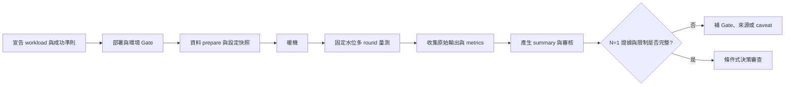

# 實驗設計

## 本章回答什麼

本章定義將需求轉成可重跑證據的最低方法：控制變因、前置 Gate、結果鏈結與樣本數。它也說明目前為何所有可用結論都保留 `N=1` 標記。

**最後驗證日期：2026-07-11**

## 實驗流程

**圖解判讀：** 多個 round 用來降低同一次執行內的波動；獨立 `N` 則要求重建並重跑整條鏈，才能觀察時間、部署與環境差異。兩者不能互相替代。

## 控制與量測原則

- [官方能力] 候選系統對隔離級、副本與資料放置的支援邊界，必須依目標版本的官方文件確認；PoC 僅驗證明確記錄的版本與設定組合。
- [決策] 每一 cell 必須宣告工作負載、隔離級、節點數、分片/副本、連線路徑、資源邊界、暖機與採樣規則。基準設計的共同設定與非合規邊界見 [`results/PoC-DESIGN.md`](../results/PoC-DESIGN.md)。
- [決策] Gate 應先驗證拓撲、資料放置、隔離級、時間同步、磁碟與必要檔案，再允許正式量測；Gate 失敗時結果檔案只用於診斷，不進結果主張。
- [本 PoC 實測｜N=1] 現有三節點資料採多個併發水位與多輪量測，但完整流程只獨立執行一次，故只能標為 `N=1`。計數口徑見 [`results/README.md`](../results/README.md)。
- [本 PoC 實測｜N=1] 跨區已使用 scope、placement、時間同步與 smoke/determinism 分層；正式跨區資料仍必須遵守 `X-CROSS` 的不可混比規則，見 [`results/x-cross/pipeline-log.md`](../results/x-cross/pipeline-log.md)。

## 結果檔案最低集合

- [決策] 原始 workload 輸出、Gate 結果、設定/manifest、資料放置證明、每輪 metrics、錯誤資訊與彙整檔須以同一 run id 串接。
- [決策] `summary.json` 是引用入口，原始輸出是可追溯依據；若兩者不一致，以原始輸出為準並修正彙整流程。
- [機制推論] CPU、I/O、網路或錯誤訊息可提出瓶頸假設，但不應取代資料庫內部 trace、鎖/重試或副本狀態的直接量測。
- [待驗證] 尚需補齊跨節點 metrics、代理統計與資料庫內部診斷，讓機制歸因可被反證。

## `N=1` 現行口徑與 `N=3` 後續補強

- [決策] 第一版所有實測結論統一標示 `N=1`，以條件式適用性和限制清單呈現，不宣稱統計顯著。
- [決策] 時間允許時再執行三次獨立重建，保留原 `N=1`，新增 `N=3` 的吞吐、尾端延遲、錯誤率與 run-to-run 差異。
- [待驗證] 若後續結果分散，先檢查 placement、再平衡、暖機、控制平面與環境差異；不可只挑選最佳一次。

## 決策影響或待驗證

- [決策] 把每個採用前結論綁定到明確實驗矩陣與結果鏈。
- [待驗證] 先用 `N=1` 完成壓力、故障與維運缺口盤點；後續時程允許時，再針對代表性情境補 `N=3` 差異。
- [待驗證] 跨區 chaos 與 failover 目前應維持 planner/受控演練門檻，執行前需有審核與回退方案，見 [`phase-crossregion/PRE-FLIGHT-TEST-PLAN-2026-06-17.md`](../phase-crossregion/PRE-FLIGHT-TEST-PLAN-2026-06-17.md)。
