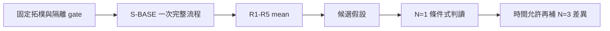
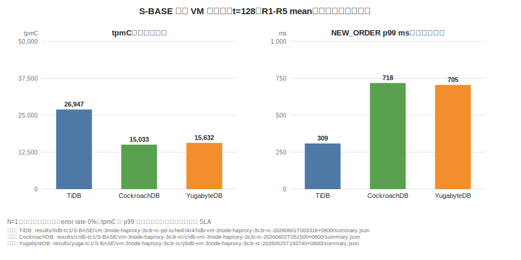
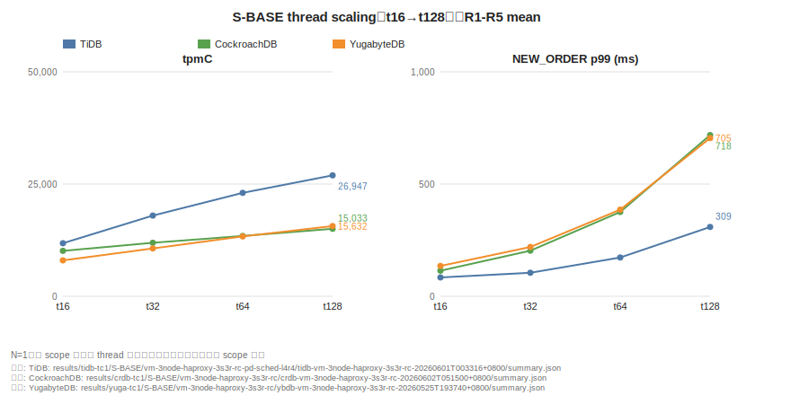

# 06. 基準發現：單區 VM

**章節問題：** 在固定的單區三節點、`3 shard × RF=3`、READ COMMITTED 與 HAProxy 入口條件下，哪些觀察可作為後續驗證的起點？

**決策影響：** 此章只提供 VM 基準家族內的候選工作負載形狀與重跑優先序；不選定產品，也不把結果外推為正式容量承諾。

**最後驗證：** 2026-07-13。原始輸出保留於 `results/`；本文只引用彙整結果檔案。

## 證據邊界

| 類別 | 可採用內容 | 不可推出的結論 |
|---|---|---|
| 官方能力 | 分散式複本、分片與多入口連線是各受測引擎的既有架構選項；隔離級與副本放置需由部署設定及 gate 驗證 | 官方能力不等於此環境的吞吐、延遲或可用性保證 |
| PoC 證據 | `S-BASE` 三節點 HAProxy `3s3r` 的 R1-R5 mean | `N=1` 不能形成產品排名、SLA 或跨環境容量模型 |
| 排除 | `S-K8S`、`T-THRD`、`X-CROSS` | 不得混入 VM 主表或用比值推導 VM 結論 |

測試是 TPC-C-derived 壓力測試，不是 audited TPC-C，亦不可與官方 TPC-C 成績比較。設計口徑、隔離級 gate 與量測方法見[PoC 設計](../results/PoC-DESIGN.md)與[phase registry](../results/PHASES.md)。

## 觀察摘要

下表只並列各自結果檔案的代表水位 `t=128`，不是跨引擎勝負表。三列皆為 `N=1`、error rate 0%、R1-R5 mean；tpmC 與 NEW_ORDER p99 必須成對解讀。

| 受測引擎 | tpmC | p99 (ms) | 可以形成的條件式假設 | PoC 來源 |
|---|---:|---:|---|---|
| TiDB | 26,946.7 | 308.7 | 在此 SQL 層多入口、PD 排程設定與負載下，入口分散值得保留為候選 | [summary.json](../results/tidb-tc1/S-BASE/vm-3node-haproxy-3s3r-rc-pd-sched-l4r4/tidb-vm-3node-haproxy-3s3r-rc-20260601T003316+0800/summary.json) |
| CockroachDB | 15,033.3 | 718.0 | 在此對稱節點與 HAProxy 條件下，應以 direct 對照重驗連線入口效應 | [summary.json](../results/crdb-tc1/S-BASE/vm-3node-haproxy-3s3r-rc/crdb-vm-3node-haproxy-3s3r-rc-20260602T051500+0800/summary.json) |
| YugabyteDB | 15,632.4 | 704.6 | 在此 tablet 與 HAProxy 條件下，應同時檢查入口分散及 leader/tablet 分布 | [summary.json](../results/yuga-tc1/S-BASE/vm-3node-haproxy-3s3r-rc/ybdb-vm-3node-haproxy-3s3r-rc-20260525T193740+0800/summary.json) |

這些是單次完整部署、prepare、run、collect 所得結果。五個 round 降低同次執行的隨機波動，但仍統一標示 `N=1`；`N` 的定義見[結果索引 N9](../results/README.md#note-n9)。

**圖解判讀：** 左右兩張子圖必須成對看——tpmC 高而 p99 低才是同向優勢；scaling 曲線呈現的是「同 scope 內各引擎隨併發變化的形狀」，不是容量承諾。圖內數字直接由上表引用的 `summary.json` 產生（`make charts` 可重生），圖註帶有相同的 `N=1` 限制。

## 條件式適用矩陣

| 決策條件 | 本章可用的證據 | 建議動作 | 不適用情況 |
|---|---|---|---|
| 單區 VM、RC、3 節點、固定 `3s3r` | `S-BASE` 結果檔案與 topology gate | 把 HAProxy、多入口、分片與副本設定列為候選組合 | K8s、跨區、改變資料量或 isolation |
| 需要判斷副本寫入成本 | 只有同 family 的固定 shard 對照才可解讀 | 保持 shard、RF、資料量與入口一致後重跑 | 使用自然 split 或不同排程狀態時 |
| 需要判斷連線入口效益 | 本輪可作方向性線索 | 於每個候選方案補 direct/HAProxy paired control 與負載分布證據 | 未開啟可觀察的連線與後端統計時 |
| 需要對外容量或採購決策 | 只有帶限制的 `N=1` | 同時納入故障演練、成本與業務 gate，並揭露樣本限制 | 將 N=1 宣稱為統計顯著時 |

## 待決事項

- 時間允許時，可優先為三個 `vm-3node-haproxy-3s3r-rc` cell 補 `N=3`，並與既有 `N=1` 比較差異。
- HAProxy 的路由分布需以可匯出的統計佐證，不能只由 tpmC 差異反推。
- 每次重跑需保留分片、replica、leader/leaseholder 或 tablet 分布的 gate 證據，避免把拓樸漂移誤判為引擎差異。

相關實作與既有 caveat 見[S-BASE 結果索引](../results/README.md#候選配置與彙整分析-pending-n3-validation)。
