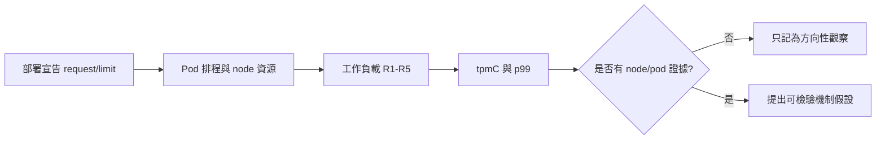

# 07. Kubernetes 發現

**章節問題：** 在同一 Kubernetes 基準家族中，資源限制條件下的壓力曲線是否足以支持下一輪部署與觀測設計？

**決策影響：** 可用於挑選 K8s family 內的重跑與診斷優先序；不可與 VM `S-BASE` 相除、排名或宣稱平台遷移損益。

**最後驗證：** 2026-07-11。數據均為 `S-K8S`、`N=1`、W=128、RC、20 分鐘 warmup 與 4 個併發水位。一般採每水位 R1-R5 mean；YugabyteDB limit 的 `t=128` 僅 4 個有效 round，必須連同例外揭露。

## 證據分級

| 分類 | 敘述 | 可否作效能結論 |
|---|---|---|
| 官方能力 | Kubernetes 提供 request/limit、排程與資源隔離機制；資料庫部署可宣告這些資源欄位 | 只說明可配置，不預測實際效能 |
| PoC 證據 | 三個受測引擎均有 `limit` 與 `unlimit` 的 S-K8S 結果檔案 | 僅限本 K8s family 的方向性觀察 |
| 尚未證明 | pod-level CPU throttling、記憶體回收、儲存或網路哪一項造成差異 | 不可由 tpmC/p99 直接斷言根因 |

S-K8S 的 family、量測口徑與禁止跨 family 直引規則，以[phase-k8s manifest](../phase-k8s/manifest.yaml)及[phase registry](../results/PHASES.md)為準。

## t=128 觀察

下表是各引擎在相同 family 內「有設定 limit」與「未設定 limit」的獨立 PoC cell；`unlimit` 不是無限硬體，而是該部署未宣告容器 limit。error rate 均為 0%，但仍僅 `N=1`。

| 受測引擎 | limit: tpmC / p99 | unlimit: tpmC / p99 | 可採用的觀察 | 來源 |
|---|---:|---:|---|---|
| TiDB | 15,751.9 / 651.0 ms | 23,442.9 / 362.4 ms | 本工作負載下，需把資源控制與排程狀態列入重跑因子 | [limit](../results/tidb-tc1/S-K8S/tidb-k8s-3node-haproxy-3s3r-limit-rc-20260608T210453+0800/summary.json) / [unlimit](../results/tidb-tc1/S-K8S/tidb-k8s-3node-haproxy-3s3r-unlimit-rc-20260608T165403+0800/summary.json) |
| CockroachDB | 6,493.5 / 2,093.8 ms | 12,196.7 / 912.7 ms | 此 cell 的尾延遲與吞吐同向變化，根因需由 node/pod 指標驗證 | [limit](../results/crdb-tc1/S-K8S/crdb-k8s-3node-haproxy-3s3r-limit-rc-20260611T132715+0800/summary.json) / [unlimit](../results/crdb-tc1/S-K8S/crdb-k8s-3node-haproxy-3s3r-unlimit-rc-20260609T065714+0800/summary.json) |
| YugabyteDB | 1,604.5 / 11,676.9 ms（4/5 valid rounds） | 2,997.6 / 5,422.4 ms | 高併發尾延遲需先設 admission、資源與 storage 的診斷 gate | [limit](../results/yuga-tc1/S-K8S/ybdb-k8s-3node-haproxy-3s3r-limit-rc-20260613T233549+0800/summary.json) / [unlimit](../results/yuga-tc1/S-K8S/ybdb-k8s-3node-haproxy-3s3r-unlimit-rc-20260612T120138+0800/summary.json) |

## 條件式適用矩陣

| 使用情境 | 可用結論 | 下一步 | 禁止的解讀 |
|---|---|---|---|
| 同一 K8s cluster、相同 topology、只調整資源宣告 | 可比較本 family 的負載反應 | 以 N=1 明列限制；時間允許再補 N=3 差異 | 與 VM baseline 混成產品排名 |
| p99 在高併發顯著上升 | 可建立容量保護與診斷門檻 | 收集 throttling、RSS/OOM、disk、network、pod placement | 直接歸因於某一資料庫產品 |
| 規劃 production request/limit | 可取得起始 sizing 範圍 | 用目標 workload、故障與擴縮情境驗證 | 把 PoC 上限當正式配額 |

## 待決事項

- 為每一 cell 補足 pod-level resource、Kubernetes event、storage latency 與 HAProxy backend 分布證據。
- 時間允許時再以完整重建補 `N=3`，確認 limit/unlimit 差異是否跨部署持續存在。
- 將 workload admission、autoscaling 與 failure recovery 納入獨立測項；其結果不得回填為本次 baseline。

目前完成狀態與例外以三家流程紀錄為準：[TiDB](../results/tidb-tc1/S-K8S/pipeline-log.md)、[CockroachDB](../results/crdb-tc1/S-K8S/pipeline-log.md)、[YugabyteDB](../results/yuga-tc1/S-K8S/pipeline-log.md)。`phase-k8s/README.md` 若仍顯示早期待辦，不覆蓋上述較新的結果紀錄。
