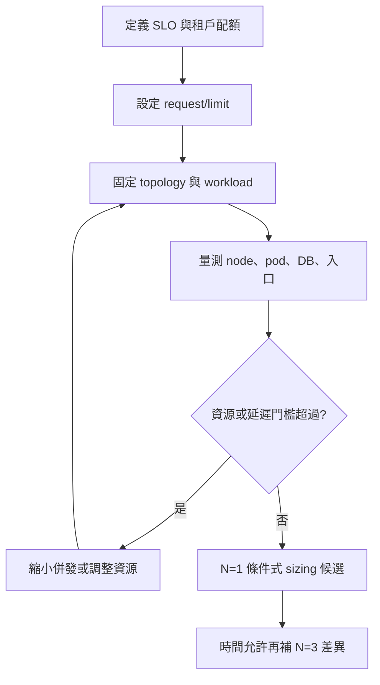

# 08. 資源控制：從配置到可驗證假設

**章節問題：** 當服務部署在共享 Kubernetes 節點時，如何把資源控制轉為可重現、可診斷的決策，而非把一次效能差異誤當產品特性？

**決策影響：** 產出 request/limit 的驗證清單與工作負載適用條件；不產生產品推薦或預設值。

**最後驗證：** 2026-07-11。本文使用 `S-K8S` 為主證據；`T-THRD` 僅用於探索機制，不能進 baseline 或主表。

## 能力與證據不可混寫

| 層次 | 官方或平台能力 | 本 PoC 已見 | 尚待驗證 |
|---|---|---|---|
| 資源宣告 | Kubernetes 可設定 CPU/memory request 與 limit | 六個 limit/unlimit cell 均有可追溯部署變數與 summary | 哪個內核/容器事件導致差異 |
| 隔離 | request 影響排程可行性，limit 形成可用上限 | 各受測引擎在 `t=128` 皆觀察到不同的 tpmC/p99 組合 | 在目標 node 壓力與鄰居負載下是否重現 |
| 引擎調參 | 引擎可有 process/thread/admission 參數 | 尚無可作 baseline 的調參結果 | 調參與 resource limit 的交互作用 |

實際部署值屬於 PoC 組態，而非官方 sizing 建議：可追溯至[TiDB vars](../ansible/vars/tidb-k8s-3node-limit.yml)、[CockroachDB vars](../ansible/vars/cockroach-k8s-3node-limit.yml)與[YugabyteDB vars](../ansible/vars/yuga-k8s-3node-limit.yml)。

## 條件式適用矩陣

| 工作負載與環境條件 | 先採取的控制 | 應收集的證據 | 決策狀態 |
|---|---|---|---|
| 共享節點、已有明確 tenant 配額 | 設 request 與 limit，先保護可預測性 | pod placement、CPU throttling、RSS、OOM、node disk/network | 可作 N=1 起始假設 |
| 獨佔或已隔離節點、要找引擎飽和點 | 以未宣告 limit 的 cell 作診斷對照 | host 與 pod 指標、backend 分布、queue/admission 資訊 | 僅供瓶頸探索 |
| p99 是主要 SLO | 先以保守併發與 admission 門檻控壓 | 每水位 p50/p95/p99、error、資源飽和與排程事件 | 需建立可接受 p99 上限 |
| 想改 thread/process 參數 | 建立獨立 `T-THRD` profile | config dump、與 default 的單因子對照 | 不可回填 S-BASE 或 S-K8S |
| 要設定正式 production 配額 | 依實際資料量、峰值、故障與擴縮策略規劃 | capacity headroom、failure/recovery、成本及 N=1 限制 | 本 PoC 不足以單獨定案 |

## 建議的控制迴路

## 判讀規則

- `limit` 對 `unlimit` 的差異是**觀察到的 cell 差異**，不是 CPU throttling 或記憶體壓力的因果證明。
- `unlimit` 表示本 PoC 未設定容器 limit；它不是「無限資源」、也不是 production 建議。
- 需要藉由 `T-THRD` 探索 process/thread/admission 機制時，必須保留具名 `tuning_profile_id` 與獨立結果目錄。scope 硬性隔離見[phase-threadcontrol README](../phase-threadcontrol/README.md)。
- 所有本章結果 `N=1`；round 數不是獨立重跑次數。

## 待決事項

- 明確定義 CPU throttling、memory pressure、storage latency、network saturation 與 admission queue 的採集欄位及失敗門檻。
- 將 request、limit、node allocatable、pod placement 和實際 metrics 寫入同一輪結果目錄，以便拆解配置與環境變數。
- 對每個目標 SLO 建立低、中、高併發情境，而非以單一 `t=128` 作配額決策。

## 官方能力來源

- [官方能力] [TiDB Resource Control](https://docs.pingcap.com/tidb/stable/tidb-resource-control-ru-groups/) 說明以 resource group 管理工作負載；是否適合本服務仍需另做服務級測試。
- [官方能力] [CockroachDB Admission Control](https://www.cockroachlabs.com/docs/stable/admission-control.html) 說明 admission control 的資源保護機制。
- [官方能力] [YB-TServer flags](https://docs.yugabyte.com/stable/reference/configuration/all-flags-yb-tserver/) 提供 YugabyteDB process/thread 等參數索引。

官方文件用於界定可調能力，不用來替代 `S-K8S` 或 `T-THRD` 的實際量測。
