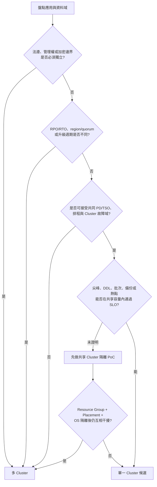
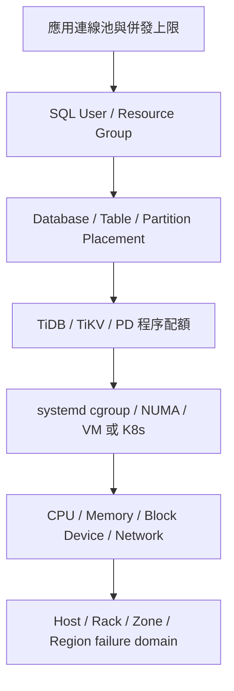
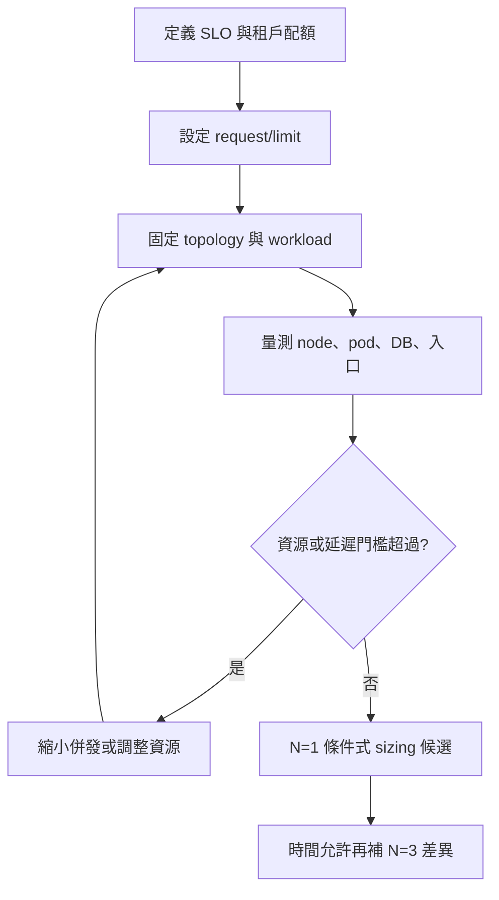

# 08. 資源控制：從配置到可驗證假設

**章節問題：** 何時可以讓多個應用共用一個 TiDB Cluster，何時必須拆成多個 Cluster？在共享 Kubernetes 或 VM/實體機時，如何把資源控制轉為可重現、可診斷的決策？

**決策影響：** 產出 Cluster 邊界、OS/程序/資料放置與 request/limit 的驗證清單；不產生未經容量與故障測試的 production 預設值。

**最後驗證：** 2026-07-11。本文使用 `S-K8S` 為主證據；`T-THRD` 僅用於探索機制，不能進 baseline 或主表。

## 能力與證據不可混寫

| 層次 | 官方或平台能力 | 本 PoC 已見 | 尚待驗證 |
|---|---|---|---|
| 資源宣告 | Kubernetes 可設定 CPU/memory request 與 limit | 六個 limit/unlimit cell 均有可追溯部署變數與 summary | 哪個內核/容器事件導致差異 |
| 隔離 | request 影響排程可行性，limit 形成可用上限 | 各受測引擎在 `t=128` 皆觀察到不同的 tpmC/p99 組合 | 在目標 node 壓力與鄰居負載下是否重現 |
| 引擎調參 | 引擎可有 process/thread/admission 參數 | 尚無可作 baseline 的調參結果 | 調參與 resource limit 的交互作用 |

實際部署值屬於 PoC 組態，而非官方 sizing 建議：可追溯至[TiDB vars](../ansible/vars/tidb-k8s-3node-limit.yml)、[CockroachDB vars](../ansible/vars/cockroach-k8s-3node-limit.yml)與[YugabyteDB vars](../ansible/vars/yuga-k8s-3node-limit.yml)。

## 一個 TiDB Cluster 還是多個

Cluster 是 TiDB 最強的故障與維運邊界。一個 Cluster 內的 database 可以有不同 Resource Group 與 Placement Policy，但仍共用 PD/TSO、排程、版本升級、部分背景工作、網路與整體容量。若業務不能接受這些共同命運，就不應只靠 schema、user 或 resource group 宣稱已隔離。



### 單一 Cluster 的成立條件

以下條件應同時成立，而不是只滿足其中一項：

- 應用接受共同的 Cluster 故障域、PD/TSO 可用性與維護窗口。
- RPO、RTO、region placement、replica 數與資料保留策略相容。
- 版本、升級、備份、restore、DDL 與 schema change 能由同一營運節奏管理。
- 權限、稽核、加密金鑰及資料主權不要求實體或管理面完全分離。
- 峰值重疊時仍有容量 headroom，且熱點、batch、DDL、backup、analyze 不會破壞其他服務 SLO。
- 應用可綁定具名 Resource Group，資料可用 Placement Policy 落到正確 TiKV pool，且已有越界告警。
- 故障、擴縮容與 rebalance 測試證明共享部署不會造成不可接受的 p95/p99、retry 或 error rate。

[官方能力] TiDB Resource Control 可在 TiDB 層做 flow control、在 TiKV 層做 priority scheduling，原廠也指出合理使用可減少 Cluster 數量；但 RU 是資源抽象與排程機制，不是獨立 OS、磁碟或控制平面。[TiDB Resource Control](https://docs.pingcap.com/tidb/stable/tidb-resource-control-ru-groups/)

### 必須優先拆成多個 Cluster 的條件

| 硬性邊界 | 為何 Resource Group／Placement 不足 |
|---|---|
| 法遵、資料主權、管理員或金鑰必須隔離 | 同一 Cluster 仍共用控制平面、metadata 與營運權限面 |
| RPO/RTO、region topology 或 quorum 策略不同 | replica/leader 放置可以細分，但 Cluster 故障、PD/TSO 與切換程序仍相依 |
| 升級版本、維護窗口或回復時點必須獨立 | 同 Cluster 無法讓不同 database 獨立執行整套 binary upgrade 或 Cluster restore |
| 不允許 noisy neighbor 影響核心交易 | RU 不是完整的 CPU、memory、network、compaction、DDL 與裝置硬隔離 |
| 儲存媒體與 latency SLO 明顯不同 | Placement 可分資料位置，但共享 PD、network、host 或混合 Raft group 仍可能形成短板 |
| 故障演練、容量事件或 scale-out 必須互不影響 | 同 Cluster 的 scheduler、rebalance 與共同容量會互相影響 |
| 需要獨立成本歸屬與容量生命週期 | Resource usage 可計量，但硬體採購、擴容與淘汰仍以 Cluster 資源池耦合 |

[決策] 任一硬性邊界成立時，預設採多 Cluster；不能用「Resource Group 尚未壓滿」推翻法遵、故障域或獨立復原需求。若只有成本與平均利用率考量，才進入單 Cluster PoC，不直接拆分或合併。

### 不應作為唯一拆分依據

- **一個 application 一個 Cluster：** 容易造成大量低利用率 Cluster、重複 PD/監控/備份與維運負擔。
- **依 database/schema 數量拆分：** schema 是命名與權限邊界，不是資源或故障邊界。
- **只按平均 CPU 拆分：** 應看同時尖峰、p99、compaction、I/O queue、backup 與失效後容量。
- **把 SSD/HDD 各自標籤後就視為完全隔離：** Placement 只決定 data at rest；流量、PD 排程與 host failure domain 仍須驗證。

## TiDB 的資源分層

單一 Cluster 若要承載多個服務，隔離必須由底向上逐層成立。上層 quota 無法補救底層磁碟競爭或共同故障域。



| 層級 | 控制方式 | 能隔離什麼 | 不能宣稱什麼 |
|---|---|---|---|
| Application | connection pool、queue、timeout、admission | 每服務併發與重試風暴 | 無法限制繞過該入口的 SQL |
| SQL workload | user 綁定 Resource Group、RU/s、priority、burst policy | foreground read/write 的流量與排程優先級 | 不是完整 CPU/memory/device hard limit |
| Data placement | TiKV labels + Placement Policy，作用到 database/table/partition | 將指定資料副本放到特定 TiKV pool | 不保證 request 或內部流量只留在該 pool/region |
| Component | TiDB、TiKV、PD 分開部署與調整 memory/thread/background 參數 | 避免 SQL、storage、control plane 直接搶同一 process | 同 host 時仍共享 kernel、memory bus、disk/network |
| OS runtime | TiUP `resource_control` 寫入 systemd cgroup；CPU、memory、read/write bandwidth limit | 限制單一 service process 的 runtime 資源上限 | 設錯可能 OOM/throttle；不等於容量保證 |
| CPU/NUMA | 專用 VM/host、`numa_node`、cpuset/CPU quota | 降低跨 NUMA memory 與 CPU contention | 不能隔離共享 storage/network bottleneck |
| Storage | 獨立 block device、filesystem、data/log 目錄與 I/O bandwidth | 降低 device queue、fsync、compaction 互擾 | 同一實體 controller 或 SAN 仍可能共享瓶頸 |
| Failure domain | host/zone/region labels，確保 Raft peers 分散 | 節點、rack、zone 故障容忍 | label 錯誤或副本不足時不會自動產生硬體 |
| Cluster | 獨立 PD/TSO、TiKV pool、版本、備份與營運程序 | 最完整的性能、故障與變更邊界 | 成本與營運複雜度最高 |

官方依據：[TiUP topology `resource_control`](https://docs.pingcap.com/tidb/stable/tiup-cluster-topology-reference/) 支援 `memory_limit`、`cpu_quota`、read/write bandwidth limit；[Hybrid Deployment](https://docs.pingcap.com/tidb/v6.5/hybrid-deployment-topology/) 說明 NUMA 綁定、同機多 instance 與 host label；[Placement Rules](https://docs.pingcap.com/tidb/stable/placement-rules-in-sql/) 支援 database/table/partition 的資料放置。

### TiUP OS 資源分層範例

以下只示範控制位置，不是 production sizing。實際值必須由容量測試決定，且保留 OS、page cache、compaction 與故障後接管所需 headroom。

```yaml
tidb_servers:
  - host: ${TIDB_HOST_A}
    numa_node: "0"
    resource_control:
      memory_limit: "32G"
      cpu_quota: "800%"

tikv_servers:
  - host: ${TIKV_HOST_A}
    data_dir: /data/nvme/tikv
    numa_node: "1"
    resource_control:
      memory_limit: "48G"
      cpu_quota: "1200%"
      io_read_bandwidth_max: "/dev/nvme0n1 800M"
      io_write_bandwidth_max: "/dev/nvme0n1 500M"
    config:
      server.labels:
        service_tier: critical
        host: host-a
```

驗收時至少保存 systemd 實際值、`numactl --show`、cgroup throttling/OOM、device mapping、mount options、`iostat`、TiKV labels 與 `SHOW PLACEMENT`；只保存 topology YAML 不能證明 runtime 已生效。

### SSD 與 HDD 的分層判斷

[官方能力] TiDB v8.5 production hardware guidance 對 TiKV 建議 SSD；SAS 出現在監控或 TiProxy 的參考規格，不應外推為 production TiKV 適用媒體。[Software and Hardware Requirements](https://docs.pingcap.com/tidb/stable/hardware-and-software-requirements/)

- 不建議把同一個 Raft group 的 voters 混放 SSD 與 HDD。慢 follower 可能增加追趕、snapshot、rebalance 與故障後接管風險；若慢副本進入必要 quorum，會直接放大 commit latency。
- 三台 SSD 加兩台 HDD 無法在 HDD pool 內形成 RF=3 且跨三個獨立 host 的完整副本組。不能用兩台 HDD 宣稱另一個同等 HA tier。
- 若資料 SLO 差異大到必須使用不同媒體，優先拆 Cluster；低成本 Cluster 仍需使用該 TiDB 版本支援且經驗證的媒體，不因拆 Cluster 就自動允許 HDD 承載 production TiKV。
- 若仍採單 Cluster 的多 TiKV pool，Placement Policy 必須保證每類資料的所有 voters、leader preference 與 failure domains 均在同一合格 tier，並驗證 policy 收斂；這仍不是控制平面或維運隔離。

## 建議的 Cluster 分層

分層應由可量測需求驅動，不以「Level 1 到 Level 5」名稱先決定硬體。可先採三類候選，再由服務清冊映射：

| 候選層 | 服務條件 | Cluster 與 OS 邊界 | 必做驗證 |
|---|---|---|---|
| 核心交易層 | 嚴格 p99、低 error budget、RPO 接近 0、獨立變更窗口 | 獨立 Cluster；TiKV 使用專用 SSD/NVMe host/VM；PD/監控與資料裝置分離 | N+1 容量、zone/region failure、restore、升級、跨區 quorum latency |
| 標準線上層 | 相同 region/RPO/RTO、可共享維護窗口，服務間可接受受控干擾 | 單一 Cluster 候選；Resource Group + Placement + systemd/VM 隔離 | 同時尖峰、batch/DDL、rebalance、單節點失效後 p99 |
| 非核心／批次層 | 可排程、可重跑、較寬鬆 latency，且不影響核心交易 | 與核心交易分 Cluster；以 admission/queue 控制，不與核心 TiKV 共用裝置 | 批次失控、I/O 飽和、暫停/重跑、成本與資料新鮮度 |

[決策] 「核心」不是由部門或主觀重要度決定，而是由 transaction correctness、p99/error budget、RPO/RTO、資料主權、故障域、尖峰容量與維護自主性共同決定。服務未填完這些欄位前，只能標為待分類。

### 拆分前的最小驗證流程

1. 建立 application/service 清冊：owner、資料域、transaction coupling、峰值、p99/error、RPO/RTO、region、backup/restore、upgrade window。
2. 標記硬性隔離條件；任一成立即建立多 Cluster proposal。
3. 對其餘服務建立 Resource Group、Placement 與 OS quota 的共享 Cluster PoC。
4. 同時跑峰值、DDL/Analyze、backup、rebalance 與一個節點失效，觀察 p95/p99、retry/error、CPU throttling、OOM、I/O queue。
5. 共享 PoC 通過才合併；失敗時依證據拆 Cluster，不以平均利用率辯護。
6. 記錄拆分後的 CDC/資料同步、跨 Cluster transaction、備份、監控與 on-call 成本，避免只計算硬體。

## 條件式適用矩陣

| 工作負載與環境條件 | 先採取的控制 | 應收集的證據 | 決策狀態 |
|---|---|---|---|
| 共享節點、已有明確 tenant 配額 | 設 request 與 limit，先保護可預測性 | pod placement、CPU throttling、RSS、OOM、node disk/network | 可作 N=1 起始假設 |
| 獨佔或已隔離節點、要找引擎飽和點 | 以未宣告 limit 的 cell 作診斷對照 | host 與 pod 指標、backend 分布、queue/admission 資訊 | 僅供瓶頸探索 |
| p99 是主要 SLO | 先以保守併發與 admission 門檻控壓 | 每水位 p50/p95/p99、error、資源飽和與排程事件 | 需建立可接受 p99 上限 |
| 想改 thread/process 參數 | 建立獨立 `T-THRD` profile | config dump、與 default 的單因子對照 | 不可回填 S-BASE 或 S-K8S |
| 要設定正式 production 配額 | 依實際資料量、峰值、故障與擴縮策略規劃 | capacity headroom、failure/recovery、成本及 N=1 限制 | 本 PoC 不足以單獨定案 |

## 建議的控制迴路



## 判讀規則

- `limit` 對 `unlimit` 的差異是**觀察到的 cell 差異**，不是 CPU throttling 或記憶體壓力的因果證明。
- `unlimit` 表示本 PoC 未設定容器 limit；它不是「無限資源」、也不是 production 建議。
- 需要藉由 `T-THRD` 探索 process/thread/admission 機制時，必須保留具名 `tuning_profile_id` 與獨立結果目錄。scope 硬性隔離見[phase-threadcontrol README](../phase-threadcontrol/README.md)。
- 所有本章結果 `N=1`；round 數不是獨立重跑次數。

## 待決事項

- 明確定義 CPU throttling、memory pressure、storage latency、network saturation 與 admission queue 的採集欄位及失敗門檻。
- 將 request、limit、node allocatable、pod placement 和實際 metrics 寫入同一輪結果目錄，以便拆解配置與環境變數。
- 對每個目標 SLO 建立低、中、高併發情境，而非以單一 `t=128` 作配額決策。

## 官方能力來源

- [官方能力] [TiDB Resource Control](https://docs.pingcap.com/tidb/stable/tidb-resource-control-ru-groups/) 說明以 resource group 管理工作負載；是否適合本服務仍需另做服務級測試。
- [官方能力] [CockroachDB Admission Control](https://www.cockroachlabs.com/docs/stable/admission-control.html) 說明 admission control 的資源保護機制。
- [官方能力] [YB-TServer flags](https://docs.yugabyte.com/stable/reference/configuration/all-flags-yb-tserver/) 提供 YugabyteDB process/thread 等參數索引。

官方文件用於界定可調能力，不用來替代 `S-K8S` 或 `T-THRD` 的實際量測。
