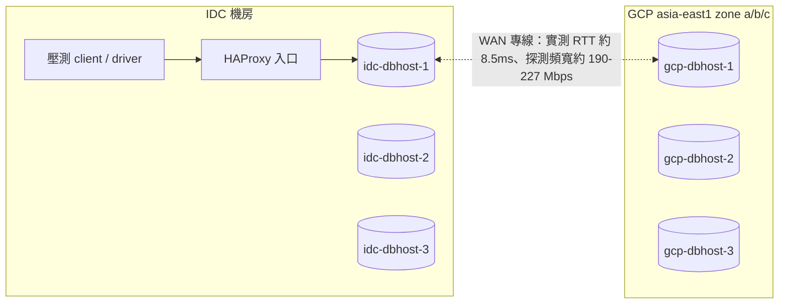
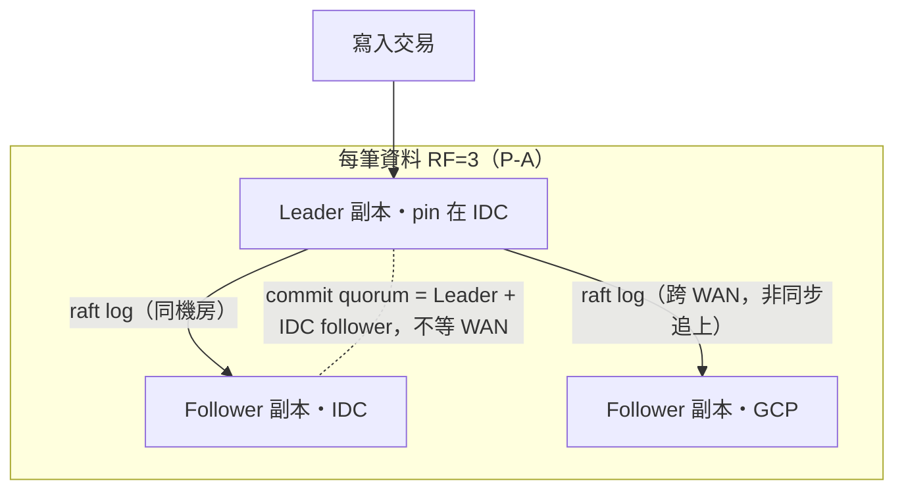
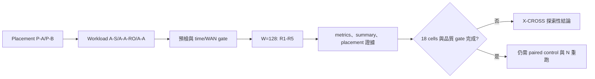

# 09. 跨區：探索性證據與升級門檻

**章節問題：** 現有跨區資料能回答什麼，及在何種 gate 全數通過前不能回答什麼？

**決策影響：** 可確認跨區 framework、placement 與量測紀律的下一步；不得產生跨區產品排名、WAN penalty 或正式 RTO/RPO 承諾。

**最後驗證：** 2026-07-13。`X-CROSS` 是 `baseline_eligible: false` 的探索 scope，資料原始檔仍留在 `results/x-cross/`。

## 拓樸與 P-A placement

**圖解判讀：** P-A 的語意是「commit 延遲留在 IDC、GCP 持續收到每筆寫入的複製流」。因此驗收必須同時看三件事：leader/lease 全在 IDC（placement gate）、GCP 節點真的持有資料副本（副本存在 gate）、GCP 端可以就近讀（probe）。只驗第一項會漏掉後兩項的失效——本 scope 已實際發生過一次，見下節。WAN 數字來源：各 suite 的 `runs/wan-probe-warmup.txt`。

## 證據分級

| 分類 | 內容 | 可用範圍 |
|---|---|---|
| 官方能力 | 跨區 placement、就近讀寫與 follower/stale read 是需由各引擎設定與驗證的能力面 | 僅作架構選項與測試設計依據，不保證零跨區流量或延遲 |
| 計畫中的設定 | P-A/P-B placement、A-S/A-A-RO/A-A profile 與 stale follower read 的取捨 | `PLANNED`，不可寫成已驗證功能結果 |
| PoC 證據 | framework、determinism，以及一個 W=128 的 P-A/A-S cell | 僅為 X-CROSS 內部探索與後續測試的起點 |

跨區 scope 的拓樸、測項與禁止跨 family 比值規則見[manifest](../phase-crossregion/manifest.yaml)與[決策紀錄](../phase-crossregion/decisions-2026-06-08.md)。

## 已有可引用資料

W=128 主資料點目前有兩個有效 TiDB cell 與一次重大效度事件：

- [本 PoC 實測｜N=1] 2026-07-03 TiDB P-A/A-S cell：`t=128` 為 16,808.6 tpmC、NEW_ORDER p99 486.5 ms、CV 2.4%、error 0%。[來源與採樣完整性](../results/x-cross/pipeline-log.md#23-2026-07-03-tidb--p-a--a-s-w128-正式口徑-cell首個)
- [本 PoC 實測｜N=1] 2026-07-11 三家 W=128 批次 + 2026-07-12 TiDB 重跑：TiDB 首輪 `t=128` CV 102.2%（R2 起腰斬）判定為單次環境雜訊——重跑同參數 CV 恢復 4.0%（13,251.6 tpmC），首輪保留備查不採用。兩批為不同 VM 生命週期，與 07-03 cell 的量級差異（約 -21%）屬跨批次變異，引用時須註明批次。
- [本 PoC 實測｜N=1] **效度事件（2026-07-13 覆核發現）：** 同批 CRDB/YBDB 的 GCP 節點經查**完全沒有 tpcc 資料副本**——CRDB 的 zone config `constraints` list 形式與 `voter_constraints` 自相矛盾、YBDB 的 read-replica 因 tserver 缺 placement_uuid 從未實體化。placement 設定「看似套用成功」但資料面未發生；兩 cell 降級備查，根因修正與重跑前的 fail-closed 副本 gate 見[X-CROSS 結案報告雛形 §6/§7](../phase-crossregion/XCROSS-CLOSING-REPORT-DRAFT.md)與[執行歷史](../phase-crossregion/SESSION-HISTORY.md)。

**圖解判讀：** 三組各自 N=1、每組五根為 R1-R5。中組（首輪）R1 正常、R2 起腰斬盤整是異常形狀；右組同參數重跑回到緊密收斂，支持「單次環境雜訊、不可重現」的判定。逐輪原始值在各 `summary.json` 的 `thread_results.128.tpmC_per_round`。

以上皆為 `N=1` 的 X-CROSS 內部資料，不構成跨家或跨環境排名。

| 可回答 | 不可回答 | 原因 |
|---|---|---|
| 該 cell 的六節點 framework、placement gate、W=128 及 per-round 採樣可完成 | 任兩引擎誰更適合跨區 | 其他引擎與所有矩陣 cell 未完成，且 scope 不可排名 |
| P-A/A-S 是可執行的測試路徑 | 相對 S-BASE 的 WAN penalty | 節點數、quorum、硬體與 topology 都不同，非 paired control |
| 同 cluster 的低變異可被觀測 | RTO/RPO 或故障可用性 | 尚須獨立 failover/chaos 實驗與量測 |

## 條件式適用矩陣

| 決策需求 | 可用設計／證據 | 必要 gate | 目前狀態 |
|---|---|---|---|
| 單主寫入與遠端讀 | A-S + placement P-A/P-B | leader/locality、time sync、WAN、metrics completeness | 部分已跑；不可外推 |
| 讀多寫少且可接受陳舊 | A-A-RO + stale follower read 設計 | staleness、fallback、讀寫 client locality | 計畫中 |
| 兩端同時寫 | A-A profile | 衝突、跨區 commit、placement 與壓力隔離 | 計畫中 |
| 宣稱 WAN cost | IDC-only 六節點 paired control | 同硬體、同 quorum、同 W、同 workload | 未完成 |
| 宣稱 DR 數字 | failover/chaos scenario | RTO/RPO 方法、故障注入、資料完整性驗證 | 未完成 |

## 待決事項

- 依 `P-A` 後 `P-B` 的順序完成 placement × workload × 引擎矩陣，保留每 cell 的 full rebuild 與採樣完整性證據。
- 建立 IDC-only 六節點 paired control；在此之前禁止計算或陳述 WAN penalty。
- 將 A-A 的寫入衝突、stale read 的實際 staleness/fallback、以及 C1/C4/C7 故障情境各自量測。
- 將跨區結果與 `S-BASE`、`S-K8S`、`T-THRD` 保持路徑與主表隔離，規則見[PHASES](../results/PHASES.md)。

## 官方能力與實測邊界

- [官方能力] [TiDB Placement Rules in SQL](https://docs.pingcap.com/tidb/stable/placement-rules-in-sql/) 說明資料副本放置；放置規則不保證應用請求、PD 查詢或所有背景流量只留在同區。
- [官方能力] [CockroachDB Multi-Region Overview](https://www.cockroachlabs.com/docs/stable/multiregion-overview) 說明 locality 與 multi-region database 能力。
- [官方能力] [YugabyteDB Data Placement](https://docs.yugabyte.com/stable/explore/linear-scalability/data-distribution/) 說明 tablets 與 replicas 的資料分布。

上述文件只支持功能與架構設計。就近存取、跨區流量、commit latency、failover 與資料完整性仍須用 client locality、leader/leaseholder/tablet placement、WAN trace 和故障演練共同證明。
