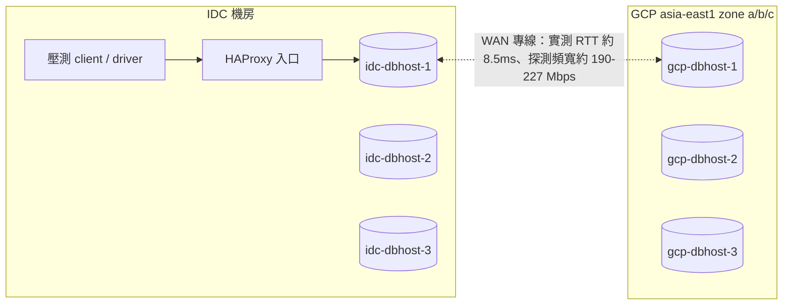
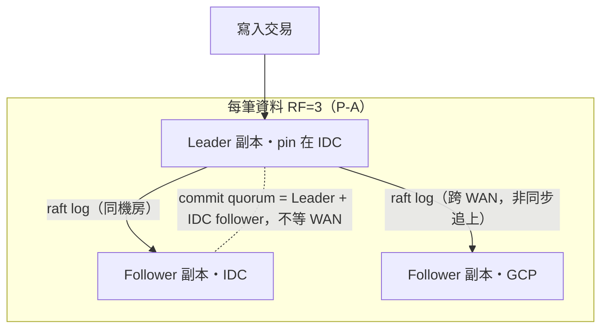
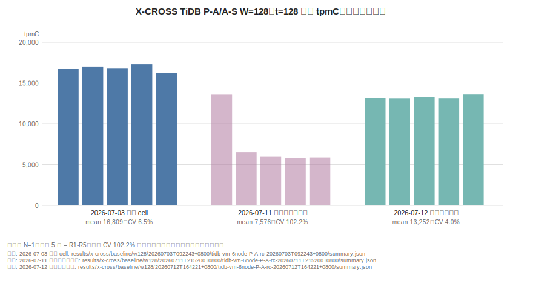
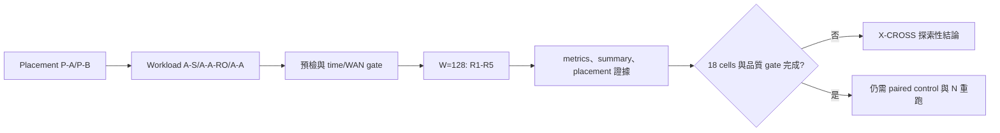

# 09. 跨區：探索性證據與升級門檻

**章節問題：** 現有跨區資料能回答什麼，及在何種 gate 全數通過前不能回答什麼？

**決策影響：** 可確認跨區 framework、placement 與量測紀律的下一步；不得產生跨區產品排名、WAN penalty 或正式 RTO/RPO 承諾。

**最後驗證：** 2026-07-15。`X-CROSS` 是 `baseline_eligible: false` 的探索 scope，資料原始檔仍留在 `results/x-cross/`。

## 拓樸與 P-A placement

**圖解判讀：** P-A 的語意是「commit 延遲留在 IDC、GCP 持續收到每筆寫入的複製流」。因此驗收必須同時看三件事：leader/lease 全在 IDC（placement gate）、GCP 節點真的持有資料副本（副本存在 gate）、GCP 端可以就近讀（probe）。只驗第一項會漏掉後兩項的失效——本 scope 已實際發生過一次，見下節。WAN 數字來源：各 suite 的 `runs/wan-probe-warmup.txt`。

## 證據分級

| 分類 | 內容 | 可用範圍 |
|---|---|---|
| 官方能力 | 跨區 placement、就近讀寫與 follower/stale read 是需由各引擎設定與驗證的能力面 | 僅作架構選項與測試設計依據，不保證零跨區流量或延遲 |
| 計畫中的設定 | P-A/P-B placement、A-S/A-A-RO/A-A profile 與 stale follower read 的取捨 | `PLANNED`，不可寫成已驗證功能結果 |
| PoC 證據 | framework、determinism，以及三家各一個 W=128 P-A/A-S cell（含 GCP 副本存在與 near-read probe 證據） | 僅為 X-CROSS 內部探索與後續測試的起點，不作跨家排名 |

跨區 scope 的拓樸、測項與禁止跨 family 比值規則見[manifest](../phase-crossregion/manifest.yaml)與[決策紀錄](../phase-crossregion/decisions-2026-06-08.md)。

## 已有可引用資料

W=128 主資料點：三家各有一個修正後有效 cell（皆 `N=1`）＋一次重大效度事件：

- [本 PoC 實測｜N=1] **三家採用 cell（07-17 同批、`t=128` 主水位，帶真實 GCP 複製成本）：**
  TiDB 12,526.5 tpmC（0 error）、CockroachDB 10,163.4（0 error）、
  YugabyteDB 12,769.5（帶 0.0072% 跨 WAN 協調錯誤 caveat，見下）。
  三家同批同鏈（單一 detached driver 依序跑完，11h13m 零人工介入），均通過
  三重驗證：placement gate、**GCP 副本存在 gate**（逐 range/tablet 驗證資料
  真的到 GCP）、GCP 端 near-read probe 各 20 輪 `fail_count=0`。
  逐項證據連結見[X-CROSS 結案報告雛形 §3/§5](../phase-crossregion/XCROSS-CLOSING-REPORT-DRAFT.md)。
  前一代採用批（07-12/07-14，TiDB 13,251.6／CRDB 11,001.1／YBDB 11,138.6）
  轉備查——數據有效但非同批，跨批變異未歸因，引用須註明批次。
- [本 PoC 實測｜N=1] 2026-07-03 TiDB P-A/A-S cell：`t=128` 為 16,808.6 tpmC、CV 2.4%、error 0%——TiDB t128 跨批走勢 16,808.6（07-03）→ 13,251.6（07-12）→ 12,526.5（07-17），變異未歸因，各批皆有效，引用須註明批次。[來源與採樣完整性](../results/x-cross/pipeline-log.md#23-2026-07-03-tidb--p-a--a-s-w128-正式口徑-cell首個)
- [本 PoC 實測｜N=1] TiDB 首輪（07-11）`t=128` CV 102.2% 判定為單次環境雜訊（重跑同參數 CV 4.0%），保留備查不採用。
- [本 PoC 實測｜N=1] **效度事件（2026-07-13 覆核發現，07-14/15 修正後重測結案）：** 07-11 批 CRDB/YBDB 的 GCP 節點經查**完全沒有 tpcc 資料副本**——CRDB 的 zone config `constraints` list 形式與 `voter_constraints` 自相矛盾、YBDB 的 read-replica 因 tserver 缺 placement_uuid 從未實體化，且 GCP 端 probe 因探測主機缺 DB client 四個 suite 全滅卻靜默通過。合計七個根因逐一修正（含藏了整個專案週期的 gate grep 計數 bug），以 fail-closed 副本 gate + probe 斷言重測取得上列採用 cell。**遺留與後續**：YugabyteDB 的 transaction status tablet（系統層）leader 部分落 GCP，造成少量跨 WAN commit 協調錯誤——placement gate 只驗 tpcc 表的盲區再現於系統層。07-17 系統層 gate 補強上線並直接證實（prepare 後 9/16 leader 在 GCP、`leader_stepdown` 修復後才開跑），錯誤 309→156 減半但未歸零（殘餘指向高併發尾延遲逼近 5s RPC deadline），timeout 上調驗證排入下輪。全程見[執行歷史](../phase-crossregion/SESSION-HISTORY.md) 2026-07-13～07-18 各節。

**圖解判讀：** 三組各自 N=1、每組五根為 R1-R5。中組（首輪）R1 正常、R2 起腰斬盤整是異常形狀；右組同參數重跑回到緊密收斂，支持「單次環境雜訊、不可重現」的判定。逐輪原始值在各 `summary.json` 的 `thread_results.128.tpmC_per_round`。

以上皆為 `N=1` 的 X-CROSS 內部資料，不構成跨家或跨環境排名。

| 可回答 | 不可回答 | 原因 |
|---|---|---|
| 三家在 P-A/A-S 下的六節點 framework、副本/lease 放置、GCP 同步與 W=128 採樣可完成 | 任兩引擎誰更適合跨區 | scope 不可排名；各 DB N=1、YBDB 帶系統層 caveat |
| P-A/A-S 是可執行的測試路徑 | 相對 S-BASE 的 WAN penalty | 節點數、quorum、硬體與 topology 都不同，非 paired control |
| 同 cluster 的低變異可被觀測 | RTO/RPO 或故障可用性 | 尚須獨立 failover/chaos 實驗與量測 |

## 條件式適用矩陣

| 決策需求 | 可用設計／證據 | 必要 gate | 目前狀態 |
|---|---|---|---|
| 單主寫入與遠端讀 | A-S + placement P-A/P-B | leader/locality、time sync、WAN、metrics completeness | 部分已跑；不可外推 |
| 讀多寫少且可接受陳舊 | A-A-RO + stale follower read 設計 | staleness、fallback、讀寫 client locality | 計畫中 |
| 兩端同時寫 | A-A profile | 衝突、跨區 commit、placement 與壓力隔離 | 計畫中 |
| 宣稱 WAN cost | IDC-only 六節點 paired control | 同硬體、同 quorum、同 W、同 workload | 未完成 |
| 宣稱 DR 數字 | failover/chaos scenario | RTO/RPO 方法、故障注入、資料完整性驗證 | 未完成 |

## 待決事項

- 依 `P-A` 後 `P-B` 的順序完成 placement × workload × 引擎矩陣，保留每 cell 的 full rebuild 與採樣完整性證據。
- 建立 IDC-only 六節點 paired control；在此之前禁止計算或陳述 WAN penalty。
- 將 A-A 的寫入衝突、stale read 的實際 staleness/fallback、以及 C1/C4/C7 故障情境各自量測。
- 將跨區結果與 `S-BASE`、`S-K8S`、`T-THRD` 保持路徑與主表隔離，規則見[PHASES](../results/PHASES.md)。

## 官方能力與實測邊界

- [官方能力] [TiDB Placement Rules in SQL](https://docs.pingcap.com/tidb/stable/placement-rules-in-sql/) 說明資料副本放置；放置規則不保證應用請求、PD 查詢或所有背景流量只留在同區。
- [官方能力] [CockroachDB Multi-Region Overview](https://www.cockroachlabs.com/docs/stable/multiregion-overview) 說明 locality 與 multi-region database 能力。
- [官方能力] [YugabyteDB Data Placement](https://docs.yugabyte.com/stable/explore/linear-scalability/data-distribution/) 說明 tablets 與 replicas 的資料分布。

上述文件只支持功能與架構設計。就近存取、跨區流量、commit latency、failover 與資料完整性仍須用 client locality、leader/leaseholder/tablet placement、WAN trace 和故障演練共同證明。
