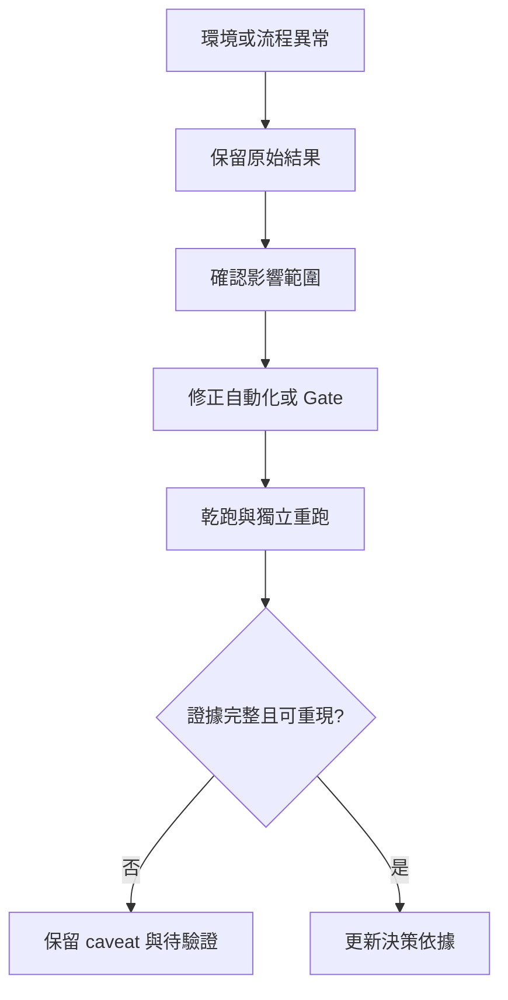

# 問題與經驗

## 本章回答什麼

本章將 PoC 過程中已發現的工程問題轉成長期控制措施。重點是讓失敗、排除資料與不確定性可見，而不是把修正後的成功結果當成唯一歷史。

**最後驗證日期：2026-07-15**

## 問題到控制措施

**圖解判讀：** 修正程式或設定不是結案條件；修正後仍要重新驗證，並保存被排除資料的原因。這使後續審查能分辨產品行為、環境污染與工具鏈問題。

## 已形成的經驗

- [官方能力] 官方文件能界定產品支援的部署與管理能力，但不能取代本地版本、設定、故障域與工作負載下的驗證。
- [本 PoC 實測｜N=1] **環境隔離是結果有效性的前提。** 不同 phase、調校狀態與跨區環境若混用，會把多個變因錯誤歸因為系統差異；因此建立了 scope registry 與輸出路徑 guard，見 [`results/PHASES.md`](../results/PHASES.md)。
- [本 PoC 實測｜N=1] **前置 Gate 必須 fail-closed。** 副本、資料放置、隔離級、時間同步、必要工具與收集路徑未驗證時，正式量測可產生數字卻不具比較意義。相關修正與里程碑見 [`1_MeetingMinutes/2026-06-22-milestone.md`](../1_MeetingMinutes/2026-06-22-milestone.md)。
- [本 PoC 實測｜N=1] **可重現性高於單次峰值。** redeploy 與暖機差異曾造成明顯 run-to-run 變異，促成同叢集重現性檢查與設定 freeze。跨區資料的排除與採用規則見 [`results/x-cross/pipeline-log.md`](../results/x-cross/pipeline-log.md)。
- [本 PoC 實測｜N=1] **失敗 trial 需要可追溯。** 準備流程、排程設定、分片檢查與工具權限等問題均可能讓看似完成的輪次失效；dispatch 摘要保留了修正與影響範圍，例如 [`results/dispatch-records/SUMMARY-crdb-vm3.md`](../results/dispatch-records/SUMMARY-crdb-vm3.md)。
- [本 PoC 實測｜N=1] **「設定已套用」不等於「資料面已發生」。** 2026-07-13 覆核發現跨區 W=128 批次中，CRDB/YBDB 的 placement 設定看似全數套用成功（SQL 無錯、gate 顯示 PASS），但 GCP 節點實際上零資料副本——CRDB 的 zone config 兩個欄位自相矛盾被 allocator 靜默解成全 IDC；YBDB 的 read-replica 因節點缺一個啟動旗標永遠無法實體化。既有 gate 只驗「leader 在哪」沒驗「副本存在」，缺口靜默通過了整輪 benchmark。修正後新增 fail-closed 的副本存在 gate（逐 range/tablet 驗 GCP 副本 + 資料量非零），並於 07-14/15 重測驗證通過結案，詳見[X-CROSS 結案報告雛形](../phase-crossregion/XCROSS-CLOSING-REPORT-DRAFT.md)。這是「官方能力 ≠ 已驗證」在資料面的具體案例：驗收必須驗到效果本身，不能只驗設定動作。
- [本 PoC 實測｜N=1] **量測工具鏈本身也要 fail-closed 驗收。** 同一事件鏈再抓到兩個藏更深的問題：(1) GCP 端 near-read 探測在四個 suite 全部失敗（每輪 ~520 次）卻靜默通過——根因不是連線而是**探測主機從未安裝 DB client**（`command not found` 快速失敗被 `|| true` 吞掉），加上 fail-closed 斷言後才現形；(2) CRDB placement gate 的計數邏輯對原始輸出整行 grep，**在舊組態下「碰巧」正確、新組態下恆等 50%**——一個藏了整個專案週期、只因輸入分布改變才暴露的量測 bug。教訓：探測與 gate 也要有「自身有在正常工作」的證明（如 probe 成功樣本數斷言），且任何 grep/計數式驗收都要對「欄位語意」而非「整行文字」。
- [本 PoC 實測｜N=1] **scope 過濾的盲區會在系統層重演。** TiDB 的 leader 快照因缺 tpcc 過濾把系統 region 雜訊誤判成漂移（假警報）；YugabyteDB 則相反——placement gate 只驗 tpcc 表，**系統層 transaction status tablet 的 leader 落在 GCP 沒被抓到**（真問題），造成 0.011-0.03% 交易跨 WAN 協調逾時。同一個「只看業務表」的過濾決策，在一家產生假警報、在另一家漏掉真問題。教訓：leader/lease 類驗收必須明確決定系統層物件是否納入，兩個方向的錯誤都實際發生過。
- [機制推論] **觀測不足會放大錯誤歸因。** 只靠 OS 指標與吞吐變化難以確認交易內部等待、鎖、重試或資料放置的因果，因此所有瓶頸敘述需保留替代解釋。

## 後續防呆

- [決策] 任何正式結論都須連到結果檔案、scope、設定、`N` 與 caveat；未追蹤資料、缺 Gate 或缺來源鏈結的資料一律排除。
- [決策] 維持「dry-run → Gate → 正式 run → collect → 審核」的順序，並將修正後的第一次成功視為候選證據，而非最終結論。
- [決策] 建立失敗分類：環境/部署、工作負載、資料放置、觀測、統計與業務語意；每類都要有 owner、修正、重跑與結案條件。
- [待驗證] 以資料庫內部診斷、跨節點 metrics、代理統計與故障演練補足目前的機制歸因缺口。
- [待驗證] 目前統一保留 `N=1` 限制；時間允許時再以獨立 `N=3` 比較修正後的代表性案例差異。

## 決策影響或待驗證

- [決策] 目前的工程經驗支持繼續以 evidence-first、fail-closed 與 scope isolation 方式執行 PoC。
- [待驗證] 在進入導入審查前，需把問題清單轉為可量測的驗收 Gate，並完成故障、還原、升級與營運交接演練。
- [待驗證] 所有候選系統都應在相同治理標準下補證，不因單次結果、工具鏈成熟度或文件完整度而獲得預設優勢。
