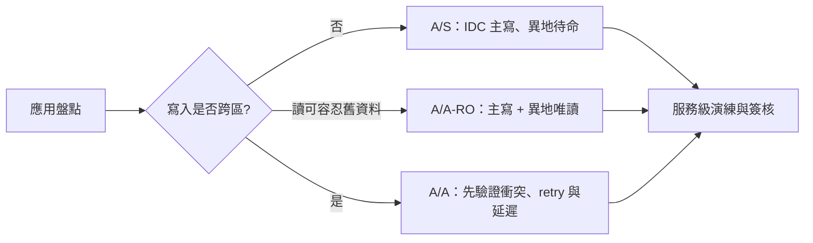

# 11. 應用就緒性

> 最後驗證：2026-07-11｜範圍：N=1 PoC；不可作採購、SLA 或全量上線結論。

## 目標與分流

先以工作負載決定適用架構，再選資料庫產品。跨區 PoC 的 A/S、A/A-RO、A/A 是部署與流量模式，不是應用可直接切換的保證。

| 104 應用原型 | 代表情境 | 主要資料行為 | 建議首輪模式 | 上線前必答 |
|---|---|---|---|---|
| 核心交易 | 會員狀態、履歷投遞、訂閱或付款狀態 | 短交易、多表寫入、不可重複提交 | 單區寫入；跨區 A/S | read-your-write、冪等鍵、補償與 RPO/RTO 是什麼？ |
| 讀取密集 | 履歷、職缺、查詢 API | 高讀取、可快取，部分欄位可能容忍舊資料 | A/A-RO | 哪些 API 可接受 stale read？失效與回源上限？ |
| 高併發熱點 | 計數器、狀態更新、熱門資料或鎖競爭 | 熱鍵、交易重試與尾端延遲敏感 | 先單區；通過壓力與故障測試後再選模式 | 熱點如何拆分？retry、排隊與降載上限？ |
| 批次與資料整合 | 匯入、同步、報表、索引與背景作業 | 大批次、長交易或與線上流量競爭資源 | 與線上交易隔離；跨區模式待服務需求決定 | 批次切片、資源配額、重跑與對帳方式？ |

以上是導入分流原型，非現有服務清冊；實際服務與 owner 對應仍為[待驗證]。

## 應用硬性契約

先定義網路分割期間的讀寫規則與資料所有權，再選足以保護業務不變量的 isolation；完整判斷流程見[從 CAP 到交易隔離](04a-cap-and-isolation.md)。

| 項目 | 必須具備 | 失敗處置 |
|---|---|---|
| 交易 | 短交易、明確 isolation、逾時上限 | 回滾；不得以無限 retry 掩蓋錯誤 |
| 重試 | 僅針對可辨識暫態錯誤；指數退避與總次數上限 | 超限回傳可追蹤失敗，交人工/佇列處理 |
| 寫入 | 冪等鍵或唯一鍵；外部副作用採 outbox/補償 | 禁止盲目重送造成重複投遞/扣款 |
| 讀取 | 為每個 API 標註 strong 或 stale | strong 路徑不可被 follower-read 路由取代 |
| 連線 | 應用連線池上限、健康檢查、過載保護 | connection storm 時限流而非擴大重試 |

## 證據與限制

- [本 PoC 實測｜N=1] S-BASE 是 TPC-C-derived stress workload，非 audited TPC-C；只支援同條件下的相對觀察。[PoC 設計](../results/PoC-DESIGN.md)
- [本 PoC 實測｜N=1] X-CROSS 的 `baseline_eligible=false`；目前不可跨家排名。[Phase Registry](../results/PHASES.md)｜[X-CROSS pipeline log](../results/x-cross/pipeline-log.md)
- [待驗證] A/S、A/A-RO、A/A 分別定義於既有 workload profiles；A/A 有跨區寫入衝突與延遲風險，不能以 A/S 結果外推。[A/S](../phase-crossregion/workload-profiles/A-S.md)｜[A/A-RO](../phase-crossregion/workload-profiles/A-A-RO.md)｜[A/A](../phase-crossregion/workload-profiles/A-A.md)

## 決策與待決

| 決策 | 狀態 | Owner |
|---|---|---|
| 試行僅選一個低風險原型，不做全量搬遷 | 待核定 | 產品 owner、DBA |
| 每個 API 的一致性、p99、retry、RTO/RPO 契約 | 待補 | 應用 owner |
| A/A 是否允許跨區雙寫 | 預設不允許，待以服務演練證明 | 架構、資安、DBA |
