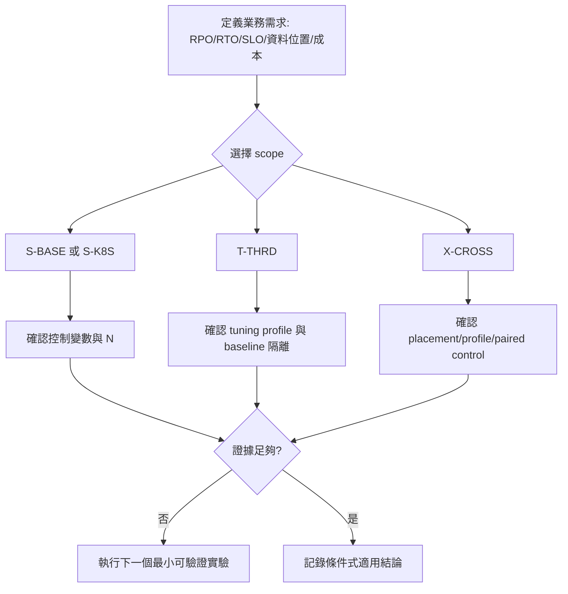

# 16. 決策框架

**章節問題：** 如何在不把異質 scope、單次結果或官方能力混為一談的前提下，選擇下一個驗證動作？

**決策影響：** 提供可稽核的條件式選擇程序；輸出是「適用／待驗證／不適用」，不是供應商排名。

**最後驗證：** 2026-07-11。資料 scope 與 baseline eligibility 以[phase registry](../results/PHASES.md)為唯一準則。

## 先分類、後比較

| 問題類型 | 正確 evidence family | 可以比較 | 不能比較 |
|---|---|---|---|
| 單區 VM 拓樸、分片、複本、入口 | `S-BASE` | 同 topology、資料量、isolation、入口下的 cell | `S-K8S`、`T-THRD`、`X-CROSS` |
| Kubernetes 配額與排程 | `S-K8S` | 同 cluster family 的 limit/unlimit 或其他明確控制變數 | VM 快慢或上雲損益 |
| process/thread/admission 機制 | `T-THRD` | 同一具名 tuning profile 的單因子探索 | baseline 主表與採購結論 |
| 跨區 placement、workload、故障 | `X-CROSS` | 同 placement/profile 的探索性 cell | S-BASE WAN penalty 或跨家排名 |

## 決策流程

## 條件式適用矩陣

| 業務條件 | 優先評估的架構能力 | 最小證據門檻 | 目前可採取的決策 |
|---|---|---|---|
| 單區 OLTP，重視穩定 p99 | 固定複本、分片與入口下的 admission/容量 | 同 family N=1、完整 latency/error/資源證據與限制聲明 | 以 S-BASE/S-K8S 分別形成候選組態 |
| 平台資源需受租戶配額約束 | K8s request/limit、排程與觀測 | limit/unlimit N=1、throttling/OOM/storage evidence | 將配額視為 SLO 控制變數，而非產品屬性 |
| 需要調整執行緒或 admission | 引擎調參面 | T-THRD 單因子、具名 profile、回復 default 的對照 | 只升級機制理解，不改 baseline 結論 |
| 跨區讀就近、可接受資料陳舊 | placement + stale follower read | locality、staleness、fallback 與 read workload 證據 | 先做 A-A-RO，結果保留 X-CROSS |
| 跨區雙端寫入或 DR | placement、quorum、failover 與衝突處理 | A-A、chaos、RTO/RPO、IDC-only paired control | 尚不可做正式承諾 |

TiDB 服務整併或拆分時，先套用[單一／多 Cluster 決策樹與 OS 資源分層](08-resource-control.md#一個-tidb-cluster-還是多個)，再選擇要執行的 evidence family；不能用單次 `S-BASE` 吞吐直接決定 Cluster 數量。

## 證據升級規則

| 等級 | 最低條件 | 可寫的結論 |
|---|---|---|
| 官方能力 | 原廠或平台文件，且版本／設定前提已列出 | 「支援某能力」 |
| PoC 機制探索 | `T-THRD` 或 `X-CROSS` 的有效結果檔案 | 「在此探索條件下觀察到」 |
| Family 內候選 | `S-BASE` 或 `S-K8S`、控制變數完整、`N=1` | 「N=1 條件式候選」 |
| 內部環境結論 | `N=1`、品質 gate、故障與成本邊界、限制揭露 | 「在明列條件下適用」 |

任何資料點都必須同時寫出 scope、topology、workload、isolation、`N`、量測統計與結果連結。`summary.json` 的 canonical estimator 是 R1-R5 mean，不可改以設計草案中的其他統計量取代。[schema 與口徑](../results/PHASES.md#5-summaryjson-schema-與-metadata)

## 待決事項

- 定義業務側 p99、error budget、RPO、RTO、資料主權與成本的可量測門檻。
- 以現有 N=1、故障演練和可觀察性證據形成帶限制的環境結論；時間允許時再補 N=3 差異。
- 定期檢查部署版本與官方能力前提；版本變更後應重新標示驗證日期與適用範圍。
