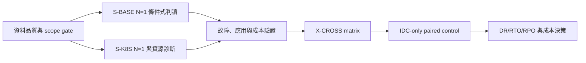
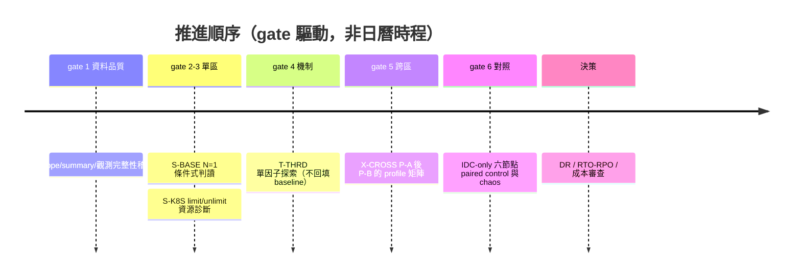

# 17. 路線圖與未決問題

**章節問題：** 哪些證據缺口會阻礙下一次架構決策，應以何種順序補齊？

**決策影響：** 將工作排成 evidence gate，而不是以一次 N=1 效能結果決定產品或架構。

**最後驗證：** 2026-07-13。原始資料、測試輸出與 secrets 均不複製到本章；可追溯資料保留於 `results/`。

## 推進順序

| 優先序 | 工作項目 | 完成 gate | 產出限制 |
|---:|---|---|---|
| 1 | 稽核 scope、結果檔案、summary、version 與觀測完整性 | 來源可追溯、無跨 scope 混用、R1-R5 mean 一致 | 不新增結果，不改原始資料 |
| 2 | S-BASE N=1 候選與限制整理 | topology/iso/shard/RF/入口 gate 完整 | 只形成 VM family 條件式候選 |
| 3 | S-K8S limit/unlimit N=1 資源診斷 | 固定 node、image、storage、pod placement；補 pod/node 指標 | 只形成 K8s family 條件式候選 |
| 4 | T-THRD 單因子機制探索 | 具名 profile、config dump、default 對照 | 不回填 baseline |
| 5 | X-CROSS P-A 後 P-B 的 profile 矩陣 | full rebuild、time/WAN、placement、metrics gate | 不作跨家排名 |
| 6 | IDC-only 六節點 paired control 與 chaos | 同硬體/quorum/W、RTO/RPO、資料完整性 | 才可討論 WAN cost 與 DR |

**圖解判讀：** 每一段的進入條件是上一段的 gate 完成，不是時間到了就推進；此圖與下表一一對應。

各 phase 的硬性隔離與 `baseline_eligible` 規則見[PHASES](../results/PHASES.md)；跨區執行次序與 cell 範圍見[跨區決策紀錄](../phase-crossregion/decisions-2026-06-08.md)。

## 未決問題

| 問題 | 為何會阻礙決策 | 所需證據 | 負責 scope |
|---|---|---|---|
| N=1 的 S-BASE 結果是否重現？ | 目前只能作條件式判讀 | 時間允許時完整重建 N=3，比較變異與結論差異 | S-BASE |
| K8s limit/unlimit 差異的機制是什麼？ | 無法安全設定配額或 SLO | throttling、RSS/OOM、storage、network、placement、backend 指標 | S-K8S |
| 調參是否改變基準行為？ | 調參結果不能誤作預設能力 | T-THRD 單因子 profile 與回復 default 對照 | T-THRD |
| 跨區資料面是否真能維持預期 locality？ | 「就近」不等於不跨區 | leader/leaseholder/tablet、fallback、staleness 與 client locality | X-CROSS |
| WAN 對延遲與吞吐的淨影響？ | 現有 VM3/VM6 非 paired control | IDC-only 六節點對照 | X-CROSS |
| 可接受的 RPO/RTO 與故障模式？ | 無法把效能結果轉成 DR 決策 | failover、C1/C4/C7、資料一致性與復原量測 | X-CROSS |
| 正式成本與維運負荷為何？ | 效能不足以決定採購與人力 | node/pod 規模、儲存、網路、備份、值班與演練成本 | 架構／平台團隊 |

## 決策紀律

- 每一項結論須標明「官方能力」或「PoC 證據」；前者不可替代後者。
- 每一張對照表須標明 scope 與 `N`；同一張表不得混入 S-BASE、S-K8S、T-THRD、X-CROSS。
- 未完成 paired control 前，不計算跨區相對 VM 的百分比，也不宣稱 WAN penalty。
- 本章不含真實 IP、認證資訊或原始輸出；讀者應由 repo-relative 連結回到受控結果目錄。

下一個可執行決策點是：先完成資料品質稽核、應用適性、DR 與成本缺口；`S-BASE` / `S-K8S` 的 N=3 在時程允許時補做，用來比較 N=1 差異，不阻擋第一版條件式報告。
