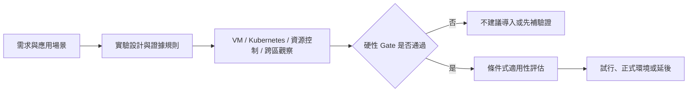

# 分散式 SQL Database PoC 決策與移交手冊

> 本手冊用於內部技術決策與後續移交。內容以三家資料庫的相同證據口徑呈現，不預設產品立場，也不以單一效能數字決定選型。

## 這本手冊回答什麼

- 為什麼需要評估分散式 SQL Database，以及 104 產品資料庫面臨哪些需求。
- TiDB、CockroachDB、YugabyteDB 的架構與執行差異。
- PoC 如何控制硬體、隔離級、分片、副本、暖機與統計條件。
- `S-BASE`、`S-K8S`、`T-THRD`、`X-CROSS` 分別證明了什麼，又沒有證明什麼。
- 導入前還需要補哪些 Application、Security、HA/DR、Migration 與成本決策。

這條流程表示：效能結果只有在一致性、可用性、安全與可維運性 gate 通過後，才進入適用性比較。

## 閱讀捷徑

| 角色 | 建議路徑 | 約略時間 |
|---|---|---:|
| 管理階層 | [管理摘要](./01-executive-summary.md) → [PoC 驗證報告](./deliverables/poc-validation-report.md) → [執行計畫](./deliverables/implementation-plan.md) → [預算評估](./deliverables/budget-assessment.md) | 15 分鐘 |
| Application Owner | [需求脈絡](./02-context-and-requirements.md) → [應用適性](./11-application-readiness.md) → [遷移與回復](./14-migration-and-rollback.md) | 25 分鐘 |
| 架構師 | [架構比較](./04-architecture-comparison.md) → [實驗設計](./05-experiment-design.md) → [跨區架構](./09-cross-region.md) | 35 分鐘 |
| DBA / SRE | [問題與經驗](./10-problems-and-lessons.md) → [Day-2 與 DR](./13-operations-and-dr.md) → [操作入口](./appendices/operational-entrypoints.md) | 35 分鐘 |
| Security / Governance | [範圍與證據](./03-scope-and-evidence.md) → [安全與治理](./12-security-and-governance.md) → [成本與責任](./15-cost-and-ownership.md) | 25 分鐘 |

完整章節順序見 [SUMMARY.md](./SUMMARY.md)。

## 證據標示

| 標示 | 意義 |
|---|---|
| `[官方能力]` | 原廠文件描述的能力，不代表本環境已驗證 |
| `[本 PoC 實測｜N=1]` | 可追溯到已提交的結果檔案與執行紀錄 |
| `[機制推論]` | 根據架構與觀測推導，仍需控制實驗驗證 |
| `[待驗證]` | 尚無足夠證據，不得當成已完成 |
| `[決策]` | 專案已拍板的範圍或取捨，不等同技術事實 |

目前全部效能結果統一視為 `N=1`。可以用來形成觀察與候選方案，但不能宣稱統計顯著或直接外推正式容量。

## 三份正式交付入口

| 交付物 | 本版覆蓋 | 成熟度 |
|---|---|---|
| [PoC 對照驗證報告](./deliverables/poc-validation-report.md) | 風險、一致性、延遲、可用性與四類 104 應用適性 | 部分驗證；HA/DR 與服務級契約待補 |
| [可落地執行計畫](./deliverables/implementation-plan.md) | 架構、部署、遷移、A/S、A/A-RO、A/A、備份與維運交接 | 可審查草案；migration、restore、failover rehearsal 待執行 |
| [預算評估報告](./deliverables/budget-assessment.md) | 五年 TCO、三情境與最低成本啟動策略 | 模型已建；價格、容量、合約與人力輸入均待 owner 補齊 |

「已覆蓋」表示文件已列出範圍、門檻與缺口，不表示相關技術或商務驗證已完成。

## 維護規則

- GitBook 只整理判讀與決策，raw data 維持在 `results/`。
- 每個重要結論須連到可讀分析，再視需要連到 `summary.json` 或 raw data。
- 官方文件與本 PoC 結果分開呈現；官方支援不等於實測通過。
- 資料庫版本、工作負載、硬體、隔離級或拓樸改變時，依 [重測條件](./17-roadmap-and-open-questions.md) 重新判定證據有效性。
- 發布時以 Git tag 凍結引用版本。
- 數據圖一律由 `make charts`（`charts.py`，零外部依賴）從已追蹤的 `summary.json` 重新產生到 `assets/charts/`，不得手工修圖；圖註必須帶 `N`、caveat 與來源路徑，數字更新時先改來源再重生圖。
- 架構與流程圖使用 mermaid code fence（GitHub / VS Code / HonKit-plugin 原生渲染）；圖內只能用邏輯主機名，禁止真實 IP 與雲端 VM 名稱（`make check` 會擋）。

最後驗證日期：2026-07-13
