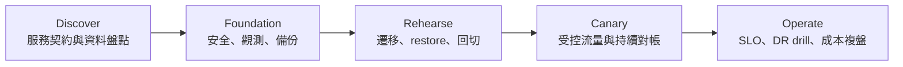

# 可落地執行計畫

> 版本：2026-07-11｜採分波導入；每一關都有停止與回復條件。規格存在不代表已完成演練。

## 工作流與完成定義

| 工作流 | 主要工作 | 完成定義 | 現況 |
|---|---|---|---|
| 架構設計 | 定義 SQL 入口、資料分片、副本、故障域、placement、監控與容量 | topology、服務契約、故障模型及 owner 簽核 | PoC 架構可參考；生產版待設計 |
| 部署流程 | IaC、Ansible/Operator、版本、設定 dump、gate、rollback | 可重建、可稽核、可回復，且 staging 演練通過 | PoC automation 已有；production hardening 待補 |
| 資料遷移 | schema 相容、全量、增量/CDC、雙寫權威、對帳、cutover | rehearsal 完成且差異為零或有核准處置 | [待驗證] |
| HA/DR | failure domain、A/S、A/A-RO、A/A、RTO/RPO 與切換責任 | 故障注入、資料對帳、回切及 runbook 演練通過 | 方法與 profile 已有，實測不足 |
| 備份架構 | 備份目的地、加密、保留、不可變性、catalog 與 restore | 定期 restore drill 達 RTO/RPO，證據可稽核 | [待驗證] |
| 維運交接 | SLO、告警、容量、升級、on-call、供應商支援 | RACI、dashboard、runbook、演練與成本核定 | [待驗證] |

## HA/DR 模式

| 模式 | 適用條件 | 必要設計 | 上線前硬閘 |
|---|---|---|---|
| A/S | 單一寫入權威、異地待命 | placement、複寫、健康檢查、切換與回切 | RTO/RPO、資料差異、DNS/入口與操作權限演練 |
| A/A-RO | 主區寫入、異地就近讀，容許定義過的舊資料 | API 分級、follower/stale read、fallback | staleness 上限、read-your-write 例外與故障回源 |
| A/A | 兩地同時寫入 | 衝突權威、冪等、retry、全域唯一性與 WAN 延遲預算 | 服務級雙寫壓測、故障對帳與補償演練；未通過不得啟用 |

[待驗證] 三種模式目前均不能僅由官方功能說明或單一 A/S cell 判定可上線。測試 profile 見 [A/S](../../phase-crossregion/workload-profiles/A-S.md)、[A/A-RO](../../phase-crossregion/workload-profiles/A-A-RO.md) 與 [A/A](../../phase-crossregion/workload-profiles/A-A.md)。

## 分波路線

1. **Discover**：將四個應用原型映射到真實服務，確認資料分類、SQL/driver、交易、一致性與 RTO/RPO。
2. **Foundation**：完成安全硬閘、可觀測性、容量基準、備份目的地與 RACI。
3. **Rehearse**：完成全量/增量、對帳、restore、cutover 與 rollback rehearsal。
4. **Canary**：只導入核准的受控流量，持續對帳與 SLO 觀察；不符即回切。
5. **Operate**：on-call、升級、容量、DR drill 與成本複盤穩定後才擴大。

## Go/No-go

| Gate | Go | No-go |
|---|---|---|
| 應用 | isolation、retry、冪等與逾時已驗收 | API 一致性或副作用契約不明 |
| 資安 | 身分、加密、稽核、秘密管理均有證據 | 任一 hard gate 缺證據 |
| 資料 | 對帳、restore 與 rollback 成功 | 無回復路徑或差異未解 |
| 維運 | on-call、告警、容量、升級與 runbook 已演練 | 無 owner 或升級路徑 |
| 商務 | 五年 TCO、合約、退出成本可接受 | 需求假設或責任未定 |

首波服務、時程、容量與風險接受人仍待核定。詳見[遷移與回滾](../14-migration-and-rollback.md)、[Day-2 與 DR](../13-operations-and-dr.md)及[成本與責任](../15-cost-and-ownership.md)。
