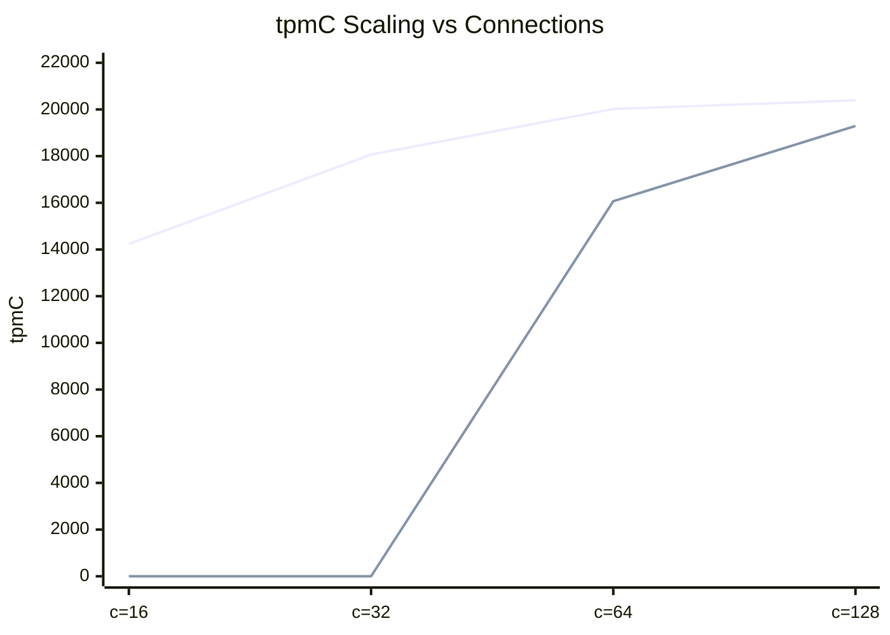

# TiDB vs YugabyteDB — TPC-C S-BASE 效能對標

**拓撲**：3 VM × 4vCPU / 16GB RAM，3-node 叢集（TiDB: TiDB+TiKV×3+PD；YBDB: 3-node RF=3 zone-a/b/c）  
**資料量**：128 Warehouses / 1,280 virtual terminals  
**日期**：TiDB 2026-04-28；YugabyteDB 2026-05-06

---

## TL;DR

| 指標 | TiDB VM | YBDB 3-node |
|------|---------|-------------|
| **Peak tpmC** | **20,394** (c=128) | **19,292** (c=128) |
| **Peak 差距** | baseline | **-5.4%** |
| c=16 可用 | ✅ 14,236 | ❌ MVCC starvation |
| c=32 可用 | ✅ 18,067 | ❌ MVCC starvation |
| c=64 可用 | ✅ 20,020 | ✅ 16,070 (-19.7%) |
| c=128 可用 | ✅ 20,394 | ✅ 19,292 (-5.4%) |
| 達峰 tier | c=128 | c=128 |
| Scaling 行為 | 線性 (16→128 +43%) | c=64→128 跳升，c<64 不可用 |

**關鍵結論**：兩者 peak tpmC 相近（差距 5%），但 YBDB 需要更高連線數才能發揮效能，低連線數工況有架構性限制。

---

## 測試方法對照

| 參數 | TiDB | YBDB |
|------|------|------|
| 工具 | go-tpc | tpccbenchmark v2.4 |
| Think time | 無 | 無（false） |
| Keying time | 無 | 無（false） |
| Warehouses | 128 | 128 |
| Warmup | 300s | 120s ⚠️ |
| Duration | 600s | 300s ⚠️ |
| 入口 | 直連 TiDB:4000 | HAProxy:15433 roundrobin |
| Locking | pessimistic | optimistic MVCC |

> ⚠️ Warmup/Duration 差異原因：YBDB 在 300s warmup 下，MVCC retry chain 累積導致 c=64/128 也 timeout；120s 為可重現穩定值。Duration 影響小（兩輪 c=128 差異 < 2%）。

---

## tpmC 對照

| Tier | TiDB VM | TiDB VM (無 AUTO_ANALYZE) | YBDB 3-node | YBDB vs TiDB (無分析) |
|------|---------|--------------------------|-------------|----------------------|
| c=16 | 13,993 | 14,236 | N/A | — |
| c=32 | 17,939 | 18,067 | N/A | — |
| c=64 | 20,816 | 20,020 | 16,070 | **-19.7%** |
| c=128 | 18,923 | **20,394** | **19,292** | **-5.4%** |



> 🔵 TiDB VM (無 AUTO_ANALYZE)　　🟠 YBDB 3-node（c=16/32 N/A 以 0 標示）

---

## 延遲對照（c=128）

| Transaction | TiDB NewOrder P99 | YBDB NewOrder P99 | TiDB Payment P99 | YBDB Payment P99 |
|-------------|-------------------|-------------------|-----------------|-----------------|
| c=128 | 385.9ms | **323.8ms** | 352.3ms | **201.4ms** |

> YBDB 個別交易 p99 延遲**優於 TiDB**（低 15–40%）。吞吐差距主因為低連線數不可用，而非單次交易效能。

---

## 架構行為差異分析

### c=16/32 YBDB 失敗原因

```
1,280 terminals / 16 connections = 80:1
無 think time → terminal 立即送下一筆 txn
MVCC 衝突 → retry（最長 25s P99）
所有 conn 被 retry 佔住 → 後續 terminal 等 HikariCP pool → 180s timeout
```

**TiDB 無此問題**：pessimistic locking 在衝突時讓 txn block 等鎖，conn hold time 受 DB lock wait 控制，不會無限 retry 膨脹。

### 結論對照

| 面向 | TiDB | YBDB |
|------|------|------|
| Peak throughput | 相近（20,394 vs 19,292） | 差距 5% |
| 低連線數穩定性 | ✅ c=16 可用 | ❌ c=64 才穩定 |
| 單交易延遲 | 略高 | 優 15-40% |
| 高競爭持久穩定 | ✅ 300s warmup 正常 | ⚠️ 120s 上限（retry 累積） |
| 連線數 scaling | 線性 16→128 +43% | 需 ≥64 conn 才啟動 |

---

## 參考：TiDB 容器化損耗（完整）

| variant | peak tpmC | vs TiDB VM |
|---------|-----------|------------|
| vm (無 AUTO_ANALYZE) | 20,394 | baseline |
| k8s-unlimit | 18,842 | -7.6% |
| k8s-limit (TiKV 2c) | 11,823 | -42.0% |

詳見 `tidb-tc1/S-BASE/compare.md`。
