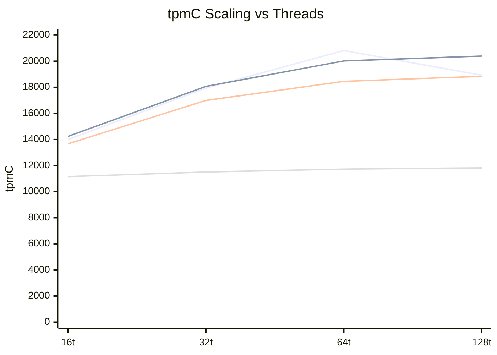
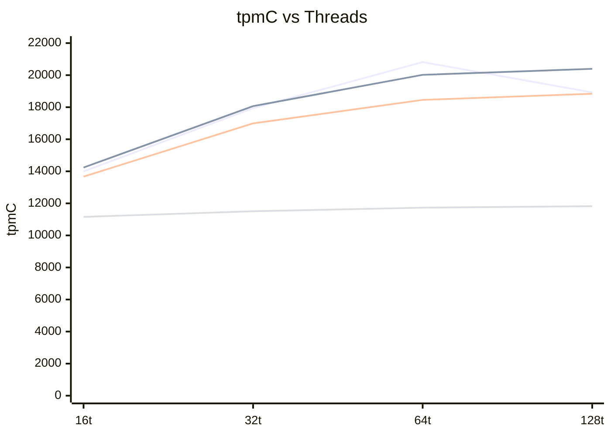
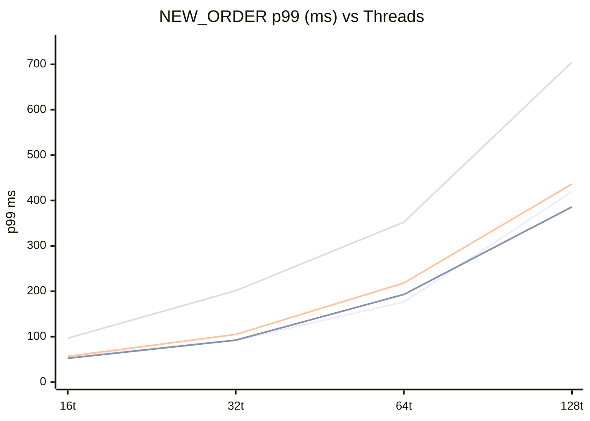
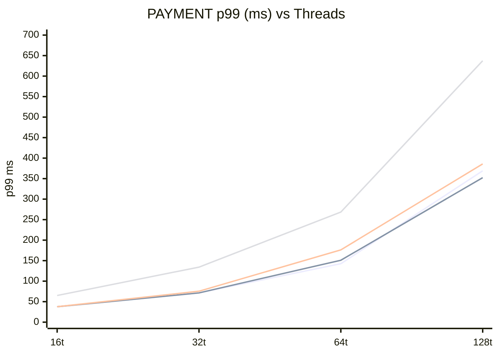

# tidb-tc1 / S-BASE — VM vs K8s TPC-C 對照

## TL;DR

**容器層開銷符合預期（< 5% 多數情境，64t 最大 -11%），但 k8s-limit 損耗遠超預期。**
原本預估高 thread 才有感，實際從 16t 就已損耗 20%（vs VM），64t 達 **-44%**。

**三項關鍵發現：**

1. **VM peak 在 64t 後反降**（20,816 → 18,923），[根因確認為 AUTO ANALYZE 干擾](#vm-128t-反降根因分析)
   → 停用後重測（vm-no-analyze）：128t 達 **20,394 tpmC**，反降消失，scaling 恢復正常
2. **k8s-unlimit 容器/CNI overhead < 12%**，符合預期上限
3. **k8s-limit 因 TiKV `2c` CPU 上限觸頂於 ~11,823 tpmC**（-44% vs VM peak）

### Peak tpmC 對照

| variant          | peak tpmC | 達峰 thread | vs VM peak |
|------------------|-----------|-------------|------------|
| vm               | **20,816** | 64t        | baseline   |
| vm-no-analyze    | 20,394    | 128t        | **-2.0%**  |
| k8s-unlimit      | 18,842    | 128t        | **-9.5%**  |
| k8s-limit        | 11,823    | 128t (觸頂) | **-43.2%** |

### Scaling 對照

| variant | 16t | 32t | 64t | 128t | scaling (16→peak) |
|---------|-----|-----|-----|------|-------------------|
| vm              | 13,993 | 17,939 | **20,816** | 18,923 | +49% (64t) |
| vm-no-analyze   | 14,236 | 18,067 | 20,020 | **20,394** | +43% (128t) |
| k8s-unlimit     | 13,668 | 16,992 | 18,456 | **18,842** | +38% (128t) |
| k8s-limit       | 11,156 | 11,508 | 11,729 | **11,823** | +6%（觸頂） |



> 🔵 vm（64t 峰值後反降）　　🟢 vm-no-analyze（反降消失）　　🟠 k8s-unlimit　　🔴 k8s-limit（近水平，CPU 觸頂）

### p99 延遲對照

#### NEW_ORDER p99 (ms)

| threads | vm | vm-no-analyze | k8s-unlimit | Δ unlimit | k8s-limit | Δ limit |
|---------|----|---------------|-------------|-----------|-----------|---------|
| 16  | 56.6  | 52.4  | 56.6  | +0.0   | 96.5  | **+39.9** |
| 32  | 92.3  | 92.3  | 104.9 | +12.6  | 201.3 | **+109.0** |
| 64  | 176.2 | 192.9 | 218.1 | +41.9  | 352.3 | **+176.1** |
| 128 | 419.4 | 385.9 | 436.2 | +16.8  | 704.6 | **+285.2** |

#### PAYMENT p99 (ms)

| threads | vm | vm-no-analyze | k8s-unlimit | Δ unlimit | k8s-limit | Δ limit |
|---------|----|---------------|-------------|-----------|-----------|---------|
| 16  | 37.7  | 37.7  | 37.7  | +0.0   | 65.0  | **+27.3** |
| 32  | 71.3  | 71.3  | 75.5  | +4.2   | 134.2 | **+62.9** |
| 64  | 142.6 | 151.0 | 176.2 | +33.6  | 268.4 | **+125.8** |
| 128 | 369.1 | 352.3 | 385.9 | +16.8  | 637.5 | **+268.4** |

> 僅列 NEW_ORDER / PAYMENT：兩者為寫入密集型主交易，合計佔總流量 ~88%，tpmC 計算基準與資源瓶頸敏感度最高。ORDER_STATUS / STOCK_LEVEL / DELIVERY 為唯讀或低頻，受 TPC-C think time 設計影響較大，不作為主要效能指標。
>
> k8s-unlimit p99 增幅 < 42 ms（可接受）；k8s-limit 在 128t 達 **+285 / +268 ms**，為 limit 配置不可接受的主要訊號。

### 建議

Resource limit 體現的是**底層效能管制機制**。DB Pod 是否需要 limit，取決於叢集規劃策略：

| 策略 | requests / limits | 適用情境 | 注意事項 |
|------|-------------------|----------|----------|
| **Guaranteed QoS** | requests = limits | 生產 DB、容量已知、需穩定 p99 | 需事先壓測確認合理值，否則過嚴反成瓶頸（本次即此問題） |
| **limit 作為 Scale 觸發器** | requests < limits | 負載動態變化、搭配 VPA/擴節點 | 觸頂需有自動因應（VPA 調整或 TiKV 水平擴節點），不可靜態卡住 |
| **不設 limit** | 僅 requests | 測試環境、效能基線量測 | 節點資源競爭無保護，不適合生產 |

本次 `2c/8Gi` 設定既非 Guaranteed（requests 僅 1c/4Gi），也未配合 scale 策略，TiKV 從 16t 即觸頂卻無自動因應，形成**硬性效能上限**。

> **反思**：根據需求，現階段需要的是**效能管制辦法**（確保 DB Pod 不搶佔鄰近工作負載的資源），還是**效能上限**（限制 DB 本身可用的最大運算量）？兩者目標不同，對應的 requests/limits 設定方向也不同，應先釐清再決定配置值。

---

## 架構規格

### 硬體（共用）

| 節點 | IP | vCPU | RAM | Disk |
|------|----|------|-----|------|
| poc-1 | 172.24.40.32 | 4 | 15 GB | 99 GB |
| poc-2 | 172.24.40.33 | 4 | 15 GB | 99 GB |
| poc-3 | 172.24.40.34 | 4 | 15 GB | 99 GB |
| client | 172.24.40.31 | 4 | 15 GB | — |

### Resource limits 對照（K8s only）

| 元件 | requests | k8s-unlimit | k8s-limit | PV |
|------|---------|-------------|-----------|-----|
| PD   × 3 | 500m / 1Gi | 無上限 | 1c / 2Gi | 10 Gi (local-path) |
| TiDB × 2 | 500m / 1Gi | 無上限 | 1c / 3Gi | — |
| TiKV × 3 | 1c / 4Gi   | 無上限 | **2c / 8Gi** | 100 Gi (local-path) |

### VM 部署（Variant: vm）

```
172.24.40.31 (client)
     │  go-tpc → :4000
     ▼
172.24.40.34  HAProxy :4000
     │  roundrobin
     ├─▶ 172.24.40.32  TiDB + PD + TiKV
     └─▶ 172.24.40.33  TiDB + PD + TiKV
         172.24.40.34            PD + TiKV

processes: 直接跑於 OS，無容器層
TiKV RF=3，每節點 30 GB data dir
```

### K8s 部署（Variant: k8s-unlimit / k8s-limit）

```
172.24.40.31 (client)
     │  go-tpc → :30004
     ▼
172.24.40.32  NodePort :30004
     │
     │  k3s cluster
     ├─ poc-1  k3s server  ┐
     ├─ poc-2  k3s agent   ├─ TiDB Operator v1.6.5 / TiDB v8.5.2
     └─ poc-3  k3s agent   ┘
          │
          └─ PD × 3、TiDB × 2、TiKV × 3（resource 詳見上表）

overhead: k3s control plane 跑於 poc-1，佔約 1 vCPU / 1~2 GB RAM（納入比較）
```

---

## TPC-C 結果對照

### 測試設計：WAREHOUSES 參數說明

TPC-C 的 warehouse 是資料分區單位，每個 warehouse 含獨立的庫存與訂單資料。  
當 **threads > warehouses** 時，多條連線競爭同一 warehouse 的行鎖，造成人為的鎖競爭天花板，tpmC 會提前飽和，無法反映真實的硬體效能上限。

本次設定 `WAREHOUSES=128`（等於最大測試執行緒數）的目的：

- **消除鎖競爭干擾**：確保每條執行緒在統計上有足夠的 warehouse 分散，NEW_ORDER/PAYMENT 的寫入鎖不會因 warehouse 不足而相互等待
- **讓資源瓶頸浮現**：tpmC 的天花板反映的是 CPU / I/O / 網路飽和，而非測試資料設計缺陷
- **數據可比性**：三個 variant（vm / k8s-unlimit / k8s-limit）使用相同 WAREHOUSES，差異完全來自部署架構

> 若 WAREHOUSES 設過小（如初期的 10），32t→64t 只有 +3% 增長，誤判為「效能天花板」，實為鎖競爭假象。

<!-- generated by tests/common/compare.sh tidb-tc1 S-BASE -->
<!-- sources:
  vm: results/tidb-tc1/S-BASE/vm/20260427-1624/summary.md
  vm-no-analyze: results/tidb-tc1/S-BASE/vm/20260428-0900/summary.md
  k8s-unlimit: results/tidb-tc1/S-BASE/k8s-unlimit/20260427-1241/summary.md
  k8s-limit: results/tidb-tc1/S-BASE/k8s-limit/20260427-1431/summary.md
-->

### tpmC

| threads | vm | vm-no-analyze | k8s-unlimit | k8s-limit |
|---------|----|----|----|----|
| 16  | 13,993 | 14,236 | 13,668 | 11,156 |
| 32  | 17,939 | 18,067 | 16,992 | 11,508 |
| 64  | **20,816** | 20,020 | 18,456 | 11,729 |
| 128 | 18,923 | **20,394** | **18,842** | **11,823** |



> 🔵 vm　　🟢 vm-no-analyze　　🟠 k8s-unlimit　　🔴 k8s-limit

### NEW_ORDER p99 (ms)

| threads | vm | vm-no-analyze | k8s-unlimit | k8s-limit |
|---------|-----|-----|-----|-----|
| 16  | 56.6  | 52.4  | 56.6  | 96.5  |
| 32  | 92.3  | 92.3  | 104.9 | 201.3 |
| 64  | 176.2 | 192.9 | 218.1 | 352.3 |
| 128 | 419.4 | 385.9 | 436.2 | 704.6 |



> 🔵 vm　　🟢 vm-no-analyze　　🟠 k8s-unlimit　　🔴 k8s-limit

### PAYMENT p99 (ms)

| threads | vm | vm-no-analyze | k8s-unlimit | k8s-limit |
|---------|-----|-----|-----|-----|
| 16  | 37.7  | 37.7  | 37.7  | 65.0  |
| 32  | 71.3  | 71.3  | 75.5  | 134.2 |
| 64  | 142.6 | 151.0 | 176.2 | 268.4 |
| 128 | 369.1 | 352.3 | 385.9 | 637.5 |



> 🔵 vm　　🟢 vm-no-analyze　　🟠 k8s-unlimit　　🔴 k8s-limit

> 參數：WAREHOUSES=128，DURATION=10m，WARMUP=5m
> 來源：
> - `results/tidb-tc1/S-BASE/vm/20260427-1624/`（vm）
> - `results/tidb-tc1/S-BASE/vm/20260428-0900/`（vm-no-analyze）
> - `results/tidb-tc1/S-BASE/k8s-unlimit/20260427-1241/`
> - `results/tidb-tc1/S-BASE/k8s-limit/20260427-1431/`

---

## 效能損耗分析

### 量測一：VM → K8s-unlimit（容器層 + CNI overhead）

> **假設**：受控變數不變，僅引入 containerd + flannel CNI。預期損耗 < 5%（local-path PV、同 LAN、無 CPU limit）。
> **實際結果**：✅ 大致符合 — 多數情境 < 5%，64t 出現最大 -11.3% 落差。

| threads | vm | k8s-unlimit | 比值 | tpmC 損耗 | NO p99 delta | PAY p99 delta | 判定 |
|---------|-----|-----|------|------|------|------|------|
| 16  | 13,993 | 13,668 | 0.977 | -2.3%  | +0.0 ms  | +0.0 ms  | ✅ 符合 |
| 32  | 17,939 | 16,992 | 0.947 | -5.3%  | +12.6 ms | +4.2 ms  | ✅ 符合 |
| 64  | 20,816 | 18,456 | 0.887 | **-11.3%** | +41.9 ms | +33.6 ms | ⚠️ 略高 |
| 128 | 18,923 | 18,842 | 0.996 | -0.4%  | +16.8 ms | +16.8 ms | ✅ 符合 |

**結論**：容器/CNI 開銷約 2~5%（低/高 thread）至 11%（中段 64t）。
64t 落差較大可能與 K8s networking stack 在中等併發下的 context switch 增加有關，
但對峰值的衝擊有限（K8s-unlimit 仍能達到 18,842 tpmC）。

---

### 量測二：K8s-unlimit → K8s-limit（resource limits 影響）

> **原假設**：低 thread 數無感；高 thread 數（≥ 64）若 TiKV CPU 觸頂則 tpmC 下降、p99 上升。
> **實際結果**：❌ 假設不成立 — 低 thread 已大幅損耗。

| threads | k8s-unlimit | k8s-limit | 比值 | tpmC 損耗 | NO p99 delta | PAY p99 delta | 判定 |
|---------|-------------|-----------|------|-----------|--------------|---------------|------|
| 16  | 13,668 | 11,156 | 0.816 | **-18.4%** | +39.9 ms  | +27.3 ms  | ⚠️ 超預期 |
| 32  | 16,992 | 11,508 | 0.677 | **-32.3%** | +96.4 ms  | +58.7 ms  | ❌ 嚴重 |
| 64  | 18,456 | 11,729 | 0.635 | **-36.5%** | +134.2 ms | +92.2 ms  | ❌ 嚴重 |
| 128 | 18,842 | 11,823 | 0.628 | **-37.2%** | +268.4 ms | +251.6 ms | ❌ 嚴重 |

**結論**：limits 設定過嚴，TiKV 2c 上限已成瓶頸。
tpmC 在 limit 模式下從 16t 起即出現 18% 損耗，64t 以上穩定在 -37%
且 tpmC 幾乎不增長（11,729 → 11,823），確認 CPU ceiling 已觸頂。
k8s-limit 配置不適合此工作負載，需依 TL;DR 建議調整。

---

### 量測三：VM → K8s-limit（生產部署總損耗）

| threads | vm | k8s-limit | tpmC 損耗 | NO p99 Δ (ms) | PAY p99 Δ (ms) |
|---------|----|----|-----------|---------------|----------------|
| 16  | 13,993 | 11,156 | -20.3% | +39.9  | +27.3  |
| 32  | 17,939 | 11,508 | -35.8% | +109.0 | +62.9  |
| 64  | 20,816 | 11,729 | **-43.7%** | +176.1 | +125.8 |
| 128 | 18,923 | 11,823 | -37.5% | +285.2 | +268.4 |

**結論**：64t 為最差情境（-43.7%），對應 VM peak 與 k8s-limit ceiling 的差距。
若調整 limits 重測，目標應為將 64t 損耗壓到 < 15%。

---

## 綜合結論

| 比較組 | tpmC 損耗 (peak) | NO p99 影響 | 備註 |
|--------|-----------------|-------------|------|
| VM → K8s-unlimit         | **-9.5%**  | +17 ~ +42 ms | 純容器層開銷，符合預期 |
| K8s-unlimit → K8s-limit  | **-37.2%** | +40 ~ +268 ms | TiKV 2c limit 觸頂 |
| VM → K8s-limit           | **-43.2%** | +40 ~ +285 ms | 實際生產部署總損耗 |

**結論**：
- 容器化（k8s-unlimit）對 TPC-C 影響有限，可接受
- 現行 k8s-limit 過嚴，需依 TL;DR 方案調整後重測
- [VM 128t 反降根因已確認](#vm-128t-反降根因分析)（AUTO ANALYZE + co-location），不影響整體結論

---

## VM 128t 反降根因分析

> 調查時間：2026-04-28；資料來源：.32/.33/.34 TiKV log（`tikv.log`）

### 觀測數據

| 指標 | 64t 視窗 (16:49-16:59) | 128t 視窗 (17:00-17:09) |
|------|------------------------|-------------------------|
| `analyze_full_sampling` slow-query (.32) | 0 筆 | **15 筆** |
| `analyze_full_sampling` slow-query (.33) | 0 筆 | **7 筆** |
| `analyze_full_sampling` slow-query (.34) | 0 筆 | **2 筆** |
| Raft `became leader` 重選（三節點合計） | 31 次 | 40 次（+29%） |
| TiKV `server is busy` / scheduler 滿載 | 0 | 0 |

### 根因

**主因：TiDB AUTO ANALYZE 背景作業（17:04 爆發）在相同 4 vCPU 節點上與 128 條 TPC-C 連線爭搶 coprocessor CPU/IO。**

- AUTO ANALYZE（`connection_id=0`）在測試期間呈週期性爆發：16:20、16:44-46、**17:04**
- 64t 視窗（16:49-16:59）恰好落在兩次 ANALYZE 之間的空窗期，得到最乾淨的資源，因此成為 VM peak
- 128t 視窗（17:00-17:09）命中下一波 ANALYZE，每次 full sampling 耗時 2~3.5 秒，15 筆並行掃描直接壓縮 TiKV coprocessor 可用 CPU
- Raft 重選略增（+29%）但無 `server is busy`，確認非 scheduler 飽和，是 coprocessor 層競爭

### 架構根因（符合原假設）

VM 部署中 TiDB + TiKV 共置於同一台 4 vCPU 節點（.32、.33）。  
ANALYZE 屬 TiDB 統計資訊維護，在 K8s 容器化部署中同樣會發生，但本次 k8s-unlimit 測試時間（12:xx）的 ANALYZE 週期與 128t 視窗未重疊，故未觀察到此現象。

### 結論

| 因素 | 影響 |
|------|------|
| AUTO ANALYZE 爆發於 128t 視窗 | **主因**：coprocessor CPU/IO 被 background 作業佔用 |
| TiDB+TiKV 同節點共 4 vCPU | **放大因素**：co-location 使背景作業直接侵蝕前台資源 |
| Raft 重選略增 | 次要因素，不構成瓶頸 |

若要消除此干擾，可在 TPC-C 測試前執行 `SET GLOBAL tidb_auto_analyze_ratio = 0` 暫停 AUTO ANALYZE，或於測試後重跑 128t 驗證基線。
