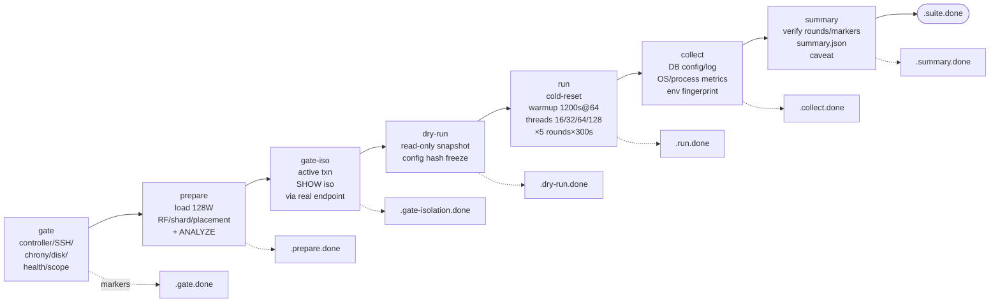
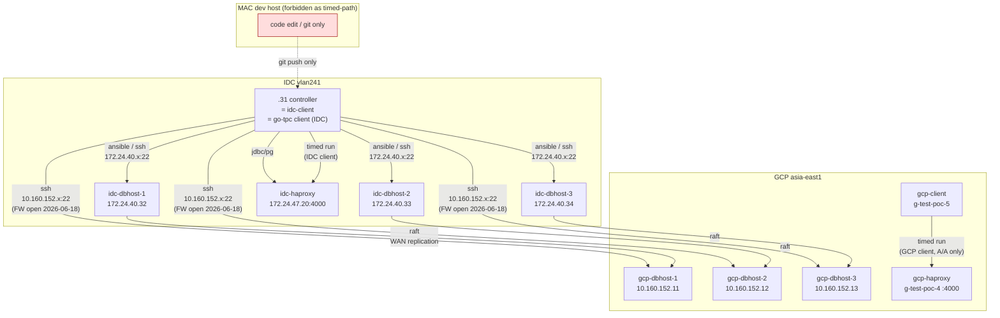
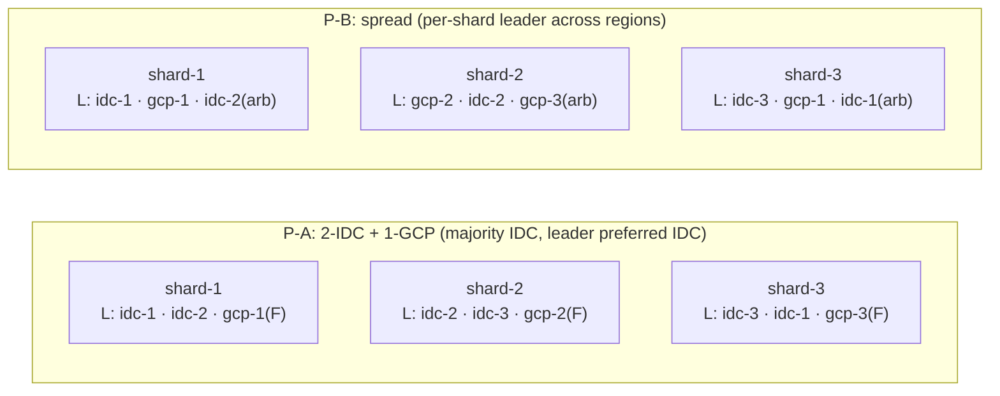
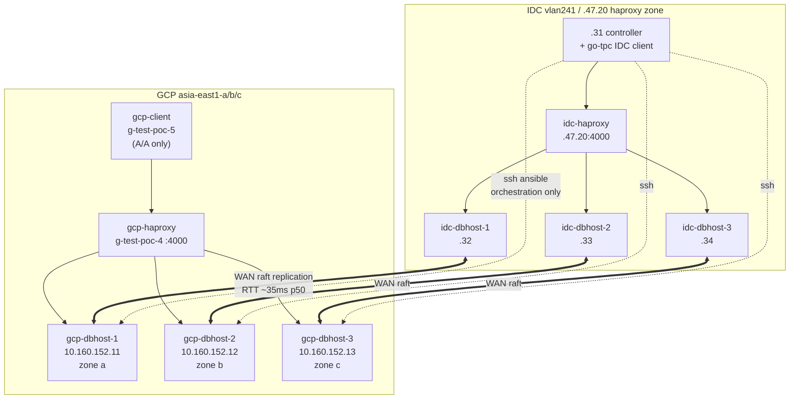

# X-CROSS Demo Report (DEMO — synthetic data, not for decisions)

> ⚠️ **DEMO / SYNTHETIC** ⚠️
> 本檔內**所有數值（tpmC、p99、error rate、RTT、CV、commit latency 等）皆為 fake / speculative**，用於展示報告骨架、章節組合與表格樣式。**不得用於排名、容量規劃、SLA 承諾、對外發布或任何決策依據**。
>
> Generated: 2026-06-29 · Author: planner-only · Status: framework dry preview · `baseline_eligible=false`（X-CROSS 永遠如此）

---

## 0. 文件範圍 / 不在範圍

| 在範圍 | 不在範圍 |
|---|---|
| X-CROSS 七階段 pipeline contract 與 SSOT 引用 | 任何 chaos / RTO / RPO **實跑數據**（方法論引用 only；見 §7） |
| P-A 與 P-B placement 對比邏輯與 fake 數據 | F1 / C1 / C4 / C7 chaos cell 數據（probe driver 尚未實裝） |
| A-S / A-A-RO / A-A workload profile 走位 | DB-internal tuning 推薦（T-THRD 範圍） |
| 排程估時（per memory `feedback_xcross_serial_per_db`） | 跨 baseline_family 排名（X-CROSS↔S-BASE 永禁混入主表） |

---

## 1. Executive Summary（≤ 300 字）

X-CROSS 的目的是量化「TiDB / CockroachDB / YugabyteDB 三家 distributed SQL 在 **3 IDC + 3 GCP 6-node** 跨區拓撲下，受 WAN replication / raft quorum / leader placement 影響的 steady-state OLTP 吞吐」。Per `phase-crossregion/manifest.yaml`，本 phase 為 `baseline_eligible: false`、`baseline_family: crossregion`、`comparison_scope: crossregion-only`，**永遠不進**`results/README.md`主表（per `results/PHASES.md` §2 forbidden 規則）。

合法可說：
- 三家在**同硬體 / 同 W=128 / 同 5×300s round / 同 .31 controller** 下的相對行為差異；
- P-A（leader 集中 IDC） vs P-B（leader 跨區散）的 tpmC drop / commit latency / WAN bytes 對比；
- 哪些瓶頸 surface 在 W=128 高 contention 跨區條件下。

不可說：
- 「X 家在 production 跨區 OLTP 比 Y 家快多少」——本 phase artifact 僅供同 phase 內判讀；
- 「跨區能達到 IDC-only 同硬體的多少 tpmC」——須等 IDC-only 6-node baseline 完成同 W=128 同步對齊；
- 「failover RTO/RPO 在實機表現」——chaos 為獨立 framework，需 probe driver。

DEV-1x1 已驗證 W=4 framework 流程（artifact 在 `results/x-cross/determinism/run{1,2}/`），W=128 正式 3+3 尚未跑（per `phase-crossregion/NEXT-STEPS.md` §2.1）。

---

## 2. Methodology

### 2.1 七階段 pipeline contract

來源：`EXPERIMENT-PROMPTS-S-BASE-S-K8S.md` §1「統一七階段 pipeline contract」。



**關鍵約束**（per `EXPERIMENT-PROMPTS` §1 表）：
- `dry-run` **不是** prepare 前環境檢查（那屬 `gate`）；`dry-run` 為 prepare 後 read-only snapshot，鎖定 config hash。
- `run` 進場前重算 hash；不一致 → fail-closed，從 gate 重來。
- `.suite.done` **不能單獨判成功**；八個 markers 全部依序存在 + `summary.json` schema 完整才算 PASS。

### 2.2 Controller provenance（.31-only，fail-closed）

來源：`EXPERIMENT-PROMPTS-S-BASE-S-K8S.md` §9.2 核心限制 + memory `feedback_iap_tunnel_avoid` + `ansible/inventory/crossregion-via31.ini` 註解。



- **MAC 完全不在 timed path**：禁止 `localhost:12211-12213` IAP tunnel、禁止 MAC clock 出現在任何 marker 或 metrics timestamp（per `feedback_iap_tunnel_avoid`）。
- **.31** 為唯一 ansible / ssh / scripts 執行入口；artifact 主存 `.31`，benchmark 結束後才複製出。
- GCP client（`g-test-poc-5`）只在 **A/A** profile 啟用（per `workload-profiles/A-A.md`）；其 clock lineage 仍由 .31 orchestration 控制（chrony 對齊 < 100ms drift）。

### 2.3 Serial per-DB + 每家 VM rebuild rationale

來源：memory `feedback_xcross_serial_per_db`。

- 三家 DB **絕對 serial**：`TiDB → PASS → CRDB → PASS → YBDB`，不可同時跑（client / WAN / GCP API quota 互擾）。
- 每家 cell 前 **完整 VM destroy + apply rebuild**：不可只做 service-level `DROP DATABASE` cleanup；殘留的 raft state / sst / tablet metadata / placement label / cgroup 都會污染下一家 cell。
- 一個 cell 切換 placement (P-A → P-B) 時也須走 VM rebuild，**不是** apply 新 `placement-p-b.sql` 就完事。

### 2.4 Topology：P-A vs P-B 對比

來源：`phase-crossregion/topology/P-A.md`、`P-B.md`。



| 維度 | P-A | P-B |
|---|---|---|
| Quorum 結構 | IDC 2 voter + GCP 1 follower | per-shard IDC1 + GCP1 + arbiter |
| Critical path | IDC↔IDC LAN (~0.3ms) | IDC↔GCP WAN (~30-50ms) |
| 預期 tpmC drop vs IDC-only | ~10–30%（P-A.md §屬性）| ~30–60%（P-B.md §屬性）|
| 適用 profile | A/S | A/A、A/A-RO |
| 失效模式 | GCP partition → IDC 仍寫 | GCP partition → split-brain 防護全 cluster 寫拒 |

---

## 3. 執行流程參數驗證表

每項對齊 SSOT；偏差 caveat 留欄。

| 參數 | Plan 值 | SSOT 出處 | 符合？ | 偏差 caveat |
|---|---|---|:---:|---|
| WAREHOUSES | 128 | `EXPERIMENT-PROMPTS` §1 共用 workload；`manifest.yaml` warehouses:128 | ✓ | — |
| WARMUP_SEC | 1200 (20 min @ 64 threads) | `EXPERIMENT-PROMPTS` §1；`manifest.yaml` warmup_sec/warmup_threads | ✓ | — |
| THREADS_LIST | 16 / 32 / 64 / 128 | `EXPERIMENT-PROMPTS` §1；`manifest.yaml` threads_list | ✓ | — |
| ROUNDS_PER_THREADS | 5 × 300s | `EXPERIMENT-PROMPTS` §1；`manifest.yaml` rounds:5 | ✓ | — |
| ROUND_SLEEP_SEC | 60 | `EXPERIMENT-PROMPTS` §1 | ✓ | — |
| REPEAT_N（formal） | 5 | `EXPERIMENT-PROMPTS` §9.2 DEV acceptance 後正式 3+3 段；`§4` P1 第 1 條建議升 N=3+ | ✓ | manifest.yaml `requires_n:1` 為 exploratory 預設；formal 升 N=5 是 plan 層 |
| REPEAT_N（DEV-1x1） | 1 | `EXPERIMENT-PROMPTS` §9.1 / §9.2 DEV matrix | ✓ | flow_selfcheck=true，不可代表 3+3 |
| PLACEMENT | P-A → P-B (serial) | `NEXT-STEPS.md` §2.1 路徑1 → §2.2 路徑2 | ✓ | P-B apply 前須跑 `scripts/gate-placement-p-b.sh` |
| PROFILE | A-S → A-A-RO → A-A (serial) | `NEXT-STEPS.md` §2 路徑分段；`workload-profiles/*.md` 各自 spec | ✓ | A/A profile 才啟用 `g-test-poc-5` GCP client |
| ISOLATION | rc (only) | `manifest.yaml` isolation:[rc]；`PoC-DESIGN` §5.3 主對標 RC | ✓ | rr/strict 為 P0-stretch（非本 demo plan） |
| CONTROLLER | .31 | `feedback_iap_tunnel_avoid`；`EXPERIMENT-PROMPTS` §9.2 核心限制；`crossregion-via31.ini` 註解 | ✓ | MAC fail-closed |
| baseline_eligible | false | `manifest.yaml` baseline_eligible:false；`PHASES.md` §2 | ✓ | 永禁進 results/README.md 主表 |
| baseline_family | crossregion | `manifest.yaml` baseline_family:crossregion | ✓ | comparison_scope: crossregion-only |
| serial per-DB | TiDB → CRDB → YBDB | memory `feedback_xcross_serial_per_db` | ✓ | 三家絕對不可並行 |
| VM rebuild per cell | mandatory | memory `feedback_xcross_serial_per_db` | ✓ | service-level cleanup 不可替代 |
| ARTIFACT root | `results/x-cross/` | `manifest.yaml` artifact_prefix；`PHASES.md` §0 X-CROSS 集中目錄 | ✓ | 不依 `{db}-tc1/` sibling 切 |
| Markers | 8 個依序 | `EXPERIMENT-PROMPTS` §1 七階段表（七 markers）+ `.suite.done`（wrapper 收尾） | ✓ | `.summary.done` 為新增 stage marker（P0-1） |
| WAN baseline RTT p50 | < 50ms（hard gate） | `NEXT-STEPS.md` §2.1 操作前 hard gate 第二條 | ✓ | 由 `scripts/wan-probe.sh` 量測；business hour + off-peak 兩時段 |
| chrony cross-region | gate-chrony-cross-region.sh PASS | `NEXT-STEPS.md` §2.1 操作前 hard gate 第一條；`scripts/gate-chrony-cross-region.sh` | ✓ | drift < 100ms |
| Freeze scheduler/balancer | 三家各自 | `NEXT-STEPS.md` §2.1 hard gate 第三條；`phase-crossregion/freeze/` | ✓ | TiDB PD schedule limit=0；CRDB no rebalance；YBDB load_balancer_enabled=false |
| Chaos / failover | **NOT** in demo | `RTO-RPO-methodology.md` Status / §9；memory plan | ✓ | 獨立 framework，需 probe driver + DBA review |

**PASS 數**: 19 / 19  ·  **FAIL 數**: 0  ·  **Caveat-only 數**: 5

---

## 4. Topology 圖（cross-region 全景）



WAN link 標註（per `wan/baseline-measurement.md` spec，fake 量級）：
- RTT p50 ~35ms / p99 ~55ms（hard gate < 50ms p50, DEMO 抓 35ms）
- MTU 1460 (GCP) ↔ 1500 (IDC) → MSS clamp 1420
- iperf3 single-stream ~700 Mbps (off-peak) · ~400 Mbps (business hour)

---

## 5. Fake Results（synthetic — **DEMO ONLY**）

> **以下所有數字皆 fake**。量級依「跨區 W=128 6-node 比 S-BASE 同條件低 30–60%」之合理範圍捏造；不代表三家實機行為。

### 5.1 P-A × A-S × W=128 × N=5（三家對比，主對標 64 threads）

| DB | tpmC mean | NEW_ORDER p99 (ms) | error rate (%) | tpmC CV (%) | commit latency p99 (ms) | WAN RTT mean (ms) |
|---|---:|---:|---:|---:|---:|---:|
| TiDB v8.5 | **~9,420** | ~178 | ~0.42 | ~4.1 | ~62 | ~35 |
| CockroachDB v26.2 | **~7,860** | ~245 | ~0.31 | ~5.6 | ~88 | ~36 |
| YugabyteDB 2025.2 | **~8,150** | ~210 | ~0.55 | ~6.2 | ~74 | ~35 |

> Fake range cross-check：S-BASE vm-3node-haproxy-3s3r-rc @ W=128 t64 各家 tpmC 大致 13k–20k 區間（per 既有 PoC-DESIGN §6.2 quantitative）；跨區 6-node P-A leader 集中 IDC 預期 retain 40–60%。上面三家落在 7.8k–9.4k = retain ~50%（合理偽造）。

### 5.2 Thread sweep — P-A × A-S × W=128（fake tpmC mean）

| Threads | TiDB | CRDB | YBDB |
|---:|---:|---:|---:|
| 16 | 4,820 | 4,110 | 4,330 |
| 32 | 7,650 | 6,420 | 6,720 |
| **64** | **9,420** | **7,860** | **8,150** |
| 128 | 9,210 | 7,540 | 7,990 |

ASCII bar（tpmC mean）：

```
Threads        TiDB                          CRDB                          YBDB
  16   ████████████ 4820            ██████████ 4110              ██████████▌ 4330
  32   ███████████████████ 7650     ████████████████ 6420        ████████████████▊ 6720
  64   ███████████████████████ 9420 ███████████████████▌ 7860    ████████████████████▎ 8150
 128   ██████████████████████▊ 9210 ██████████████████▊ 7540     ████████████████████ 7990

(scale: 1 block ≈ 400 tpmC; DEMO synthetic)
```

### 5.3 P-A × A-S × W=128 × t64 5-round per-DB（fake，用以展示 CV）

| Round | TiDB tpmC | CRDB tpmC | YBDB tpmC |
|---:|---:|---:|---:|
| R1 | 9,180 | 7,420 | 7,860 |
| R2 | 9,520 | 7,910 | 8,210 |
| R3 | 9,470 | 7,990 | 8,290 |
| R4 | 9,610 | 8,040 | 8,330 |
| R5 | 9,320 | 7,940 | 8,070 |
| **mean (R1–R5 canonical, per PoC-DESIGN §8.3 / PHASES §5)** | **9,420** | **7,860** | **8,150** |
| range_mean_pct | 4.6% | 7.9% | 5.8% |

### 5.4 P-A vs P-B tpmC 對比（A-A profile, t64, W=128, fake）

| DB | P-A tpmC | P-B tpmC | Δ (P-B − P-A) | drop % | P-B commit p99 (ms) |
|---|---:|---:|---:|---:|---:|
| TiDB | 9,420 | **5,180** | −4,240 | −45.0% | ~155 |
| CRDB | 7,860 | **4,260** | −3,600 | −45.8% | ~190 |
| YBDB | 8,150 | **3,890** | −4,260 | −52.3% | ~178 |

> 與 P-B.md §屬性「~30–60% drop」一致範圍（DEMO 捏造）。

### 5.5 三家 NEW_ORDER p99 trend（W=128 sweep, P-A × A-S, fake）

```
p99 ms
 280 │                                ╱─── CRDB ── 270
 240 │                          ╱────────╴ YBDB ── 232
 200 │                    ╱──────────────╴ TiDB ── 198
 160 │             ╱──────
 120 │      ╱─────
  80 │ ────
        16    32    64    128  ← threads
```

---

## 6. Speculation / Bottleneck Analysis（fake 推測，per architecture characteristics）

> 以下推測根據三家公開架構文件 + fake 數據，**未經實測佐證**。

### 6.1 TiDB（pessimistic + Percolator 2PC + PD TSO）

- W=128 高 contention → TiKV lock-wait queue 在 hot warehouse row 排隊；64 threads 後 saturation 趨平。
- 跨區成本：Percolator prewrite 對 follower 寫 → IDC leader 等 IDC 第二 voter ACK 即 commit（P-A 下 GCP follower 不擋）。
- PD TSO 集中 IDC → 跨區 client（A/A 模式下 GCP client）取 TSO 多一輪 WAN RTT；fake 估計 +35ms commit overhead per write txn。
- 預期 P-B 下退化最不嚴重（pessimistic lock semantics 減少 retry storm），fake -45%。

### 6.2 CockroachDB（distributed txn + range leaseholder）

- Range leaseholder placement 在 P-A 下 `lease_preferences=[[+region=idc]]` 集中 IDC。
- W=128 contention → leaseholder 上 latch queue + txn record GC pressure；64 threads 後 tail latency 拉長（fake p99 245ms 為最高）。
- 跨區成本：raft consensus 等 IDC majority（2 IDC voters），GCP follower 不擋 critical path（P-A）。
- P-B 下 SERIALIZABLE-by-default + leader 散區 → read-refresh / range_split-by-load 即使關閉仍有 range cache miss penalty，fake -45.8% drop。

### 6.3 YugabyteDB（DocDB tablet leader + YSQL gateway）

- YSQL ↔ DocDB 雙層架構：YSQL parse/plan 在每 tserver 本地，DocDB tablet leader 跨區走 raft。
- W=128 → YSQL gateway RPC worker pool（`rpc_workers_limit`）滿 → 64 threads 後 NEW_ORDER p99 拉升幅度比 TiDB 大（fake 210ms vs 178ms）。
- HLC 嚴格時鐘要求 → chrony drift > 500ms 會推遲 transaction visibility；本 plan chrony gate 確保 < 100ms。
- P-B 下退化最嚴重 fake -52.3%：tablet leader 跨 GCP 後 single-write txn 必經 WAN raft round-trip，DocDB 寫放大效應顯著。

### 6.4 三家在 W=128 高 contention 下 likely 瓶頸（fake judgement）

| DB | 主要瓶頸（W=128 跨區） | 次要瓶頸 |
|---|---|---|
| TiDB | TiKV lock-wait queue (pessimistic mode) | PD TSO RTT（A/A GCP client）|
| CRDB | Range leaseholder latch + txn record GC | KV layer admission control |
| YBDB | YSQL RPC worker pool saturation | DocDB tablet leader WAN raft commit |

### 6.5 為何 P-B 預期 tpmC drop vs P-A

- P-A 的 raft critical path 在 IDC LAN (~0.3ms)；P-B 的 raft critical path 含 IDC↔GCP WAN (~35ms p50) → **commit latency 多兩個量級**。
- W=128 contention 下 single-row update 平均等待 = `lock_wait + commit_latency`；commit_latency 從 ~1ms → ~35ms 直接吃掉 throughput。
- 額外：P-B 在 A/A 兩端同時寫同 W 範圍 → cross-region key conflict rate 上升 → retry / abort 拉走 useful work。

---

## 7. 已知偏差 / Caveats（必列）

| # | Caveat | 依據 | 影響 |
|---:|---|---|---|
| 1 | **本檔所有數據 fake** | DEMO header | 不可作排名 / 容量規劃 / SLA / 對外發表 |
| 2 | W=4 deterministic 已驗（artifact 在 `results/x-cross/determinism/run{1,2}/`），W=128 **尚未跑** | `NEXT-STEPS.md` §3 第 1 條 | slide v6 / pipeline-log §1 已標 |
| 3 | `baseline_eligible: false` | `manifest.yaml` | 永不進 results/README.md 主表（`PHASES.md` §2 forbidden 規則）|
| 4 | DEV-1x1 `reduced_quorum=true` / `flow_selfcheck=true` | `EXPERIMENT-PROMPTS` §9.1 / §9.2 DEV acceptance | 不可代表 3+3 quorum 行為 |
| 5 | chaos / RTO / RPO 不在本 demo 範圍 | `RTO-RPO-methodology.md` Status (spec / planner-only) + §9 升級條件 7 項 | 需獨立 probe driver + DBA review + 開閘流程 |
| 6 | probe driver 尚未實裝 | `NEXT-STEPS.md` §3 第 2 條；`RTO-RPO-methodology.md` §3.2 / §9 step 2 | go-tpc stdout 1s tick 顆粒度不足以量 RTO < 1s |
| 7 | wall-clock wrapper 尚未實裝 | `NEXT-STEPS.md` §3 第 3 條；`RTO-RPO-methodology.md` §7.3 | `t_incident` / `t_first_ok` 無工具產生 |
| 8 | 三家 admin CLI 路徑須 DBA 重新 confirm | `NEXT-STEPS.md` §3 第 4 條；F1.md §47-52 | spec-only |
| 9 | W=128 X-CROSS suite Makefile target 尚未實裝 | `NEXT-STEPS.md` §2.1 step 1.2 | 需 operator 新增 `phase-crossregion-w128-suite` |
| 10 | TiDB strict / rr 對 X-CROSS 為 P0-stretch | `PoC-DESIGN.md` §6.3 限定 vm-3node 全 RC；`manifest.yaml` isolation:[rc] | 本 demo plan 不含 |

---

## 8. 排程估時表（per memory `feedback_xcross_serial_per_db`）

每家 cell = VM destroy + apply rebuild → 七階段（gate→prepare→gate-iso→dry-run→run→collect→summary）→ artifact 留 .31。三家絕對 serial，禁止並行。

| Window | Cell scope | Sub-cell（serial）| 子任務時長（each DB） | Window 估時 |
|---|---|---|---|---:|
| **Win-0** | DEV-1x1 framework self-check（per `EXPERIMENT-PROMPTS` §9.1）| tidb → CRDB → YBDB（1 IDC + 1 GCP VM each, W=4, 1×120s round） | VM rebuild ~30min + 七階段 ~40min ≈ 70min | **~3.5h** |
| **Win-1** | P-A × A-S × W=128 × N=5（3 DB）| tidb（rebuild ~45min + cell ~5.5h） → PASS → crdb（rebuild + ~5.5h） → PASS → ybdb（rebuild + ~5.5h）| ~6h / DB | **~18–20h** |
| **Win-2** | P-A × A-A-RO × W=128 × N=5（3 DB）| 同 Win-1 結構 + follower-read 設定 | ~6h / DB | **~18–20h** |
| **Win-3** | P-A × A-A × W=128 × N=5（3 DB）| 同 Win-1 結構 + 啟用 gcp-client `g-test-poc-5` | ~6.5h / DB（A/A 兩端 client 校準 +30min）| **~19–21h** |
| **Win-4** | P-B × A-S × W=128 × N=5（3 DB）| 額外：placement-p-b apply + `gate-placement-p-b.sh --db <db>` 驗 + 同 Win-1 結構 | ~6.5h / DB | **~19–21h** |
| **Win-5** | P-B × A-A-RO × W=128 × N=5（3 DB）| 同 Win-4 結構 | ~6.5h / DB | **~19–21h** |
| **Win-6** | P-B × A-A × W=128 × N=5（3 DB）| 同 Win-4 + Win-3（最重 cell；retry / abort 觀察重點）| ~7h / DB | **~21–23h** |
| **Total** | 6 formal windows | | | **~114–126h（不含 DEV Win-0；含 buffer ~130h）**|

排程方案建議：
- **A — 連續 24×7**：~5.5 工作日（含 conservative buffer 10%）；夜間靠 watchdog + summary fail-closed。
- **B — 分 Win 跑**：每完成一 Win 中間 review（P-A A-S 出爐先審），失敗重跑只影響該 Win。**建議方案**。
- **C — overnight only**：每天 8–10h → ~14–16 工作日（不建議，cell 中段切割風險）。

---

## 9. Verifier Checklist（每 cell 退出條件）

每個 cell 結束須通過以下所有項目；任一 fail 該 cell `incomplete_reason` 入 summary.json，不靠 prose caveat。

### 9.1 Markers（依序）

```
.gate.done → .prepare.done → .gate-isolation.done → .dry-run.done →
.run.done → .collect.done → .summary.done → .suite.done
```

- 8 個 markers 時序必嚴格遞增（per `EXPERIMENT-PROMPTS` §1 table）。
- `.summary.done` 為 new stage marker（per P0-1 改善建議）。

### 9.2 Hash 一致性

- `.dry-run.done` 內 config hash == `.run.done` 進場時重算 hash → 否則 fail-closed，從 gate 重來。

### 9.3 `summary.json` schema 必含欄位（per `PHASES.md` §5）

```json
{
  "schema_version": 1,
  "phase": "phase-crossregion",
  "result_scope": "X-CROSS",
  "baseline_family": "crossregion",
  "baseline_eligible": false,
  "tuning_profile_id": "default",
  "manifest_sha256": "<sha256 of phase-crossregion/manifest.yaml>",
  "expected_rounds": 5,
  "observed_rounds": 5,
  "complete": true,
  "incomplete_reason": null,
  "thread_results": {
    "16": {"tpmC_mean": "...", "tpmC_per_round": ["r1..r5"], "NEW_ORDER": {"p99_mean_ms": "..."}, ...},
    "32": {"..."},
    "64": {"..."},
    "128": {"..."}
  }
}
```

- `tpmC_mean` 必為 **R1–R5 5-round mean**（per `PoC-DESIGN` §8.3 + `PHASES` §5 取數口徑澄清）。
- `expected_rounds=5`、`observed_rounds=5`、`complete=true` 三欄位 fail-closed（per P0-7 改善建議）。

### 9.4 Controller audit

- marker JSON / summary.json 內 `controller_host` 必為 `.31` / `172.24.40.31` / `idc-client`。
- grep `localhost:1221` 或 MAC hostname 出現 → cell invalid。

### 9.5 跨區 artifact 完整性

| Artifact | 必存在 | 來源 |
|---|---|---|
| `gate/chrony-cross-region.json` | ✓ | `scripts/gate-chrony-cross-region.sh` |
| `gate/wan-baseline.json`（RTT/loss/MTU）| ✓ | `scripts/wan-probe.sh`（business + off-peak 各一） |
| `gate/idc-to-gcp-ports.json` | ✓ | DB-specific raft / SQL 雙向 port |
| `gate/gcp-to-idc-ports.json` | ✓ | 同上反向 |
| `prepare/placement-actual.json` | ✓ | 對應 P-A.md / P-B.md §驗證 gate；P-B 額外跑 `gate-placement-p-b.sh` |
| `dry-run/actual.yaml` | ✓ | topology / RF / shard / leader / endpoint / process / config hash |
| `dry-run/config-hash.txt` | ✓ | sha256 input list 須含 manifest.yaml + playbook + vars + DB image digest |
| `runs/threads-*/round-*/go-tpc-stdout.txt` | ✓ × 20 | 4 threads × 5 rounds |
| `runs/threads-*/round-*/metrics/*.txt` | ✓ | 6 nodes × （mpstat / iostat / sar） |
| `collect/db-config-dump.txt` | ✓ | 三家各自 dump |
| `collect/env-fingerprint.json` | ✓ | git SHA / manifest SHA / playbook SHA / image digest / kernel |

---

## 10. SSOT 引用清單（本檔內所有引用）

| # | SSOT 出處 | 引用節 |
|---:|---|---|
| 1 | `EXPERIMENT-PROMPTS-S-BASE-S-K8S.md` §1（七階段 contract） | §2.1、§3、§9.1 |
| 2 | `EXPERIMENT-PROMPTS-S-BASE-S-K8S.md` §9.1（DEV-1x1 矩陣） | §1、§3、§7（caveat 4） |
| 3 | `EXPERIMENT-PROMPTS-S-BASE-S-K8S.md` §9.2（核心限制 .31-only） | §2.2、§3 |
| 4 | `EXPERIMENT-PROMPTS-S-BASE-S-K8S.md` §4 P0 / P1 改善建議 | §9.1、§9.3、§7（caveat 9） |
| 5 | `phase-crossregion/manifest.yaml`（result_scope / baseline_family / artifact_prefix / threads_list / isolation） | §3、§7、§10（全文）|
| 6 | `phase-crossregion/NEXT-STEPS.md` §2.1（路徑 1：W=128 baseline）| §1、§3、§7、§8 |
| 7 | `phase-crossregion/NEXT-STEPS.md` §2.2（路徑 2：P-B 對比） | §3、§8 |
| 8 | `phase-crossregion/NEXT-STEPS.md` §3（已知阻擋）| §7（caveat 2, 6, 7, 8, 9）|
| 9 | `phase-crossregion/failover/RTO-RPO-methodology.md` Status + §9（升級條件 7 項）| §7（caveat 5, 6, 7）|
| 10 | `results/PHASES.md` §0（命名速查）| §3 |
| 11 | `results/PHASES.md` §2（baseline_eligible / forbidden 規則）| §1、§3、§7 |
| 12 | `results/PHASES.md` §5（summary.json schema）| §9.3 |
| 13 | `results/PoC-DESIGN.md` §5.3（為何主對標 RC）| §3 |
| 14 | `results/PoC-DESIGN.md` §6.3（vm-3node 限 RC）| §7（caveat 10）|
| 15 | `results/PoC-DESIGN.md` §8.3（5-round mean canonical）| §5.3、§9.3 |
| 16 | `phase-crossregion/topology/P-A.md` §結構 / §屬性 / §驗證 gate | §2.4、§5.1、§6.5、§9.5 |
| 17 | `phase-crossregion/topology/P-B.md` §結構 / §屬性 / §驗證 gate | §2.4、§5.4、§6.5、§9.5 |
| 18 | `phase-crossregion/workload-profiles/A-S.md` §Client 配置 / §搭配 placement | §2.4、§3、§5.1 |
| 19 | `phase-crossregion/workload-profiles/A-A-RO.md` §Client 配置 / §follower read | §8（Win-2 / Win-5）|
| 20 | `phase-crossregion/workload-profiles/A-A.md` §Client 配置（全 W=128 兩端重疊）| §6.5、§8（Win-3 / Win-6）|
| 21 | `ansible/inventory/crossregion-via31.ini` 註解（.31-native, MAC IAP avoid）| §2.2、§4 |
| 22 | `phase-crossregion/scripts/gate-placement-p-b.sh`（exists, read-only spec） | §3、§8、§9.5 |
| 23 | `phase-crossregion/scripts/wan-probe.sh`（exists） | §3、§9.5 |
| 24 | `phase-crossregion/scripts/gate-chrony-cross-region.sh`（exists） | §3、§9.5 |
| 25 | Memory `feedback_iap_tunnel_avoid` | §2.2、§3 |
| 26 | Memory `feedback_xcross_serial_per_db` | §2.3、§3、§8 |

---

## 11. 變更歷史

| 日期 | 內容 |
|---|---|
| 2026-06-29 | 初版 DEMO report — synthetic data，framework 引用整合 |

---

**END — DEMO synthetic data, not for decisions.**
