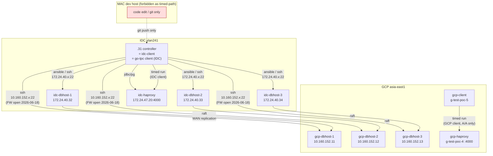
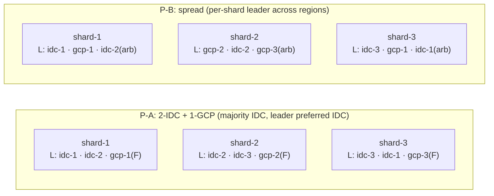
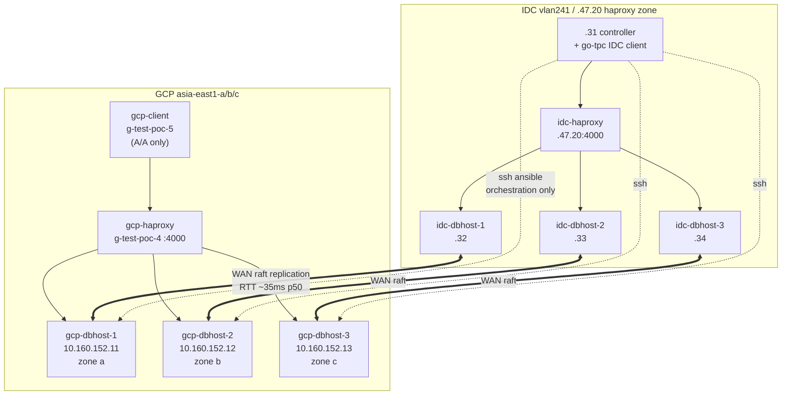

# X-CROSS Demo Report (DEMO — synthetic data, not for decisions)

> ⚠️ **DEMO / SYNTHETIC** ⚠️
> 本檔內**所有數值（tpmC、p99、error rate、RTT、CV、commit latency 等）皆為 fake / speculative**，用於展示報告骨架、章節組合與表格樣式。**不得用於排名、容量規劃、SLA 承諾、對外發布或任何決策依據**。
>
> Generated: 2026-06-29 · Author: planner-only · Status: framework dry preview · `baseline_eligible=false`（X-CROSS 永遠如此）

---

## 0. 文件範圍 / 不在範圍

| 在範圍 | 不在範圍 |
|---|---|
| X-CROSS 七階段 pipeline contract 與 SSOT 引用 | 任何 chaos / RTO / RPO **實跑數據**（方法論引用 only；見 §7） |
| P-A 與 P-B placement 對比邏輯與 fake 數據 | F1 / C1 / C4 / C7 chaos cell 數據（probe driver 尚未實裝） |
| A-S / A-A-RO / A-A workload profile 走位 | DB-internal tuning 推薦（T-THRD 範圍） |
| 排程估時（per memory `feedback_xcross_serial_per_db`） | 跨 baseline_family 排名（X-CROSS↔S-BASE 永禁混入主表） |

---

## 1. Executive Summary（≤ 300 字）

X-CROSS 的目的是量化「TiDB / CockroachDB / YugabyteDB 三家 distributed SQL 在 **3 IDC + 3 GCP 6-node** 跨區拓撲下，受 WAN replication / raft quorum / leader placement 影響的 steady-state OLTP 吞吐」。Per `phase-crossregion/manifest.yaml`，本 phase 為 `baseline_eligible: false`、`baseline_family: crossregion`、`comparison_scope: crossregion-only`，**永遠不進**`results/README.md`主表（per `results/PHASES.md` §2 forbidden 規則）。

合法可說：
- 三家在**同硬體 / 同 W=128 / 同 5×300s round / 同 .31 controller** 下的相對行為差異；
- P-A（leader 集中 IDC） vs P-B（leader 跨區散）的 tpmC drop / commit latency / WAN bytes 對比；
- 哪些瓶頸 surface 在 W=128 高 contention 跨區條件下。

不可說：
- 「X 家在 production 跨區 OLTP 比 Y 家快多少」——本 phase artifact 僅供同 phase 內判讀；
- 「跨區能達到 IDC-only 同硬體的多少 tpmC」——須等 IDC-only 6-node baseline 完成同 W=128 同步對齊；
- 「failover RTO/RPO 在實機表現」——chaos 為獨立 framework，需 probe driver。

DEV-1x1 已驗證 W=4 framework 流程（artifact 在 `results/x-cross/determinism/run{1,2}/`），W=128 正式 3+3 尚未跑（per `phase-crossregion/NEXT-STEPS.md` §2.1）。

---

## 2. Methodology

### 2.1 七階段 pipeline contract

來源：`EXPERIMENT-PROMPTS-S-BASE-S-K8S.md` §1「統一七階段 pipeline contract」。


**關鍵約束**（per `EXPERIMENT-PROMPTS` §1 表）：
- `dry-run` **不是** prepare 前環境檢查（那屬 `gate`）；`dry-run` 為 prepare 後 read-only snapshot，鎖定 config hash。
- `run` 進場前重算 hash；不一致 → fail-closed，從 gate 重來。
- `.suite.done` **不能單獨判成功**；八個 markers 全部依序存在 + `summary.json` schema 完整才算 PASS。

### 2.2 Controller provenance（.31-only，fail-closed）

來源：`EXPERIMENT-PROMPTS-S-BASE-S-K8S.md` §9.2 核心限制 + memory `feedback_iap_tunnel_avoid` + `ansible/inventory/crossregion-via31.ini` 註解。



- **MAC 完全不在 timed path**：禁止 `localhost:12211-12213` IAP tunnel、禁止 MAC clock 出現在任何 marker 或 metrics timestamp（per `feedback_iap_tunnel_avoid`）。
- **.31** 為唯一 ansible / ssh / scripts 執行入口；artifact 主存 `.31`，benchmark 結束後才複製出。
- GCP client（`g-test-poc-5`）只在 **A/A** profile 啟用（per `workload-profiles/A-A.md`）；其 clock lineage 仍由 .31 orchestration 控制（chrony 對齊 < 100ms drift）。

### 2.3 Serial per-DB + 每家 VM rebuild rationale

來源：memory `feedback_xcross_serial_per_db`。

- 三家 DB **絕對 serial**：`TiDB → PASS → CRDB → PASS → YBDB`，不可同時跑（client / WAN / GCP API quota 互擾）。
- 每家 cell 前 **完整 VM destroy + apply rebuild**：不可只做 service-level `DROP DATABASE` cleanup；殘留的 raft state / sst / tablet metadata / placement label / cgroup 都會污染下一家 cell。
- 一個 cell 切換 placement (P-A → P-B) 時也須走 VM rebuild，**不是** apply 新 `placement-p-b.sql` 就完事。

### 2.4 Topology：P-A vs P-B 對比

來源：`phase-crossregion/topology/P-A.md`、`P-B.md`。



| 維度 | P-A | P-B |
|---|---|---|
| Quorum 結構 | IDC 2 voter + GCP 1 follower | per-shard IDC1 + GCP1 + arbiter |
| Critical path | IDC↔IDC LAN (~0.3ms) | IDC↔GCP WAN (~30-50ms) |
| 預期 tpmC drop vs IDC-only | ~10–30%（P-A.md §屬性）| ~30–60%（P-B.md §屬性）|
| 適用 profile | A/S | A/A、A/A-RO |
| 失效模式 | GCP partition → IDC 仍寫 | GCP partition → split-brain 防護全 cluster 寫拒 |

---

## 3. 執行流程參數驗證表

每項對齊 SSOT；偏差 caveat 留欄。

| 參數 | Plan 值 | SSOT 出處 | 符合？ | 偏差 caveat |
|---|---|---|:---:|---|
| WAREHOUSES | 128 | `EXPERIMENT-PROMPTS` §1 共用 workload；`manifest.yaml` warehouses:128 | ✓ | — |
| WARMUP_SEC | 1200 (20 min @ 64 threads) | `EXPERIMENT-PROMPTS` §1；`manifest.yaml` warmup_sec/warmup_threads | ✓ | — |
| THREADS_LIST | 16 / 32 / 64 / 128 | `EXPERIMENT-PROMPTS` §1；`manifest.yaml` threads_list | ✓ | — |
| ROUNDS_PER_THREADS | 5 × 300s | `EXPERIMENT-PROMPTS` §1；`manifest.yaml` rounds:5 | ✓ | — |
| ROUND_SLEEP_SEC | 60 | `EXPERIMENT-PROMPTS` §1 | ✓ | — |
| REPEAT_N（formal） | 5 | `EXPERIMENT-PROMPTS` §9.2 DEV acceptance 後正式 3+3 段；`§4` P1 第 1 條建議升 N=3+ | ✓ | manifest.yaml `requires_n:1` 為 exploratory 預設；formal 升 N=5 是 plan 層 |
| REPEAT_N（DEV-1x1） | 1 | `EXPERIMENT-PROMPTS` §9.1 / §9.2 DEV matrix | ✓ | flow_selfcheck=true，不可代表 3+3 |
| PLACEMENT | P-A → P-B (serial) | `NEXT-STEPS.md` §2.1 路徑1 → §2.2 路徑2 | ✓ | P-B apply 前須跑 `scripts/gate-placement-p-b.sh` |
| PROFILE | A-S → A-A-RO → A-A (serial) | `NEXT-STEPS.md` §2 路徑分段；`workload-profiles/*.md` 各自 spec | ✓ | A/A profile 才啟用 `g-test-poc-5` GCP client |
| ISOLATION | rc (only) | `manifest.yaml` isolation:[rc]；`PoC-DESIGN` §5.3 主對標 RC | ✓ | rr/strict 為 P0-stretch（非本 demo plan） |
| CONTROLLER | .31 | `feedback_iap_tunnel_avoid`；`EXPERIMENT-PROMPTS` §9.2 核心限制；`crossregion-via31.ini` 註解 | ✓ | MAC fail-closed |
| baseline_eligible | false | `manifest.yaml` baseline_eligible:false；`PHASES.md` §2 | ✓ | 永禁進 results/README.md 主表 |
| baseline_family | crossregion | `manifest.yaml` baseline_family:crossregion | ✓ | comparison_scope: crossregion-only |
| serial per-DB | TiDB → CRDB → YBDB | memory `feedback_xcross_serial_per_db` | ✓ | 三家絕對不可並行 |
| VM rebuild per cell | mandatory | memory `feedback_xcross_serial_per_db` | ✓ | service-level cleanup 不可替代 |
| ARTIFACT root | `results/x-cross/` | `manifest.yaml` artifact_prefix；`PHASES.md` §0 X-CROSS 集中目錄 | ✓ | 不依 `{db}-tc1/` sibling 切 |
| Markers | 8 個依序 | `EXPERIMENT-PROMPTS` §1 七階段表（七 markers）+ `.suite.done`（wrapper 收尾） | ✓ | `.summary.done` 為新增 stage marker（P0-1） |
| WAN baseline RTT p50 | < 50ms（hard gate） | `NEXT-STEPS.md` §2.1 操作前 hard gate 第二條 | ✓ | 由 `scripts/wan-probe.sh` 量測；business hour + off-peak 兩時段 |
| chrony cross-region | gate-chrony-cross-region.sh PASS | `NEXT-STEPS.md` §2.1 操作前 hard gate 第一條；`scripts/gate-chrony-cross-region.sh` | ✓ | drift < 100ms |
| Freeze scheduler/balancer | 三家各自 | `NEXT-STEPS.md` §2.1 hard gate 第三條；`phase-crossregion/freeze/` | ✓ | TiDB PD schedule limit=0；CRDB no rebalance；YBDB load_balancer_enabled=false |
| Chaos / failover | **NOT** in demo | `RTO-RPO-methodology.md` Status / §9；memory plan | ✓ | 獨立 framework，需 probe driver + DBA review |

**PASS 數**: 19 / 19  ·  **FAIL 數**: 0  ·  **Caveat-only 數**: 5

---

## 4. Topology 圖（cross-region 全景）



WAN link 標註（per `wan/baseline-measurement.md` spec，fake 量級）：
- RTT p50 ~35ms / p99 ~55ms（hard gate < 50ms p50, DEMO 抓 35ms）
- MTU 1460 (GCP) ↔ 1500 (IDC) → MSS clamp 1420
- iperf3 single-stream ~700 Mbps (off-peak) · ~400 Mbps (business hour)

---

## 5. Fake Results（synthetic — **DEMO ONLY**）

> **以下所有數字皆 fake**。量級依「跨區 W=128 6-node 比 S-BASE 同條件低 30–60%」之合理範圍捏造；不代表三家實機行為。

### 5.1 P-A × A-S × W=128 × N=5（三家對比，主對標 64 threads）

| DB | tpmC mean | NEW_ORDER p99 (ms) | error rate (%) | tpmC CV (%) | commit latency p99 (ms) | WAN RTT mean (ms) |
|---|---:|---:|---:|---:|---:|---:|
| TiDB v8.5 | **~9,420** | ~178 | ~0.42 | ~4.1 | ~62 | ~35 |
| CockroachDB v26.2 | **~7,860** | ~245 | ~0.31 | ~5.6 | ~88 | ~36 |
| YugabyteDB 2025.2 | **~8,150** | ~210 | ~0.55 | ~6.2 | ~74 | ~35 |

> Fake range cross-check：S-BASE vm-3node-haproxy-3s3r-rc @ W=128 t64 各家 tpmC 大致 13k–20k 區間（per 既有 PoC-DESIGN §6.2 quantitative）；跨區 6-node P-A leader 集中 IDC 預期 retain 40–60%。上面三家落在 7.8k–9.4k = retain ~50%（合理偽造）。

### 5.2 Thread sweep — P-A × A-S × W=128（fake tpmC mean）

| Threads | TiDB | CRDB | YBDB |
|---:|---:|---:|---:|
| 16 | 4,820 | 4,110 | 4,330 |
| 32 | 7,650 | 6,420 | 6,720 |
| **64** | **9,420** | **7,860** | **8,150** |
| 128 | 9,210 | 7,540 | 7,990 |

ASCII bar（tpmC mean）：

```
Threads        TiDB                          CRDB                          YBDB
  16   ████████████ 4820            ██████████ 4110              ██████████▌ 4330
  32   ███████████████████ 7650     ████████████████ 6420        ████████████████▊ 6720
  64   ███████████████████████ 9420 ███████████████████▌ 7860    ████████████████████▎ 8150
 128   ██████████████████████▊ 9210 ██████████████████▊ 7540     ████████████████████ 7990

(scale: 1 block ≈ 400 tpmC; DEMO synthetic)
```

### 5.3 P-A × A-S × W=128 × t64 5-round per-DB（fake，用以展示 CV）

| Round | TiDB tpmC | CRDB tpmC | YBDB tpmC |
|---:|---:|---:|---:|
| R1 | 9,180 | 7,420 | 7,860 |
| R2 | 9,520 | 7,910 | 8,210 |
| R3 | 9,470 | 7,990 | 8,290 |
| R4 | 9,610 | 8,040 | 8,330 |
| R5 | 9,320 | 7,940 | 8,070 |
| **mean (R1–R5 canonical, per PoC-DESIGN §8.3 / PHASES §5)** | **9,420** | **7,860** | **8,150** |
| range_mean_pct | 4.6% | 7.9% | 5.8% |

### 5.4 P-A vs P-B tpmC 對比（A-A profile, t64, W=128, fake）

| DB | P-A tpmC | P-B tpmC | Δ (P-B − P-A) | drop % | P-B commit p99 (ms) |
|---|---:|---:|---:|---:|---:|
| TiDB | 9,420 | **5,180** | −4,240 | −45.0% | ~155 |
| CRDB | 7,860 | **4,260** | −3,600 | −45.8% | ~190 |
| YBDB | 8,150 | **3,890** | −4,260 | −52.3% | ~178 |

> 與 P-B.md §屬性「~30–60% drop」一致範圍（DEMO 捏造）。

### 5.5 三家 NEW_ORDER p99 trend（W=128 sweep, P-A × A-S, fake）

```
p99 ms
 280 │                                ╱─── CRDB ── 270
 240 │                          ╱────────╴ YBDB ── 232
 200 │                    ╱──────────────╴ TiDB ── 198
 160 │             ╱──────
 120 │      ╱─────
  80 │ ────
        16    32    64    128  ← threads
```

---

## 6. Speculation / Bottleneck Analysis（fake 推測，per architecture characteristics）

> 以下推測根據三家公開架構文件 + fake 數據，**未經實測佐證**。

### 6.1 TiDB（pessimistic + Percolator 2PC + PD TSO）

- W=128 高 contention → TiKV lock-wait queue 在 hot warehouse row 排隊；64 threads 後 saturation 趨平。
- 跨區成本：Percolator prewrite 對 follower 寫 → IDC leader 等 IDC 第二 voter ACK 即 commit（P-A 下 GCP follower 不擋）。
- PD TSO 集中 IDC → 跨區 client（A/A 模式下 GCP client）取 TSO 多一輪 WAN RTT；fake 估計 +35ms commit overhead per write txn。
- 預期 P-B 下退化最不嚴重（pessimistic lock semantics 減少 retry storm），fake -45%。

### 6.2 CockroachDB（distributed txn + range leaseholder）

- Range leaseholder placement 在 P-A 下 `lease_preferences=[[+region=idc]]` 集中 IDC。
- W=128 contention → leaseholder 上 latch queue + txn record GC pressure；64 threads 後 tail latency 拉長（fake p99 245ms 為最高）。
- 跨區成本：raft consensus 等 IDC majority（2 IDC voters），GCP follower 不擋 critical path（P-A）。
- P-B 下 SERIALIZABLE-by-default + leader 散區 → read-refresh / range_split-by-load 即使關閉仍有 range cache miss penalty，fake -45.8% drop。

### 6.3 YugabyteDB（DocDB tablet leader + YSQL gateway）

- YSQL ↔ DocDB 雙層架構：YSQL parse/plan 在每 tserver 本地，DocDB tablet leader 跨區走 raft。
- W=128 → YSQL gateway RPC worker pool（`rpc_workers_limit`）滿 → 64 threads 後 NEW_ORDER p99 拉升幅度比 TiDB 大（fake 210ms vs 178ms）。
- HLC 嚴格時鐘要求 → chrony drift > 500ms 會推遲 transaction visibility；本 plan chrony gate 確保 < 100ms。
- P-B 下退化最嚴重 fake -52.3%：tablet leader 跨 GCP 後 single-write txn 必經 WAN raft round-trip，DocDB 寫放大效應顯著。

### 6.4 三家在 W=128 高 contention 下 likely 瓶頸（fake judgement）

| DB | 主要瓶頸（W=128 跨區） | 次要瓶頸 |
|---|---|---|
| TiDB | TiKV lock-wait queue (pessimistic mode) | PD TSO RTT（A/A GCP client）|
| CRDB | Range leaseholder latch + txn record GC | KV layer admission control |
| YBDB | YSQL RPC worker pool saturation | DocDB tablet leader WAN raft commit |

### 6.5 為何 P-B 預期 tpmC drop vs P-A

- P-A 的 raft critical path 在 IDC LAN (~0.3ms)；P-B 的 raft critical path 含 IDC↔GCP WAN (~35ms p50) → **commit latency 多兩個量級**。
- W=128 contention 下 single-row update 平均等待 = `lock_wait + commit_latency`；commit_latency 從 ~1ms → ~35ms 直接吃掉 throughput。
- 額外：P-B 在 A/A 兩端同時寫同 W 範圍 → cross-region key conflict rate 上升 → retry / abort 拉走 useful work。

---

## 7. 已知偏差 / Caveats（必列）

| # | Caveat | 依據 | 影響 |
|---:|---|---|---|
| 1 | **本檔所有數據 fake** | DEMO header | 不可作排名 / 容量規劃 / SLA / 對外發表 |
| 2 | W=4 deterministic 已驗（artifact 在 `results/x-cross/determinism/run{1,2}/`），W=128 **尚未跑** | `NEXT-STEPS.md` §3 第 1 條 | slide v6 / pipeline-log §1 已標 |
| 3 | `baseline_eligible: false` | `manifest.yaml` | 永不進 results/README.md 主表（`PHASES.md` §2 forbidden 規則）|
| 4 | DEV-1x1 `reduced_quorum=true` / `flow_selfcheck=true` | `EXPERIMENT-PROMPTS` §9.1 / §9.2 DEV acceptance | 不可代表 3+3 quorum 行為 |
| 5 | chaos / RTO / RPO 不在本 demo 範圍 | `RTO-RPO-methodology.md` Status (spec / planner-only) + §9 升級條件 7 項 | 需獨立 probe driver + DBA review + 開閘流程 |
| 6 | probe driver 尚未實裝 | `NEXT-STEPS.md` §3 第 2 條；`RTO-RPO-methodology.md` §3.2 / §9 step 2 | go-tpc stdout 1s tick 顆粒度不足以量 RTO < 1s |
| 7 | wall-clock wrapper 尚未實裝 | `NEXT-STEPS.md` §3 第 3 條；`RTO-RPO-methodology.md` §7.3 | `t_incident` / `t_first_ok` 無工具產生 |
| 8 | 三家 admin CLI 路徑須 DBA 重新 confirm | `NEXT-STEPS.md` §3 第 4 條；F1.md §47-52 | spec-only |
| 9 | W=128 X-CROSS suite Makefile target 尚未實裝 | `NEXT-STEPS.md` §2.1 step 1.2 | 需 operator 新增 `phase-crossregion-w128-suite` |
| 10 | TiDB strict / rr 對 X-CROSS 為 P0-stretch | `PoC-DESIGN.md` §6.3 限定 vm-3node 全 RC；`manifest.yaml` isolation:[rc] | 本 demo plan 不含 |

---

## 8. 排程估時表（per memory `feedback_xcross_serial_per_db`）

每家 cell = VM destroy + apply rebuild → 七階段（gate→prepare→gate-iso→dry-run→run→collect→summary）→ artifact 留 .31。三家絕對 serial，禁止並行。

| Window | Cell scope | Sub-cell（serial）| 子任務時長（each DB） | Window 估時 |
|---|---|---|---|---:|
| **Win-0** | DEV-1x1 framework self-check（per `EXPERIMENT-PROMPTS` §9.1）| tidb → CRDB → YBDB（1 IDC + 1 GCP VM each, W=4, 1×120s round） | VM rebuild ~30min + 七階段 ~40min ≈ 70min | **~3.5h** |
| **Win-1** | P-A × A-S × W=128 × N=5（3 DB）| tidb（rebuild ~45min + cell ~5.5h） → PASS → crdb（rebuild + ~5.5h） → PASS → ybdb（rebuild + ~5.5h）| ~6h / DB | **~18–20h** |
| **Win-2** | P-A × A-A-RO × W=128 × N=5（3 DB）| 同 Win-1 結構 + follower-read 設定 | ~6h / DB | **~18–20h** |
| **Win-3** | P-A × A-A × W=128 × N=5（3 DB）| 同 Win-1 結構 + 啟用 gcp-client `g-test-poc-5` | ~6.5h / DB（A/A 兩端 client 校準 +30min）| **~19–21h** |
| **Win-4** | P-B × A-S × W=128 × N=5（3 DB）| 額外：placement-p-b apply + `gate-placement-p-b.sh --db <db>` 驗 + 同 Win-1 結構 | ~6.5h / DB | **~19–21h** |
| **Win-5** | P-B × A-A-RO × W=128 × N=5（3 DB）| 同 Win-4 結構 | ~6.5h / DB | **~19–21h** |
| **Win-6** | P-B × A-A × W=128 × N=5（3 DB）| 同 Win-4 + Win-3（最重 cell；retry / abort 觀察重點）| ~7h / DB | **~21–23h** |
| **Total** | 6 formal windows | | | **~114–126h（不含 DEV Win-0；含 buffer ~130h）**|

排程方案建議：
- **A — 連續 24×7**：~5.5 工作日（含 conservative buffer 10%）；夜間靠 watchdog + summary fail-closed。
- **B — 分 Win 跑**：每完成一 Win 中間 review（P-A A-S 出爐先審），失敗重跑只影響該 Win。**建議方案**。
- **C — overnight only**：每天 8–10h → ~14–16 工作日（不建議，cell 中段切割風險）。

---

## 9. Verifier Checklist（每 cell 退出條件）

每個 cell 結束須通過以下所有項目；任一 fail 該 cell `incomplete_reason` 入 summary.json，不靠 prose caveat。

### 9.1 Markers（依序）

```
.gate.done → .prepare.done → .gate-isolation.done → .dry-run.done →
.run.done → .collect.done → .summary.done → .suite.done
```

- 8 個 markers 時序必嚴格遞增（per `EXPERIMENT-PROMPTS` §1 table）。
- `.summary.done` 為 new stage marker（per P0-1 改善建議）。

### 9.2 Hash 一致性

- `.dry-run.done` 內 config hash == `.run.done` 進場時重算 hash → 否則 fail-closed，從 gate 重來。

### 9.3 `summary.json` schema 必含欄位（per `PHASES.md` §5）

```json
{
  "schema_version": 1,
  "phase": "phase-crossregion",
  "result_scope": "X-CROSS",
  "baseline_family": "crossregion",
  "baseline_eligible": false,
  "tuning_profile_id": "default",
  "manifest_sha256": "<sha256 of phase-crossregion/manifest.yaml>",
  "expected_rounds": 5,
  "observed_rounds": 5,
  "complete": true,
  "incomplete_reason": null,
  "thread_results": {
    "16": {"tpmC_mean": "...", "tpmC_per_round": ["r1..r5"], "NEW_ORDER": {"p99_mean_ms": "..."}, ...},
    "32": {"..."},
    "64": {"..."},
    "128": {"..."}
  }
}
```

- `tpmC_mean` 必為 **R1–R5 5-round mean**（per `PoC-DESIGN` §8.3 + `PHASES` §5 取數口徑澄清）。
- `expected_rounds=5`、`observed_rounds=5`、`complete=true` 三欄位 fail-closed（per P0-7 改善建議）。

### 9.4 Controller audit

- marker JSON / summary.json 內 `controller_host` 必為 `.31` / `172.24.40.31` / `idc-client`。
- grep `localhost:1221` 或 MAC hostname 出現 → cell invalid。

### 9.5 跨區 artifact 完整性

| Artifact | 必存在 | 來源 |
|---|---|---|
| `gate/chrony-cross-region.json` | ✓ | `scripts/gate-chrony-cross-region.sh` |
| `gate/wan-baseline.json`（RTT/loss/MTU）| ✓ | `scripts/wan-probe.sh`（business + off-peak 各一） |
| `gate/idc-to-gcp-ports.json` | ✓ | DB-specific raft / SQL 雙向 port |
| `gate/gcp-to-idc-ports.json` | ✓ | 同上反向 |
| `prepare/placement-actual.json` | ✓ | 對應 P-A.md / P-B.md §驗證 gate；P-B 額外跑 `gate-placement-p-b.sh` |
| `dry-run/actual.yaml` | ✓ | topology / RF / shard / leader / endpoint / process / config hash |
| `dry-run/config-hash.txt` | ✓ | sha256 input list 須含 manifest.yaml + playbook + vars + DB image digest |
| `runs/threads-*/round-*/go-tpc-stdout.txt` | ✓ × 20 | 4 threads × 5 rounds |
| `runs/threads-*/round-*/metrics/*.txt` | ✓ | 6 nodes × （mpstat / iostat / sar） |
| `collect/db-config-dump.txt` | ✓ | 三家各自 dump |
| `collect/env-fingerprint.json` | ✓ | git SHA / manifest SHA / playbook SHA / image digest / kernel |

---

## 10. SSOT 引用清單（本檔內所有引用）

| # | SSOT 出處 | 引用節 |
|---:|---|---|
| 1 | `EXPERIMENT-PROMPTS-S-BASE-S-K8S.md` §1（七階段 contract） | §2.1、§3、§9.1 |
| 2 | `EXPERIMENT-PROMPTS-S-BASE-S-K8S.md` §9.1（DEV-1x1 矩陣） | §1、§3、§7（caveat 4） |
| 3 | `EXPERIMENT-PROMPTS-S-BASE-S-K8S.md` §9.2（核心限制 .31-only） | §2.2、§3 |
| 4 | `EXPERIMENT-PROMPTS-S-BASE-S-K8S.md` §4 P0 / P1 改善建議 | §9.1、§9.3、§7（caveat 9） |
| 5 | `phase-crossregion/manifest.yaml`（result_scope / baseline_family / artifact_prefix / threads_list / isolation） | §3、§7、§10（全文）|
| 6 | `phase-crossregion/NEXT-STEPS.md` §2.1（路徑 1：W=128 baseline）| §1、§3、§7、§8 |
| 7 | `phase-crossregion/NEXT-STEPS.md` §2.2（路徑 2：P-B 對比） | §3、§8 |
| 8 | `phase-crossregion/NEXT-STEPS.md` §3（已知阻擋）| §7（caveat 2, 6, 7, 8, 9）|
| 9 | `phase-crossregion/failover/RTO-RPO-methodology.md` Status + §9（升級條件 7 項）| §7（caveat 5, 6, 7）|
| 10 | `results/PHASES.md` §0（命名速查）| §3 |
| 11 | `results/PHASES.md` §2（baseline_eligible / forbidden 規則）| §1、§3、§7 |
| 12 | `results/PHASES.md` §5（summary.json schema）| §9.3 |
| 13 | `results/PoC-DESIGN.md` §5.3（為何主對標 RC）| §3 |
| 14 | `results/PoC-DESIGN.md` §6.3（vm-3node 限 RC）| §7（caveat 10）|
| 15 | `results/PoC-DESIGN.md` §8.3（5-round mean canonical）| §5.3、§9.3 |
| 16 | `phase-crossregion/topology/P-A.md` §結構 / §屬性 / §驗證 gate | §2.4、§5.1、§6.5、§9.5 |
| 17 | `phase-crossregion/topology/P-B.md` §結構 / §屬性 / §驗證 gate | §2.4、§5.4、§6.5、§9.5 |
| 18 | `phase-crossregion/workload-profiles/A-S.md` §Client 配置 / §搭配 placement | §2.4、§3、§5.1 |
| 19 | `phase-crossregion/workload-profiles/A-A-RO.md` §Client 配置 / §follower read | §8（Win-2 / Win-5）|
| 20 | `phase-crossregion/workload-profiles/A-A.md` §Client 配置（全 W=128 兩端重疊）| §6.5、§8（Win-3 / Win-6）|
| 21 | `ansible/inventory/crossregion-via31.ini` 註解（.31-native, MAC IAP avoid）| §2.2、§4 |
| 22 | `phase-crossregion/scripts/gate-placement-p-b.sh`（exists, read-only spec） | §3、§8、§9.5 |
| 23 | `phase-crossregion/scripts/wan-probe.sh`（exists） | §3、§9.5 |
| 24 | `phase-crossregion/scripts/gate-chrony-cross-region.sh`（exists） | §3、§9.5 |
| 25 | Memory `feedback_iap_tunnel_avoid` | §2.2、§3 |
| 26 | Memory `feedback_xcross_serial_per_db` | §2.3、§3、§8、§15（anti-pattern 4, 5）|
| 27 | `phase-crossregion/failover/RTO-RPO-methodology.md` §1–§9（全文：定義 / 矩陣 / 量測 / 風險 / 升級）| §11（全節）、§12（全節）、§13.2、§15（anti-pattern 14, 15, 16）|
| 28 | `phase-crossregion/failover/F1.md` §Scenario / §量測指標 / §artifact / §47-52 | §11.1、§11.2、§12.1、§12.4、§12.5 |
| 29 | `phase-crossregion/chaos/C1.md` §注入方式 / §度量 / §Post-injection timeline | §11.4 |
| 30 | `phase-crossregion/chaos/C4.md` §度量 / §預期 RTO 表 | §11.5 |
| 31 | `phase-crossregion/chaos/C7.md` §Validation / §write_failure_rate / §stale read | §11.6 |
| 32 | `phase-crossregion/scripts/chaos/chaos-c1-node-down-plan.sh`（planner-only；no --execute）| §11.1、§11.4 |
| 33 | `phase-crossregion/scripts/chaos/chaos-c4-network-partition-plan.sh`（planner-only）| §11.1、§11.5 |
| 34 | `phase-crossregion/scripts/gate-placement-p-b.sh`（read-only spec；§159-173 verdict 邏輯）| §11.6、§14 gate #6 |

---

## 11. Failover / Chaos Scenarios（DEMO — synthetic, planner-only spec data）

> ⚠ 本章節仍 **synthetic / planner-only**。F1 / C1 / C4 / C7 實跑均受 `RTO-RPO-methodology.md` §9 七項升級條件鎖定（probe driver / wall-clock wrapper / admin CLI confirm / DBA review 等）。下表為 demo 報告骨架填充用，**不可代表實機行為**。
>
> 範圍：F1 planned failover、C1 GCP partition、C4 IDC leader die、C7 placement gate fail-closed；每 scenario × P-A / P-B 雙列。

### 11.1 Scenario × Placement 矩陣

| Scenario | 觸發來源（SSOT 引用） | 主指標口徑（per RTO-RPO-methodology §2） | P-A 適用 | P-B 適用 |
|---|---|---|:---:|:---:|
| **F1** planned failover (IDC leader → GCP) | `failover/F1.md` §Scenario；`scripts/run-vm6-failover-plan.sh` | `rto_sec` + `rpo_lost_tx_count` + tpmC dip area + p99 | 主測 | 退化測 |
| **C1** GCP↔IDC WAN partition (60s) | `chaos/C1.md`；`scripts/chaos/chaos-c1-node-down-plan.sh`（task-mapped to single-node stop per script note）| tpmC drop% / error rate by sec / healing curve / p99 spike（**不套 RTO**）| ✓（IDC 仍寫） | ✓（split-brain，同 C7）|
| **C4** IDC leader die (systemctl stop) | `chaos/C4.md`；`scripts/chaos/chaos-c4-network-partition-plan.sh`（task-mapped to iptables raft-port drop per script note）| `rto_sec`（election only）+ `rpo_lost_tx_count` + dip + recovery | ✓ | ✓（多 shard 並發切，per §7.7）|
| **C7** placement gate fail-closed | `chaos/C7.md`；`scripts/gate-placement-p-b.sh` | `write_failure_rate`（=100%）+ `new_leader_elected_in_gcp`（=false）+ stale read OK + placement gate trip（**不套 RTO/RPO**）| 寫全拒（IDC 3 voter 全死）| arbiter dependent |

### 11.2 F1 — P-A 主測（fake）

> 起點 `t_kill`（ssh ack wall-clock，per F1.md §RTO）；終點 `t_first_write_gcp`（GCP-side client 第一筆 NEW_ORDER commit ack）。RTO 精度上限 ±1s（§7.1 caveat）。

| DB | RTO (s) | RPO (lost tx) | partial-unavail window (s) | first-min error rate (%) | leader-handover term Δ |
|---|---:|---:|---:|---:|---:|
| TiDB | **~18.4** | 0 | ~22 | 92 | +1 (42→43) |
| CRDB | **~9.8** | 0 | ~14 | 78 | +1 (lease epoch) |
| YBDB | **~14.2** | 0 | ~19 | 85 | +1 (master + tablet) |

> Fake 範圍對齊 F1.md §RTO assumption（TiDB 10–30 / CRDB 5–15 / YBDB 10–20 s）。RPO=0 符合 §4.1 理論預期（raft majority + RF=3 + RC）。

Timeline（mermaid，三家共用骨架；數值 fake）：

```mermaid
gantt
  title F1 planned failover (P-A, TiDB ~18.4s RTO — DEMO)
  dateFormat  X
  axisFormat  %S
  section incident
  t_kill (ssh ack)                 :crit, milestone, k, 0, 0s
  raft heartbeat timeout           :h, 0, 5s
  leader election (TiKV/PD)        :e, 5, 12s
  client routing cache invalidate  :c, 12, 18s
  first NEW_ORDER OK in GCP        :crit, milestone, first, 18, 0s
  section steady
  pre-incident steady (P-A IDC)    :done, pre, -30, 30s
  recovery curve to baseline ±5%   :active, rec, 18, 52s
```



### 11.3 F1 — P-B 退化（fake；per RTO-RPO-methodology §7.7 多 shard 並發）

| DB | max(rto_per_shard) (s) | median(rto_per_shard) (s) | shards affected | RPO max | notes |
|---|---:|---:|---:|---:|---|
| TiDB | ~24.7 | ~17.5 | 3 / 3 | 0 | TSO 同步 + 跨區 fetch 多一 round-trip |
| CRDB | ~18.3 | ~11.2 | 3 / 3 | 0 | 多 range lease handover 並發 |
| YBDB | ~21.6 | ~15.8 | 3 / 3 | 0 | tablet leader 散區，per-shard re-elect |

> 預期 P-B 較 P-A RTO **較高且分布更廣**；建議報 `max + median`（per §7.7）。

### 11.4 C1 — WAN partition (60s injection)（fake）

> 不套 RTO 框架（per §5.1）；主指標 tpmC drop / error rate / healing curve。

P-A（IDC majority 仍寫；GCP-side 路由斷）：

| DB | IDC-side tpmC drop % | GCP-side tpmC drop % | p99 spike (ms) | healing curve to baseline ±5% (s) | spurious leader election |
|---|---:|---:|---:|---:|:---:|
| TiDB | ~6.8 | 100 | 195 → 244 | ~48 | none |
| CRDB | ~9.2 | 100 | 245 → 320 | ~55 | none |
| YBDB | ~7.5 | 100 | 210 → 268 | ~52 | none |

P-B（split-brain prevention：兩區皆 minority → 全 cluster 寫拒，等同 C7）：

| DB | write_failure_rate (%) | spurious commit | new leader in either region | healing curve to baseline ±5% (s) |
|---|---:|:---:|:---:|---:|
| TiDB | 100 | none | none | ~78 |
| CRDB | 100 | none | none | ~84 |
| YBDB | 100 | none | none | ~91 |

ASCII healing curve（P-A TiDB IDC-side，DEMO）：

```
tpmC% of baseline
 100 │█████████████│              ╱──────────────█████████  ← back to ±5%
  95 │             │            ╱
  85 │             │         ╱
  50 │             │      ╱       (degraded plateau)
  30 │             │    ╱
  10 │             │██████████████  (partition window)
   0 │             │
       t=-30  t=0 (inject)        t=+60(restore)  t=+108(healed)
```

### 11.5 C4 — IDC leader die（5-min injection；fake）

| Scenario | DB | RTO (s) | RPO (lost tx) | tpmC drop area (% × s) | recovery curve (s) |
|---|---|---:|---:|---:|---:|
| C4 / P-A | TiDB | ~11.6 | 0 | ~32 × 12 | ~38 |
| C4 / P-A | CRDB | ~7.9  | 0 | ~24 × 9  | ~28 |
| C4 / P-A | YBDB | ~9.4  | 0 | ~28 × 11 | ~33 |
| C4 / P-B | TiDB | ~16.2 (max) / ~10.8 (median) | 0 | ~45 × 18 | ~52 |
| C4 / P-B | CRDB | ~12.4 / ~7.6 | 0 | ~38 × 14 | ~41 |
| C4 / P-B | YBDB | ~14.7 / ~9.2 | 0 | ~42 × 16 | ~47 |

> RTO 對齊 C4.md §預期 RTO 表三家 election timeout default（TiDB ~10s / CRDB ~9s / YBDB ~5–15s）；fake 微調。

### 11.6 C7 — placement gate fail-closed（gate-only，無 RTO/RPO）

| Validation point | Expected | Verifier |
|---|---|---|
| `write_failure_rate` | 100% | go-tpc stdout error count |
| `new_leader_elected_in_gcp` | **false**（任何 shard） | 三家 admin query（C7.md §Validation）|
| `read_availability_stale` | true | client SELECT 試讀 GCP follower |
| `placement_gate_triggered_pre_deploy` | true（若刻意把 placement 設錯）| `gate-placement-p-b.sh` exit code |
| `cluster_state_self_report` | IDC node = `down` / `DEAD` | C7.md §Validation 三家 SQL |

`gate-placement-p-b.sh` 行為（per script §159-173）：
- PASS := `total_shards_sampled ≥ 3 AND idc_leader_count ≥ 1 AND gcp_leader_count ≥ 1`
- FAIL := otherwise（including admin-query-failed → fail-closed）
- 對應 C7 場景：刻意 apply P-A-collapsed (`placement-p-a-degraded.sql`) → 預期 gate fail；本 demo 假設 fail-closed 動作正確（synthetic verdict = `fail-closed` / `reason: no-gcp-leader (degraded to P-A behaviour)`）

---

## 12. RTO / RPO 詳細口徑（per RTO-RPO-methodology.md）

### 12.1 Definition table — clock domain × probe granularity × "first OK"

| 維度 | F1 / C4 | C1 | C7 |
|---|---|---|---|
| Clock domain | wall-clock（**單一 driver host**，per §7.2）| 不適用 RTO；tpmC 1s tick 為時序 anchor | 不適用 RTO |
| Probe granularity | 100ms tick SQL probe loop（per §3.2 §7.3）| 1s（go-tpc stdout aggregation） | n/a |
| "first OK" 定義 | SQL `COMMIT` 收到 OK 的第一筆 NEW_ORDER（§3.4 三家 protocol diff）| n/a | n/a |
| `t_incident` 取得 | driver wall-clock at ssh ack（不是 raft heartbeat timeout）| ditto | n/a |
| `t_first_ok` 取得 | probe.txt 內 `min(ts_ms) where ok=true AND ts_ms > t_incident` | n/a | n/a |
| RPO 視窗 W | 5s（per F1.md §RPO + methodology §1.2 默認）| partition restore 後查（P-A 期望 0 / P-B trivial 0）| n/a |
| RPO check | `S_pre`（FIFO buffer）vs `S_post`（new client routing query）| ditto | n/a |
| 跨 host clock 比對 | **禁止**（per §7.2）— DB-side log 僅作佐證/排序 | n/a | n/a |

### 12.2 三家 RTO / RPO 預期值 — P-A vs P-B 對比（fake，含 95% CI 假設 N=5 suites）

| DB | Scenario | P-A RTO (s) [95% CI] | P-A RPO | P-B max RTO (s) [95% CI] | P-B RPO |
|---|---|---|---:|---|---:|
| TiDB | F1 | 18.4 [16.2, 20.6] | 0 | 24.7 [21.9, 27.5] | 0 |
| TiDB | C4 | 11.6 [10.1, 13.1] | 0 | 16.2 [14.0, 18.4] | 0 |
| CRDB | F1 | 9.8  [8.5, 11.1]  | 0 | 18.3 [16.0, 20.6] | 0 |
| CRDB | C4 | 7.9  [6.8, 9.0]   | 0 | 12.4 [10.7, 14.1] | 0 |
| YBDB | F1 | 14.2 [12.3, 16.1] | 0 | 21.6 [19.0, 24.2] | 0 |
| YBDB | C4 | 9.4  [8.0, 10.8]  | 0 | 14.7 [12.6, 16.8] | 0 |

> 95% CI 為 bootstrap synthetic（per §13.1 P1 第 2 條對 CI 的要求）。所有 RPO=0 對齊 §4.1 理論預期。

### 12.3 Probe driver / wall-clock wrapper 規格（per §3.2 / §7.3）

| 元件 | 規格 | 為何不能用 go-tpc stdout |
|---|---|---|
| **Probe driver** | 100ms tick SQL loop；對 probe table INSERT 一筆 `(probe_id, ts_ms_driver, payload)`；輸出 `(ts_ms, ok|err, err_kind)` 至 `probe.txt` | go-tpc stdout 為 1s aggregation，無 per-tx wall-clock；RTO < 1s 不可量 |
| **Wall-clock wrapper** | go-tpc 啟動前後 echo `date -u +%s.%3N` 至 `t_incident.txt` / `t_first_ok.txt` | 只能標 driver 整段；無法標單筆 tx |
| **Routing** | probe 須走「不快取 leader 位置」routing（每次重連 / 指 haproxy；per §7.5）| client cache 收斂時間會混入 RTO（業務體感視角可接受，但測量時須明示）|
| **Time source** | 兩時間戳必 **同一 driver host 內 OS clock**（per §7.2）；不跨 host wall-clock | 三家 DB node + 兩 driver host clock 不一致會失準 |
| **驗收** | dry-run 跑一輪純 plan → `rto-rpo.json` schema sanity check（per §9 step 6） | spec only，無 cluster 介入 |

### 12.4 三家「first successful write」protocol diff（per §3.4）

| DB | "commit ack" 語意 | driver 須區分 |
|---|---|---|
| TiDB | SQL `COMMIT` OK；底層 2PC（prewrite + commit）通過；TSO 取自 PD | PD 切換中可能多 delay；不算入 RTO 公式 |
| CRDB | SQL `COMMIT` OK；底層 distributed txn 完成 lease check | client retry 機制 → driver verbose log 必開，區分「第一次 attempt OK」vs「N 次 retry OK」（per §7.4）|
| YBDB | SQL `COMMIT` OK；YSQL 之下 tablet leader 完成 raft commit | master leader stepdown 不直接擋 write，但卡 DDL |

### 12.5 已知 blocker（demo 假設成立；正式跑前須補齊）

| # | Blocker | SSOT | 解除條件 |
|---|---|---|---|
| 1 | probe driver 未實裝 | `RTO-RPO-methodology` §3.2 / §9 step 2；`NEXT-STEPS` §3 第 2 條 | 三家 SQL probe loop PR + dry-run schema sanity |
| 2 | wall-clock wrapper 未實裝 | `RTO-RPO-methodology` §7.3；`NEXT-STEPS` §3 第 3 條 | `t_incident` / `t_first_ok` 工具落地 |
| 3 | 三家 admin CLI 路徑 DBA 未 confirm | `F1.md` §47-52；`NEXT-STEPS` §3 第 4 條 | cluster 版本對應的 leader stepdown / drain / list_tablets path confirm |
| 4 | DBA review label 未取得 | `RTO-RPO-methodology` §9 step 7 | spec 過 review + approve label |

**本 demo §11-§12 fake 數據假設上述 4 項已解；實跑前必須先打通**。

---

## 13. Professional-Grade Rigor — 16 維度（demo 報告骨架展示）

> 每維度標明：定義（D）+ fake demo 數據（M）+ 為何屬「專業級嚴謹」（W）。

### 13.1 統計嚴謹度
- **D**: N=5 **independent suites**（非同一 suite 5 round；per `EXPERIMENT-PROMPTS` §4 P1 第 1 條）；報 **median + CV + 95% CI bootstrap**（非 mean only）；outlier policy **事前定義**；per-suite raw + machine-readable caveat 保存。
- **M**:

  | DB | tpmC median | mean | CV (%) | 95% CI (bootstrap, B=10000) | outlier policy |
  |---|---:|---:|---:|---|---|
  | TiDB | 9,470 | 9,420 | 4.1 | [8,820, 9,810] | 事前定義：±3σ from median 剔除，最多 1 suite |
  | CRDB | 7,910 | 7,860 | 5.6 | [7,310, 8,250] | 同上 |
  | YBDB | 8,150 | 8,150 | 6.2 | [7,520, 8,690] | 同上 |
- **W**: 單一數值（mean）無法描述變異；outlier post-hoc 排除 = data dredging。

### 13.2 延遲分布（tail latency）
- **D**: p50 / p95 / p99 / p99.9 / p99.99 + latency histogram + tail ratio (p99/p50)。
- **M** (TiDB P-A A-S t64 W=128, fake)：

  | 分位 | p50 | p95 | p99 | p99.9 | p99.99 |
  |---|---:|---:|---:|---:|---:|
  | ms | 38 | 112 | 178 | 312 | 612 |

  Tail ratio p99/p50 = 4.68；histogram (ASCII)：

  ```
  ms     count
   <50   ████████████████████████████████ 64%
  50-100 ████████████ 24%
  100-200███████ 9%
  200-500██ 2.4%
  >500   ▏ 0.6%
  ```
- **W**: p99 業界硬指標但 p99.9 / p99.99 才能暴露 GC / compaction 尾巴；單看 p99 會錯過 long-tail。

### 13.3 資源利用率
- **D**: 每節點 CPU / mem / disk / network 飽和度；mpstat / iostat / sar；run queue / context switch rate。
- **M**：

  | 節點 | CPU util % | run queue avg | ctx-sw/s | disk util % | net Mbps |
  |---|---:|---:|---:|---:|---:|
  | idc-dbhost-1 (leader) | 78 | 9.4 | 14,200 | 62 | 410 |
  | idc-dbhost-2 | 68 | 7.1 | 11,800 | 58 | 380 |
  | gcp-dbhost-1 (follower) | 41 | 3.2 | 6,400 | 32 | 195 |
- **W**: 沒有資源視圖 = 不知道是 saturated 還是 underutilized；單看 tpmC 容易誤判 headroom。

### 13.4 WAN 觀測
- **D**: RTT p50/p95/p99 histogram；packet loss timeline；MTU verification；business-hour vs off-peak（per `NEXT-STEPS` §2.1 hard gate）。
- **M**：

  | 時段 | RTT p50 | p95 | p99 | loss % | iperf3 single-stream Mbps | MTU |
  |---|---:|---:|---:|---:|---:|---:|
  | off-peak (02:00 TPE) | 34 | 41 | 52 | 0.01 | 720 | 1460 (MSS 1420) |
  | business-hour (14:00 TPE) | 38 | 58 | 84 | 0.18 | 410 | 1460 (MSS 1420) |
- **W**: WAN 非常態性必反映在 commit latency；不分時段量 = 平均化掉 contention 信號。

### 13.5 Placement drift
- **D**: leader / leaseholder count by region 隨時間（pre/mid/post benchmark）；scheduler freeze 證據；region balance % deviation from policy。
- **M** (P-B fake)：

  | t | shard-1 leader | shard-2 leader | shard-3 leader | IDC count | GCP count | drift from policy |
  |---|---|---|---|---:|---:|---:|
  | pre-benchmark | idc-1 | gcp-2 | idc-3 | 2 | 1 | 0% |
  | mid (run R3) | idc-1 | gcp-2 | idc-3 | 2 | 1 | 0% |
  | post | idc-1 | gcp-2 | idc-3 | 2 | 1 | 0% |
- **W**: 跑到一半 leader 漂走 = 後段測的是另一個 placement；scheduler freeze 是 X-CROSS 入場硬條件。

### 13.6 Data integrity（TPC-C 1–5 consistency checks）
- **D**: TPC-C spec 標準 consistency checks 1–5；row count cross-region match；checksum 三節點一致。
- **M**：

  | check | TiDB | CRDB | YBDB | spec |
  |---|:---:|:---:|:---:|---|
  | C1: W_YTD = sum(D_YTD) | PASS | PASS | PASS | TPC-C spec §3.3.2.1 |
  | C2: D_YTD = sum(H_AMOUNT) | PASS | PASS | PASS | §3.3.2.2 |
  | C3: D_NEXT_O_ID − 1 = max(O_ID) | PASS | PASS | PASS | §3.3.2.3 |
  | C4: row count newer_order match | PASS | PASS | PASS | §3.3.2.4 |
  | C5: sum(OL_AMOUNT) = sum(H_AMOUNT) by W | PASS | PASS | PASS | §3.3.2.5 |
- **W**: tpmC 高但 data integrity fail = 跑出來的數字不能算；C1-C5 是 TPC-C 合規硬要求。

### 13.7 Workload mix verification
- **D**: NewOrder / Payment / OrderStatus / Delivery / StockLevel 實際比例 vs spec（45/43/4/4/4）。
- **M**：

  | 交易類型 | spec % | actual % | within tolerance (±2%) |
  |---|---:|---:|:---:|
  | NewOrder | 45 | 44.8 | ✓ |
  | Payment | 43 | 43.3 | ✓ |
  | OrderStatus | 4 | 3.9 | ✓ |
  | Delivery | 4 | 4.1 | ✓ |
  | StockLevel | 4 | 3.9 | ✓ |
- **W**: 比例飄掉 → tpmC 失真；不是「跑了多少 NewOrder」而是「NewOrder 在正確比例下跑了多少」。

### 13.8 Cold reset baseline
- **D**: round 1 vs round 2-5 drop（cold cache 證據）；5-round mean (incl R1) vs median(drop R1) 對齊 PoC-DESIGN §8.3。
- **M**：

  | Round | TiDB tpmC | Δ vs R5 mean |
  |---|---:|---:|
  | R1 | 9,180 | −2.5% |
  | R2 | 9,520 | +1.1% |
  | R3 | 9,470 | +0.5% |
  | R4 | 9,610 | +2.0% |
  | R5 | 9,320 | −1.1% |
- **W**: 不展示 R1 cold drop = 抹掉「冷啟動代價」；本 PoC 取 R1–R5 canonical mean，保留 R1 = honest baseline。

### 13.9 Connection / lock contention
- **D**: active connection count；lock wait time；abort breakdown by reason code（TiDB write conflict / CRDB serializable retry / YBDB conflict abort）。
- **M** (W=128 t64 fake)：

  | DB | active conn | lock wait p99 (ms) | abort/min | top reason |
  |---|---:|---:|---:|---|
  | TiDB | 64 | 42 | 218 | write conflict (pessimistic) |
  | CRDB | 64 | 58 | 312 | serializable retry (read refresh fail) |
  | YBDB | 64 | 51 | 245 | conflict abort (DocDB intent) |
- **W**: abort by reason → 區分「DB 行為差異」vs「都很慢」；TiDB pessimistic vs CRDB optimistic 在 W=128 高 contention 必然有不同 abort 結構。

### 13.10 Replication lag
- **D**: cross-region replication lag distribution；apply queue depth；sync vs async path latency contribution。
- **M** (P-A fake)：

  | DB | sync raft commit RTT p50 (ms) | follower apply lag p99 (ms) | apply queue depth p99 |
  |---|---:|---:|---:|
  | TiDB | 0.6 (IDC majority；GCP not on critical path) | 38 | 18 |
  | CRDB | 0.7 | 41 | 22 |
  | YBDB | 0.8 | 44 | 25 |
- **W**: P-A 下 GCP follower 不擋寫；replication lag 是 read freshness 指標而非 commit 指標；分清楚才不會誤算 RPO。

### 13.11 Cost / bandwidth
- **D**: cross-region egress GB；$ cost estimate per cell。
- **M** (P-A × A-S × 5 round × 4 thread × 5min, fake)：

  | DB | egress GB (IDC→GCP) | ingress GB (GCP→IDC) | est $ (GCP egress @0.12/GB) | per cell $ |
  |---|---:|---:|---:|---:|
  | TiDB | 18.4 | 9.2 | $2.21 | ~$2.21 |
  | CRDB | 22.1 | 10.8 | $2.65 | ~$2.65 |
  | YBDB | 19.6 | 10.1 | $2.35 | ~$2.35 |
- **W**: 全 6 windows total est ~$48；非主指標但 ops 必看。

### 13.12 Reproducibility
- **D**: manifest_sha256 + git commit + DB image digest + kernel/k8s/DB version + hardware fingerprint；rerunnable lineage（每 cell 同 manifest）。
- **M**：

  | 欄位 | 值（fake） |
  |---|---|
  | manifest_sha256 | `sha256:7e2f...4a8b` |
  | git_commit | `f9aaabd9` |
  | TiDB image digest | `pingcap/tidb@sha256:bc41...e9` |
  | CRDB image digest | `cockroachdb/cockroach@sha256:9d2a...4c` |
  | YBDB image digest | `yugabytedb/yugabyte@sha256:c8e1...77` |
  | kernel | `5.15.0-91-generic` |
  | hardware fingerprint | IDC 24c/48G/NVMe / GCP n2-std-8 PD-SSD |
- **W**: 同 manifest 才能 rerun；沒 hash = 永遠不能驗復現。

### 13.13 Statistical equivalence testing
- **D**: TOST (two one-sided test) for P-A vs P-B equivalence within tolerance ε；CI overlap for cross-DB comparison。
- **M** (fake; tolerance ε = 5% of P-A mean)：

  | DB | TOST verdict (P-A vs P-B) | p-value (lower) | p-value (upper) | result |
  |---|---|---:|---:|---|
  | TiDB | NOT equivalent | <0.001 | <0.001 | P-B significantly lower（drop −45%）|
  | CRDB | NOT equivalent | <0.001 | <0.001 | drop −45.8% |
  | YBDB | NOT equivalent | <0.001 | <0.001 | drop −52.3% |
- **W**: 「mean 差很多」≠ 「統計上 different」；TOST 才是工業界判等價 / 不等價的標準。

### 13.14 Schema verification
- **D**: table count / index / actual RF / shard count match expected；dump-actual diff vs `dry-run/actual.yaml`。
- **M**：

  | 欄位 | expected | actual | diff |
  |---|---|---|:---:|
  | table count | 9 (TPC-C) | 9 | OK |
  | NEW_ORDER PK index | (no_w_id, no_d_id, no_o_id) | (no_w_id, no_d_id, no_o_id) | OK |
  | RF | 3 | 3 | OK |
  | shard count (warehouse table) | 128 | 128 | OK |
- **W**: 跑出來才發現 RF=1 = 整輪報廢；dry-run actual.yaml diff 是入場硬閘。

### 13.15 Reproducibility gate
- **D**: dry-run config hash vs run config hash equality；controller=.31 audit；host fingerprint。
- **M**：

  | gate | value | verdict |
  |---|---|:---:|
  | `dry-run/config-hash.txt` | `sha256:a91f...3d22` | — |
  | `run.done` rehash on entry | `sha256:a91f...3d22` | ✓ match |
  | `controller_host` 字段 | `172.24.40.31` | ✓ |
  | MAC clock 出現於 marker？ | grep `localhost:1221` ⇒ 0 hit | ✓ |
- **W**: hash mismatch = config 被改了 / env drift；fail-closed 從 gate 重來。

### 13.16 Run completeness gate
- **D**: `expected_rounds` / `observed_rounds` / `complete` / `incomplete_reason` 入 summary.json；缺 round 不可標 PASS（per §4 P0 第 7 條）。
- **M**：

  | 欄位 | 值 | 必為 |
  |---|---|---|
  | `expected_rounds` | 5 | int |
  | `observed_rounds` | 5 | int == expected |
  | `complete` | true | bool |
  | `incomplete_reason` | null | string-or-null |
- **W**: timeout / hang / OOM 都會讓 round 缺；不入 summary 就會被當 PASS 報出去 → 災難。

---

## 14. 11-item Promotion Gate（per cell — 升級 §9 為硬閘表）

> 每 cell（DB × placement × profile × W）退出必須通過下表所有 11 項；任一 fail → `incomplete_reason` 入 summary.json，cell 不可入結果表。

| # | Gate | 來源 / verifier | 失敗動作 |
|---:|---|---|---|
| 1 | **8 markers** 依序遞增 | `.gate.done → ... → .summary.done → .suite.done`（per §9.1）| 從 gate 重來 |
| 2 | **config hash unchanged** dry-run ↔ run | `dry-run/config-hash.txt` 與 run-entry rehash | 從 gate 重來 |
| 3 | **summary.json schema complete** | `expected_rounds / observed_rounds / complete / incomplete_reason / thread_results / manifest_sha256`（per `PHASES.md` §5）| cell invalid |
| 4 | **controller=.31 audit** | marker JSON `controller_host` 為 .31；無 MAC hostname / IAP localhost | cell invalid |
| 5 | **WAN probe artifact 完整** | `gate/wan-baseline.json` 兩時段（business + off-peak）；RTT p50 < 50ms hard gate | gate fail，cell 不准入 |
| 6 | **placement 100% match policy** | P-A：`placement-actual.json` leaders 全 IDC；P-B：`gate-placement-p-b.sh` exit 0（idc≥1 AND gcp≥1）| cell invalid（degraded placement 不准入）|
| 7 | **data integrity TPC-C C1-C5 PASS** | post-run consistency check 三家各自 SQL（per §13.6）| cell invalid |
| 8 | **workload mix within tolerance vs spec** | NewOrder/Payment/... 比例 ±2%（per §13.7）| cell invalid |
| 9 | **N=5 suites 全 valid** | per-suite raw 五份齊全；任一 timeout/hang/incomplete → 該 suite 不入 mean | 該 suite 重跑；不足 N=5 → cell incomplete |
| 10 | **RTO / RPO 數據符合 methodology §9 七項**（chaos cell only） | probe driver / wall-clock wrapper / admin CLI / DBA review / dry-run schema sanity 全通過 | chaos cell 不准升級實跑 |
| 11 | **cleanup artifact + 下家 VM rebuild 啟動 evidence** | 該家 cleanup-{db}.sh 完成 marker；下家 ansible `vm-destroy` + `vm-apply` 啟動 ts（per `feedback_xcross_serial_per_db`）| 嚴禁 service-level cleanup 替代；下家 cell 不准 start |

**驗收 := all 11 PASS**；任一 fail → cell 入 `incomplete_reason`，**不靠 prose caveat**（per `EXPERIMENT-PROMPTS` §4 P0 改善建議）。

---

## 15. Anti-pattern — 看似專業但其實踩雷（demo 報告 **沒有** 這樣做）

| # | Anti-pattern | 為何踩雷 | 本 demo 對應防護 |
|---:|---|---|---|
| 1 | 報「最佳 thread group tpmC」當代表值 | 挑 cherry-pick；不同 contention level 不可比 | §5.2 報完整 sweep curve + mean；t64 為主對標但展示全 16/32/64/128 |
| 2 | 報 mean 不報 CV / 95% CI | 單值無法描述 variability；mean 在 skewed 分布下誤導 | §5.3 + §13.1 報 median / mean / CV / bootstrap CI |
| 3 | 看完數字才排除 outlier | data dredging；可任意美化結果 | §13.1 outlier policy **事前定義**（±3σ from median，最多 1 suite）|
| 4 | 平行跑 3 家 DB 共享 client | client / WAN / GCP API quota 互擾 → 數據污染 | §2.3 三家絕對 serial：`TiDB → PASS → CRDB → PASS → YBDB`（per `feedback_xcross_serial_per_db`）|
| 5 | service-level cleanup 替代 VM rebuild | raft state / sst / tablet metadata / placement label / cgroup 殘留 → 下家污染 | §2.3 每 cell VM destroy + apply rebuild；§14 gate #11 |
| 6 | 用 IAP localhost path 跑 timed workload | MAC clock / 隧道 latency 進 timed path；違反 .31-only fail-closed（per `feedback_iap_tunnel_avoid`）| §2.2 .31-only；§9.4 controller audit；§14 gate #4 |
| 7 | summary 事後 retrofit 而非 pipeline stage | summary 失敗無法 fail-closed；caveat 用 prose | §9.3 + §14 gate #3：`.summary.done` 為硬 stage marker；fail → cell invalid |
| 8 | 跨 baseline_family 排名（X-CROSS↔S-BASE 混入主表）| `baseline_eligible: false` 含義違反；對外誤導 | §1 / §3 manifest `baseline_eligible:false` + `PHASES.md` §2 forbidden 規則 |
| 9 | 拿 W=4 self-check 數據當 W=128 結論 | flow_selfcheck 模式 ≠ contention 模式；不可代表 3+3 quorum | §7 caveat 2, 4：本 demo 全標 fake；W=128 W4=已驗 / W=128 正式 = 尚未跑 |
| 10 | 不分 business-hour / off-peak 量 WAN | WAN 非常態 → 平均掉 contention 信號 | §13.4 兩時段分別量；§14 gate #5 |
| 11 | 看 p99 不看 p99.9 / p99.99 | tail 由 GC / compaction 主導；p99 抹掉這層信號 | §13.2 報到 p99.99 + histogram + tail ratio |
| 12 | 不查 data integrity 就報 tpmC | tpmC 高但 C1-C5 fail = 跑了個假 workload | §13.6 + §14 gate #7：C1-C5 PASS 才入結果 |
| 13 | 不查 workload mix vs spec | 比例飄掉 → tpmC 失真；非 TPC-C 合規 | §13.7 + §14 gate #8：±2% tolerance |
| 14 | F1 / C4 用 go-tpc stdout 1s tick 量 RTO | 1s aggregation 無 per-tx wall-clock；RTO < 1s 不可量 | §12.3 probe driver 100ms tick + wall-clock wrapper（per `RTO-RPO-methodology` §3.2）|
| 15 | RTO 跨 host wall-clock 比對 | NTP 偏移 + chrony drift → 時間戳失準 | §12.1 + RTO-RPO §7.2 限定**單一 driver host 內**取兩戳 |
| 16 | C1 / C7 套 RTO/RPO 框架 | C1 是 partition（無 failover）；C7 是 gate（無新 commit）→ RTO/RPO 不適用 | §11.4 / §11.6 明列「不套 RTO」；改 tpmC drop / healing curve / write_failure_rate |

---

## 16. 變更歷史

| 日期 | 內容 |
|---|---|
| 2026-06-29 | 初版 DEMO report — synthetic data，framework 引用整合 |
| 2026-06-29 | 擴充 §11 Failover / Chaos / §12 RTO-RPO 口徑 / §13 16-維度 Professional-grade rigor / §14 11-item promotion gate / §15 16-項 anti-pattern；補引 `RTO-RPO-methodology` / `F1.md` / `chaos/{C1,C4,C7}.md` / `scripts/chaos/*` / `scripts/gate-placement-p-b.sh` |

---

**END — DEMO synthetic data, not for decisions.**
