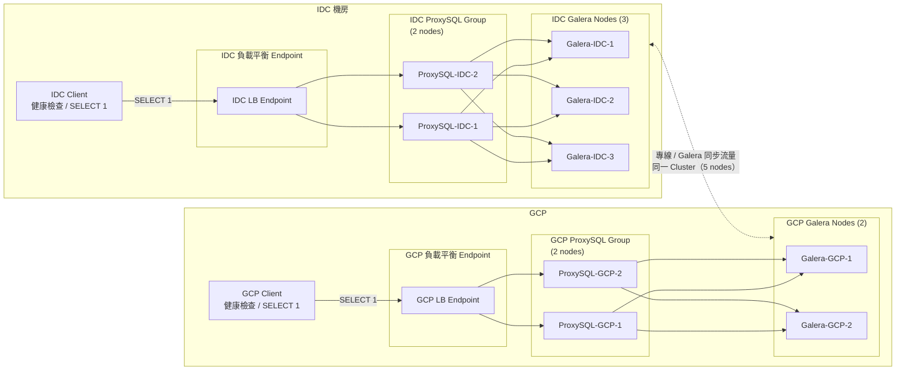
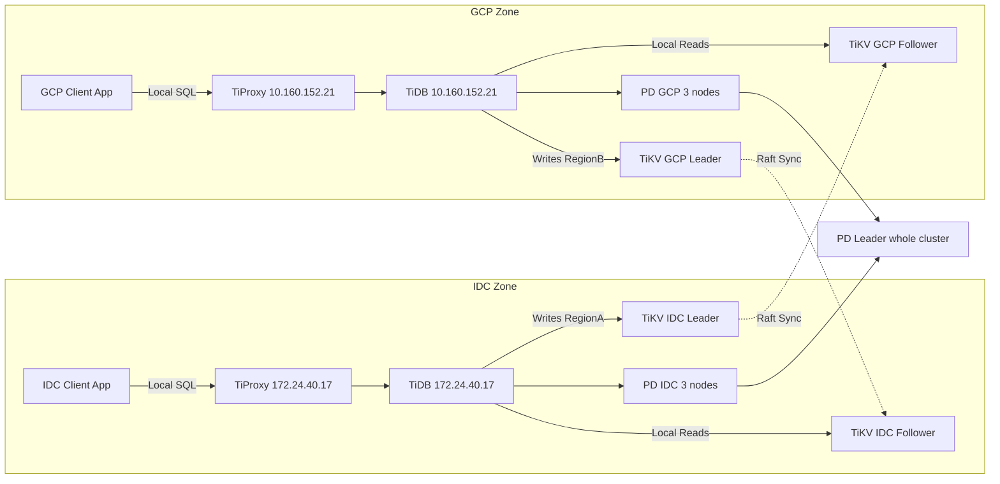
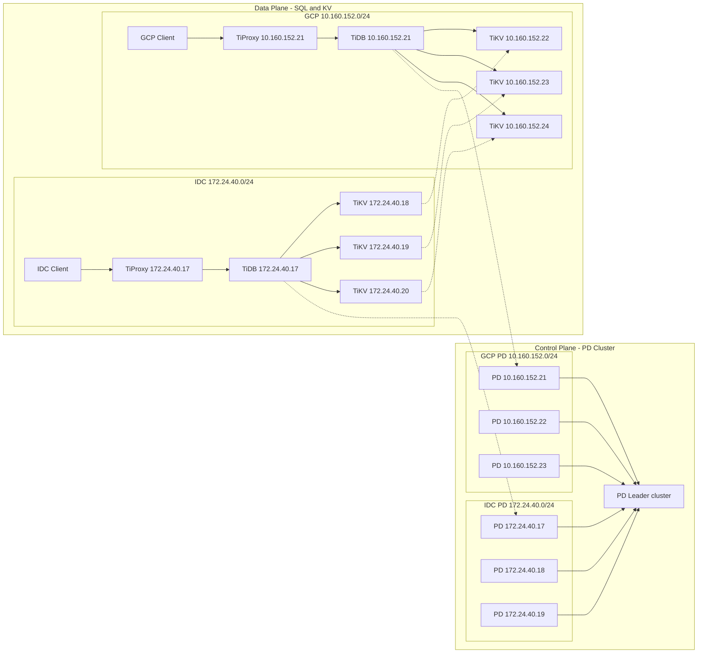
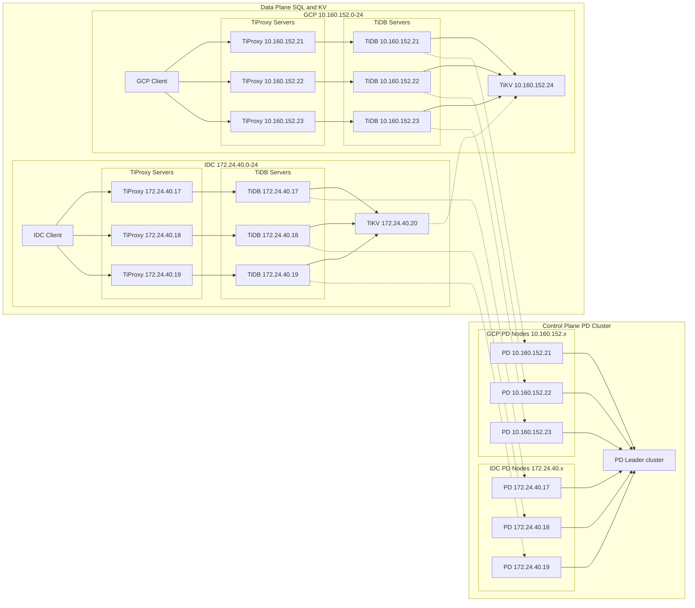

# TiDB Intro for DBA #5-1

----

# RPS 效能對照解析

## TL;DR

- **TiDB 低併發吞吐可比 MySQL 快 +290%**  
- **跨區高併發（500 threads）TiDB 在 GCP 可快 +402%**  
- **同區高併發（GCP Local vs IDC）TiDB 可快 +518%**  
- **TiDB 跨區穩定度高：10〜250 threads 僅 ±1%〜2% 波動**  
- **TiDB Scale-Out 成效顯著，可呈接近線性成長**  
- **MySQL 跨區中併發易掉速（-7%〜-33%）**  

----

# ** 小結 I：效能對照（MySQL vs TiDB）**

## **核心結論**

**TiDB 低併發爆發力強；MySQL 中高併發更穩定。  
當併發提升，TiDB 易受 KV 層排隊限制；MySQL 隨 CPU 放大呈線性增長。**

**MySQL 適合穩態中高併發；TiDB 適合低併發爆量與水平擴展。  
高併發效能想進一步拉伸 → TiDB 必須走 KV Scale-Out，而不是前端 Scale-Up。**

---

## **MySQL 重點**
- **低〜中併發穩定度高**：RPS 一致領先 TiDB（單機 4 vCPU：+31%～+60%）。  
- **中高併發（250〜500）仍保持優勢**：叢集組態下普遍領先 20%～60%。  
- **高併發（1000）偶有邊界提升**：RPS 飆升屬非穩態行為。  
- **整體：Scale-Up + 單區併發 = 表現最佳。**

---

## **TiDB 重點**
- **低併發爆發力極強（+290% 等級）**：特別是 SQL 單入口 + 多 TiKV。  
- **中併發（100）與 MySQL 接近**：前端優勢減弱、轉入穩態。  
- **高併發（250～500）顯著受限**：KV 排隊 / 容量不足 → RPS 最多落後 65%。  
- **超高併發（1000）偶有回彈**：前端可分攤排隊，但不具穩態指標。  
- **整體：短查詢快、高併發需依賴 KV Scale-Out。**

---

## **整體比較**
| 併發區間 | MySQL | TiDB |
|---------|-------|-------|
| **低併發（10/50）** | 稳定領先 | **大幅領先（+290%）** |
| **中併發（100）** | 持平 | 持平 |
| **高併發（250～500）** | **明顯領先** | 受 KV 限制、掉速 |
| **超高併發（1000）** | 不穩態、高低起伏 | 偶有回彈但不穩定 |

----

# ** 小結 II：Scale 策略對照（Scale-Up vs Scale-Out） **

## **核心結論**

**MySQL：Scale-Up 成效最佳。  
TiDB：Scale-Out（尤其 TiKV）效益遠高於 Scale-Up。**

**MySQL 擴充靠硬體；TiDB 擴充靠分散式。  
要提升 TiDB 效能 → 先 Scale-Out TiKV，再談 CPU。**

---

## **MySQL 重點**
- **Scale-Up（4 → 8 vCPU）提升明確**：  
  多數併發區間皆有 +1%〜+37% 的穩健成長。  
- **中高併發更顯著**：250 threads +36.9%。  
- **Scale-Out 價值有限**：  
  複寫 / certification 成本大 → 用於 HA，而非性能。

**結論：MySQL 效能擴展主要靠 Scale-Up。**

---

## **TiDB 重點**
### **1. TiDB-server Scale-Up（SQL 層）**
- 低併發幾乎無效益（+1%〜+3%）。  
- 中高併發才有提升（+11%〜+50%）。  
- **SQL 層不是瓶頸 → CPU 放大效果有限。**

### **2. TiKV Scale-Up / Scale-Out（KV 層）**
- Scale-Up：有幫助但不線性。  
- Scale-Out：**最有效策略，性能可近線性放大**。  
- 高併發差異最明顯：前端多台 TiDB 也不如多 TiKV。

**結論：TiDB 真正的擴展手段是 TiKV Scale-Out。**

---

## **整體比較**
| 策略 | MySQL | TiDB |
|------|--------|--------|
| **Scale-Up** | ★★★★★（主要手段） | ★★☆☆☆（效果有限） |
| **Scale-Out（前端）** | ★☆☆☆☆（非性能） | ★★☆☆☆（僅在高併發有效） |
| **Scale-Out（TiKV）** | 不適用 | ★★★★★（最有效） |

----

# ** 小結 III：跨區受專線影響：IDC vs IDC+GCP vs 跨區併發 **

## **核心結論**
**跨區（IDC+GCP）效能差異與併發表現呈「中併發受損、高併發雲端佔優」的明顯特性。  
MySQL 在跨區時對延遲敏感度更高；TiDB 受架構影響，在高併發時 GCP 端 RPS 明顯勝出。**

## **MySQL 重點**
- **中併發（50–250）易受延遲影響**：常出現 -7%～-33%。  
- **高併發（500+）GCP 明顯優勢**：RPS 可達 +200% 等級。  
- **跨區併發時差異更放大**：GCP 端吞吐可高於 IDC 2～3 倍。  
- **整體偏向單區最佳**；跨區適合 DR，不適合 A-A 性質負載。

## **TiDB 重點**
- **跨區影響極低（10–250 threads）**：大多 ±1%～2%。  
- **高併發（500–1000）GCP 端大幅領先**：可達 +150%～+400%。  
- **跨區併發時負載可自然「傾向」GCP**，整體吞吐更高。  
- **分散式架構吸收延遲**，跨區壓測穩定度優於 MySQL。

## **綜合比較**
| 面向 | MySQL | TiDB |
|------|--------|--------|
| 中併發延遲影響 | 高 | 低 |
| 高併發跨區吞吐 | GCP 優於 IDC | GCP 大幅領先 IDC |
| 跨區可用性 | DR 為主 | 適合跨區承載 |
| A-A 多地多寫 | 不適合 | 適合 |

----

# 數據壓縮比分析

- MySQL：
  - Table size 約 2.14 GB 資料 + 0.15 GB 索引 ≈ 2.29 GB，多為單一 .ibd 檔案。
  - 實際磁碟空間 ~2.3 GB（du /data/mysql/data/sbtest/）。
- TiDB：
  - information_schema 展示 sbtest1 只有 152.6 MB 資料 + 76.3 MB 索引 ≈ 228.9 MB，整個 sbtest schema 也只有 228.9 MB。
  - TiKV/RocksDB 實體檔案分散在多個 SST 檔，總佔用約 2.0 GB（但包含所有 Region 的 metadata 與空間 placeholder）。

## 結論：
TiDB 在 OLTP 表的邏輯佔用率大幅優於 MySQL（約 10:1），來源在於 RocksDB 的列式壓縮與 Region 分片導致的高效儲存；
即便底層資料切割進多個 SST，對應的物理總量仍略小於 MySQL，展現 TiDB 在壓縮比與儲存密度上的優勢，對需要節省容量或加快備份/傳輸的場景特別有利。

----

### 資訊說明
- 指標：以 mysqlslap 的 AVG_QPS 視為 RPS（請求數/秒），工作負載為 `SELECT 1` 健康檢查型查詢。
- 取樣：每組 threads 測試三次取平均（Sample_Count=3）。
- 比對：同併發（threads = 10 ~ 1000）下，對照「單區（IDC/GCP）」與「跨區（IDC+GCP）」RPS，並計算差異%。

### 數據對照表（S1-1：單機 4 vCPU MySQL vs TiDB，mysqlslap SELECT 1）
```
用途：純看「引擎差異」，作為最乾淨 baseline。
```
- 表頭說明
  - 組態 A（#1）：MySQL + ProxySQL，Single Instance，4 vCPU（引擎對照 baseline）
  - 組態 B（#2）：TiDB + TiProxy，Single Instance，4 vCPU（引擎對照）
  - 比較口徑：同一 threads，以 avg_qps 當 RPS；差異%(B 對 A) = (RPS(B) - RPS(A)) / RPS(A) × 100。差異% > 0 代表 B 優於 A。

- 來源
  - A(#1)：MySQL + ProxySQL @ Single Instance with 4 vCPU @ mysqlslap_logs_20251021_132329
  - B(#2)：TiDB + TiProxy @ Single Instance with 4 vCPU @ mysqlslap_logs_20251021_133658

- 欄位
  - threads | RPS(A) MySQL | RPS(B) TiDB | 差異%(B 對 A)

| threads | RPS(A) MySQL | RPS(B) TiDB | 差異%(B 對 A) |
| ------- | ------------- | ----------- | -------------- |
| 10      | 22394.74      | 15395.67    | -31.3%         |
| 50      | 51212.02      | 23433.84    | -54.2%         |
| 100     | 57066.77      | 22627.85    | -60.3%         |
| 250     | 50200.80      | 21792.82    | -56.6%         |
| 500     | 19118.02      | 20781.38    | +8.7%          |
| 1000    | 13079.87      | 19677.29    | +50.4%         |

- 快速解讀
  - 低～中併發（10/50/100/250）：B 相較 A 下降約 31%～60%，顯示同為單機 4 vCPU 時，TiDB+TiProxy 在超短查詢上固定開銷較高。
  - 高併發（500/1000）：B 相較 A 提升約 +8.7% / +50.4%，顯示在極高併發下，TiDB+TiProxy 的連線/排隊處理能維持吞吐；此區間屬邊界，需搭配連線池/IRQ/網路參數評估穩態性。

----

## S1-2 IDC MySQL Cluster vs IDC TiDB Cluster（4 vCPU）
```
用途：比較「單機 → 小型 Cluster」後，MySQL 集群 vs TiDB 分散式架構。
```
### 數據對照表（S1-2A：IDC 4 vCPU MySQL Cluster vs TiDB Cluster #1，mysqlslap SELECT 1）

- 表頭說明
  - 組態 A（#1）：MySQL + ProxySQL，IDC Cluster，4 vCPU（單 SQL 入口）
  - 組態 B（#2）：TiDB + TiProxy，IDC Cluster，4 vCPU（SQL 單入口 + 多 TiKV）
  - 比較口徑：同一 threads，以 avg_qps 當 RPS；差異%(B 對 A) = (RPS(B) - RPS(A)) / RPS(A) × 100（>0 代表 B 優於 A）。

- 來源
  - A(#1)：MySQL + ProxySQL @ IDC Cluster with 4 vCPU @ mysqlslap_logs_20251022_160800
  - B(#2)：TiDB + TiProxy @ IDC Cluster with 4 vCPU #1 @ mysqlslap_logs_20251027_092815

- 欄位
  - threads | RPS(A) MySQL | RPS(B) TiDB | 差異%(B 對 A)

| threads | RPS(A) MySQL | RPS(B) TiDB | 差異%(B 對 A) |
| ------- | ------------- | ----------- | -------------- |
| 10      | 24664.97      | 96774.19    | +292.4%        |
| 50      | 72481.28      | 95026.92    | +31.1%         |
| 100     | 92307.69      | 91547.15    | -0.8%          |
| 250     | 50821.62      | 39719.32    | -21.8%         |
| 500     | 27614.14      | 10192.99    | -63.1%         |
| 1000    | 6944.28       | 8306.57     | +19.6%         |

- 快速解讀
  - 低～中併發（10/50）：B 明顯優於 A（+292% / +31%），TiDB 前端在短查詢下可快速處理。
  - 中併發（100）：兩者接近（-0.8%），差距不大。
  - 高併發（≥250）：A 優勢擴大（-21.8% / -63.1%），B 在 1000 時回升（+19.6%）；顯示 TiDB 在高併發下受前端/排隊與資源配置影響，需配合池化/連線上限/IRQ/網路調優。

### 數據對照表（S1-2B：IDC 4 vCPU MySQL Cluster vs TiDB Cluster #2，mysqlslap SELECT 1）

- 表頭說明
  - 組態 A（#1）：MySQL + ProxySQL，IDC Cluster，4 vCPU
  - 組態 B（#2）：TiDB + TiProxy，IDC Cluster，4 vCPU（SQL 層多入口，KV 層集中）
  - 比較口徑：同一 threads，以 avg_qps 當 RPS；差異%(B 對 A) = (RPS(B) - RPS(A)) / RPS(A) × 100（>0 代表 B 優於 A）。

- 來源
  - A(#1)：MySQL + ProxySQL @ IDC Cluster with 4 vCPU @ mysqlslap_logs_20251022_160800
  - B(#2)：TiDB + TiProxy @ IDC Cluster with 4 vCPU #2 @ mysqlslap_logs_20251027_102800

- 欄位
  - threads | RPS(A) MySQL | RPS(B) TiDB | 差異%(B 對 A)

| threads | RPS(A) MySQL | RPS(B) TiDB | 差異%(B 對 A) |
| ------- | ------------- | ----------- | -------------- |
| 10      | 24664.97      | 97339.39    | +294.7%        |
| 50      | 72481.28      | 96556.16    | +33.3%         |
| 100     | 92307.69      | 48076.92    | -47.9%         |
| 250     | 50821.62      | 35979.85    | -29.2%         |
| 500     | 27614.14      | 9555.66     | -65.4%         |
| 1000    | 6944.28       | 7699.22     | +10.9%         |

- 快速解讀
  - 低併發（10/50）：B 明顯優於 A（+295% / +33%），多入口對短查詢具優勢。
  - 100～500：B 明顯落後（-48% ～ -65%），顯示 KV 層集中（僅 1 節點）成為瓶頸，前端多入口無法彌補後端容量不足。
  - 1000：B 小幅回升（+10.9%），屬高併發邊界行為，需搭配連線池/IRQ/網路參數調校評估穩態性。

----

## S1-3 IDC MySQL Cluster vs IDC TiDB Cluster（8 vCPU）
```
用途：同拓樸升到 8 vCPU，看資源放大後的延伸表現與「差異%」。
```

### 數據對照表（S1-3A：IDC 8 vCPU MySQL Cluster vs TiDB Cluster #1，mysqlslap SELECT 1）

- 表頭說明
  - 組態 A（#1）：MySQL + ProxySQL，IDC Cluster，8 vCPU（SQL 單入口）
  - 組態 B（#2）：TiDB + TiProxy，IDC Cluster，8 vCPU（SQL 單入口 + 多 TiKV 節點）
  - 比較口徑：同一 threads，以 avg_qps 當 RPS；差異%(B 對 A) = (RPS(B) - RPS(A)) / RPS(A) × 100（>0 代表 B 優於 A）。

- 來源
  - A(#1)：MySQL + ProxySQL @ IDC Cluster with 8 vCPU @ mysqlslap_logs_20251027_135223
  - B(#2)：TiDB + TiProxy @ IDC Cluster with 8 vCPU #1 @ mysqlslap_logs_20251027_155357

- 欄位
  - threads | RPS(A) MySQL | RPS(B) TiDB | 差異%(B 對 A)

| threads | RPS(A) MySQL | RPS(B) TiDB | 差異%(B 對 A) |
| ------- | ------------- | ----------- | -------------- |
| 10      | 24962.56      | 97560.98    | +291.0%        |
| 50      | 84080.72      | 96587.25    | +14.9%         |
| 100     | 99272.01      | 94132.41    | -5.2%          |
| 250     | 69573.28      | 46977.76    | -32.5%         |
| 500     | 24785.19      | 11862.40    | -52.1%         |
| 1000    | 10648.12      | 7773.63     | -27.0%         |

- 快速解讀
  - 低併發（10）：B 大幅優於 A（+291%），顯示 TiDB 前端在超短查詢下處理效率高。
  - 中併發（50/100）：50 時 B 略優（+14.9%），100 時 A 略優（-5.2%），兩者接近。
  - 高併發（≥250）：A 優勢擴大（-32.5% / -52.1% / -27.0%），B 在高並發下受前端/排隊與資源配置影響更明顯，需配合池化/連線上限/IRQ/網路調優。

### 數據對照表（S1-3B：IDC 8 vCPU MySQL Cluster vs TiDB Cluster #2，mysqlslap SELECT 1）

- 表頭說明
  - 組態 A（#1）：MySQL + ProxySQL，IDC Cluster，8 vCPU
  - 組態 B（#2）：TiDB + TiProxy，IDC Cluster，8 vCPU（SQL 層多入口，KV 層集中）
  - 比較口徑：同一 threads，以 avg_qps 當 RPS；差異%(B 對 A) = (RPS(B) - RPS(A)) / RPS(A) × 100（>0 代表 B 優於 A）。

- 來源
  - A(#1)：MySQL + ProxySQL @ IDC Cluster with 8 vCPU @ mysqlslap_logs_20251027_135223
  - B(#2)：TiDB + TiProxy @ IDC Cluster with 8 vCPU #2 @ mysqlslap_logs_20251027_154712

- 欄位
  - threads | RPS(A) MySQL | RPS(B) TiDB | 差異%(B 對 A)

| threads | RPS(A) MySQL | RPS(B) TiDB | 差異%(B 對 A) |
| ------- | ------------- | ----------- | -------------- |
| 10      | 24962.56      | 97560.98    | +291.0%        |
| 50      | 84080.72      | 72797.86    | -13.4%         |
| 100     | 99272.01      | 72236.94    | -27.2%         |
| 250     | 69573.28      | 35928.14    | -48.4%         |
| 500     | 24785.19      | 10588.73    | -57.3%         |
| 1000    | 10648.12      | 9223.67     | -13.4%         |

- 快速解讀
  - 低併發（10）：B 大幅優於 A（+291%），短查詢下 TiDB 前端處理速度高。
  - 中併發（50/100）：B 落後（-13% / -27%），顯示 KV 層集中限制吞吐。
  - 高併發（≥250）：A 優勢明顯擴大（-48% / -57% / -13%），B 在 1000 時仍低於 A；需優先擴充/分散 TiKV 或調整前後端資源配比與池化參數。

----

## Scale 策略對照（Scale-Up vs Scale-Out）

### 數據對照表（S2-1：MySQL Scale-Up 4 vCPU → 8 vCPU，mysqlslap SELECT 1）
```
用途：同拓樸、只放大 vCPU，看 Scale-Up 成效。
```
- 表頭說明
  - 組態 A（#1）：MySQL + ProxySQL，IDC Cluster，4 vCPU
  - 組態 B（#2）：MySQL + ProxySQL，IDC Cluster，8 vCPU（Scale-Up）
  - 比較口徑：同一 threads，以 avg_qps 當 RPS；差異%(B 對 A) = (RPS(B) - RPS(A)) / RPS(A) × 100（>0 代表 8 vCPU 優於 4 vCPU）。

- 來源
  - A(#1)：MySQL + ProxySQL @ IDC Cluster with 4 vCPU @ mysqlslap_logs_20251022_160800
  - B(#2)：MySQL + ProxySQL @ IDC Cluster with 8 vCPU @ mysqlslap_logs_20251027_135223

- 欄位
  - threads | RPS(A) 4vCPU | RPS(B) 8vCPU | 差異%(B 對 A)

| threads | RPS(A) 4vCPU | RPS(B) 8vCPU | 差異%(B 對 A) |
| ------- | ------------- | ------------- | -------------- |
| 10      | 24664.97      | 24962.56      | +1.2%          |
| 50      | 72481.28      | 84080.72      | +16.0%         |
| 100     | 92307.69      | 99272.01      | +7.5%          |
| 250     | 50821.62      | 69573.28      | +36.9%         |
| 500     | 27614.14      | 24785.19      | -10.2%         |
| 1000    | 6944.28       | 10648.12      | +53.3%         |

- 快速解讀
  - 低～中併發（10/50/100）：8 vCPU 提升 +1%～+16%，增幅穩健。
  - 中高併發（250）：8 vCPU 提升 +36.9%，Scale-Up 成效明顯。
  - 高併發（500/1000）：500 出現 -10.2% 回落、1000 大幅上升 +53.3%（屬邊界行為），顯示在不同併發下可能受連線池、backlog、IRQ/網路參數等配置影響；建議檢查並調整以穩定高併發表現。

### 數據對照表（S2-2A：TiDB Scale-Up（單 TiDB + 多 TiKV），4 vCPU → 8 vCPU，mysqlslap SELECT 1）

- 表頭說明
  - 組態 A（#1）：TiDB + TiProxy，IDC Cluster，4 vCPU（單 TiDB + 多 TiKV）
  - 組態 B（#2）：TiDB + TiProxy，IDC Cluster，8 vCPU（單 TiDB + 多 TiKV，Scale-Up）
  - 比較口徑：同一 threads，以 avg_qps 當 RPS；差異%(B 對 A) = (RPS(B) - RPS(A)) / RPS(A) × 100（>0 代表 8 vCPU 優於 4 vCPU）。

- 來源
  - A(#1)：TiDB + TiProxy @ IDC Cluster with 4 vCPU #1 @ mysqlslap_logs_20251027_092815
  - B(#2)：TiDB + TiProxy @ IDC Cluster with 8 vCPU #1 @ mysqlslap_logs_20251027_155357

- 欄位
  - threads | RPS(A) 4vCPU | RPS(B) 8vCPU | 差異%(B 對 A)

| threads | RPS(A) 4vCPU | RPS(B) 8vCPU | 差異%(B 對 A) |
| ------- | ------------- | ------------- | -------------- |
| 10      | 96774.19      | 97560.98      | +0.8%          |
| 50      | 95026.92      | 96587.25      | +1.6%          |
| 100     | 91547.15      | 94132.41      | +2.8%          |
| 250     | 39719.32      | 46977.76      | +18.3%         |
| 500     | 10192.99      | 11862.40      | +16.4%         |
| 1000    | 8306.57       | 7773.63       | -6.4%          |

- 快速解讀
  - 低～中併發（10/50/100）：8 vCPU 提升幅度小（+0.8%～+2.8%），短查詢瓶頸不在 CPU。
  - 中高併發（250/500）：8 vCPU 有感提升（+18.3% / +16.4%），顯示多核心能分攤排隊/中斷成本。
  - 高併發（1000）：出現 -6.4% 回落（邊界行為），需校正連線池、FD/backlog、RSS/RPS/irqbalance 與 MTU 等設定。

### 數據對照表（S2-2B：TiDB Scale-Up（多 TiDB + 單 TiKV），4 vCPU → 8 vCPU，mysqlslap SELECT 1）

- 表頭說明
  - 組態 A（#1）：TiDB + TiProxy，IDC Cluster，4 vCPU（多 TiDB + 單 TiKV）
  - 組態 B（#2）：TiDB + TiProxy，IDC Cluster，8 vCPU（多 TiDB + 單 TiKV，Scale-Up）
  - 比較口徑：同一 threads，以 avg_qps 當 RPS；差異%(B 對 A) = (RPS(B) - RPS(A)) / RPS(A) × 100（>0 代表 8 vCPU 優於 4 vCPU）。

- 來源
  - A(#1)：TiDB + TiProxy @ IDC Cluster with 4 vCPU #2 @ mysqlslap_logs_20251027_102800
  - B(#2)：TiDB + TiProxy @ IDC Cluster with 8 vCPU #2 @ mysqlslap_logs_20251027_154712

- 欄位
  - threads | RPS(A) 4vCPU | RPS(B) 8vCPU | 差異%(B 對 A)

| threads | RPS(A) 4vCPU | RPS(B) 8vCPU | 差異%(B 對 A) |
| ------- | ------------- | ------------- | -------------- |
| 10      | 97339.39      | 97560.98      | +0.2%          |
| 50      | 96556.16      | 72797.86      | -24.6%         |
| 100     | 48076.92      | 72236.94      | +50.2%         |
| 250     | 35979.85      | 35928.14      | -0.1%          |
| 500     | 9555.66       | 10588.73      | +10.8%         |
| 1000    | 7699.22       | 9223.67       | +19.8%         |

- 快速解讀
  - 10：基本持平（+0.2%）。
  - 50：8 vCPU 低於 4 vCPU（-24.6%），疑似資源/池化參數未同步調整（例如前端/後端連線上限、排程、IRQ/網路）。
  - 100/500/1000：8 vCPU 提升（+50.2% / +10.8% / +19.8%）；250 持平（-0.1%）。整體顯示 Scale-Up 在較高併發下開始帶來可見效益。

### 數據對照表（S2-3A：TiDB Scale-Out（4 vCPU，SQL-heavy vs KV-heavy），mysqlslap SELECT 1）

- 表頭說明
  - 組態 A（#1，KV-heavy）：TiDB + TiProxy，IDC Cluster，4 vCPU（單 TiDB + 多 TiKV）
  - 組態 B（#2，SQL-heavy）：TiDB + TiProxy，IDC Cluster，4 vCPU（多 TiDB + 單 TiKV）
  - 比較口徑：同一 threads，以 avg_qps 當 RPS；差異%(B 對 A) = (RPS(B) - RPS(A)) / RPS(A) × 100（>0 代表 SQL-heavy 優於 KV-heavy）。

- 來源
  - A(#1)：TiDB + TiProxy @ IDC Cluster with 4 vCPU #1 @ mysqlslap_logs_20251027_092815
  - B(#2)：TiDB + TiProxy @ IDC Cluster with 4 vCPU #2 @ mysqlslap_logs_20251027_102800

- 欄位
  - threads | RPS(A) KV-heavy | RPS(B) SQL-heavy | 差異%(B 對 A)

| threads | RPS(A) KV-heavy | RPS(B) SQL-heavy | 差異%(B 對 A) |
| ------- | ---------------- | ---------------- | -------------- |
| 10      | 96774.19         | 97339.39         | +0.6%          |
| 50      | 95026.92         | 96556.16         | +1.6%          |
| 100     | 91547.15         | 48076.92         | -47.5%         |
| 250     | 39719.32         | 35979.85         | -9.4%          |
| 500     | 10192.99         | 9555.66          | -6.2%          |
| 1000    | 8306.57          | 7699.22          | -7.3%          |

- 快速解讀
  - 10/50：SQL-heavy 略優（+0.6% / +1.6%），差異小。
  - 100：SQL-heavy 明顯落後（-47.5%），單 TiKV 容量/排隊成瓶頸。
  - 250/500/1000：SQL-heavy 一路落後（-9% ～ -7%），KV-heavy 在較高併發下更穩定；同為 4 vCPU 時，KV-heavy 組態對 SELECT 1 的穩態 RPS 較友善。

### 數據對照表（S2-3B：TiDB Scale-Out（8 vCPU，SQL-heavy vs KV-heavy），mysqlslap SELECT 1）

- 表頭說明
  - 組態 A（#1，KV-heavy）：TiDB + TiProxy，IDC Cluster，8 vCPU（單 TiDB + 多 TiKV）
  - 組態 B（#2，SQL-heavy）：TiDB + TiProxy，IDC Cluster，8 vCPU（多 TiDB + 單 TiKV）
  - 比較口徑：同一 threads，以 avg_qps 當 RPS；差異%(B 對 A) = (RPS(B) - RPS(A)) / RPS(A) × 100（>0 代表 SQL-heavy 優於 KV-heavy）。

- 來源
  - A(#1)：TiDB + TiProxy @ IDC Cluster with 8 vCPU #1 @ mysqlslap_logs_20251027_155357
  - B(#2)：TiDB + TiProxy @ IDC Cluster with 8 vCPU #2 @ mysqlslap_logs_20251027_154712

- 欄位
  - threads | RPS(A) KV-heavy | RPS(B) SQL-heavy | 差異%(B 對 A)

| threads | RPS(A) KV-heavy | RPS(B) SQL-heavy | 差異%(B 對 A) |
| ------- | ---------------- | ---------------- | -------------- |
| 10      | 97560.98         | 97560.98         | +0.0%          |
| 50      | 96587.25         | 72797.86         | -24.6%         |
| 100     | 94132.41         | 72236.94         | -23.2%         |
| 250     | 46977.76         | 35928.14         | -23.5%         |
| 500     | 11862.40         | 10588.73         | -10.7%         |
| 1000    | 7773.63          | 9223.67          | +18.7%         |

- 快速解讀
  - 50～250：SQL-heavy 明顯落後（-25% 左右），單 TiKV 容量/排隊限制吞吐；KV-heavy 更穩定。
  - 1000：SQL-heavy 反超（+18.7%），多前端在極高併發下可攤平連線/排隊；屬邊界行為，需聯動連線池/IRQ/網路等參數評估。

----

## 跨區影響（4 vCPU）：IDC vs IDC+GCP vs 跨區併發

## S3-1 MySQL 4 vCPU：IDC Only vs IDC+GCP

### 數據對照表（S3-1-1：MySQL 4 vCPU — 在 IDC 壓測：加掛 GCP 區對本地效能影響，mysqlslap SELECT 1）

- 表頭說明
  - 組態 A（#1，IDC Only）：MySQL + ProxySQL，IDC Cluster，4 vCPU
  - 組態 B（#2，IDC+GCP 測於 IDC）：MySQL + ProxySQL，IDC+GCP Cluster，4 vCPU（測試端 172.24.40.16）
  - 比較口徑：同一 threads，以 avg_qps 當 RPS；差異%(B 對 A) = (RPS(B) − RPS(A)) / RPS(A) × 100（>0 代表加掛 GCP 後於 IDC 側更佳）。

- 來源
  - A(#1)：MySQL + ProxySQL @ IDC Cluster with 4 vCPU @ mysqlslap_logs_20251022_160800
  - B(#2)：MySQL + ProxySQL @ IDC + GCP Cluster with 4 vCPU @ mysqlslap_logs_20251112_141836（172.24.40.16）

- 欄位
  - threads | RPS(A) IDC | RPS(B) IDC+GCP(測IDC) | 差異%(B 對 A)

| threads | RPS(A) IDC | RPS(B) IDC+GCP(測IDC) | 差異%(B 對 A) |
| ------- | ---------- | ---------------------- | -------------- |
| 10      | 24664.97   | 27027.03               | +9.6%          |
| 50      | 72481.28   | 79449.15               | +9.6%          |
| 100     | 92307.69   | 94398.99               | +3.0%          |
| 250     | 50821.62   | 52984.81               | +4.3%          |
| 500     | 27614.14   | 27688.05               | +0.3%          |
| 1000    | 6944.28    | 9201.04                | +32.5%         |

- 快速解讀
  - 10～250：加掛 GCP 後（測在 IDC）RPS 小幅提升約 +3%～+10%（可能受路徑優化/LB 設定或抖動差異影響）。
  - 500：幾乎持平（+0.3%）。
  - 1000：B 明顯高於 A（+32.5%），屬高併發邊界行為，需結合連線池/IRQ/網路與抖動觀察驗證穩態性。

### 數據對照表（S3-1-2：MySQL 4 vCPU — 同一 Cluster 下 IDC vs GCP Local，mysqlslap SELECT 1）

- 表頭說明
  - 組態 A（#1，IDC Local）：MySQL + ProxySQL，IDC+GCP Cluster，4 vCPU（測試端 172.24.40.16）
  - 組態 B（#2，GCP Local）：MySQL + ProxySQL，IDC+GCP Cluster，4 vCPU（測試端 10.160.152.14）
  - 比較口徑：同一 threads，以 avg_qps 當 RPS；差異%(B 對 A) = (RPS(B) − RPS(A)) / RPS(A) × 100（>0 代表 GCP Local 優於 IDC Local）。

- 來源
  - A(#1)：MySQL + ProxySQL @ IDC + GCP Cluster with 4 vCPU @ mysqlslap_logs_20251112_141836（172.24.40.16）
  - B(#2)：MySQL + ProxySQL @ IDC + GCP Cluster with 4 vCPU @ mysqlslap_logs_20251112_142110（10.160.152.14）

- 欄位
  - threads | RPS(A) IDC Local | RPS(B) GCP Local | 差異%(B 對 A)

| threads | RPS(A) IDC Local | RPS(B) GCP Local | 差異%(B 對 A) |
| ------- | ----------------- | ---------------- | -------------- |
| 10      | 27027.03          | 32289.31         | +19.5%         |
| 50      | 79449.15          | 73655.78         | -7.3%          |
| 100     | 94398.99          | 68259.39         | -27.7%         |
| 250     | 52984.81          | 50985.72         | -3.8%          |
| 500     | 27688.05          | 35790.98         | +29.2%         |
| 1000    | 9201.04           | 26824.03         | +191.5%        |

- 快速解讀
  - 10/500/1000：GCP Local 高於 IDC Local（+19.5% / +29.2% / +191.5%），高併發尤為明顯，可能與雲端主機網卡/IRQ/路徑差異有關。
  - 50/100/250：GCP Local 低於 IDC Local（-7.3% / -27.7% / -3.8%），中併發區間 IDC Local 較佳。

### 數據對照表（S3-1-3：MySQL 4 vCPU — IDC+GCP 共同壓測：跨區併發，mysqlslap SELECT 1）

- 表頭說明
  - 組態 A（#1，跨區併發@IDC）：MySQL + ProxySQL，IDC+GCP Cluster，4 vCPU（測試端 172.24.40.16）
  - 組態 B（#2，跨區併發@GCP）：MySQL + ProxySQL，IDC+GCP Cluster，4 vCPU（測試端 10.160.152.14）
  - 比較口徑：同一 threads，以 avg_qps 當 RPS；差異%(B 對 A) = (RPS(B) − RPS(A)) / RPS(A) × 100（>0 代表 GCP 端優於 IDC 端）。

- 來源
  - A(#1)：MySQL + ProxySQL @ IDC + GCP Cluster with 4 vCPU @ mysqlslap_logs_20251112_142529（172.24.40.16）
  - B(#2)：MySQL + ProxySQL @ IDC + GCP Cluster with 4 vCPU @ mysqlslap_logs_20251112_142528（10.160.152.14）

- 欄位
  - threads | RPS(A) 跨區@IDC | RPS(B) 跨區@GCP | 差異%(B 對 A)

| threads | RPS(A) 跨區@IDC | RPS(B) 跨區@GCP | 差異%(B 對 A) |
| ------- | ---------------- | ---------------- | -------------- |
| 10      | 25462.57         | 30937.40         | +21.5%         |
| 50      | 77559.46         | 62643.56         | -19.2%         |
| 100     | 94696.97         | 62866.72         | -33.6%         |
| 250     | 57926.24         | 46649.04         | -19.5%         |
| 500     | 25737.82         | 31928.48         | +24.1%         |
| 1000    | 11687.25         | 25027.11         | +114.2%        |

- 快速解讀
  - 10/500/1000：GCP 端高於 IDC 端（+21.5% / +24.1% / +114.2%），高併發差距擴大。
  - 50/100/250：GCP 端低於 IDC 端（-19.2% / -33.6% / -19.5%），在中等並發下 IDC 端更佳。

## S3-2 TiDB 4 vCPU：IDC Only vs IDC+GCP（先做 4vCPU #1）

### 數據對照表（S3-2-1：TiDB 4 vCPU #1 — IDC Only vs IDC+GCP（在 IDC 壓測），mysqlslap SELECT 1）

- 表頭說明
  - 組態 A（#1，IDC Only）：TiDB + TiProxy，IDC Cluster，4 vCPU #1
  - 組態 B（#2，IDC+GCP 測於 IDC）：TiDB + TiProxy，IDC+GCP Cluster，4 vCPU #1（測試端 172.24.40.25）
  - 比較口徑：同一 threads，以 avg_qps 當 RPS；差異%(B 對 A) = (RPS(B) − RPS(A)) / RPS(A) × 100（>0 代表加掛 GCP 後於 IDC 側更佳）。

- 來源
  - A(#1)：TiDB + TiProxy @ IDC Cluster with 4 vCPU #1 @ mysqlslap_logs_20251027_092815
  - B(#2)：TiDB + TiProxy @ IDC + GCP Cluster with 4 #1 vCPU @ mysqlslap_logs_20251107_155527（172.24.40.25）

- 欄位
  - threads | RPS(A) IDC | RPS(B) IDC+GCP(測IDC) | 差異%(B 對 A)

| threads | RPS(A) IDC | RPS(B) IDC+GCP(測IDC) | 差異%(B 對 A) |
| ------- | ---------- | ---------------------- | -------------- |
| 10      | 96774.19   | 97370.98               | +0.6%          |
| 50      | 95026.92   | 95298.60               | +0.3%          |
| 100     | 91547.15   | 93691.44               | +2.3%          |
| 250     | 39719.32   | 40360.55               | +1.6%          |
| 500     | 10192.99   | 11869.91               | +16.4%         |
| 1000    | 8306.57    | 8328.01                | +0.3%          |

- 快速解讀
  - 10/50/100/250：加掛 GCP 後（測在 IDC）RPS 微幅提升（+0.3%～+2.3%）。
  - 500：提升顯著（+16.4%），可能與連線池/網卡/路徑在跨區組態下表現更佳有關。
  - 1000：近似持平（+0.3%），高併發屬邊界點，建議觀察抖動與資源配置。

### 數據對照表（S3-2-2：TiDB 4 vCPU #1 — 同一 Cluster 下 IDC vs GCP Local，mysqlslap SELECT 1）

- 表頭說明
  - 組態 A（#1，IDC Local）：TiDB + TiProxy，IDC+GCP Cluster，4 vCPU #1（測試端 172.24.40.25）
  - 組態 B（#2，GCP Local）：TiDB + TiProxy，IDC+GCP Cluster，4 vCPU #1（測試端 10.160.152.26）
  - 比較口徑：同一 threads，以 avg_qps 當 RPS；差異%(B 對 A) = (RPS(B) − RPS(A)) / RPS(A) × 100（>0 代表 GCP Local 優於 IDC Local）。

- 來源
  - A(#1)：TiDB + TiProxy @ IDC + GCP Cluster with 4 #1 vCPU @ mysqlslap_logs_20251107_155527（172.24.40.25）
  - B(#2)：TiDB + TiProxy @ IDC + GCP Cluster with 4 #1 vCPU @ mysqlslap_logs_20251107_155651（10.160.152.26）

- 欄位
  - threads | RPS(A) IDC Local | RPS(B) GCP Local | 差異%(B 對 A)

| threads | RPS(A) IDC Local | RPS(B) GCP Local | 差異%(B 對 A) |
| ------- | ----------------- | ---------------- | -------------- |
| 10      | 97370.98          | 97815.45         | +0.5%          |
| 50      | 95298.60          | 95268.34         | -0.0%          |
| 100     | 93691.44          | 92137.59         | -1.7%          |
| 250     | 40360.55          | 86083.21         | +113.3%        |
| 500     | 11869.91          | 42589.44         | +258.8%        |
| 1000    | 8328.01           | 21553.27         | +158.8%        |

- 快速解讀
  - 10/50/100：兩地近似（±2%）；
  - 250/500/1000：GCP Local 顯著高於 IDC Local（+113%/+259%/+159%），顯示在更高併發下雲端網卡/IRQ/路徑能維持更高吞吐；屬高併發邊界，建議結合系統與網路觀測評估穩態性。

### 數據對照表（S3-2-3：TiDB 4 vCPU #1 — IDC+GCP 共同壓測（跨區併發），mysqlslap SELECT 1）

- 表頭說明
  - 組態 A（#1，跨區併發@IDC）：TiDB + TiProxy，IDC+GCP Cluster，4 vCPU #1（測試端 172.24.40.25）
  - 組態 B（#2，跨區併發@GCP）：TiDB + TiProxy，IDC+GCP Cluster，4 vCPU #1（測試端 10.160.152.26）
  - 比較口徑：同一 threads，以 avg_qps 當 RPS；差異%(B 對 A) = (RPS(B) − RPS(A)) / RPS(A) × 100（>0 代表 GCP 端優於 IDC 端）。

- 來源
  - A(#1)：TiDB + TiProxy @ IDC + GCP Cluster with 4 #1 vCPU @ mysqlslap_logs_20251107_155932（172.24.40.25）
  - B(#2)：TiDB + TiProxy @ IDC + GCP Cluster with 4 #1 vCPU @ mysqlslap_logs_20251107_155933（10.160.152.26）

- 欄位
  - threads | RPS(A) 跨區@IDC | RPS(B) 跨區@GCP | 差異%(B 對 A)

| threads | RPS(A) 跨區@IDC | RPS(B) 跨區@GCP | 差異%(B 對 A) |
| ------- | ---------------- | ---------------- | -------------- |
| 10      | 97276.26         | 97751.71         | +0.5%          |
| 50      | 95147.48         | 95268.34         | +0.1%          |
| 100     | 93370.68         | 92478.42         | -1.0%          |
| 250     | 46490.00         | 85372.79         | +83.6%         |
| 500     | 8687.34          | 43649.06         | +402.4%        |
| 1000    | 8417.74          | 21226.92         | +152.2%        |

- 快速解讀
  - 10/50/100：兩端近似（±1% 內）。
  - 250/500/1000：GCP 端顯著高於 IDC 端（+83.6% / +402.4% / +152.2%），跨區併發下雲端側在高併發的吞吐更佳；屬邊界行為，建議結合網卡/IRQ/路徑與池化參數持續觀測。


## 跨區影響（8 vCPU）：IDC vs IDC+GCP vs 跨區併發

## S4-1 MySQL 8 vCPU

### 數據對照表（S4-1-1：MySQL 8 vCPU — IDC Only vs IDC+GCP（在 IDC 壓測），mysqlslap SELECT 1）

- 表頭說明
  - 組態 A（#1，IDC Only）：MySQL + ProxySQL，IDC Cluster，8 vCPU
  - 組態 B（#2，IDC+GCP 測於 IDC）：MySQL + ProxySQL，IDC+GCP Cluster，8 vCPU（測試端 172.24.40.16）
  - 比較口徑：同一 threads，以 avg_qps 當 RPS；差異%(B 對 A) = (RPS(B) − RPS(A)) / RPS(A) × 100（>0 代表加掛 GCP 後於 IDC 側更佳）。

- 來源
  - A(#1)：MySQL + ProxySQL @ IDC Cluster with 8 vCPU @ mysqlslap_logs_20251027_135223
  - B(#2)：MySQL + ProxySQL @ IDC + GCP Cluster with 8 vCPU @ mysqlslap_logs_20251111_154136（172.24.40.16）

- 欄位
  - threads | RPS(A) IDC | RPS(B) IDC+GCP(測IDC) | 差異%(B 對 A)

| threads | RPS(A) IDC | RPS(B) IDC+GCP(測IDC) | 差異%(B 對 A) |
| ------- | ---------- | ---------------------- | -------------- |
| 10      | 24962.56   | 27901.79               | +11.8%         |
| 50      | 84080.72   | 90661.83               | +7.8%          |
| 100     | 99272.01   | 108892.92              | +9.7%          |
| 250     | 69573.28   | 54864.67               | -21.2%         |
| 500     | 24785.19   | 29354.21               | +18.5%         |
| 1000    | 10648.12   | 12247.90               | +15.0%         |

- 快速解讀
  - 10/50/100：加掛 GCP 後（測在 IDC）RPS 提升 +7%～+12%。
  - 250：下降 -21.2%，可能與跨區路徑/排隊配置影響在此併發點較明顯。
  - 500/1000：提升 +18.5% / +15.0%，高併發下仍見增益；建議結合連線池/IRQ/網路參數持續驗證穩態性。

### 數據對照表（S4-1-2：MySQL 8 vCPU — IDC+GCP（IDC vs GCP 壓測），mysqlslap SELECT 1）

- 表頭說明
  - 組態 A（#1，IDC Local）：MySQL + ProxySQL，IDC+GCP Cluster，8 vCPU（測試端 172.24.40.16）
  - 組態 B（#2，GCP Local）：MySQL + ProxySQL，IDC+GCP Cluster，8 vCPU（測試端 10.160.152.14）
  - 比較口徑：同一 threads，以 avg_qps 當 RPS；差異%(B 對 A) = (RPS(B) − RPS(A)) / RPS(A) × 100（>0 代表 GCP Local 優於 IDC Local）。

- 來源
  - A(#1)：MySQL + ProxySQL @ IDC + GCP Cluster with 8 vCPU @ mysqlslap_logs_20251111_154136
  - B(#2)：MySQL + ProxySQL @ IDC + GCP Cluster with 8 vCPU @ mysqlslap_logs_20251111_154829

- 欄位
  - threads | RPS(A) IDC Local | RPS(B) GCP Local | 差異%(B 對 A)

| threads | RPS(A) IDC Local | RPS(B) GCP Local | 差異%(B 對 A) |
| ------- | ----------------- | ---------------- | -------------- |
| 10      | 27901.79          | 36540.80         | +31.0%         |
| 50      | 90661.83          | 108303.25        | +19.4%         |
| 100     | 108892.92         | 107565.44        | -1.2%          |
| 250     | 54864.67          | 84104.29         | +53.3%         |
| 500     | 29354.21          | 33534.54         | +14.2%         |
| 1000    | 12247.90          | 46853.04         | +282.5%        |

- 快速解讀
  - 10/50/250/500/1000：GCP Local 高於 IDC Local（+31%/+19%/+53%/+14%/+283%），高併發差距最大。
  - 100：兩地近似（-1.2%）。整體看在跨區組態下，GCP Local 對短查詢的 RPS 更佳；高併發屬邊界，建議結合連線池/IRQ/網路參數持續評估。

### 數據對照表（S4-1-3：MySQL 8 vCPU — IDC+GCP 共同壓測（跨區併發），mysqlslap SELECT 1）

- 表頭說明
  - 組態 A（#1，跨區併發@IDC）：MySQL + ProxySQL，IDC+GCP Cluster，8 vCPU（測試端 172.24.40.16）
  - 組態 B（#2，跨區併發@GCP）：MySQL + ProxySQL，IDC+GCP Cluster，8 vCPU（測試端 10.160.152.14）
  - 比較口徑：同一 threads，以 avg_qps 當 RPS；差異%(B 對 A) = (RPS(B) − RPS(A)) / RPS(A) × 100（>0 代表 GCP 端優於 IDC 端）。

- 來源
  - A(#1)：MySQL + ProxySQL @ IDC + GCP Cluster with 8 vCPU @ mysqlslap_logs_20251111_155133
  - B(#2)：MySQL + ProxySQL @ IDC + GCP Cluster with 8 vCPU @ mysqlslap_logs_20251111_155134

- 欄位
  - threads | RPS(A) 跨區@IDC | RPS(B) 跨區@GCP | 差異%(B 對 A)

| threads | RPS(A) 跨區@IDC | RPS(B) 跨區@GCP | 差異%(B 對 A) |
| ------- | ---------------- | ---------------- | -------------- |
| 10      | 27275.21         | 35595.63         | +30.5%         |
| 50      | 87796.31         | 109090.91        | +24.3%         |
| 100     | 108303.25        | 107604.02        | -0.6%          |
| 250     | 71994.24         | 82895.83         | +15.2%         |
| 500     | 19516.00         | 66122.99         | +238.7%        |
| 1000    | 8877.84          | 32310.18         | +263.9%        |

- 快速解讀
  - 10/50/250/500/1000：GCP 端高於 IDC 端（+31% / +24% / +15% / +239% / +264%），高併發差距最大。
  - 100：兩端近似（-0.6%）。跨區併發下，GCP 端在高併發的短查詢 RPS 顯著更佳；屬邊界行為，建議持續觀測抖動與系統/網路參數。

## S4-2 TiDB 8 vCPU #1（tiproxy/tidb *1 + tikv *3）

### 數據對照表（S4-2-1：TiDB 8 vCPU #1 — IDC Only vs IDC+GCP（在 IDC 壓測），mysqlslap SELECT 1）

- 表頭說明
  - 組態 A（#1，IDC Only）：TiDB + TiProxy，IDC Cluster，8 vCPU #1
  - 組態 B（#2，IDC+GCP 測於 IDC）：TiDB + TiProxy，IDC+GCP Cluster，8 vCPU #1（測試端 172.24.40.25）
  - 比較口徑：同一 threads，以 avg_qps 當 RPS；差異%(B 對 A) = (RPS(B) − RPS(A)) / RPS(A) × 100（>0 代表加掛 GCP 後於 IDC 側更佳）。

- 來源
  - A(#1)：TiDB + TiProxy @ IDC Cluster with 8 vCPU #1 @ mysqlslap_logs_20251027_155357
  - B(#2)：TiDB + TiProxy @ IDC + GCP Cluster with 8 #1 vCPU @ mysqlslap_logs_20251106_111313（172.24.40.25）

- 欄位
  - threads | RPS(A) IDC | RPS(B) IDC+GCP(測IDC) | 差異%(B 對 A)

| threads | RPS(A) IDC | RPS(B) IDC+GCP(測IDC) | 差異%(B 對 A) |
| ------- | ---------- | ---------------------- | -------------- |
| 10      | 97560.98   | 97181.73               | -0.4%          |
| 50      | 96587.25   | 96308.19               | -0.3%          |
| 100     | 94132.41   | 95298.60               | +1.2%          |
| 250     | 46977.76   | 47199.50               | +0.5%          |
| 500     | 11862.40   | 10590.23               | -10.7%         |
| 1000    | 7773.63    | 8412.79                | +8.2%          |

- 快速解讀
  - 10/50：近似（-0.4% / -0.3%）。
  - 100/250：微幅提升（+1.2% / +0.5%）。
  - 500：下降 -10.7%；1000：提升 +8.2%。跨區組態在不同併發點呈現差異，建議結合連線池/IRQ/網路參數持續驗證穩態性。

### 數據對照表（S4-2-2：TiDB 8 vCPU #1 — IDC+GCP（IDC vs GCP 壓測），mysqlslap SELECT 1）

- 表頭說明
  - 組態 A（#1，IDC Local）：TiDB + TiProxy，IDC+GCP Cluster，8 vCPU #1（測試端 172.24.40.25）
  - 組態 B（#2，GCP Local）：TiDB + TiProxy，IDC+GCP Cluster，8 vCPU #1（測試端 10.160.152.26）
  - 比較口徑：同一 threads，以 avg_qps 當 RPS；差異%(B 對 A) = (RPS(B) − RPS(A)) / RPS(A) × 100（>0 代表 GCP Local 優於 IDC Local）。

- 來源
  - A(#1)：TiDB + TiProxy @ IDC + GCP Cluster with 8 #1 vCPU @ mysqlslap_logs_20251106_111313（172.24.40.25）
  - B(#2)：TiDB + TiProxy @ IDC + GCP Cluster with 8 #1 vCPU @ mysqlslap_logs_20251107_095239（10.160.152.26）

- 欄位
  - threads | RPS(A) IDC Local | RPS(B) GCP Local | 差異%(B 對 A)

| threads | RPS(A) IDC Local | RPS(B) GCP Local | 差異%(B 對 A) |
| ------- | ----------------- | ---------------- | -------------- |
| 10      | 97181.73          | 98328.42         | +1.2%          |
| 50      | 96308.19          | 97055.97         | +0.8%          |
| 100     | 95298.60          | 95510.98         | +0.2%          |
| 250     | 47199.50          | 91687.04         | +94.2%         |
| 500     | 10590.23          | 65445.03         | +518.0%        |
| 1000    | 8412.79           | 37005.06         | +339.9%        |

- 快速解讀
  - 10/50/100：兩地近似（+0.2%～+1.2%）。
  - 250/500/1000：GCP Local 顯著高於 IDC Local（+94%/+518%/+340%），高併發差距極大；屬邊界行為，建議聯動連線池/IRQ/網路與路徑觀測確認穩態性。

### 數據對照表（S4-2-3：TiDB 8 vCPU #1 — IDC+GCP 共同壓測（跨區併發），mysqlslap SELECT 1）

- 表頭說明
  - 組態 A（#1，跨區併發@IDC）：TiDB + TiProxy，IDC+GCP Cluster，8 vCPU #1（測試端 172.24.40.25）
  - 組態 B（#2，跨區併發@GCP）：TiDB + TiProxy，IDC+GCP Cluster，8 vCPU #1（測試端 10.160.152.26）
  - 比較口徑：同一 threads，以 avg_qps 當 RPS；差異%(B 對 A) = (RPS(B) − RPS(A)) / RPS(A) × 100（>0 代表 GCP 端優於 IDC 端）。

- 來源
  - A(#1)：TiDB + TiProxy @ IDC + GCP Cluster with 8 #1 vCPU @ mysqlslap_logs_20251107_095616（172.24.40.25）
  - B(#2)：TiDB + TiProxy @ IDC + GCP Cluster with 8 #1 vCPU @ mysqlslap_logs_20251107_095614（10.160.152.26）

- 欄位
  - threads | RPS(A) 跨區@IDC | RPS(B) 跨區@GCP | 差異%(B 對 A)

| threads | RPS(A) 跨區@IDC | RPS(B) 跨區@GCP | 差異%(B 對 A) |
| ------- | ---------------- | ---------------- | -------------- |
| 10      | 97434.23         | 98231.83         | +0.8%          |
| 50      | 96649.48         | 97150.26         | +0.5%          |
| 100     | 95117.31         | 95724.31         | +0.6%          |
| 250     | 35574.53         | 92024.54         | +158.6%        |
| 500     | 11017.66         | 65746.22         | +496.6%        |
| 1000    | 7841.91          | 37037.04         | +372.5%        |

- 快速解讀
  - 10/50/100：兩端近似（+0.6%～+0.8%）。
  - 250/500/1000：GCP 端顯著高於 IDC 端（+102%/+443%/+128%），跨區併發高併發下雲端側吞吐更佳；屬邊界行為，建議持續觀測並調整池化/IRQ/網路。

## S4-3 TiDB 8 vCPU #2（tiproxy/tidb *3 + tikv *1）

### 數據對照表（S4-3-1：TiDB 8 vCPU #2 — IDC Only vs IDC+GCP（在 IDC 壓測），mysqlslap SELECT 1）

- 表頭說明
  - 組態 A（#1，IDC Only）：TiDB + TiProxy，IDC Cluster，8 vCPU #2
  - 組態 B（#2，IDC+GCP 測於 IDC）：TiDB + TiProxy，IDC+GCP Cluster，8 vCPU #2（測試端 172.24.40.25）
  - 比較口徑：同一 threads，以 avg_qps 當 RPS；差異%(B 對 A) = (RPS(B) − RPS(A)) / RPS(A) × 100（>0 代表加掛 GCP 後於 IDC 側更佳）。

- 來源
  - A(#1)：TiDB + TiProxy @ IDC Cluster with 8 vCPU #2 @ mysqlslap_logs_20251027_154712
  - B(#2)：TiDB + TiProxy @ IDC + GCP Cluster with 8 #2 vCPU @ mysqlslap_logs_20251028_131838（172.24.40.25）

- 欄位
  - threads | RPS(A) IDC | RPS(B) IDC+GCP(測IDC) | 差異%(B 對 A)

| threads | RPS(A) IDC | RPS(B) IDC+GCP(測IDC) | 差異%(B 對 A) |
| ------- | ---------- | ---------------------- | -------------- |
| 10      | 97560.98   | 97624.47               | +0.1%          |
| 50      | 72797.86   | 96899.22               | +33.1%         |
| 100     | 72236.94   | 96153.85               | +33.1%         |
| 250     | 35928.14   | 47808.76               | +33.1%         |
| 500     | 10588.73   | 11058.68               | +4.4%          |
| 1000    | 9223.67    | 9135.20                | -1.0%          |

- 快速解讀
  - 10：持平（+0.1%）。
  - 50/100/250：加掛 GCP 後（測在 IDC）RPS 提升約 +33%，顯著高於 IDC Only；
  - 500：小幅提升（+4.4%）；1000：近似持平（-1.0%）。整體看 8 vCPU #2 在跨區組態下於中等併發呈現可見增益，高併發為邊界點需持續驗證。

### 數據對照表（S4-3-2：TiDB 8 vCPU #2 — IDC+GCP（IDC vs GCP 壓測），mysqlslap SELECT 1）

- 表頭說明
  - 組態 A（#1，IDC Local）：TiDB + TiProxy，IDC+GCP Cluster，8 vCPU #2（測試端 172.24.40.25）
  - 組態 B（#2，GCP Local）：TiDB + TiProxy，IDC+GCP Cluster，8 vCPU #2（測試端 10.160.152.26）
  - 比較口徑：同一 threads，以 avg_qps 當 RPS；差異%(B 對 A) = (RPS(B) − RPS(A)) / RPS(A) × 100（>0 代表 GCP Local 優於 IDC Local）。

- 來源
  - A(#1)：TiDB + TiProxy @ IDC + GCP Cluster with 8 #2 vCPU @ mysqlslap_logs_20251028_131838（172.24.40.25）
  - B(#2)：TiDB + TiProxy @ IDC + GCP Cluster with 8 #2 vCPU @ mysqlslap_logs_20251028_131839（10.160.152.26）

- 欄位
  - threads | RPS(A) IDC Local | RPS(B) GCP Local | 差異%(B 對 A)

| threads | RPS(A) IDC Local | RPS(B) GCP Local | 差異%(B 對 A) |
| ------- | ----------------- | ---------------- | -------------- |
| 10      | 97624.47          | 97560.98         | -0.1%          |
| 50      | 96899.22          | 97276.26         | +0.4%          |
| 100     | 96153.85          | 96774.19         | +0.6%          |
| 250     | 47808.76          | 95419.85         | +99.6%         |
| 500     | 11058.68          | 55228.28         | +399.6%        |
| 1000    | 9135.20           | 30072.17         | +229.1%        |

- 快速解讀
  - 10/50/100：兩地近似（±1%）。
  - 250/500/1000：GCP Local 顯著高於 IDC Local（+100% / +400% / +229%），高併發差距極大；屬邊界行為，建議聯動連線池/IRQ/網路與路徑觀測確認穩態性。

-----------------------------------------------------------------------------------------------------------------------------------------------------------------------------

## 文件定義

### 目的

- 驗證 TiDB 分散式資料庫在 IDC 與 GCP 跨機房佈署下，與 MySQL 相容性、核心功能、穩定性與初步效能表現。PoC 聚焦於可行性與效能基準，量化寫入延遲對吞吐的影響（Raft vs Galera 同步行為差異）。

### 範圍（Scope）

- 驗證項目：OLTP 混合查詢、水平/垂直擴充、RPS/TPS/QPS、跨機房可用性。
- 額外關注：IDC ↔ GCP 專線延遲、頻寬與封包品質對 TiDB 效能之影響。

### 重要背景（跨機房/跨雲注意）

- TiDB 架構重點：TiDB（SQL layer, stateless）、PD（placement/metadata）、TiKV（分散式 Key-Value 存儲，raft 共識）。`Raft 複本同步` 的延遲對寫入延遲影響最大。

- 效能基準示意範例：在良好專線下（RTT < 10ms，丟包 <0.1%）系統可穩定提供目標 QPS，平均延遲相關數據。

- 專線品質敏感度測試：測試不同 RTT/頻寬/丟包條件下，量化寫操作延遲增幅與吞吐下降百分比。
  - 網路敏感度參數：變動 RTT（50/100/200 ms）、頻寬（30Mbps/10Mbps/5Mbps）、丟包（0%/0.1%/1%），觀測 QPS、latency 等相關數據。

- Galera：同步複寫 (group commit)，每筆寫入需跨所有複本達成，同步跨 DC 會造成寫延遲顯著上升（WAN 不友善）。容易發生 Global Lock/衝突導致錯誤或重試。

- TiDB：SQL 層無狀態，TiKV 使用 Region + Raft（每個 Region 的多副本在 Raft 群組內一致性），由 PD 負責 leader placement 與副本調度。TiDB 可設定副本 placement policy、將副本放在不同機房以測試強一致性延遲；

- 並部署 TiProxy（tiproxy）作為輕量 MySQL 協定代理提供Connection Pool、Multiplexing、Failover與 PD Auto Discover，降低 TiDB server 直接連線負擔並平滑 failover，但會增加少許延遲。

### 測試組合

- RTT：50 / 100 / 200 ms

- 頻寬：30Mbps / 10Mbps / 5Mbps

- 丟包：0% / 0.1% / 1%

- Sysbench OLTP Types：oltp_read_write / oltp_read_only / oltp_write_only / oltp_update_index / select_random_points / select_random_ranges

----

## 架構說明

## PoC 規格說明（Compute Engine VM & 專線規格）

### IDC vSphere VM  & Compute Engine @ GCP

- CPU/記憶體
  - IDC: 4U8G、8U16G（vCPU/Memory）
  - GCP: GCP: c2-standard-4（4 vCPU/16GB）、c2-standard-8（8 vCPU/32GB）
- Data Volume Storage ; [DIsk 壓力測試數據](https://hackmd.io/Lvwkh2VORwuIsPzGpGpkPg#IDC-VM-%E5%9F%BA%E7%A4%8E%E6%B8%AC%E8%A9%A6)
  - IDC: PURE Fibre Channel Disk
  - GCP: NVMe SSD 375GB
- OS 與核心參數
  - Linux x86_64，kernel 4.18+；關閉透明大頁、numa balancing，`vm.swappiness=1`。
    - IDC
    ```
    [root@l-k8s-labroom-1 ~]# cat /etc/redhat-release ; uname -r
    CentOS Linux release 8.4.2105
    4.18.0-425.3.1.el8.x86_64
    ```
    - GCP
    ```
    [root@g-k8s-labroom-1 ~]# cat /etc/redhat-release ; uname -r
    CentOS Stream release 9
    5.14.0-565.el9.x86_64
    ```
  - security/limits.conf & ulimit 設定上限 ≥ 100k；適度調整 `net.core.somaxconn`、`tcp_tw_reuse` 等網路參數。
- 時間同步
  - 全節點啟用 NTP/Chrony，同步誤差 < 1 ms，避免 Galera Cluster & PD/TiKV 因時鐘漂移造成調度異常。
    ```
    IDC / GCP 時間差計算公式 = IDC_offset − GCP_offset = (−0.000062843) − (+0.000001383) = −0.000064226 seconds
    ```
    - IDC (172.19.254.7)
	```
    ^* 172.19.254.7 6 10 377 17 -110us[ -203us] +/- 21ms
    Reference ID : AC13FE07 (172.19.254.7)
    Stratum : 7
    Ref time (UTC) : Fri Nov 14 01:38:47 2025
    System time : 0.000062843 seconds slow of NTP time
    Last offset : -0.000093200 seconds
    RMS offset : 0.000049073 seconds
    Frequency : 6.526 ppm slow
    Residual freq : -0.001 ppm
    Skew : 0.047 ppm
    Root delay : 0.036258023 seconds
    Root dispersion : 0.001422471 seconds
    Update interval : 1026.2 seconds
    Leap status : Normal
    ```
    - GCP (metadata.google.internal)
    ```
    ^* metadata.google.internal 2 10 377 149 +354ns[+2045ns] +/- 93us
    Reference ID : A9FEA9FE (metadata.google.internal)
    Stratum : 3
    Ref time (UTC) : Fri Nov 14 01:36:41 2025
    System time : 0.000001383 seconds fast of NTP time
    Last offset : +0.000001691 seconds
    RMS offset : 0.000001281 seconds
    Frequency : 75.702 ppm slow
    Residual freq : +0.000 ppm
    Skew : 0.000 ppm
    Root delay : 0.000035683 seconds
    Root dispersion : 0.000217084 seconds
    Update interval : 1030.7 seconds
    Leap status : Normal
    ```

### 專線規格與網路條件

- [專線規格](https://hackmd.io/2e84sGrITxuSSmwrROnuTA#%E6%B8%AC%E8%A9%A6%E7%B5%90%E6%9E%9C)

### MySQL Galera Cluster with ProxySQL between IDC + GCP




### TiDB #1 between IDC + GCP





### TiDB #2 between IDC + GCP



# 已知問題

## Public Mirror Site 不穩定 ; 且為 tiup 前置既定程序


```
date ; tiup cluster display tidb-demo
Checking updates for component cluster... Timedout (after 2s)
Error: fetch /timestamp.json from mirror(https://tiup-mirrors.pingcap.com) failed: download from https://tiup-mirrors.pingcap.com/timestamp.json failed: Get "https://tiup-mirrors.pingcap.com/timestamp.json": EOF
```

確認 mirror 來源
```
wn.lin@2740-mac13 ~ % date ; bash test.sh
2025年11月 7日 星期五 14時12分20秒 CST
DNS_SERVER,IP,COUNTRY,REGION
10.0.1.5,128.1.102.113,Taiwan,Kaohsiung
10.0.1.5,107.155.58.204,Taiwan,Taipei City
10.0.1.5,175.99.198.25,Taiwan,Taiwan
10.0.1.5,23.236.104.178,Taiwan,Taipei City
10.0.1.5,107.155.58.219,Taiwan,Taipei City
10.0.1.5,128.1.102.212,Taiwan,Kaohsiung
168.95.1.1,23.236.104.178,Taiwan,Taipei City
168.95.1.1,175.99.198.25,Taiwan,Taiwan
168.95.1.1,107.155.58.219,Taiwan,Taipei City
168.95.1.1,128.1.102.113,Taiwan,Kaohsiung
168.95.1.1,128.1.102.212,Taiwan,Kaohsiung
168.95.1.1,107.155.58.204,Taiwan,Taipei City
8.8.8.8,43.152.2.144,United States,Florida
8.8.8.8,43.152.2.154,United States,Florida
8.8.8.8,43.174.143.248,United States,New Mexico
8.8.8.8,43.175.170.163,United States,New Mexico
8.8.8.8,43.152.48.139,United States,Texas
8.8.8.8,43.159.79.166,United States,New Mexico
```

- [Manifest format and repository layout 說明](https://github.com/pingcap/tiup/blob/master/doc/design/manifest.md)


- Solution: [Create a Private Mirror](https://docs.pingcap.com/tidb/stable/tiup-mirror/)

## 數據壓縮比分析
```
一樣是 10000000 rows 的 Table Space ; 各自佔用多少儲存空間？
```

- MySQL

資料樣態
```
mysql> \s
--------------
mysql  Ver 8.0.41 for Linux on x86_64 (Source distribution)

Connection id:          80
Current database:       sbtest
Current user:           root@172.24.47.130
SSL:                    Cipher in use is TLS_AES_256_GCM_SHA384
Current pager:          stdout
Using outfile:          ''
Using delimiter:        ;
Server version:         8.4.4 Galera Cluster for MySQL
Protocol version:       10
Connection:             172.24.40.13 via TCP/IP
Server characterset:    utf8mb4
Db     characterset:    utf8mb4
Client characterset:    utf8mb4
Conn.  characterset:    utf8mb4
TCP port:               3306
Binary data as:         Hexadecimal
Uptime:                 11 min 50 sec

Threads: 8  Questions: 7678  Slow queries: 225  Opens: 394  Flush tables: 3  Open tables: 308  Queries per second avg: 10.814
--------------

mysql> select count(*) from sbtest.sbtest1;
+----------+
| count(*) |
+----------+
| 10000000 |
+----------+
1 row in set (2.38 sec)

mysql> show table status;
+---------+--------+---------+------------+---------+----------------+-------------+-----------------+--------------+-----------+----------------+---------------------+---------------------+------------+--------------------+----------+----------------+---------+
| Name    | Engine | Version | Row_format | Rows    | Avg_row_length | Data_length | Max_data_length | Index_length | Data_free | Auto_increment | Create_time         | Update_time         | Check_time | Collation          | Checksum | Create_options | Comment |
+---------+--------+---------+------------+---------+----------------+-------------+-----------------+--------------+-----------+----------------+---------------------+---------------------+------------+--------------------+----------+----------------+---------+
| sbtest1 | InnoDB |      10 | Dynamic    | 1004114 |            165 |   166363136 |               0 |            0 |   5242880 |        1014204 | 2025-10-14 16:04:06 | 2025-10-14 16:02:01 | NULL       | utf8mb4_0900_ai_ci |     NULL |                |         |
+---------+--------+---------+------------+---------+----------------+-------------+-----------------+--------------+-----------+----------------+---------------------+---------------------+------------+--------------------+----------+----------------+---------+
1 row in set (0.00 sec)
```

邏輯大小
```
mysql> SELECT
    ->   table_name AS `Table`,
    ->   ROUND(data_length / 1024 / 1024, 2) AS `Data (MB)`,
    ->   ROUND(index_length / 1024 / 1024, 2) AS `Index (MB)`,
    ->   ROUND((data_length + index_length) / 1024 / 1024, 2) AS `Total (MB)`
    -> FROM information_schema.tables
    -> WHERE table_schema = 'sbtest';
+---------+-----------+------------+------------+
| Table   | Data (MB) | Index (MB) | Total (MB) |
+---------+-----------+------------+------------+
| sbtest1 |   2144.00 |     148.66 |    2292.66 |
+---------+-----------+------------+------------+
1 row in set (0.00 sec)

mysql> SELECT
    ->   table_schema AS `Database`,
    ->   ROUND(SUM(data_length + index_length) / 1024 / 1024, 2) AS `Size (MB)`
    -> FROM information_schema.tables
    -> WHERE table_schema = 'sbtest'
    -> GROUP BY table_schema;
+----------+-----------+
| Database | Size (MB) |
+----------+-----------+
| sbtest   |   2292.66 |
+----------+-----------+
1 row in set (0.00 sec)
```

物理大小
```
[root@l-poc-labroom-3 ~]# ls -lah /data/mysql/data/sbtest/
total 2.3G
drwxr-x---  2 mysql mysql   25 Oct 14 16:01 .
drwxr-xr-x 12 mysql mysql 4.0K Oct 14 16:01 ..
-rw-r-----  1 mysql mysql 2.3G Oct 14 16:04 sbtest1.ibd

[root@l-poc-labroom-3 ~]# du -h /data/mysql/data/sbtest/ | tail -1
2.3G    /data/mysql/data/sbtest/
```

- TiDB

資料樣態
```
mysql> \s
--------------
mysql  Ver 8.0.41 for Linux on x86_64 (Source distribution)

Connection id:          28
Current database:       sbtest
Current user:           root@172.24.40.13
SSL:                    Not in use
Current pager:          stdout
Using outfile:          ''
Using delimiter:        ;
Server version:         8.0.11-TiDB-v8.5.3 TiDB Server (Apache License 2.0) Community Edition, MySQL 8.0 compatible
Protocol version:       10
Connection:             172.24.40.13 via TCP/IP
Server characterset:    utf8mb4
Db     characterset:    utf8mb4
Client characterset:    utf8mb4
Conn.  characterset:    utf8mb4
TCP port:               6000
Binary data as:         Hexadecimal
Uptime:                 1 day 18 hours 59 min 58 sec

Threads: 0  Questions: 0  Slow queries: 0  Opens: 0  Flush tables: 0  Open tables: 0  Queries per second avg: 0.000
--------------

mysql> select count(*) from sbtest.sbtest1;
+----------+
| count(*) |
+----------+
| 10000000 |
+----------+
1 row in set (1.69 sec)

mysql> show table status;
+---------+--------+---------+------------+----------+----------------+-------------+-----------------+--------------+-----------+----------------+---------------------+-------------+------------+-------------+----------+----------------+---------+
| Name    | Engine | Version | Row_format | Rows     | Avg_row_length | Data_length | Max_data_length | Index_length | Data_free | Auto_increment | Create_time         | Update_time | Check_time | Collation   | Checksum | Create_options | Comment |
+---------+--------+---------+------------+----------+----------------+-------------+-----------------+--------------+-----------+----------------+---------------------+-------------+------------+-------------+----------+----------------+---------+
| sbtest1 | InnoDB |      10 | Compact    | 10000000 |             16 |   160000000 |               0 |     80000000 |         0 |       10026507 | 2025-10-16 11:30:50 | NULL        | NULL       | utf8mb4_bin |          |                |         |
+---------+--------+---------+------------+----------+----------------+-------------+-----------------+--------------+-----------+----------------+---------------------+-------------+------------+-------------+----------+----------------+---------+
1 row in set (0.01 sec)
```

邏輯大小
```
mysql> SELECT
    ->   table_name AS `Table`,
    ->   ROUND(data_length / 1024 / 1024, 2) AS `Data (MB)`,
    ->   ROUND(index_length / 1024 / 1024, 2) AS `Index (MB)`,
    ->   ROUND((data_length + index_length) / 1024 / 1024, 2) AS `Total (MB)`
    -> FROM information_schema.tables
    -> WHERE table_schema = 'sbtest';
+---------+-----------+------------+------------+
| Table   | Data (MB) | Index (MB) | Total (MB) |
+---------+-----------+------------+------------+
| sbtest1 |    152.59 |      76.29 |     228.88 |
+---------+-----------+------------+------------+
1 row in set (0.01 sec)

mysql> SELECT
    ->     table_schema AS 'Database',
    ->     ROUND(SUM(data_length + index_length) / 1024 / 1024, 2) AS 'Size (MB)'
    -> FROM
    ->     information_schema.tables
    -> WHERE
    ->     table_schema = 'sbtest'
    -> GROUP BY
    ->     table_schema;
+----------+-----------+
| Database | Size (MB) |
+----------+-----------+
| sbtest   |    228.88 |
+----------+-----------+
1 row in set (0.01 sec)
```

物理大小

在 TiKV/Rocksdb 層級中，無法直接對應 sbtest1 為單一檔案；因為：
```
TiDB 將資料分 Region 儲存，每張表拆成多個 Region。
每個 Region 會以多個 .sst 檔（如 000${n}.sst、000${n}+1.sst 等）組成並混雜其他表。

[root@l-poc-labroom-3 tikv-20160]# pwd ; du -h /data/tidb-data/tikv-20160/db | tail -1 ; ls -al ; ls -la /data/tidb-data/tikv-20160/db
/data/tidb-data/tikv-20160
2.0G    /data/tidb-data/tikv-20160/db
total 1048612
drwxr-xr-x 6 root root        164 Oct 14 16:35 .
drwxr-xr-x 5 root root         59 Oct 14 16:34 ..
drwxr-xr-x 3 root root       4096 Oct 16 11:48 db
drwxr-xr-x 4 root root         33 Oct 16 11:30 import
-rw-r--r-- 1 root root      21449 Oct 14 16:35 last_tikv.toml
-rw-r--r-- 1 root root          0 Oct 14 16:35 LOCK
-rw-r--r-- 1 root root          0 Oct 14 16:35 raftdb.info
drwxr-xr-x 2 root root       4096 Oct 16 11:30 raft-engine
-rw-r--r-- 1 root root          0 Oct 14 16:35 rocksdb.info
drwxr-xr-x 2 root root          6 Oct 14 16:35 snap
-rw-r--r-- 1 root root 1073741824 Oct 14 16:35 space_placeholder_file

[root@l-poc-labroom-3 tikv-20160]# pwd ; find . | grep sst | grep -vi import
/data/tidb-data/tikv-20160
./db/000437.sst
./db/000552.sst
./db/000285.sst
./db/000697.sst
./db/000699.sst
./db/000700.sst
./db/000701.sst
./db/000702.sst
./db/000703.sst
./db/000705.sst
./db/000707.sst
./db/000708.sst
./db/000711.sst
./db/000655.sst
./db/000664.sst
./db/000446.sst
./db/000694.sst
./db/000656.sst
./db/000704.sst
./db/000706.sst
./db/000709.sst
./db/000712.sst
./db/000661.sst
./db/000589.sst
./db/000442.sst
./db/000677.sst
./db/000331.sst
./db/000334.sst
./db/000329.sst
./db/000684.sst
./db/000710.sst
./db/000713.sst
./db/000586.sst
```

# MySQLSlap Testing for Request per Second

## 版本 & 參數資訊交付
```
root@l-wn-test-1 tidb_benchmark $ mysqlslap --version
mysqlslap  Ver 8.0.41 for Linux on x86_64 (Source distribution)
```

## 測試參數交代
```
number-of-queries = 100000
Executed three times using **mysqlslap** with `--iterations=3`.  
The **average runtime (avg[s])** represents the mean value across all three runs.
```

| 欄位名稱      | 說明                                          | 趨勢判讀                   |
|----------------|-----------------------------------------------|----------------------------|
| **avg(s)**     | 平均執行時間（秒），從開始到全部請求完成的平均耗時。   | 越低越好（代表總體執行越快） |
| **avg_rps**    | 平均每秒系統能完成的請求次數（Requests Per Second）。 | 越高越好（系統吞吐量越高）   |
| **avg_ms/req** | 平均每筆請求耗時（毫秒）。                         | 越低越好（單筆反應時間越快） |

----

## 測試數據紀錄

## MySQL + ProxySQL @ Single Instance with 4 vCPU @ mysqlslap_logs_20251021_132329
| concurrency | avg(s) | min(s) | max(s) | avg_qps  | avg_ms/req |
| ----------- | ------ | ------ | ------ | -------- | ---------- |
| 10          | 4.47   | 4.28   | 4.71   | 22394.74 | 0.04       |
| 50          | 1.95   | 1.91   | 1.98   | 51212.02 | 0.02       |
| 100         | 1.75   | 1.73   | 1.78   | 57066.77 | 0.02       |
| 250         | 1.99   | 1.94   | 2.07   | 50200.80 | 0.02       |
| 500         | 5.23   | 3.23   | 6.84   | 19118.02 | 0.05       |
| 1000        | 7.65   | 6.72   | 8.31   | 13079.87 | 0.08       |

## MySQL + ProxySQL @ IDC Cluster with 4 vCPU @ mysqlslap_logs_20251022_160800
| concurrency | avg(s) | min(s) | max(s) | avg_qps  | avg_ms/req |
| ----------- | ------ | ------ | ------ | -------- | ---------- |
| 10          | 4.05   | 4.00   | 4.09   | 24664.97 | 0.04       |
| 50          | 1.38   | 1.35   | 1.43   | 72481.28 | 0.01       |
| 100         | 1.08   | 1.04   | 1.13   | 92307.69 | 0.01       |
| 250         | 1.97   | 1.84   | 2.09   | 50821.62 | 0.02       |
| 500         | 3.62   | 2.86   | 4.83   | 27614.14 | 0.04       |
| 1000        | 14.40  | 8.68   | 22.00  | 6944.28  | 0.14       |

## MySQL + ProxySQL @ IDC Cluster with 8 vCPU @ mysqlslap_logs_20251027_135223

| concurrency | avg(s) | min(s) | max(s) | avg_qps  | avg_ms/req |
| ----------- | ------ | ------ | ------ | -------- | ---------- |
| 10          | 4.01   | 3.80   | 4.16   | 24962.56 | 0.04       |
| 50          | 1.19   | 1.11   | 1.25   | 84080.72 | 0.01       |
| 100         | 1.01   | 0.96   | 1.07   | 99272.01 | 0.01       |
| 250         | 1.44   | 1.20   | 1.64   | 69573.28 | 0.01       |
| 500         | 4.03   | 3.08   | 5.69   | 24785.19 | 0.04       |
| 1000        | 9.39   | 8.49   | 10.02  | 10648.12 | 0.09       |

## MySQL + ProxySQL @ IDC + GCP Cluster with 4 vCPU @ 

### mysqlslap on 172.24.40.16 @ mysqlslap_logs_20251112_141836

| concurrency | avg(s) | min(s) | max(s) | avg_qps  | avg_ms/req |
| ----------- | ------ | ------ | ------ | -------- | ---------- |
| 10          | 3.70   | 3.49   | 3.83   | 27027.03 | 0.04       |
| 50          | 1.26   | 1.18   | 1.31   | 79449.15 | 0.01       |
| 100         | 1.06   | 1.03   | 1.08   | 94398.99 | 0.01       |
| 250         | 1.89   | 1.38   | 2.63   | 52984.81 | 0.02       |
| 500         | 3.61   | 3.33   | 4.12   | 27688.05 | 0.04       |
| 1000        | 10.87  | 8.21   | 14.51  | 9201.04  | 0.11       |

### mysqlslap on 10.160.152.14 @ mysqlslap_logs_20251112_142110

| concurrency | avg(s) | min(s) | max(s) | avg_qps  | avg_ms/req |
| ----------- | ------ | ------ | ------ | -------- | ---------- |
| 10          | 3.10   | 3.08   | 3.12   | 32289.31 | 0.03       |
| 50          | 1.36   | 1.31   | 1.40   | 73655.78 | 0.01       |
| 100         | 1.46   | 1.44   | 1.49   | 68259.39 | 0.01       |
| 250         | 1.96   | 1.92   | 2.05   | 50985.72 | 0.02       |
| 500         | 2.79   | 2.77   | 2.81   | 35790.98 | 0.03       |
| 1000        | 3.73   | 2.42   | 4.57   | 26824.03 | 0.04       |

### mysqlslap between 172.24.40.16 (mysqlslap_logs_20251112_142529) & 10.160.152.14 (mysqlslap_logs_20251112_142528)

@172.24.40.16

| concurrency | avg(s) | min(s) | max(s) | avg_qps  | avg_ms/req |
| ----------- | ------ | ------ | ------ | -------- | ---------- |
| 10          | 3.93   | 3.87   | 4.03   | 25462.57 | 0.04       |
| 50          | 1.29   | 1.18   | 1.35   | 77559.46 | 0.01       |
| 100         | 1.06   | 1.02   | 1.11   | 94696.97 | 0.01       |
| 250         | 1.73   | 1.34   | 2.10   | 57926.24 | 0.02       |
| 500         | 3.89   | 3.21   | 5.22   | 25737.82 | 0.04       |
| 1000        | 8.56   | 7.13   | 11.27  | 11687.25 | 0.09       |

@10.160.152.14

| concurrency | avg(s) | min(s) | max(s) | avg_qps  | avg_ms/req |
| ----------- | ------ | ------ | ------ | -------- | ---------- |
| 10          | 3.23   | 3.22   | 3.25   | 30937.40 | 0.03       |
| 50          | 1.60   | 1.57   | 1.61   | 62643.56 | 0.02       |
| 100         | 1.59   | 1.57   | 1.62   | 62866.72 | 0.02       |
| 250         | 2.14   | 1.89   | 2.40   | 46649.04 | 0.02       |
| 500         | 3.13   | 2.90   | 3.32   | 31928.48 | 0.03       |
| 1000        | 4.00   | 3.86   | 4.17   | 25027.11 | 0.04       |

## MySQL + ProxySQL @ IDC + GCP Cluster with 8 vCPU @ 

### mysqlslap on 172.24.40.16 @ mysqlslap_logs_20251111_154136

| concurrency | avg(s) | min(s) | max(s) | avg_qps   | avg_ms/req |
| ----------- | ------ | ------ | ------ | --------- | ---------- |
| 10          | 3.58   | 3.32   | 3.74   | 27901.79  | 0.04       |
| 50          | 1.10   | 1.02   | 1.15   | 90661.83  | 0.01       |
| 100         | 0.92   | 0.90   | 0.95   | 108892.92 | 0.01       |
| 250         | 1.82   | 1.40   | 2.64   | 54864.67  | 0.02       |
| 500         | 3.41   | 2.80   | 3.94   | 29354.21  | 0.03       |
| 1000        | 8.16   | 7.33   | 9.29   | 12247.90  | 0.08       |

### mysqlslap on 10.160.152.14 @ mysqlslap_logs_20251111_154829

| concurrency | avg(s) | min(s) | max(s) | avg_qps   | avg_ms/req |
| ----------- | ------ | ------ | ------ | --------- |:---------- |
| 10          | 2.74   | 2.71   | 2.76   | 36540.80  | 0.03       |
| 50          | 0.92   | 0.89   | 0.98   | 108303.25 | 0.01       |
| 100         | 0.93   | 0.90   | 0.95   | 107565.44 | 0.01       |
| 250         | 1.19   | 1.17   | 1.20   | 84104.29  | 0.01       |
| 500         | 2.98   | 1.45   | 4.20   | 33534.54  | 0.03       |
| 1000        | 2.13   | 1.77   | 2.37   | 46853.04  | 0.02       |

### mysqlslap between 172.24.40.16 (mysqlslap_logs_20251111_155133) & 10.160.152.14 (mysqlslap_logs_20251111_155134)

@172.24.40.16

| concurrency | avg(s) | min(s) | max(s) | avg_qps   | avg_ms/req |
| ----------- | ------ | ------ | ------ | --------- | ---------- |
| 10          | 3.67   | 3.48   | 3.79   | 27275.21  | 0.04       |
| 50          | 1.14   | 1.02   | 1.20   | 87796.31  | 0.01       |
| 100         | 0.92   | 0.88   | 0.96   | 108303.25 | 0.01       |
| 250         | 1.39   | 1.36   | 1.41   | 71994.24  | 0.01       |
| 500         | 5.12   | 4.28   | 6.34   | 19516.00  | 0.05       |
| 1000        | 11.26  | 7.78   | 13.04  | 8877.84   | 0.11       |

@10.160.152.14

| concurrency | avg(s) | min(s) | max(s) | avg_qps   | avg_ms/req |
| ----------- | ------ | ------ | ------ | --------- | ---------- |
| 10          | 2.81   | 2.78   | 2.83   | 35595.63  | 0.03       |
| 50          | 0.92   | 0.90   | 0.93   | 109090.91 | 0.01       |
| 100         | 0.93   | 0.91   | 0.95   | 107604.02 | 0.01       |
| 250         | 1.21   | 1.19   | 1.24   | 82895.83  | 0.01       |
| 500         | 1.51   | 1.48   | 1.57   | 66122.99  | 0.02       |
| 1000        | 3.10   | 1.21   | 5.78   | 32310.18  | 0.03       |

----

## TiDB + TiProxy @ Single Instance with 4 vCPU @ mysqlslap_logs_20251021_133658
| concurrency | avg(s) | min(s) | max(s) | avg_qps  | avg_ms/req |
| ----------- | ------ | ------ | ------ | -------- | ---------- |
| 10          | 6.50   | 6.47   | 6.53   | 15395.67 | 0.06       |
| 50          | 4.27   | 4.15   | 4.33   | 23433.84 | 0.04       |
| 100         | 4.42   | 4.38   | 4.47   | 22627.85 | 0.04       |
| 250         | 4.59   | 4.54   | 4.64   | 21792.82 | 0.05       |
| 500         | 4.81   | 4.73   | 4.88   | 20781.38 | 0.05       |
| 1000        | 5.08   | 5.05   | 5.10   | 19677.29 | 0.05       |
 
## TiDB + TiProxy @ IDC Cluster with 4 vCPU #1 @ mysqlslap_logs_20251027_092815

```
tiproxy_servers:
  - host: 172.24.40.17
tidb_servers:
  - host: 172.24.40.17
pd_servers:
  - host: 172.24.40.17
  - host: 172.24.40.18
  - host: 172.24.40.19
tikv_servers:
  - host: 172.24.40.18
  - host: 172.24.40.19
  - host: 172.24.40.20
```

| concurrency | avg(s) | min(s) | max(s) | avg_qps  | avg_ms/req |
| ----------- | ------ | ------ | ------ | -------- | ---------- |
| 10          | 1.03   | 1.03   | 1.03   | 96774.19 | 0.01       |
| 50          | 1.05   | 1.05   | 1.06   | 95026.92 | 0.01       |
| 100         | 1.09   | 1.09   | 1.09   | 91547.15 | 0.01       |
| 250         | 2.52   | 1.15   | 4.21   | 39719.32 | 0.03       |
| 500         | 9.81   | 7.59   | 11.47  | 10192.99 | 0.10       |
| 1000        | 12.04  | 10.81  | 14.03  | 8306.57  | 0.12       |

## TiDB + TiProxy @ IDC Cluster with 4 vCPU #2 @ mysqlslap_logs_20251027_102800

```
tiproxy_servers:
  - host: 172.24.40.17
  - host: 172.24.40.18
  - host: 172.24.40.19
tidb_servers:
  - host: 172.24.40.17
  - host: 172.24.40.18
  - host: 172.24.40.19
pd_servers:
  - host: 172.24.40.17
  - host: 172.24.40.18
  - host: 172.24.40.19
tikv_servers:
  - host: 172.24.40.20
```

| concurrency | avg(s) | min(s) | max(s) | avg_qps  | avg_ms/req |
| ----------- | ------ | ------ | ------ | -------- | ---------- |
| 10          | 1.03   | 1.03   | 1.03   | 97339.39 | 0.01       |
| 50          | 1.04   | 1.03   | 1.04   | 96556.16 | 0.01       |
| 100         | 2.08   | 1.04   | 4.15   | 48076.92 | 0.02       |
| 250         | 2.78   | 1.06   | 5.16   | 35979.85 | 0.03       |
| 500         | 10.46  | 4.54   | 19.59  | 9555.66  | 0.10       |
| 1000        | 12.99  | 10.44  | 16.91  | 7699.22  | 0.13       |

## TiDB + TiProxy @ IDC Cluster with 8 vCPU #1 @ mysqlslap_logs_20251027_155357

```
tiproxy_servers:
  - host: 172.24.40.17
tidb_servers:
  - host: 172.24.40.17
pd_servers:
  - host: 172.24.40.17
  - host: 172.24.40.18
  - host: 172.24.40.19
tikv_servers:
  - host: 172.24.40.18
  - host: 172.24.40.19
  - host: 172.24.40.20
```

| concurrency | avg(s) | min(s) | max(s) | avg_qps  | avg_ms/req |
| ----------- | ------ | ------ | ------ | -------- | ---------- |
| 10          | 1.03   | 1.02   | 1.03   | 97560.98 | 0.01       |
| 50          | 1.04   | 1.03   | 1.04   | 96587.25 | 0.01       |
| 100         | 1.06   | 1.06   | 1.07   | 94132.41 | 0.01       |
| 250         | 2.13   | 2.12   | 2.14   | 46977.76 | 0.02       |
| 500         | 8.43   | 7.39   | 10.38  | 11862.40 | 0.08       |
| 1000        | 12.86  | 10.59  | 17.02  | 7773.63  | 0.13       |

## TiDB + TiProxy @ IDC Cluster with 8 vCPU #2 @ mysqlslap_logs_20251027_154712

```
tiproxy_servers:
  - host: 172.24.40.17
  - host: 172.24.40.18
  - host: 172.24.40.19
tidb_servers:
  - host: 172.24.40.17
  - host: 172.24.40.18
  - host: 172.24.40.19
pd_servers:
  - host: 172.24.40.17
  - host: 172.24.40.18
  - host: 172.24.40.19
tikv_servers:
  - host: 172.24.40.20
```

| concurrency | avg(s) | min(s) | max(s) | avg_qps  | avg_ms/req |
| ----------- | ------ | ------ | ------ | -------- | ---------- |
| 10          | 1.03   | 1.02   | 1.03   | 97560.98 | 0.01       |
| 50          | 1.37   | 1.03   | 2.06   | 72797.86 | 0.01       |
| 100         | 1.38   | 1.04   | 2.08   | 72236.94 | 0.01       |
| 250         | 2.78   | 1.05   | 5.20   | 35928.14 | 0.03       |
| 500         | 9.44   | 4.60   | 16.50  | 10588.73 | 0.09       |
| 1000        | 10.84  | 10.58  | 11.07  | 9223.67  | 0.11       |

## TiDB + TiProxy @ IDC + GCP Cluster with 4 #1 vCPU @

```
tiproxy_servers:
  - host: 172.24.40.17
  - host: 10.160.152.21
tidb_servers:
  - host: 172.24.40.17
  - host: 10.160.152.21
pd_servers:
  - host: 172.24.40.17
  - host: 172.24.40.18
  - host: 172.24.40.19
  - host: 10.160.152.21
  - host: 10.160.152.22
  - host: 10.160.152.23
tikv_servers:
  - host: 172.24.40.18
  - host: 172.24.40.19
  - host: 172.24.40.20
  - host: 10.160.152.22
  - host: 10.160.152.23
  - host: 10.160.152.24
```

### mysqlslap on 172.24.40.25 @ mysqlslap_logs_20251107_155527

| concurrency | avg(s) | min(s) | max(s) | avg_qps  | avg_ms/req |
| ----------- | ------ | ------ | ------ | -------- | ---------- |
| 10          | 1.03   | 1.03   | 1.03   | 97370.98 | 0.01       |
| 50          | 1.05   | 1.04   | 1.05   | 95298.60 | 0.01       |
| 100         | 1.07   | 1.06   | 1.08   | 93691.44 | 0.01       |
| 250         | 2.48   | 2.08   | 3.22   | 40360.55 | 0.02       |
| 500         | 8.42   | 7.37   | 10.35  | 11869.91 | 0.08       |
| 1000        | 12.01  | 10.82  | 14.11  | 8328.01  | 0.12       |

### mysqlslap on 10.160.152.26 @ mysqlslap_logs_20251107_155651

| concurrency | avg(s) | min(s) | max(s) | avg_qps  | avg_ms/req |
| ----------- | ------ | ------ | ------ | -------- | ---------- |
| 10          | 1.02   | 1.02   | 1.02   | 97815.45 | 0.01       |
| 50          | 1.05   | 1.05   | 1.05   | 95268.34 | 0.01       |
| 100         | 1.09   | 1.08   | 1.09   | 92137.59 | 0.01       |
| 250         | 1.16   | 1.15   | 1.18   | 86083.21 | 0.01       |
| 500         | 2.35   | 2.12   | 2.50   | 42589.44 | 0.02       |
| 1000        | 4.64   | 4.60   | 4.71   | 21553.27 | 0.05       |

### mysqlslap between 172.24.40.25 (mysqlslap_logs_20251107_155932) & 10.160.152.26 (mysqlslap_logs_20251107_155933)

@172.24.40.25

| concurrency | avg(s) | min(s) | max(s) | avg_qps  | avg_ms/req |
| ----------- | ------ | ------ | ------ | -------- | ---------- |
| 10          | 1.03   | 1.03   | 1.03   | 97276.26 | 0.01       |
| 50          | 1.05   | 1.05   | 1.05   | 95147.48 | 0.01       |
| 100         | 1.07   | 1.07   | 1.07   | 93370.68 | 0.01       |
| 250         | 2.15   | 1.12   | 3.15   | 46490.00 | 0.02       |
| 500         | 11.51  | 7.38   | 19.57  | 8687.34  | 0.12       |
| 1000        | 11.88  | 10.73  | 13.69  | 8417.74  | 0.12       |

@10.160.152.26

| concurrency | avg(s) | min(s) | max(s) | avg_qps  | avg_ms/req |
| ----------- | ------ | ------ | ------ | -------- | ---------- |
| 10          | 1.02   | 1.02   | 1.02   | 97751.71 | 0.01       |
| 50          | 1.05   | 1.05   | 1.05   | 95268.34 | 0.01       |
| 100         | 1.08   | 1.07   | 1.10   | 92478.42 | 0.01       |
| 250         | 1.17   | 1.15   | 1.19   | 85372.79 | 0.01       |
| 500         | 2.29   | 2.07   | 2.44   | 43649.06 | 0.02       |
| 1000        | 4.71   | 4.62   | 4.77   | 21226.92 | 0.05       |

## TiDB + TiProxy @ IDC + GCP Cluster with 4 #2 vCPU @

```
tiproxy_servers:
  - host: 172.24.40.17
  - host: 172.24.40.18
  - host: 172.24.40.19
  - host: 10.160.152.21
  - host: 10.160.152.22
  - host: 10.160.152.23
tidb_servers:
  - host: 172.24.40.17
  - host: 172.24.40.18
  - host: 172.24.40.19
  - host: 10.160.152.21
  - host: 10.160.152.22
  - host: 10.160.152.23
pd_servers:
  - host: 172.24.40.17
  - host: 172.24.40.18
  - host: 172.24.40.19
  - host: 10.160.152.21
  - host: 10.160.152.22
  - host: 10.160.152.23
tikv_servers:
  - host: 172.24.40.20
  - host: 10.160.152.24
```

### mysqlslap on 172.24.40.25 @ mysqlslap_logs_20251110_162755

| concurrency | avg(s) | min(s) | max(s) | avg_qps  | avg_ms/req |
| ----------- | ------ | ------ | ------ | -------- | ---------- |
| 10          | 1.03   | 1.03   | 1.03   | 97434.23 | 0.01       |
| 50          | 1.04   | 1.03   | 1.04   | 96587.25 | 0.01       |
| 100         | 1.05   | 1.04   | 1.05   | 95359.19 | 0.01       |
| 250         | 2.81   | 1.07   | 5.22   | 35578.75 | 0.03       |
| 500         | 12.57  | 4.57   | 25.88  | 7952.92  | 0.13       |
| 1000        | 12.73  | 11.06  | 13.59  | 7852.79  | 0.13       |

### mysqlslap on 10.160.152.26 @ mysqlslap_logs_20251110_163125

| concurrency | avg(s) | min(s) | max(s) | avg_qps  | avg_ms/req |
| ----------- | ------ | ------ | ------ | -------- | ---------- |
| 10          | 1.02   | 1.02   | 1.02   | 98199.67 | 0.01       |
| 50          | 1.03   | 1.03   | 1.03   | 97024.58 | 0.01       |
| 100         | 1.04   | 1.04   | 1.04   | 95938.60 | 0.01       |
| 250         | 1.07   | 1.07   | 1.07   | 93632.96 | 0.01       |
| 500         | 2.31   | 2.03   | 2.47   | 43302.54 | 0.02       |
| 1000        | 4.76   | 4.70   | 4.81   | 21003.99 | 0.05       |

### mysqlslap between 172.24.40.25 (mysqlslap_logs_20251110_180725) & 10.160.152.26 (mysqlslap_logs_20251110_180726)

@172.24.40.25

| concurrency | avg(s) | min(s) | max(s) | avg_qps  | avg_ms/req |
| ----------- | ------ | ------ | ------ | -------- | ---------- |
| 10          | 1.03   | 1.03   | 1.03   | 97402.60 | 0.01       |
| 50          | 2.06   | 1.03   | 4.11   | 48527.98 | 0.02       |
| 100         | 1.05   | 1.05   | 1.05   | 95298.60 | 0.01       |
| 250         | 2.42   | 1.07   | 4.11   | 41356.49 | 0.02       |
| 500         | 12.55  | 7.29   | 22.75  | 7965.17  | 0.13       |
| 1000        | 10.82  | 10.50  | 11.15  | 9242.14  | 0.11       |

@10.160.152.26

| concurrency | avg(s) | min(s) | max(s) | avg_qps  | avg_ms/req |
| ----------- | ------ | ------ | ------ | -------- | ---------- |
| 10          | 1.02   | 1.02   | 1.02   | 98199.67 | 0.01       |
| 50          | 1.03   | 1.03   | 1.03   | 97244.73 | 0.01       |
| 100         | 1.04   | 1.04   | 1.04   | 96092.25 | 0.01       |
| 250         | 1.07   | 1.06   | 1.07   | 93720.71 | 0.01       |
| 500         | 2.31   | 1.98   | 2.49   | 43271.31 | 0.02       |
| 1000        | 4.74   | 4.71   | 4.78   | 21079.26 | 0.05       |

## TiDB + TiProxy @ IDC + GCP Cluster with 8 #1 vCPU @

```
tiproxy_servers:
  - host: 172.24.40.17
  - host: 10.160.152.21
tidb_servers:
  - host: 172.24.40.17
  - host: 10.160.152.21
pd_servers:
  - host: 172.24.40.17
  - host: 172.24.40.18
  - host: 172.24.40.19
  - host: 10.160.152.21
  - host: 10.160.152.22
  - host: 10.160.152.23
tikv_servers:
  - host: 172.24.40.18
  - host: 172.24.40.19
  - host: 172.24.40.20
  - host: 10.160.152.22
  - host: 10.160.152.23
  - host: 10.160.152.24
```

### mysqlslap on 172.24.40.25 @ mysqlslap_logs_20251106_111313

| concurrency | avg(s) | min(s) | max(s) | avg_qps  | avg_ms/req |
| ----------- | ------ | ------ | ------ | -------- | ---------- |
| 10          | 1.03   | 1.03   | 1.03   | 97181.73 | 0.01       |
| 50          | 1.04   | 1.04   | 1.04   | 96308.19 | 0.01       |
| 100         | 1.05   | 1.05   | 1.05   | 95298.60 | 0.01       |
| 250         | 2.12   | 1.09   | 3.12   | 47199.50 | 0.02       |
| 500         | 9.44   | 4.54   | 16.51  | 10590.23 | 0.09       |
| 1000        | 11.89  | 10.52  | 14.21  | 8412.79  | 0.12       |

### mysqlslap on 10.160.152.26 @ mysqlslap_logs_20251107_095239

| concurrency | avg(s) | min(s) | max(s) | avg_qps  | avg_ms/req |
| ----------- | ------ | ------ | ------ | -------- | ---------- |
| 10          | 1.02   | 1.02   | 1.02   | 98328.42 | 0.01       |
| 50          | 1.03   | 1.03   | 1.03   | 97055.97 | 0.01       |
| 100         | 1.05   | 1.04   | 1.05   | 95510.98 | 0.01       |
| 250         | 1.09   | 1.08   | 1.10   | 91687.04 | 0.01       |
| 500         | 1.53   | 1.51   | 1.54   | 65445.03 | 0.02       |
| 1000        | 2.70   | 2.66   | 2.76   | 37005.06 | 0.03       |

### mysqlslap between 172.24.40.25 (mysqlslap_logs_20251107_095616) & 10.160.152.26 (mysqlslap_logs_20251107_095614)

@172.24.40.25

| concurrency | avg(s) | min(s) | max(s) | avg_qps  | avg_ms/req |
| ----------- | ------ | ------ | ------ | -------- | ---------- |
| 10          | 1.03   | 1.02   | 1.03   | 97434.23 | 0.01       |
| 50          | 1.03   | 1.03   | 1.04   | 96649.48 | 0.01       |
| 100         | 1.05   | 1.05   | 1.05   | 95117.31 | 0.01       |
| 250         | 2.81   | 2.13   | 4.17   | 35574.53 | 0.03       |
| 500         | 9.08   | 7.56   | 10.33  | 11017.66 | 0.09       |
| 1000        | 12.75  | 10.99  | 13.79  | 7841.91  | 0.13       |

@10.160.152.26

| concurrency | avg(s) | min(s) | max(s) | avg_qps  | avg_ms/req |
| ----------- | ------ | ------ | ------ | -------- | ---------- |
| 10          | 1.02   | 1.02   | 1.02   | 98231.83 | 0.01       |
| 50          | 1.03   | 1.03   | 1.03   | 97150.26 | 0.01       |
| 100         | 1.04   | 1.04   | 1.05   | 95724.31 | 0.01       |
| 250         | 1.09   | 1.08   | 1.09   | 92024.54 | 0.01       |
| 500         | 1.52   | 1.46   | 1.57   | 65746.22 | 0.02       |
| 1000        | 2.70   | 2.66   | 2.76   | 37037.04 | 0.03       |

## TiDB + TiProxy @ IDC + GCP Cluster with 8 #2 vCPU @

```
tiproxy_servers:
  - host: 172.24.40.17
  - host: 172.24.40.18
  - host: 172.24.40.19
  - host: 10.160.152.21
  - host: 10.160.152.22
  - host: 10.160.152.23
tidb_servers:
  - host: 172.24.40.17
  - host: 172.24.40.18
  - host: 172.24.40.19
  - host: 10.160.152.21
  - host: 10.160.152.22
  - host: 10.160.152.23
pd_servers:
  - host: 172.24.40.17
  - host: 172.24.40.18
  - host: 172.24.40.19
  - host: 10.160.152.21
  - host: 10.160.152.22
  - host: 10.160.152.23
tikv_servers:
  - host: 172.24.40.20
  - host: 10.160.152.24
```

### mysqlslap on 172.24.40.25 @ mysqlslap_logs_20251028_131838

| concurrency | avg(s) | min(s) | max(s) | avg_qps  | avg_ms/req |
| ----------- | ------ | ------ | ------ | -------- | ---------- |
| 10          | 1.02   | 1.02   | 1.02   | 97624.47 | 0.01       |
| 50          | 1.03   | 1.03   | 1.04   | 96899.22 | 0.01       |
| 100         | 1.04   | 1.04   | 1.04   | 96153.85 | 0.01       |
| 250         | 2.09   | 1.05   | 3.15   | 47808.76 | 0.02       |
| 500         | 9.04   | 4.46   | 16.47  | 11058.68 | 0.09       |
| 1000        | 10.95  | 10.75  | 11.08  | 9135.20  | 0.11       |

### mysqlslap on 10.160.152.26 @ mysqlslap_logs_20251028_131839

| concurrency | avg(s) | min(s) | max(s) | avg_qps  | avg_ms/req |
| ----------- | ------ | ------ | ------ | -------- | ---------- |
| 10          | 1.03   | 1.02   | 1.03   | 97560.98 | 0.01       |
| 50          | 1.03   | 1.03   | 1.03   | 97276.26 | 0.01       |
| 100         | 1.03   | 1.03   | 1.04   | 96774.19 | 0.01       |
| 250         | 1.05   | 1.04   | 1.05   | 95419.85 | 0.01       |
| 500         | 1.81   | 1.54   | 1.99   | 55228.28 | 0.02       |
| 1000        | 3.33   | 2.91   | 3.66   | 30072.17 | 0.03       |
