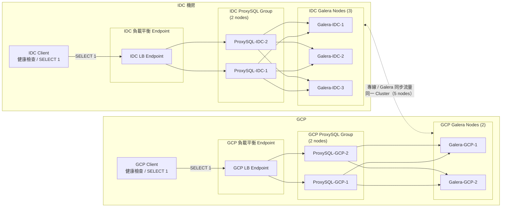
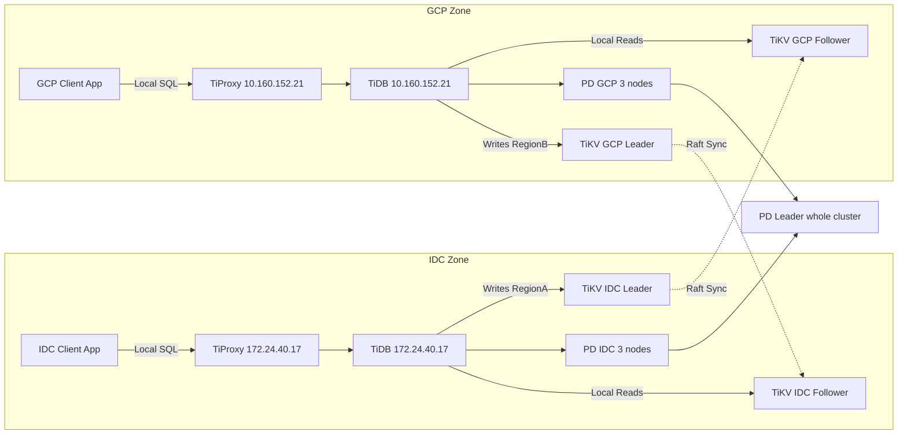
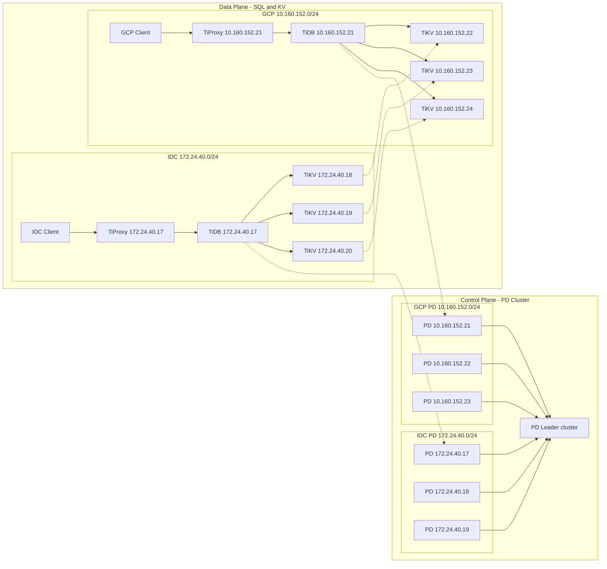
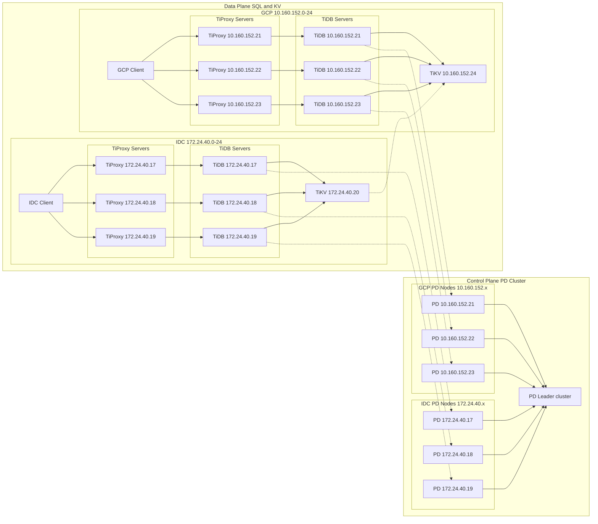

# TiDB Intro for DBA #5-1

## TL;DR
```
```

## 文件定義

### 目的

- 驗證 TiDB 分散式資料庫在 IDC 與 GCP 跨機房佈署下，與 MySQL 相容性、核心功能、穩定性與初步效能表現。PoC 聚焦於可行性與效能基準，量化寫入延遲對吞吐的影響（Raft vs Galera 同步行為差異）。

### 範圍（Scope）

- 驗證項目：OLTP 混合查詢、水平/垂直擴充、RPS/TPS/QPS、跨機房可用性。
- 
- 額外關注：IDC ↔ GCP 專線延遲、頻寬與封包品質對 TiDB 效能之影響。

### 重要背景（跨機房/跨雲注意）

- TiDB 架構重點：TiDB（SQL layer, stateless）、PD（placement/metadata）、TiKV（分散式 Key-Value 存儲，raft 共識）。`Raft 複本同步` 的延遲對寫入延遲影響最大。

- 效能基準示意範例：在良好專線下（RTT < 10ms，丟包 <0.1%）系統可穩定提供目標 QPS，平均延遲相關數據。

- 專線品質敏感度測試：測試不同 RTT/頻寬/丟包條件下，量化寫操作延遲增幅與吞吐下降百分比。
  - 網路敏感度參數：變動 RTT（50/100/200 ms）、頻寬（30Mbps/10Mbps/5Mbps）、丟包（0%/0.1%/1%），觀測 QPS、latency 等相關數據。

- Galera：同步複寫 (group commit)，每筆寫入需跨所有複本達成，同步跨 DC 會造成寫延遲顯著上升（WAN 不友善）。容易發生 Global Lock/衝突導致錯誤或重試。

- TiDB：SQL 層無狀態，TiKV 使用 Region + Raft（每個 Region 的多副本在 Raft 群組內一致性），由 PD 負責 leader placement 與副本調度。TiDB 可設定副本 placement policy、將副本放在不同機房以測試強一致性延遲；

- 並部署 TiProxy（tiproxy）作為輕量 MySQL 協定代理提供Connection Pool、Multiplexing、Failover與 PD Auto Discover，降低 TiDB server 直接連線負擔並平滑 failover，但會增加少許延遲。

### 測試組合

- RTT：50 / 100 / 200 ms

- 頻寬：30Mbps / 10Mbps / 5Mbps

- 丟包：0% / 0.1% / 1%

- Sysbench OLTP Types：oltp_read_write / oltp_read_only / oltp_write_only / oltp_update_index / select_random_points / select_random_ranges

----

## 架構說明

## PoC 規格說明（Compute Engine VM & 專線規格）

### IDC vSphere VM  & Compute Engine @ GCP

- CPU/記憶體
  - 測試節點建議最小規格：TiDB/TiProxy/ProxySQL/DB 節點 4–8 vCPU、16–32GB RAM；TiKV 建議 8–16 vCPU、32–64GB RAM。
  - PD 節點 4 vCPU、8–16GB RAM，採 3 或 6 節點奇數部署。
- 儲存
  - TiKV：本地 SSD 或高 IOPS 區塊儲存，單盤至少 10k IOPS、延遲 p99 < 2ms；建議啟用多併發 I/O，資料與 WAL 分層（可行時）。
  - TiDB/PD/ProxySQL/TiProxy：一般 SSD 即可，建議系統/日誌/資料分區分開。
- OS 與核心參數
  - Linux x86_64，kernel 4.18+；關閉透明大頁、numa balancing，`vm.swappiness=1`。
  - 檔案描述符上限 ≥ 100k；適度調整 `net.core.somaxconn`、`tcp_tw_reuse` 等網路參數。
- 時間同步
  - 全節點啟用 NTP/Chrony，同步誤差 < 1 ms，避免 Galera Cluster & PD/TiKV 因時鐘漂移造成調度異常。
    ```
    IDC / GCP 時間差計算公式 = IDC_offset − GCP_offset = (−0.000062843) − (+0.000001383) = −0.000064226 seconds
    ```
    - IDC (172.19.254.7)
	```
    ^* 172.19.254.7 6 10 377 17 -110us[ -203us] +/- 21ms
    Reference ID : AC13FE07 (172.19.254.7)
    Stratum : 7
    Ref time (UTC) : Fri Nov 14 01:38:47 2025
    System time : 0.000062843 seconds slow of NTP time
    Last offset : -0.000093200 seconds
    RMS offset : 0.000049073 seconds
    Frequency : 6.526 ppm slow
    Residual freq : -0.001 ppm
    Skew : 0.047 ppm
    Root delay : 0.036258023 seconds
    Root dispersion : 0.001422471 seconds
    Update interval : 1026.2 seconds
    Leap status : Normal
    ```
    - GCP (metadata.google.internal)
    ```
    ^* metadata.google.internal 2 10 377 149 +354ns[+2045ns] +/- 93us
    Reference ID : A9FEA9FE (metadata.google.internal)
    Stratum : 3
    Ref time (UTC) : Fri Nov 14 01:36:41 2025
    System time : 0.000001383 seconds fast of NTP time
    Last offset : +0.000001691 seconds
    RMS offset : 0.000001281 seconds
    Frequency : 75.702 ppm slow
    Residual freq : +0.000 ppm
    Skew : 0.000 ppm
    Root delay : 0.000035683 seconds
    Root dispersion : 0.000217084 seconds
    Update interval : 1030.7 seconds
    Leap status : Normal
    ```

### 專線規格與網路條件

- 目標門檻（PoC 基準）
  - RTT：IDC ↔ GCP 往返延遲 10–20ms 以內（越低越好），抖動 < 5ms。
  - 丟包率：< 0.1%（理想 0%）；短時突增需在 1 分鐘內恢復。
  - 頻寬：≥ 100 Mbps 穩定保證（建議 1 Gbps），避免高峰擁塞。
- L3/L4 設定與 QoS
  - 端到端 MTU 一致（1500 或 9001），避免碎片；確保 TCP/UDP 穩定通過。
  - 對 Raft/DB 關鍵流量標記高優先級 QoS，與備份/大檔傳輸流量分級管理。
- 可觀測性與驗收
  - 提供 mtr/iperf3 雙向基準（30–60 分鐘視窗），輸出 RTT、抖動、丟包、重傳率。
  - 連續 24–48 小時監測，於尖峰時段仍符合門檻。
- 連通與安全
  - 開通 TiDB/TiKV/PD/TiProxy/ProxySQL 必要埠與健康檢查、監控端點；DNS/Service 發現穩定。
  - PD 控制面需雙向可達，避免 placement/調度受阻。
- 失效與降級策略
  - 專線異常自動切換備援鏈路（VPN/次要專線），收斂 < 30 秒。
  - 監控告警：RTT、丟包、重傳、TCP RTT p95/p99 超標即告警並記錄事件。


### MySQL Galera Cluster with ProxySQL between IDC + GCP


```mermaid
flowchart LR
    %% ===== 區域標示 =====
    subgraph IDC["IDC 機房"]
        direction TB
        IDC_Client["IDC Client<br/>健康檢查 / SELECT 1"]

        subgraph IDC_LB["IDC 負載平衡 Endpoint"]
            IDC_LB_1["IDC LB Endpoint"]
        end

        subgraph IDC_Proxy["IDC ProxySQL Group<br/>(2 nodes)"]
            IDC_P1["ProxySQL-IDC-1"]
            IDC_P2["ProxySQL-IDC-2"]
        end

        subgraph IDC_Galera["IDC Galera Nodes (3)"]
            IDC_G1["Galera-IDC-1"]
            IDC_G2["Galera-IDC-2"]
            IDC_G3["Galera-IDC-3"]
        end
    end

    subgraph GCP["GCP"]
        direction TB
        GCP_Client["GCP Client<br/>健康檢查 / SELECT 1"]

        subgraph GCP_LB["GCP 負載平衡 Endpoint"]
            GCP_LB_1["GCP LB Endpoint"]
        end

        subgraph GCP_Proxy["GCP ProxySQL Group<br/>(2 nodes)"]
            GCP_P1["ProxySQL-GCP-1"]
            GCP_P2["ProxySQL-GCP-2"]
        end

        subgraph GCP_Galera["GCP Galera Nodes (2)"]
            GCP_G1["Galera-GCP-1"]
            GCP_G2["Galera-GCP-2"]
        end
    end

    %% ===== Global Galera Cluster (IDC+GCP) =====
    IDC_Galera <-. "專線 / Galera 同步流量<br/>同一 Cluster（5 nodes）" .-> GCP_Galera

    %% ===== 流量路徑：IDC =====
    IDC_Client -->|SELECT 1| IDC_LB_1
    IDC_LB_1 --> IDC_P1
    IDC_LB_1 --> IDC_P2

    IDC_P1 --> IDC_G1
    IDC_P1 --> IDC_G2
    IDC_P1 --> IDC_G3

    IDC_P2 --> IDC_G1
    IDC_P2 --> IDC_G2
    IDC_P2 --> IDC_G3

    %% ===== 流量路徑：GCP =====
    GCP_Client -->|SELECT 1| GCP_LB_1
    GCP_LB_1 --> GCP_P1
    GCP_LB_1 --> GCP_P2

    GCP_P1 --> GCP_G1
    GCP_P1 --> GCP_G2

    GCP_P2 --> GCP_G1
    GCP_P2 --> GCP_G2
```


### TiDB #1 between IDC + GCP


```mermaid
flowchart LR

%% ================ IDC ================
subgraph IDC_ZONE [IDC Zone]
direction TB

IDC_CLIENT[IDC Client App]

IDC_TiProxy[TiProxy 172.24.40.17]
IDC_TiDB[TiDB 172.24.40.17]

IDC_PD[PD IDC 3 nodes]

IDC_KV_LEADER[TiKV IDC Leader]
IDC_KV_FOLLOWER[TiKV IDC Follower]

end

%% ================ GCP ================
subgraph GCP_ZONE [GCP Zone]
direction TB

GCP_CLIENT[GCP Client App]

GCP_TiProxy[TiProxy 10.160.152.21]
GCP_TiDB[TiDB 10.160.152.21]

GCP_PD[PD GCP 3 nodes]

GCP_KV_LEADER[TiKV GCP Leader]
GCP_KV_FOLLOWER[TiKV GCP Follower]

end

%% ================ PD Leader (全域) ================
PD_LEADER[PD Leader whole cluster]

%% ============ SQL 本地化 ============
IDC_CLIENT -->|Local SQL| IDC_TiProxy --> IDC_TiDB
GCP_CLIENT -->|Local SQL| GCP_TiProxy --> GCP_TiDB

%% ============ TiDB <-> PD ============
IDC_TiDB --> IDC_PD
GCP_TiDB --> GCP_PD

%% ============ PD Raft / Leader ============
IDC_PD --> PD_LEADER
GCP_PD --> PD_LEADER

%% ============ 本地優先寫入 ============
IDC_TiDB -->|Writes RegionA| IDC_KV_LEADER
GCP_TiDB -->|Writes RegionB| GCP_KV_LEADER

%% ============ 本地優先讀取 ============
IDC_TiDB -->|Local Reads| IDC_KV_FOLLOWER
GCP_TiDB -->|Local Reads| GCP_KV_FOLLOWER

%% ============ 跨區 Raft ============
IDC_KV_LEADER -.->|Raft Sync| GCP_KV_FOLLOWER
GCP_KV_LEADER -.->|Raft Sync| IDC_KV_FOLLOWER

```


```mermaid
flowchart LR

%% =============== CONTROL PLANE (PD) ===============
subgraph CONTROL_PLANE [Control Plane - PD Cluster]
direction LR

  subgraph CP_IDC [IDC PD 172.24.40.0/24]
    direction TB
    CP_IDC_PD_17[PD 172.24.40.17]
    CP_IDC_PD_18[PD 172.24.40.18]
    CP_IDC_PD_19[PD 172.24.40.19]
  end

  subgraph CP_GCP [GCP PD 10.160.152.0/24]
    direction TB
    CP_GCP_PD_21[PD 10.160.152.21]
    CP_GCP_PD_22[PD 10.160.152.22]
    CP_GCP_PD_23[PD 10.160.152.23]
  end

  PD_LEADER[PD Leader cluster]

  CP_IDC_PD_17 --> PD_LEADER
  CP_IDC_PD_18 --> PD_LEADER
  CP_IDC_PD_19 --> PD_LEADER

  CP_GCP_PD_21 --> PD_LEADER
  CP_GCP_PD_22 --> PD_LEADER
  CP_GCP_PD_23 --> PD_LEADER
end

%% =============== DATA PLANE (SQL and KV) ===============
subgraph DATA_PLANE [Data Plane - SQL and KV]
direction LR

  %% ---------- IDC Data Plane ----------
  subgraph DP_IDC [IDC 172.24.40.0/24]
    direction TB

    IDC_CLIENT[IDC Client]

    IDC_TiProxy[TiProxy 172.24.40.17]
    IDC_TiDB[TiDB 172.24.40.17]

    IDC_KV_18[TiKV 172.24.40.18]
    IDC_KV_19[TiKV 172.24.40.19]
    IDC_KV_20[TiKV 172.24.40.20]
  end

  %% ---------- GCP Data Plane ----------
  subgraph DP_GCP [GCP 10.160.152.0/24]
    direction TB

    GCP_CLIENT[GCP Client]

    GCP_TiProxy[TiProxy 10.160.152.21]
    GCP_TiDB[TiDB 10.160.152.21]

    GCP_KV_22[TiKV 10.160.152.22]
    GCP_KV_23[TiKV 10.160.152.23]
    GCP_KV_24[TiKV 10.160.152.24]
  end

  %% --- SQL local entry (不跨區) ---
  IDC_CLIENT --> IDC_TiProxy --> IDC_TiDB
  GCP_CLIENT --> GCP_TiProxy --> GCP_TiDB

  %% --- TiDB to local KV (本區優先讀寫) ---
  IDC_TiDB --> IDC_KV_18
  IDC_TiDB --> IDC_KV_19
  IDC_TiDB --> IDC_KV_20

  GCP_TiDB --> GCP_KV_22
  GCP_TiDB --> GCP_KV_23
  GCP_TiDB --> GCP_KV_24

  %% --- TiDB 查詢 PD（控制面依賴） ---
  IDC_TiDB -.-> CP_IDC_PD_17
  GCP_TiDB -.-> CP_GCP_PD_21

  %% --- 必要的跨區 Raft 複本同步 ---
  IDC_KV_18 -.-> GCP_KV_22
  IDC_KV_19 -.-> GCP_KV_23
  IDC_KV_20 -.-> GCP_KV_24
end
```

### TiDB #2 between IDC + GCP


```mermaid
flowchart LR

%% ================= CONTROL PLANE (PD) =================
subgraph CONTROL_PLANE [Control Plane PD Cluster]
direction LR

  subgraph CP_IDC [IDC PD Nodes 172.24.40.x]
    direction TB
    CP_IDC_PD_17[PD 172.24.40.17]
    CP_IDC_PD_18[PD 172.24.40.18]
    CP_IDC_PD_19[PD 172.24.40.19]
  end

  subgraph CP_GCP [GCP PD Nodes 10.160.152.x]
    direction TB
    CP_GCP_PD_21[PD 10.160.152.21]
    CP_GCP_PD_22[PD 10.160.152.22]
    CP_GCP_PD_23[PD 10.160.152.23]
  end

  PD_LEADER[PD Leader cluster]

  CP_IDC_PD_17 --> PD_LEADER
  CP_IDC_PD_18 --> PD_LEADER
  CP_IDC_PD_19 --> PD_LEADER

  CP_GCP_PD_21 --> PD_LEADER
  CP_GCP_PD_22 --> PD_LEADER
  CP_GCP_PD_23 --> PD_LEADER
end

%% ================= DATA PLANE (TiProxy / TiDB / TiKV) =================
subgraph DATA_PLANE [Data Plane SQL and KV]
direction LR

  %% ---------------- IDC -----------------
  subgraph DP_IDC [IDC 172.24.40.0-24]
    direction TB

    IDC_CLIENT[IDC Client]

    subgraph IDC_TiProxy_Group [TiProxy Servers]
      direction TB
      IDC_TP_17[TiProxy 172.24.40.17]
      IDC_TP_18[TiProxy 172.24.40.18]
      IDC_TP_19[TiProxy 172.24.40.19]
    end

    subgraph IDC_TiDB_Group [TiDB Servers]
      direction TB
      IDC_TDB_17[TiDB 172.24.40.17]
      IDC_TDB_18[TiDB 172.24.40.18]
      IDC_TDB_19[TiDB 172.24.40.19]
    end

    IDC_KV_20[TiKV 172.24.40.20]
  end

  %% ---------------- GCP -----------------
  subgraph DP_GCP [GCP 10.160.152.0-24]
    direction TB

    GCP_CLIENT[GCP Client]

    subgraph GCP_TiProxy_Group [TiProxy Servers]
      direction TB
      GCP_TP_21[TiProxy 10.160.152.21]
      GCP_TP_22[TiProxy 10.160.152.22]
      GCP_TP_23[TiProxy 10.160.152.23]
    end

    subgraph GCP_TiDB_Group [TiDB Servers]
      direction TB
      GCP_TDB_21[TiDB 10.160.152.21]
      GCP_TDB_22[TiDB 10.160.152.22]
      GCP_TDB_23[TiDB 10.160.152.23]
    end

    GCP_KV_24[TiKV 10.160.152.24]
  end

  %% ---- SQL local entry (不跨區) ----
  IDC_CLIENT --> IDC_TP_17
  IDC_CLIENT --> IDC_TP_18
  IDC_CLIENT --> IDC_TP_19

  IDC_TP_17 --> IDC_TDB_17
  IDC_TP_18 --> IDC_TDB_18
  IDC_TP_19 --> IDC_TDB_19

  GCP_CLIENT --> GCP_TP_21
  GCP_CLIENT --> GCP_TP_22
  GCP_CLIENT --> GCP_TP_23

  GCP_TP_21 --> GCP_TDB_21
  GCP_TP_22 --> GCP_TDB_22
  GCP_TP_23 --> GCP_TDB_23

  %% ---- TiDB -> local TiKV ----
  IDC_TDB_17 --> IDC_KV_20
  IDC_TDB_18 --> IDC_KV_20
  IDC_TDB_19 --> IDC_KV_20

  GCP_TDB_21 --> GCP_KV_24
  GCP_TDB_22 --> GCP_KV_24
  GCP_TDB_23 --> GCP_KV_24

  %% ---- TiDB -> PD (control plane dependency) ----
  IDC_TDB_17 -.-> CP_IDC_PD_17
  IDC_TDB_18 -.-> CP_IDC_PD_18
  IDC_TDB_19 -.-> CP_IDC_PD_19

  GCP_TDB_21 -.-> CP_GCP_PD_21
  GCP_TDB_22 -.-> CP_GCP_PD_22
  GCP_TDB_23 -.-> CP_GCP_PD_23

  %% ---- Cross zone TiKV raft sync ----
  IDC_KV_20 -.-> GCP_KV_24
end
```

# 已知問題

## Public Mirror Site 不穩定 ; 且為 tiup 前置既定程序


```
date ; tiup cluster display tidb-demo
Checking updates for component cluster... Timedout (after 2s)
Error: fetch /timestamp.json from mirror(https://tiup-mirrors.pingcap.com) failed: download from https://tiup-mirrors.pingcap.com/timestamp.json failed: Get "https://tiup-mirrors.pingcap.com/timestamp.json": EOF
```

確認 mirror 來源
```
wn.lin@2740-mac13 ~ % date ; bash test.sh
2025年11月 7日 星期五 14時12分20秒 CST
DNS_SERVER,IP,COUNTRY,REGION
10.0.1.5,128.1.102.113,Taiwan,Kaohsiung
10.0.1.5,107.155.58.204,Taiwan,Taipei City
10.0.1.5,175.99.198.25,Taiwan,Taiwan
10.0.1.5,23.236.104.178,Taiwan,Taipei City
10.0.1.5,107.155.58.219,Taiwan,Taipei City
10.0.1.5,128.1.102.212,Taiwan,Kaohsiung
168.95.1.1,23.236.104.178,Taiwan,Taipei City
168.95.1.1,175.99.198.25,Taiwan,Taiwan
168.95.1.1,107.155.58.219,Taiwan,Taipei City
168.95.1.1,128.1.102.113,Taiwan,Kaohsiung
168.95.1.1,128.1.102.212,Taiwan,Kaohsiung
168.95.1.1,107.155.58.204,Taiwan,Taipei City
8.8.8.8,43.152.2.144,United States,Florida
8.8.8.8,43.152.2.154,United States,Florida
8.8.8.8,43.174.143.248,United States,New Mexico
8.8.8.8,43.175.170.163,United States,New Mexico
8.8.8.8,43.152.48.139,United States,Texas
8.8.8.8,43.159.79.166,United States,New Mexico
```

- [Manifest format and repository layout 說明](https://github.com/pingcap/tiup/blob/master/doc/design/manifest.md)


- Solution: [Create a Private Mirror](https://docs.pingcap.com/tidb/stable/tiup-mirror/)

## 性能差異與選型建議

- 主要性能差異總結
  - MySQL 優勢突出 ; 跨專線短板明顯
  - TiDB 分散式儲存與穩定性優勢，巨大資料量體合適
    - 核心價值
    - 性能瓶頸

## 業務選型建議

- 優先選擇 MySQL 的場景
- 優先選擇 TiDB 的場景

## 測試局限性與改善建議

## 總結與未來規劃

- 下一階段的技術管理投資方向 ; [Reference](https://landscape.cncf.io/guide#app-definition-and-development--database)


## 數據壓縮比分析
```
一樣是 10000000 rows 的 Table Space ; 各自佔用多少儲存空間？
```

- MySQL

資料樣態
```
mysql> \s
--------------
mysql  Ver 8.0.41 for Linux on x86_64 (Source distribution)

Connection id:          80
Current database:       sbtest
Current user:           root@172.24.47.130
SSL:                    Cipher in use is TLS_AES_256_GCM_SHA384
Current pager:          stdout
Using outfile:          ''
Using delimiter:        ;
Server version:         8.4.4 Galera Cluster for MySQL
Protocol version:       10
Connection:             172.24.40.13 via TCP/IP
Server characterset:    utf8mb4
Db     characterset:    utf8mb4
Client characterset:    utf8mb4
Conn.  characterset:    utf8mb4
TCP port:               3306
Binary data as:         Hexadecimal
Uptime:                 11 min 50 sec

Threads: 8  Questions: 7678  Slow queries: 225  Opens: 394  Flush tables: 3  Open tables: 308  Queries per second avg: 10.814
--------------

mysql> select count(*) from sbtest.sbtest1;
+----------+
| count(*) |
+----------+
| 10000000 |
+----------+
1 row in set (2.38 sec)

mysql> show table status;
+---------+--------+---------+------------+---------+----------------+-------------+-----------------+--------------+-----------+----------------+---------------------+---------------------+------------+--------------------+----------+----------------+---------+
| Name    | Engine | Version | Row_format | Rows    | Avg_row_length | Data_length | Max_data_length | Index_length | Data_free | Auto_increment | Create_time         | Update_time         | Check_time | Collation          | Checksum | Create_options | Comment |
+---------+--------+---------+------------+---------+----------------+-------------+-----------------+--------------+-----------+----------------+---------------------+---------------------+------------+--------------------+----------+----------------+---------+
| sbtest1 | InnoDB |      10 | Dynamic    | 1004114 |            165 |   166363136 |               0 |            0 |   5242880 |        1014204 | 2025-10-14 16:04:06 | 2025-10-14 16:02:01 | NULL       | utf8mb4_0900_ai_ci |     NULL |                |         |
+---------+--------+---------+------------+---------+----------------+-------------+-----------------+--------------+-----------+----------------+---------------------+---------------------+------------+--------------------+----------+----------------+---------+
1 row in set (0.00 sec)
```

邏輯大小
```
mysql> SELECT
    ->   table_name AS `Table`,
    ->   ROUND(data_length / 1024 / 1024, 2) AS `Data (MB)`,
    ->   ROUND(index_length / 1024 / 1024, 2) AS `Index (MB)`,
    ->   ROUND((data_length + index_length) / 1024 / 1024, 2) AS `Total (MB)`
    -> FROM information_schema.tables
    -> WHERE table_schema = 'sbtest';
+---------+-----------+------------+------------+
| Table   | Data (MB) | Index (MB) | Total (MB) |
+---------+-----------+------------+------------+
| sbtest1 |   2144.00 |     148.66 |    2292.66 |
+---------+-----------+------------+------------+
1 row in set (0.00 sec)

mysql> SELECT
    ->   table_schema AS `Database`,
    ->   ROUND(SUM(data_length + index_length) / 1024 / 1024, 2) AS `Size (MB)`
    -> FROM information_schema.tables
    -> WHERE table_schema = 'sbtest'
    -> GROUP BY table_schema;
+----------+-----------+
| Database | Size (MB) |
+----------+-----------+
| sbtest   |   2292.66 |
+----------+-----------+
1 row in set (0.00 sec)
```

物理大小
```
[root@l-poc-labroom-3 ~]# ls -lah /data/mysql/data/sbtest/
total 2.3G
drwxr-x---  2 mysql mysql   25 Oct 14 16:01 .
drwxr-xr-x 12 mysql mysql 4.0K Oct 14 16:01 ..
-rw-r-----  1 mysql mysql 2.3G Oct 14 16:04 sbtest1.ibd

[root@l-poc-labroom-3 ~]# du -h /data/mysql/data/sbtest/ | tail -1
2.3G    /data/mysql/data/sbtest/
```

- TiDB

資料樣態
```
mysql> \s
--------------
mysql  Ver 8.0.41 for Linux on x86_64 (Source distribution)

Connection id:          28
Current database:       sbtest
Current user:           root@172.24.40.13
SSL:                    Not in use
Current pager:          stdout
Using outfile:          ''
Using delimiter:        ;
Server version:         8.0.11-TiDB-v8.5.3 TiDB Server (Apache License 2.0) Community Edition, MySQL 8.0 compatible
Protocol version:       10
Connection:             172.24.40.13 via TCP/IP
Server characterset:    utf8mb4
Db     characterset:    utf8mb4
Client characterset:    utf8mb4
Conn.  characterset:    utf8mb4
TCP port:               6000
Binary data as:         Hexadecimal
Uptime:                 1 day 18 hours 59 min 58 sec

Threads: 0  Questions: 0  Slow queries: 0  Opens: 0  Flush tables: 0  Open tables: 0  Queries per second avg: 0.000
--------------

mysql> select count(*) from sbtest.sbtest1;
+----------+
| count(*) |
+----------+
| 10000000 |
+----------+
1 row in set (1.69 sec)

mysql> show table status;
+---------+--------+---------+------------+----------+----------------+-------------+-----------------+--------------+-----------+----------------+---------------------+-------------+------------+-------------+----------+----------------+---------+
| Name    | Engine | Version | Row_format | Rows     | Avg_row_length | Data_length | Max_data_length | Index_length | Data_free | Auto_increment | Create_time         | Update_time | Check_time | Collation   | Checksum | Create_options | Comment |
+---------+--------+---------+------------+----------+----------------+-------------+-----------------+--------------+-----------+----------------+---------------------+-------------+------------+-------------+----------+----------------+---------+
| sbtest1 | InnoDB |      10 | Compact    | 10000000 |             16 |   160000000 |               0 |     80000000 |         0 |       10026507 | 2025-10-16 11:30:50 | NULL        | NULL       | utf8mb4_bin |          |                |         |
+---------+--------+---------+------------+----------+----------------+-------------+-----------------+--------------+-----------+----------------+---------------------+-------------+------------+-------------+----------+----------------+---------+
1 row in set (0.01 sec)
```

邏輯大小
```
mysql> SELECT
    ->   table_name AS `Table`,
    ->   ROUND(data_length / 1024 / 1024, 2) AS `Data (MB)`,
    ->   ROUND(index_length / 1024 / 1024, 2) AS `Index (MB)`,
    ->   ROUND((data_length + index_length) / 1024 / 1024, 2) AS `Total (MB)`
    -> FROM information_schema.tables
    -> WHERE table_schema = 'sbtest';
+---------+-----------+------------+------------+
| Table   | Data (MB) | Index (MB) | Total (MB) |
+---------+-----------+------------+------------+
| sbtest1 |    152.59 |      76.29 |     228.88 |
+---------+-----------+------------+------------+
1 row in set (0.01 sec)

mysql> SELECT
    ->     table_schema AS 'Database',
    ->     ROUND(SUM(data_length + index_length) / 1024 / 1024, 2) AS 'Size (MB)'
    -> FROM
    ->     information_schema.tables
    -> WHERE
    ->     table_schema = 'sbtest'
    -> GROUP BY
    ->     table_schema;
+----------+-----------+
| Database | Size (MB) |
+----------+-----------+
| sbtest   |    228.88 |
+----------+-----------+
1 row in set (0.01 sec)
```

物理大小

在 TiKV/Rocksdb 層級中，無法直接對應 sbtest1 為單一檔案；因為：
```
TiDB 將資料分 Region 儲存，每張表拆成多個 Region。
每個 Region 會以多個 .sst 檔（如 000${n}.sst、000${n}+1.sst 等）組成並混雜其他表。

[root@l-poc-labroom-3 tikv-20160]# pwd ; du -h /data/tidb-data/tikv-20160/db | tail -1 ; ls -al ; ls -la /data/tidb-data/tikv-20160/db
/data/tidb-data/tikv-20160
2.0G    /data/tidb-data/tikv-20160/db
total 1048612
drwxr-xr-x 6 root root        164 Oct 14 16:35 .
drwxr-xr-x 5 root root         59 Oct 14 16:34 ..
drwxr-xr-x 3 root root       4096 Oct 16 11:48 db
drwxr-xr-x 4 root root         33 Oct 16 11:30 import
-rw-r--r-- 1 root root      21449 Oct 14 16:35 last_tikv.toml
-rw-r--r-- 1 root root          0 Oct 14 16:35 LOCK
-rw-r--r-- 1 root root          0 Oct 14 16:35 raftdb.info
drwxr-xr-x 2 root root       4096 Oct 16 11:30 raft-engine
-rw-r--r-- 1 root root          0 Oct 14 16:35 rocksdb.info
drwxr-xr-x 2 root root          6 Oct 14 16:35 snap
-rw-r--r-- 1 root root 1073741824 Oct 14 16:35 space_placeholder_file

[root@l-poc-labroom-3 tikv-20160]# pwd ; find . | grep sst | grep -vi import
/data/tidb-data/tikv-20160
./db/000437.sst
./db/000552.sst
./db/000285.sst
./db/000697.sst
./db/000699.sst
./db/000700.sst
./db/000701.sst
./db/000702.sst
./db/000703.sst
./db/000705.sst
./db/000707.sst
./db/000708.sst
./db/000711.sst
./db/000655.sst
./db/000664.sst
./db/000446.sst
./db/000694.sst
./db/000656.sst
./db/000704.sst
./db/000706.sst
./db/000709.sst
./db/000712.sst
./db/000661.sst
./db/000589.sst
./db/000442.sst
./db/000677.sst
./db/000331.sst
./db/000334.sst
./db/000329.sst
./db/000684.sst
./db/000710.sst
./db/000713.sst
./db/000586.sst
```

# MySQLSlap Testing for Request per Second

## 版本 & 參數資訊交付
```
root@l-wn-test-1 tidb_benchmark $ mysqlslap --version
mysqlslap  Ver 8.0.41 for Linux on x86_64 (Source distribution)
```

## 測試參數交代
```
number-of-queries = 100000
Executed three times using **mysqlslap** with `--iterations=3`.  
The **average runtime (avg[s])** represents the mean value across all three runs.
```

| 欄位名稱      | 說明                                          | 趨勢判讀                   |
|----------------|-----------------------------------------------|----------------------------|
| **avg(s)**     | 平均執行時間（秒），從開始到全部請求完成的平均耗時。   | 越低越好（代表總體執行越快） |
| **avg_rps**    | 平均每秒系統能完成的請求次數（Requests Per Second）。 | 越高越好（系統吞吐量越高）   |
| **avg_ms/req** | 平均每筆請求耗時（毫秒）。                         | 越低越好（單筆反應時間越快） |

## 測試數據紀錄

## MySQL + ProxySQL @ Single Instance with 4 vCPU @ mysqlslap_logs_20251021_132329
| concurrency | avg(s) | min(s) | max(s) | avg_qps  | avg_ms/req |
| ----------- | ------ | ------ | ------ | -------- | ---------- |
| 10          | 4.47   | 4.28   | 4.71   | 22394.74 | 0.04       |
| 50          | 1.95   | 1.91   | 1.98   | 51212.02 | 0.02       |
| 100         | 1.75   | 1.73   | 1.78   | 57066.77 | 0.02       |
| 250         | 1.99   | 1.94   | 2.07   | 50200.80 | 0.02       |
| 500         | 5.23   | 3.23   | 6.84   | 19118.02 | 0.05       |
| 1000        | 7.65   | 6.72   | 8.31   | 13079.87 | 0.08       |

## MySQL + ProxySQL @ IDC Cluster with 4 vCPU @ mysqlslap_logs_20251022_160800
| concurrency | avg(s) | min(s) | max(s) | avg_qps  | avg_ms/req |
| ----------- | ------ | ------ | ------ | -------- | ---------- |
| 10          | 4.05   | 4.00   | 4.09   | 24664.97 | 0.04       |
| 50          | 1.38   | 1.35   | 1.43   | 72481.28 | 0.01       |
| 100         | 1.08   | 1.04   | 1.13   | 92307.69 | 0.01       |
| 250         | 1.97   | 1.84   | 2.09   | 50821.62 | 0.02       |
| 500         | 3.62   | 2.86   | 4.83   | 27614.14 | 0.04       |
| 1000        | 14.40  | 8.68   | 22.00  | 6944.28  | 0.14       |

## MySQL + ProxySQL @ IDC Cluster with 8 vCPU @ mysqlslap_logs_20251027_135223

| concurrency | avg(s) | min(s) | max(s) | avg_qps  | avg_ms/req |
| ----------- | ------ | ------ | ------ | -------- | ---------- |
| 10          | 4.01   | 3.80   | 4.16   | 24962.56 | 0.04       |
| 50          | 1.19   | 1.11   | 1.25   | 84080.72 | 0.01       |
| 100         | 1.01   | 0.96   | 1.07   | 99272.01 | 0.01       |
| 250         | 1.44   | 1.20   | 1.64   | 69573.28 | 0.01       |
| 500         | 4.03   | 3.08   | 5.69   | 24785.19 | 0.04       |
| 1000        | 9.39   | 8.49   | 10.02  | 10648.12 | 0.09       |

## MySQL + ProxySQL @ IDC + GCP Cluster with 4 vCPU @ 

### mysqlslap on 172.24.40.16 @ mysqlslap_logs_20251112_141836

| concurrency | avg(s) | min(s) | max(s) | avg_qps  | avg_ms/req |
| ----------- | ------ | ------ | ------ | -------- | ---------- |
| 10          | 3.70   | 3.49   | 3.83   | 27027.03 | 0.04       |
| 50          | 1.26   | 1.18   | 1.31   | 79449.15 | 0.01       |
| 100         | 1.06   | 1.03   | 1.08   | 94398.99 | 0.01       |
| 250         | 1.89   | 1.38   | 2.63   | 52984.81 | 0.02       |
| 500         | 3.61   | 3.33   | 4.12   | 27688.05 | 0.04       |
| 1000        | 10.87  | 8.21   | 14.51  | 9201.04  | 0.11       |

### mysqlslap on 10.160.152.14 @ mysqlslap_logs_20251112_142110

| concurrency | avg(s) | min(s) | max(s) | avg_qps  | avg_ms/req |
| ----------- | ------ | ------ | ------ | -------- | ---------- |
| 10          | 3.10   | 3.08   | 3.12   | 32289.31 | 0.03       |
| 50          | 1.36   | 1.31   | 1.40   | 73655.78 | 0.01       |
| 100         | 1.46   | 1.44   | 1.49   | 68259.39 | 0.01       |
| 250         | 1.96   | 1.92   | 2.05   | 50985.72 | 0.02       |
| 500         | 2.79   | 2.77   | 2.81   | 35790.98 | 0.03       |
| 1000        | 3.73   | 2.42   | 4.57   | 26824.03 | 0.04       |

### mysqlslap between 172.24.40.16 (mysqlslap_logs_20251112_142529) & 10.160.152.14 (mysqlslap_logs_20251112_142528)

@172.24.40.16

| concurrency | avg(s) | min(s) | max(s) | avg_qps  | avg_ms/req |
| ----------- | ------ | ------ | ------ | -------- | ---------- |
| 10          | 3.93   | 3.87   | 4.03   | 25462.57 | 0.04       |
| 50          | 1.29   | 1.18   | 1.35   | 77559.46 | 0.01       |
| 100         | 1.06   | 1.02   | 1.11   | 94696.97 | 0.01       |
| 250         | 1.73   | 1.34   | 2.10   | 57926.24 | 0.02       |
| 500         | 3.89   | 3.21   | 5.22   | 25737.82 | 0.04       |
| 1000        | 8.56   | 7.13   | 11.27  | 11687.25 | 0.09       |

@10.160.152.14

| concurrency | avg(s) | min(s) | max(s) | avg_qps  | avg_ms/req |
| ----------- | ------ | ------ | ------ | -------- | ---------- |
| 10          | 3.23   | 3.22   | 3.25   | 30937.40 | 0.03       |
| 50          | 1.60   | 1.57   | 1.61   | 62643.56 | 0.02       |
| 100         | 1.59   | 1.57   | 1.62   | 62866.72 | 0.02       |
| 250         | 2.14   | 1.89   | 2.40   | 46649.04 | 0.02       |
| 500         | 3.13   | 2.90   | 3.32   | 31928.48 | 0.03       |
| 1000        | 4.00   | 3.86   | 4.17   | 25027.11 | 0.04       |

## MySQL + ProxySQL @ IDC + GCP Cluster with 8 vCPU @ 

### mysqlslap on 172.24.40.16 @ mysqlslap_logs_20251111_154136

| concurrency | avg(s) | min(s) | max(s) | avg_qps   | avg_ms/req |
| ----------- | ------ | ------ | ------ | --------- | ---------- |
| 10          | 3.58   | 3.32   | 3.74   | 27901.79  | 0.04       |
| 50          | 1.10   | 1.02   | 1.15   | 90661.83  | 0.01       |
| 100         | 0.92   | 0.90   | 0.95   | 108892.92 | 0.01       |
| 250         | 1.82   | 1.40   | 2.64   | 54864.67  | 0.02       |
| 500         | 3.41   | 2.80   | 3.94   | 29354.21  | 0.03       |
| 1000        | 8.16   | 7.33   | 9.29   | 12247.90  | 0.08       |

### mysqlslap on 10.160.152.14 @ mysqlslap_logs_20251111_154829

| concurrency | avg(s) | min(s) | max(s) | avg_qps   | avg_ms/req |
| ----------- | ------ | ------ | ------ | --------- |:---------- |
| 10          | 2.74   | 2.71   | 2.76   | 36540.80  | 0.03       |
| 50          | 0.92   | 0.89   | 0.98   | 108303.25 | 0.01       |
| 100         | 0.93   | 0.90   | 0.95   | 107565.44 | 0.01       |
| 250         | 1.19   | 1.17   | 1.20   | 84104.29  | 0.01       |
| 500         | 2.98   | 1.45   | 4.20   | 33534.54  | 0.03       |
| 1000        | 2.13   | 1.77   | 2.37   | 46853.04  | 0.02       |

### mysqlslap between 172.24.40.16 (mysqlslap_logs_20251111_155133) & 10.160.152.14 (mysqlslap_logs_20251111_155134)

@172.24.40.16

| concurrency | avg(s) | min(s) | max(s) | avg_qps   | avg_ms/req |
| ----------- | ------ | ------ | ------ | --------- | ---------- |
| 10          | 3.67   | 3.48   | 3.79   | 27275.21  | 0.04       |
| 50          | 1.14   | 1.02   | 1.20   | 87796.31  | 0.01       |
| 100         | 0.92   | 0.88   | 0.96   | 108303.25 | 0.01       |
| 250         | 1.39   | 1.36   | 1.41   | 71994.24  | 0.01       |
| 500         | 5.12   | 4.28   | 6.34   | 19516.00  | 0.05       |
| 1000        | 11.26  | 7.78   | 13.04  | 8877.84   | 0.11       |

@10.160.152.14

| concurrency | avg(s) | min(s) | max(s) | avg_qps   | avg_ms/req |
| ----------- | ------ | ------ | ------ | --------- | ---------- |
| 10          | 2.81   | 2.78   | 2.83   | 35595.63  | 0.03       |
| 50          | 0.92   | 0.90   | 0.93   | 109090.91 | 0.01       |
| 100         | 0.93   | 0.91   | 0.95   | 107604.02 | 0.01       |
| 250         | 1.21   | 1.19   | 1.24   | 82895.83  | 0.01       |
| 500         | 1.51   | 1.48   | 1.57   | 66122.99  | 0.02       |
| 1000        | 3.10   | 1.21   | 5.78   | 32310.18  | 0.03       |

----

## TiDB + TiProxy @ Single Instance with 4 vCPU @ mysqlslap_logs_20251021_133658
| concurrency | avg(s) | min(s) | max(s) | avg_qps  | avg_ms/req |
| ----------- | ------ | ------ | ------ | -------- | ---------- |
| 10          | 6.50   | 6.47   | 6.53   | 15395.67 | 0.06       |
| 50          | 4.27   | 4.15   | 4.33   | 23433.84 | 0.04       |
| 100         | 4.42   | 4.38   | 4.47   | 22627.85 | 0.04       |
| 250         | 4.59   | 4.54   | 4.64   | 21792.82 | 0.05       |
| 500         | 4.81   | 4.73   | 4.88   | 20781.38 | 0.05       |
| 1000        | 5.08   | 5.05   | 5.10   | 19677.29 | 0.05       |

## TiDB + TiProxy @ IDC Cluster with 4 vCPU #1 @ mysqlslap_logs_20251027_092815

```
tiproxy_servers:
  - host: 172.24.40.17
tidb_servers:
  - host: 172.24.40.17
pd_servers:
  - host: 172.24.40.17
  - host: 172.24.40.18
  - host: 172.24.40.19
tikv_servers:
  - host: 172.24.40.18
  - host: 172.24.40.19
  - host: 172.24.40.20
```

| concurrency | avg(s) | min(s) | max(s) | avg_qps  | avg_ms/req |
| ----------- | ------ | ------ | ------ | -------- | ---------- |
| 10          | 1.03   | 1.03   | 1.03   | 96774.19 | 0.01       |
| 50          | 1.05   | 1.05   | 1.06   | 95026.92 | 0.01       |
| 100         | 1.09   | 1.09   | 1.09   | 91547.15 | 0.01       |
| 250         | 2.52   | 1.15   | 4.21   | 39719.32 | 0.03       |
| 500         | 9.81   | 7.59   | 11.47  | 10192.99 | 0.10       |
| 1000        | 12.04  | 10.81  | 14.03  | 8306.57  | 0.12       |

## TiDB + TiProxy @ IDC Cluster with 4 vCPU #2 @ mysqlslap_logs_20251027_102800

```
tiproxy_servers:
  - host: 172.24.40.17
  - host: 172.24.40.18
  - host: 172.24.40.19
tidb_servers:
  - host: 172.24.40.17
  - host: 172.24.40.18
  - host: 172.24.40.19
pd_servers:
  - host: 172.24.40.17
  - host: 172.24.40.18
  - host: 172.24.40.19
tikv_servers:
  - host: 172.24.40.20
```

| concurrency | avg(s) | min(s) | max(s) | avg_qps  | avg_ms/req |
| ----------- | ------ | ------ | ------ | -------- | ---------- |
| 10          | 1.03   | 1.03   | 1.03   | 97339.39 | 0.01       |
| 50          | 1.04   | 1.03   | 1.04   | 96556.16 | 0.01       |
| 100         | 2.08   | 1.04   | 4.15   | 48076.92 | 0.02       |
| 250         | 2.78   | 1.06   | 5.16   | 35979.85 | 0.03       |
| 500         | 10.46  | 4.54   | 19.59  | 9555.66  | 0.10       |
| 1000        | 12.99  | 10.44  | 16.91  | 7699.22  | 0.13       |

## TiDB + TiProxy @ IDC Cluster with 8 vCPU #1 @ mysqlslap_logs_20251027_155357

```
tiproxy_servers:
  - host: 172.24.40.17
tidb_servers:
  - host: 172.24.40.17
pd_servers:
  - host: 172.24.40.17
  - host: 172.24.40.18
  - host: 172.24.40.19
tikv_servers:
  - host: 172.24.40.18
  - host: 172.24.40.19
  - host: 172.24.40.20
```

| concurrency | avg(s) | min(s) | max(s) | avg_qps  | avg_ms/req |
| ----------- | ------ | ------ | ------ | -------- | ---------- |
| 10          | 1.03   | 1.02   | 1.03   | 97560.98 | 0.01       |
| 50          | 1.04   | 1.03   | 1.04   | 96587.25 | 0.01       |
| 100         | 1.06   | 1.06   | 1.07   | 94132.41 | 0.01       |
| 250         | 2.13   | 2.12   | 2.14   | 46977.76 | 0.02       |
| 500         | 8.43   | 7.39   | 10.38  | 11862.40 | 0.08       |
| 1000        | 12.86  | 10.59  | 17.02  | 7773.63  | 0.13       |

## TiDB + TiProxy @ IDC Cluster with 8 vCPU #2 @ mysqlslap_logs_20251027_154712

```
tiproxy_servers:
  - host: 172.24.40.17
  - host: 172.24.40.18
  - host: 172.24.40.19
tidb_servers:
  - host: 172.24.40.17
  - host: 172.24.40.18
  - host: 172.24.40.19
pd_servers:
  - host: 172.24.40.17
  - host: 172.24.40.18
  - host: 172.24.40.19
tikv_servers:
  - host: 172.24.40.20
```

| concurrency | avg(s) | min(s) | max(s) | avg_qps  | avg_ms/req |
| ----------- | ------ | ------ | ------ | -------- | ---------- |
| 10          | 1.03   | 1.02   | 1.03   | 97560.98 | 0.01       |
| 50          | 1.37   | 1.03   | 2.06   | 72797.86 | 0.01       |
| 100         | 1.38   | 1.04   | 2.08   | 72236.94 | 0.01       |
| 250         | 2.78   | 1.05   | 5.20   | 35928.14 | 0.03       |
| 500         | 9.44   | 4.60   | 16.50  | 10588.73 | 0.09       |
| 1000        | 10.84  | 10.58  | 11.07  | 9223.67  | 0.11       |

## TiDB + TiProxy @ IDC + GCP Cluster with 4 #1 vCPU @

```
tiproxy_servers:
  - host: 172.24.40.17
  - host: 10.160.152.21
tidb_servers:
  - host: 172.24.40.17
  - host: 10.160.152.21
pd_servers:
  - host: 172.24.40.17
  - host: 172.24.40.18
  - host: 172.24.40.19
  - host: 10.160.152.21
  - host: 10.160.152.22
  - host: 10.160.152.23
tikv_servers:
  - host: 172.24.40.18
  - host: 172.24.40.19
  - host: 172.24.40.20
  - host: 10.160.152.22
  - host: 10.160.152.23
  - host: 10.160.152.24
```

### mysqlslap on 172.24.40.25 @ mysqlslap_logs_20251107_155527

| concurrency | avg(s) | min(s) | max(s) | avg_qps  | avg_ms/req |
| ----------- | ------ | ------ | ------ | -------- | ---------- |
| 10          | 1.03   | 1.03   | 1.03   | 97370.98 | 0.01       |
| 50          | 1.05   | 1.04   | 1.05   | 95298.60 | 0.01       |
| 100         | 1.07   | 1.06   | 1.08   | 93691.44 | 0.01       |
| 250         | 2.48   | 2.08   | 3.22   | 40360.55 | 0.02       |
| 500         | 8.42   | 7.37   | 10.35  | 11869.91 | 0.08       |
| 1000        | 12.01  | 10.82  | 14.11  | 8328.01  | 0.12       |

### mysqlslap on 10.160.152.26 @ mysqlslap_logs_20251107_155651

| concurrency | avg(s) | min(s) | max(s) | avg_qps  | avg_ms/req |
| ----------- | ------ | ------ | ------ | -------- | ---------- |
| 10          | 1.02   | 1.02   | 1.02   | 97815.45 | 0.01       |
| 50          | 1.05   | 1.05   | 1.05   | 95268.34 | 0.01       |
| 100         | 1.09   | 1.08   | 1.09   | 92137.59 | 0.01       |
| 250         | 1.16   | 1.15   | 1.18   | 86083.21 | 0.01       |
| 500         | 2.35   | 2.12   | 2.50   | 42589.44 | 0.02       |
| 1000        | 4.64   | 4.60   | 4.71   | 21553.27 | 0.05       |

### mysqlslap between 172.24.40.25 (mysqlslap_logs_20251107_155932) & 10.160.152.26 (mysqlslap_logs_20251107_155933)

@172.24.40.25

| concurrency | avg(s) | min(s) | max(s) | avg_qps  | avg_ms/req |
| ----------- | ------ | ------ | ------ | -------- | ---------- |
| 10          | 1.03   | 1.03   | 1.03   | 97276.26 | 0.01       |
| 50          | 1.05   | 1.05   | 1.05   | 95147.48 | 0.01       |
| 100         | 1.07   | 1.07   | 1.07   | 93370.68 | 0.01       |
| 250         | 2.15   | 1.12   | 3.15   | 46490.00 | 0.02       |
| 500         | 11.51  | 7.38   | 19.57  | 8687.34  | 0.12       |
| 1000        | 11.88  | 10.73  | 13.69  | 8417.74  | 0.12       |

@10.160.152.26

| concurrency | avg(s) | min(s) | max(s) | avg_qps  | avg_ms/req |
| ----------- | ------ | ------ | ------ | -------- | ---------- |
| 10          | 1.02   | 1.02   | 1.02   | 97751.71 | 0.01       |
| 50          | 1.05   | 1.05   | 1.05   | 95268.34 | 0.01       |
| 100         | 1.08   | 1.07   | 1.10   | 92478.42 | 0.01       |
| 250         | 1.17   | 1.15   | 1.19   | 85372.79 | 0.01       |
| 500         | 2.29   | 2.07   | 2.44   | 43649.06 | 0.02       |
| 1000        | 4.71   | 4.62   | 4.77   | 21226.92 | 0.05       |

## TiDB + TiProxy @ IDC + GCP Cluster with 4 #2 vCPU @

```
tiproxy_servers:
  - host: 172.24.40.17
  - host: 172.24.40.18
  - host: 172.24.40.19
  - host: 10.160.152.21
  - host: 10.160.152.22
  - host: 10.160.152.23
tidb_servers:
  - host: 172.24.40.17
  - host: 172.24.40.18
  - host: 172.24.40.19
  - host: 10.160.152.21
  - host: 10.160.152.22
  - host: 10.160.152.23
pd_servers:
  - host: 172.24.40.17
  - host: 172.24.40.18
  - host: 172.24.40.19
  - host: 10.160.152.21
  - host: 10.160.152.22
  - host: 10.160.152.23
tikv_servers:
  - host: 172.24.40.20
  - host: 10.160.152.24
```

### mysqlslap on 172.24.40.25 @ mysqlslap_logs_20251110_162755

| concurrency | avg(s) | min(s) | max(s) | avg_qps  | avg_ms/req |
| ----------- | ------ | ------ | ------ | -------- | ---------- |
| 10          | 1.03   | 1.03   | 1.03   | 97434.23 | 0.01       |
| 50          | 1.04   | 1.03   | 1.04   | 96587.25 | 0.01       |
| 100         | 1.05   | 1.04   | 1.05   | 95359.19 | 0.01       |
| 250         | 2.81   | 1.07   | 5.22   | 35578.75 | 0.03       |
| 500         | 12.57  | 4.57   | 25.88  | 7952.92  | 0.13       |
| 1000        | 12.73  | 11.06  | 13.59  | 7852.79  | 0.13       |

### mysqlslap on 10.160.152.26 @ mysqlslap_logs_20251110_163125

| concurrency | avg(s) | min(s) | max(s) | avg_qps  | avg_ms/req |
| ----------- | ------ | ------ | ------ | -------- | ---------- |
| 10          | 1.02   | 1.02   | 1.02   | 98199.67 | 0.01       |
| 50          | 1.03   | 1.03   | 1.03   | 97024.58 | 0.01       |
| 100         | 1.04   | 1.04   | 1.04   | 95938.60 | 0.01       |
| 250         | 1.07   | 1.07   | 1.07   | 93632.96 | 0.01       |
| 500         | 2.31   | 2.03   | 2.47   | 43302.54 | 0.02       |
| 1000        | 4.76   | 4.70   | 4.81   | 21003.99 | 0.05       |

### mysqlslap between 172.24.40.25 (mysqlslap_logs_20251110_180725) & 10.160.152.26 (mysqlslap_logs_20251110_180726)

@172.24.40.25

| concurrency | avg(s) | min(s) | max(s) | avg_qps  | avg_ms/req |
| ----------- | ------ | ------ | ------ | -------- | ---------- |
| 10          | 1.03   | 1.03   | 1.03   | 97402.60 | 0.01       |
| 50          | 2.06   | 1.03   | 4.11   | 48527.98 | 0.02       |
| 100         | 1.05   | 1.05   | 1.05   | 95298.60 | 0.01       |
| 250         | 2.42   | 1.07   | 4.11   | 41356.49 | 0.02       |
| 500         | 12.55  | 7.29   | 22.75  | 7965.17  | 0.13       |
| 1000        | 10.82  | 10.50  | 11.15  | 9242.14  | 0.11       |

@10.160.152.26

| concurrency | avg(s) | min(s) | max(s) | avg_qps  | avg_ms/req |
| ----------- | ------ | ------ | ------ | -------- | ---------- |
| 10          | 1.02   | 1.02   | 1.02   | 98199.67 | 0.01       |
| 50          | 1.03   | 1.03   | 1.03   | 97244.73 | 0.01       |
| 100         | 1.04   | 1.04   | 1.04   | 96092.25 | 0.01       |
| 250         | 1.07   | 1.06   | 1.07   | 93720.71 | 0.01       |
| 500         | 2.31   | 1.98   | 2.49   | 43271.31 | 0.02       |
| 1000        | 4.74   | 4.71   | 4.78   | 21079.26 | 0.05       |

## TiDB + TiProxy @ IDC + GCP Cluster with 8 #1 vCPU @

```
tiproxy_servers:
  - host: 172.24.40.17
  - host: 10.160.152.21
tidb_servers:
  - host: 172.24.40.17
  - host: 10.160.152.21
pd_servers:
  - host: 172.24.40.17
  - host: 172.24.40.18
  - host: 172.24.40.19
  - host: 10.160.152.21
  - host: 10.160.152.22
  - host: 10.160.152.23
tikv_servers:
  - host: 172.24.40.18
  - host: 172.24.40.19
  - host: 172.24.40.20
  - host: 10.160.152.22
  - host: 10.160.152.23
  - host: 10.160.152.24
```

### mysqlslap on 172.24.40.25 @ mysqlslap_logs_20251106_111313

| concurrency | avg(s) | min(s) | max(s) | avg_qps  | avg_ms/req |
| ----------- | ------ | ------ | ------ | -------- | ---------- |
| 10          | 1.03   | 1.03   | 1.03   | 97181.73 | 0.01       |
| 50          | 1.04   | 1.04   | 1.04   | 96308.19 | 0.01       |
| 100         | 1.05   | 1.05   | 1.05   | 95298.60 | 0.01       |
| 250         | 2.12   | 1.09   | 3.12   | 47199.50 | 0.02       |
| 500         | 9.44   | 4.54   | 16.51  | 10590.23 | 0.09       |
| 1000        | 11.89  | 10.52  | 14.21  | 8412.79  | 0.12       |

### mysqlslap on 10.160.152.26 @ mysqlslap_logs_20251107_095239

| concurrency | avg(s) | min(s) | max(s) | avg_qps  | avg_ms/req |
| ----------- | ------ | ------ | ------ | -------- | ---------- |
| 10          | 1.02   | 1.02   | 1.02   | 98328.42 | 0.01       |
| 50          | 1.03   | 1.03   | 1.03   | 97055.97 | 0.01       |
| 100         | 1.05   | 1.04   | 1.05   | 95510.98 | 0.01       |
| 250         | 1.09   | 1.08   | 1.10   | 91687.04 | 0.01       |
| 500         | 1.53   | 1.51   | 1.54   | 65445.03 | 0.02       |
| 1000        | 2.70   | 2.66   | 2.76   | 37005.06 | 0.03       |

### mysqlslap between 172.24.40.25 (mysqlslap_logs_20251107_095616) & 10.160.152.26 (mysqlslap_logs_20251107_095614)

@172.24.40.25

| concurrency | avg(s) | min(s) | max(s) | avg_qps  | avg_ms/req |
| ----------- | ------ | ------ | ------ | -------- | ---------- |
| 10          | 1.03   | 1.02   | 1.03   | 97434.23 | 0.01       |
| 50          | 1.03   | 1.03   | 1.04   | 96649.48 | 0.01       |
| 100         | 1.05   | 1.05   | 1.05   | 95117.31 | 0.01       |
| 250         | 2.81   | 2.13   | 4.17   | 35574.53 | 0.03       |
| 500         | 9.08   | 7.56   | 10.33  | 11017.66 | 0.09       |
| 1000        | 12.75  | 10.99  | 13.79  | 7841.91  | 0.13       |

@10.160.152.26

| concurrency | avg(s) | min(s) | max(s) | avg_qps  | avg_ms/req |
| ----------- | ------ | ------ | ------ | -------- | ---------- |
| 10          | 1.02   | 1.02   | 1.02   | 98231.83 | 0.01       |
| 50          | 1.03   | 1.03   | 1.03   | 97150.26 | 0.01       |
| 100         | 1.04   | 1.04   | 1.05   | 95724.31 | 0.01       |
| 250         | 1.09   | 1.08   | 1.09   | 92024.54 | 0.01       |
| 500         | 1.52   | 1.46   | 1.57   | 65746.22 | 0.02       |
| 1000        | 2.70   | 2.66   | 2.76   | 37037.04 | 0.03       |

## TiDB + TiProxy @ IDC + GCP Cluster with 8 #2 vCPU @

```
tiproxy_servers:
  - host: 172.24.40.17
  - host: 172.24.40.18
  - host: 172.24.40.19
  - host: 10.160.152.21
  - host: 10.160.152.22
  - host: 10.160.152.23
tidb_servers:
  - host: 172.24.40.17
  - host: 172.24.40.18
  - host: 172.24.40.19
  - host: 10.160.152.21
  - host: 10.160.152.22
  - host: 10.160.152.23
pd_servers:
  - host: 172.24.40.17
  - host: 172.24.40.18
  - host: 172.24.40.19
  - host: 10.160.152.21
  - host: 10.160.152.22
  - host: 10.160.152.23
tikv_servers:
  - host: 172.24.40.20
  - host: 10.160.152.24
```

### mysqlslap on 172.24.40.25 @ mysqlslap_logs_20251028_131838

| concurrency | avg(s) | min(s) | max(s) | avg_qps  | avg_ms/req |
| ----------- | ------ | ------ | ------ | -------- | ---------- |
| 10          | 1.02   | 1.02   | 1.02   | 97624.47 | 0.01       |
| 50          | 1.03   | 1.03   | 1.04   | 96899.22 | 0.01       |
| 100         | 1.04   | 1.04   | 1.04   | 96153.85 | 0.01       |
| 250         | 2.09   | 1.05   | 3.15   | 47808.76 | 0.02       |
| 500         | 9.04   | 4.46   | 16.47  | 11058.68 | 0.09       |
| 1000        | 10.95  | 10.75  | 11.08  | 9135.20  | 0.11       |

### mysqlslap on 10.160.152.26 @ mysqlslap_logs_20251028_131839

| concurrency | avg(s) | min(s) | max(s) | avg_qps  | avg_ms/req |
| ----------- | ------ | ------ | ------ | -------- | ---------- |
| 10          | 1.03   | 1.02   | 1.03   | 97560.98 | 0.01       |
| 50          | 1.03   | 1.03   | 1.03   | 97276.26 | 0.01       |
| 100         | 1.03   | 1.03   | 1.04   | 96774.19 | 0.01       |
| 250         | 1.05   | 1.04   | 1.05   | 95419.85 | 0.01       |
| 500         | 1.81   | 1.54   | 1.99   | 55228.28 | 0.02       |
| 1000        | 3.33   | 2.91   | 3.66   | 30072.17 | 0.03       |
