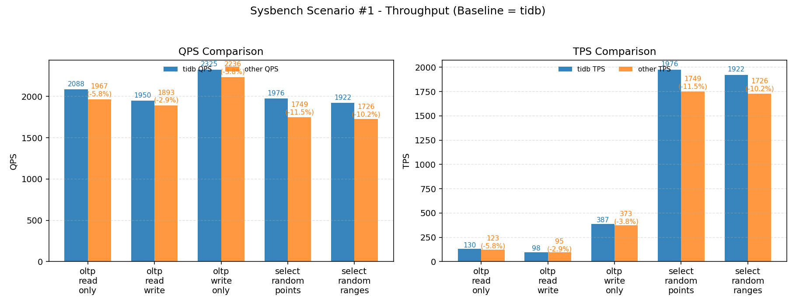

# TiDB Intro for DBA #3

## [Sysbench](https://docs.pingcap.com/zh/tidb/stable/benchmark-tidb-using-sysbench/)

### IDC * 3 (4vCPU 8GB Ram)

Benchmark from TiDB # sysbench_results_#2_tidb


```
OLTP Type             95th percentile latency (ms)  Average latency (ms)  Maximum latency (ms)  Minimum latency (ms)  Events per thread (avg)  Execution time per thread (avg)  Queries per second  Total latency (ms)  Transactions per second
oltp_read_only        19.29                         14.91                 60.86                 8.42                  20121.5000               299.9338                         8584.75 per sec.    2399470.12          536.55 per sec.
oltp_read_write       30.81                         23.90                 809.77                14.52                 12552.2500               299.9713                         6693.06 per sec.    2399770.39          334.65 per sec.
oltp_write_only       10.65                         8.20                  35.96                 4.32                  36552.8750               299.9060                         5848.28 per sec.    2399248.21          974.71 per sec.
select_random_points  3.96                          2.31                  174.16                0.78                  130037.1250              299.8231                         3467.61 per sec.    2398584.53          3467.61 per sec.
select_random_ranges  3.13                          1.95                  29.62                 0.84                  153417.5000              299.7851                         4091.08 per sec.    2398280.45          4091.08 per sec.
```

Benchmark from TiProxy # sysbench_results_#2_tiproxy


```
OLTP Type             95th percentile latency (ms)  Average latency (ms)  Maximum latency (ms)  Minimum latency (ms)  Events per thread (avg)  Execution time per thread (avg)  Queries per second  Total latency (ms)  Transactions per second
oltp_read_only        18.61                         14.37                 145.59                8.83                  20869.0000               299.9442                         8903.67 per sec.    2399553.59          556.48 per sec.
oltp_read_write       28.16                         22.79                 64.23                 14.54                 13163.2500               299.9658                         7019.79 per sec.    2399726.48          350.99 per sec.
oltp_write_only       10.65                         8.32                  38.05                 4.38                  36065.1250               299.9151                         5770.23 per sec.    2399320.49          961.70 per sec.
select_random_points  3.96                          2.28                  37.92                 0.75                  131615.3750              299.8247                         3509.69 per sec.    2398597.29          3509.69 per sec.
select_random_ranges  3.19                          1.93                  19.37                 0.85                  155384.2500              299.8055                         4143.52 per sec.    2398444.19          4143.52 per sec.
```

### IDC * 3 (8vCPU 16GB Ram) 

Benchmark from TiDB # sysbench_results_#19_tidb


```
OLTP Type             95th percentile latency (ms)  Average latency (ms)  Maximum latency (ms)  Minimum latency (ms)  Events per thread (avg)  Execution time per thread (avg)  Queries per second  Total latency (ms)  Transactions per second
oltp_read_only        16.41                         12.37                 37.00                 8.04                  9703.7500                119.9897                         10349.42 per sec.   959917.48           646.84 per sec.
oltp_read_write       23.10                         18.65                 237.12                12.94                 6435.6250                119.9947                         8579.39 per sec.    959957.94           428.97 per sec.
oltp_write_only       7.56                          6.12                  28.07                 3.64                  19618.6250               119.9741                         7846.96 per sec.    959792.64           1307.83 per sec.
select_random_points  3.25                          1.80                  23.90                 0.78                  66620.8750               119.9371                         4441.26 per sec.    959496.86           4441.26 per sec.
select_random_ranges  2.43                          1.65                  16.15                 0.78                  72656.7500               119.9354                         4843.63 per sec.    959483.33           4843.63 per sec.
```

Benchmark from TiProxy # sysbench_results_#19_tiproxy


```
OLTP Type             95th percentile latency (ms)  Average latency (ms)  Maximum latency (ms)  Minimum latency (ms)  Events per thread (avg)  Execution time per thread (avg)  Queries per second  Total latency (ms)  Transactions per second
oltp_read_only        19.65                         15.15                 38.77                 8.89                  7922.6250                119.9936                         8449.29 per sec.    959948.98           528.08 per sec.
oltp_read_write       27.66                         21.65                 48.64                 14.37                 5541.2500                119.9930                         7387.28 per sec.    959943.69           369.36 per sec.
oltp_write_only       8.90                          6.91                  35.87                 4.16                  17365.7500               119.9765                         6945.77 per sec.    959812.25           1157.63 per sec.
select_random_points  3.07                          1.94                  15.81                 0.84                  61701.6250               119.9426                         4113.32 per sec.    959540.60           4113.32 per sec.
select_random_ranges  2.52                          1.78                  13.92                 0.79                  67431.7500               119.9402                         4495.30 per sec.    959521.59           4495.30 per sec.
```


### IDC * 3 + GCP * 3 # 實施 Label 隔離分流

Benchmark From TiDB with IDC # 離峰 # sysbench_results_#1_tidb


```
OLTP Type             95th percentile latency (ms)  Average latency (ms)  Maximum latency (ms)  Minimum latency (ms)  Events per thread (avg)  Execution time per thread (avg)  Queries per second  Total latency (ms)  Transactions per second
oltp_read_only        82.96                         61.28                 297.06                9.43                  1958.6250                120.0307                         2087.83 per sec.    960245.97           130.49 per sec.
oltp_read_write       106.75                        81.99                 196.97                21.92                 1464.1250                120.0439                         1950.36 per sec.    960351.09           97.52 per sec.
oltp_write_only       25.74                         20.64                 251.35                8.47                  5813.2500                119.9913                         2324.89 per sec.    959930.38           387.48 per sec.
select_random_points  7.56                          4.05                  238.00                0.70                  29636.8750               119.9570                         1975.64 per sec.    959655.73           1975.64 per sec.
select_random_ranges  6.91                          4.16                  255.25                0.82                  28838.1250               119.9506                         1922.42 per sec.    959605.08           1922.42 per sec.
```

Benchmark From TiProxy with IDC # 離峰 # sysbench_results_#1_tiproxy


```
OLTP Type             95th percentile latency (ms)  Average latency (ms)  Maximum latency (ms)  Minimum latency (ms)  Events per thread (avg)  Execution time per thread (avg)  Queries per second  Total latency (ms)  Transactions per second
oltp_read_only        86.00                         65.06                 315.10                10.99                 1844.7500                120.0184                         1966.71 per sec.    960147.16           122.92 per sec.
oltp_read_write       108.68                        84.49                 319.32                25.87                 1420.7500                120.0340                         1893.37 per sec.    960271.92           94.67 per sec.
oltp_write_only       26.68                         21.46                 254.66                9.02                  5591.2500                119.9871                         2236.19 per sec.    959896.85           372.70 per sec.
select_random_points  7.84                          4.57                  219.89                0.84                  26235.7500               119.9599                         1748.93 per sec.    959679.16           1748.93 per sec.
select_random_ranges  7.56                          4.63                  228.49                0.92                  25888.1250               119.9552                         1725.76 per sec.    959641.43           1725.76 per sec.
```

Benchmark From TiDB with GCP # 離峰 # sysbench_results_#2_tidb


```
OLTP Type             95th percentile latency (ms)  Average latency (ms)  Maximum latency (ms)  Minimum latency (ms)  Events per thread (avg)  Execution time per thread (avg)  Queries per second  Total latency (ms)  Transactions per second
oltp_read_only        77.19                         37.03                 107.58                12.89                 3240.7500                120.0109                         3455.60 per sec.    960086.85           215.97 per sec.
oltp_read_write       104.84                        59.54                 156.87                21.70                 2016.0000                120.0303                         2685.90 per sec.    960242.20           134.29 per sec.
oltp_write_only       43.39                         31.30                 355.41                13.18                 3834.8750                120.0181                         1533.41 per sec.    960145.15           255.57 per sec.
select_random_points  21.50                         13.95                 251.19                5.94                  8602.8750                119.9994                         573.45 per sec.     959994.93           573.45 per sec.
select_random_ranges  16.71                         11.30                 225.73                6.13                  10623.3750               119.9949                         708.15 per sec.     959959.16           708.15 per sec.
```

Benchmark From TiProxy with GCP # 離峰 # sysbench_results_#2_tiproxy


```
OLTP Type             95th percentile latency (ms)  Average latency (ms)  Maximum latency (ms)  Minimum latency (ms)  Events per thread (avg)  Execution time per thread (avg)  Queries per second  Total latency (ms)  Transactions per second
oltp_read_only        81.48                         39.32                 106.15                14.42                 3052.3750                120.0152                         3254.39 per sec.    960121.81           203.40 per sec.
oltp_read_write       110.66                        62.69                 338.16                24.14                 1914.5000                120.0294                         2550.61 per sec.    960235.33           127.53 per sec.
oltp_write_only       43.39                         30.45                 309.89                14.01                 3941.2500                120.0122                         1576.06 per sec.    960097.20           262.68 per sec.
select_random_points  18.61                         13.47                 246.17                5.98                  8911.6250                119.9990                         594.02 per sec.     959991.74           594.02 per sec.
select_random_ranges  16.12                         11.82                 645.64                6.27                  10153.3750               119.9954                         676.82 per sec.     959963.35           676.82 per sec.
```

Benchmark From TiDB with IDC # 離峰 # 同時執行 # sysbench_results_#3_tidb


```
OLTP Type             95th percentile latency (ms)  Average latency (ms)  Maximum latency (ms)  Minimum latency (ms)  Events per thread (avg)  Execution time per thread (avg)  Queries per second  Total latency (ms)  Transactions per second
oltp_read_only        86.00                         63.06                 348.31                9.20                  1903.3750                120.0274                         2029.10 per sec.    960219.03           126.82 per sec.
oltp_read_write       110.66                        85.02                 320.95                20.34                 1412.2500                120.0628                         1881.49 per sec.    960502.56           94.07 per sec.
oltp_write_only       26.20                         20.97                 225.69                8.71                  5722.3750                119.9886                         2288.44 per sec.    959908.43           381.41 per sec.
select_random_points  7.84                          4.36                  247.67                0.73                  27537.3750               119.9548                         1835.68 per sec.    959638.54           1835.68 per sec.
select_random_ranges  7.04                          4.31                  34.11                 0.84                  27801.2500               119.9553                         1853.29 per sec.    959642.38           1853.29 per sec.
```

Benchmark From TiProxy with IDC # 離峰 # 同時執行 # sysbench_results_#3_tiproxy


```
OLTP Type             95th percentile latency (ms)  Average latency (ms)  Maximum latency (ms)  Minimum latency (ms)  Events per thread (avg)  Execution time per thread (avg)  Queries per second  Total latency (ms)  Transactions per second
oltp_read_only        87.56                         65.30                 302.16                12.06                 1838.2500                120.0310                         1959.76 per sec.    960247.66           122.49 per sec.
oltp_read_write       110.66                        85.65                 186.21                26.73                 1401.3750                120.0328                         1866.93 per sec.    960262.47           93.35 per sec.
oltp_write_only       27.17                         21.91                 299.88                9.10                  5476.1250                119.9932                         2190.04 per sec.    959945.97           365.01 per sec.
select_random_points  8.13                          4.73                  223.14                0.83                  25352.2500               119.9575                         1690.04 per sec.    959660.24           1690.04 per sec.
select_random_ranges  7.30                          4.44                  38.45                 0.87                  27015.7500               119.9626                         1800.92 per sec.    959700.99           1800.92 per sec.
```

Benchmark From TiDB with GCP # 離峰 # 同時執行 # sysbench_results_#4_tidb


```
OLTP Type             95th percentile latency (ms)  Average latency (ms)  Maximum latency (ms)  Minimum latency (ms)  Events per thread (avg)  Execution time per thread (avg)  Queries per second  Total latency (ms)  Transactions per second
oltp_read_only        81.48                         38.66                 350.57                13.05                 3104.7500                120.0292                         3309.73 per sec.    960233.79           206.86 per sec.
oltp_read_write       108.68                        62.33                 342.85                22.18                 1925.6250                120.0264                         2565.35 per sec.    960211.18           128.27 per sec.
oltp_write_only       42.61                         30.37                 289.53                13.89                 3951.8750                120.0026                         1580.42 per sec.    960020.70           263.40 per sec.
select_random_points  18.95                         13.33                 284.87                5.67                  8998.8750                119.9985                         599.81 per sec.     959987.72           599.81 per sec.
select_random_ranges  15.55                         11.26                 227.14                6.03                  10659.3750               119.9954                         710.56 per sec.     959963.39           710.56 per sec.
```

Benchmark From TiProxy with GCP # 離峰 # 同時執行 # sysbench_results_#4_tiproxy


```
OLTP Type             95th percentile latency (ms)  Average latency (ms)  Maximum latency (ms)  Minimum latency (ms)  Events per thread (avg)  Execution time per thread (avg)  Queries per second  Total latency (ms)  Transactions per second
oltp_read_only        81.48                         39.71                 1227.70               14.62                 3022.5000                120.0224                         3222.09 per sec.    960178.94           201.38 per sec.
oltp_read_write       108.68                        63.11                 173.15                24.68                 1901.7500                120.0155                         2534.71 per sec.    960123.95           126.74 per sec.
oltp_write_only       41.85                         30.31                 262.51                13.97                 3958.7500                120.0067                         1583.14 per sec.    960053.68           263.86 per sec.
select_random_points  20.00                         14.27                 290.75                5.79                  8410.8750                119.9969                         560.65 per sec.     959975.57           560.65 per sec.
select_random_ranges  15.55                         10.48                 35.96                 6.05                  11452.0000               119.9957                         763.36 per sec.     959965.76           763.36 per sec.
```

### TiDB 直連與 TiProxy 連線的 Benchmark 差異

- 吞吐：RO/RW/WO 約 -3%<del>-6%；Points / Ranges 約 -10%</del>-12%。
- Benchmark Throughput 沒有太大差異，因為 `計算` `調度` 單元，處理與連線階層無關。



### IDC / GCP TiDB 直連與 TiProxy 連線的 Benchmark 差異


### IDC VM * 3 從 4vCPU -> 8vCPU 效能差異


### IDC VM * 3 -> IDC VM * 3 + GCP VM * 3 效能差異


### TiDB 直連與 TiProxy 連線與 Galera 的 Benchmark 差異

{FIXME}

======================================================================================================================================================

## TPC-C benchmark
> 使用 Percona-Lab/tpcc-mysql ; 不使用 TiUP Bench ; 根據 TiDB 優化過?

### 只參照 sysbench 的問題
- sysbench交易太單純 → 產能被高估
- 均勻存取 → 掩蓋熱點與鎖衝突
- 忽略日誌/複寫 → 產品上線問題逐漸浮現

### 為什麼需要 TPC-C
- 交易真實性：涵蓋五種交易類型，比例固定，能模擬 ERP / 訂單系統的實際行為。
- 複雜關聯：多表 JOIN、二級索引、外鍵依賴，能觸發行鎖、間隙鎖與死鎖情境。
- 查詢計畫穩定性：選擇性變化與複合索引，能反映統計異動導致的計畫抖動。
- HA/複寫檢驗：能觀察叢集提交延遲，驗證同步/半同步複寫下的 SLA。
- 資料寫入壓力：TPC-C 有大量新增/更新，能真實測試系統「寫入資料」的穩定性與延遲，而不是只看讀取速度。
- 併發擴展性：倉庫數量能調整，模擬使用者數成長時，觀察系統是否能隨規模放大而維持效能。
- 與 sysbench 互補：sysbench 適合微調，TPC-C 則提供端到端 SLA 與產能 (tpmC) 評估。

### [TPC-C benchmark 需要關注哪些指標](https://blog.csdn.net/justlpf/article/details/127516283)
- tpmC/TPS：越高代表系統能處理的交易產能越強。
- 延遲 (P95、P99)：顯示交易響應時間分佈，評估 SLA 是否能在實務場景達成。
- System Load 指標：判斷效能瓶頸主要在計算、記憶體，或磁碟 I/O。

### IDC * 3
```
[Summary] DELIVERY - Takes(s): 299.7, Count: 2858, TPM: 572.2, Sum(ms): 282137.9, Avg(ms): 98.7, 50th(ms): 75.5, 90th(ms): 176.2, 95th(ms): 218.1, 99th(ms): 352.3, 99.9th(ms): 486.5, Max(ms): 604.0
[Summary] DELIVERY_ERR - Takes(s): 299.7, Count: 2, TPM: 0.4, Sum(ms): 94.5, Avg(ms): 46.8, 50th(ms): 7.9, 90th(ms): 88.1, 95th(ms): 88.1, 99th(ms): 88.1, 99.9th(ms): 88.1, Max(ms): 88.1
[Summary] NEW_ORDER - Takes(s): 299.9, Count: 33007, TPM: 6602.7, Sum(ms): 1034428.7, Avg(ms): 31.4, 50th(ms): 24.1, 90th(ms): 60.8, 95th(ms): 71.3, 99th(ms): 88.1, 99.9th(ms): 109.1, Max(ms): 1040.2
[Summary] NEW_ORDER_ERR - Takes(s): 299.9, Count: 2, TPM: 0.4, Sum(ms): 75.1, Avg(ms): 37.5, 50th(ms): 28.3, 90th(ms): 48.2, 95th(ms): 48.2, 99th(ms): 48.2, 99.9th(ms): 48.2, Max(ms): 48.2
[Summary] ORDER_STATUS - Takes(s): 299.8, Count: 2954, TPM: 591.3, Sum(ms): 19726.8, Avg(ms): 6.7, 50th(ms): 6.8, 90th(ms): 9.4, 95th(ms): 10.5, 99th(ms): 14.7, 99.9th(ms): 29.4, Max(ms): 37.7
[Summary] PAYMENT - Takes(s): 299.9, Count: 31773, TPM: 6355.8, Sum(ms): 1617272.1, Avg(ms): 50.9, 50th(ms): 52.4, 90th(ms): 71.3, 95th(ms): 79.7, 99th(ms): 96.5, 99.9th(ms): 121.6, Max(ms): 1040.2
[Summary] PAYMENT_ERR - Takes(s): 299.9, Count: 6, TPM: 1.2, Sum(ms): 95.3, Avg(ms): 16.2, 50th(ms): 11.0, 90th(ms): 28.3, 95th(ms): 39.8, 99th(ms): 39.8, 99.9th(ms): 39.8, Max(ms): 39.8
[Summary] STOCK_LEVEL - Takes(s): 299.8, Count: 2912, TPM: 582.8, Sum(ms): 30707.6, Avg(ms): 10.5, 50th(ms): 10.5, 90th(ms): 13.6, 95th(ms): 15.7, 99th(ms): 21.0, 99.9th(ms): 31.5, Max(ms): 48.2
tpmC: 6602.7, tpmTotal: 14704.8, efficiency: 51343.0%
```