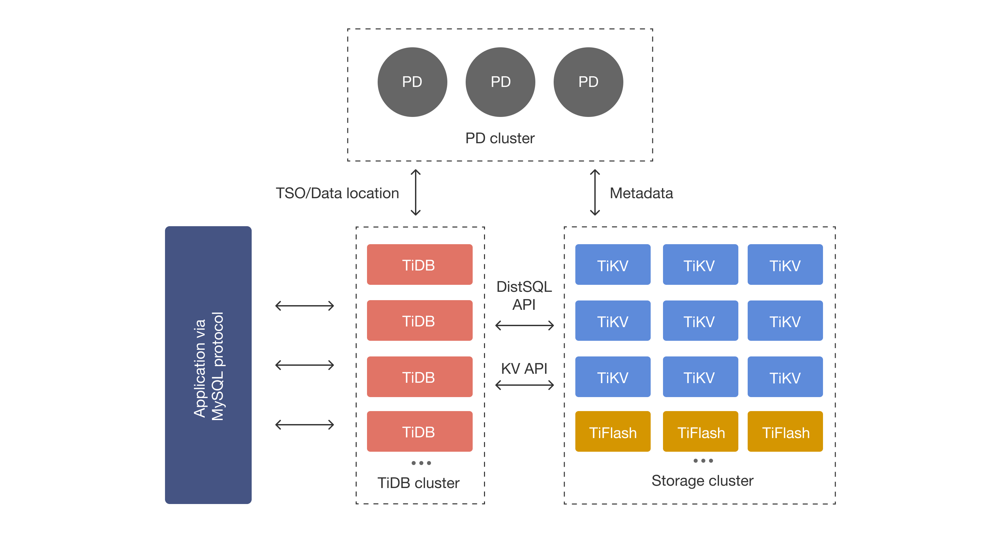
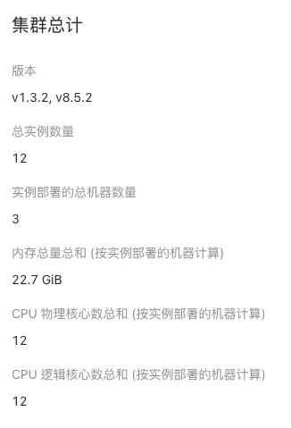

# TiDB Intro for DBA #1

## 不要用 TiDB 跟 MySQL 比較

---

## Structure Compare

- MySQL
```
             +---------+
             |  App    |
             +---------+
                  |
           +---------------+
           |    MySQL      | <--- 寫入 (InnoDB)
           +---------------+
          /                 \
+-----------------+     +-----------------+
|   Storage 主    | ->  |  Storage 從(複製)|
+-----------------+     +-----------------+
```

- TiDB
```
                 +---------+
                 |  App    |
                 +---------+
                      |
         +---------------------------+
         |    多個 TiDB SQL 節點     |
         +---------------------------+
                      |
              +---------------+
              |     PD        |  (元資料/調度)
              +---------------+
                      |
    +------------------------------------------+
    |   多台 TiKV (行存)   |   多台 TiFlash (列存) |
    +------------------------------------------+
```

## Data Flow

- TiDB



```
+-----+
| App |
+-----+
   |
   v
+-------------------------------------------------+
|                     TiDB                        |
| (SQL 解析 / 查詢路由 / 事務協調)                    |
+-------------------------------------------------+
   |                               |
   v                               v
+-----------------+           +---------------------------------+
|       PD        |           |              TiKVs              |
| (叢集管理 / 元資料) |<----->| (行存 / 分布式鍵值 / Raft 多副本) |
+-----------------+           +---------------------------------+
                                     |
                                     v (透過 Raft Learner 機制同步資料)
                               +---------------------------------+
                               |             TiFlash             |
                               | (列存 / 分析查詢 / MPP 引擎)    |
                               +---------------------------------+
```

## 三大單元

### [儲存](https://docs.pingcap.com/zh/tidb/stable/tidb-storage/)
<details>

    - 123
    - 123
    - 123

</details>

### [計算](https://docs.pingcap.com/zh/tidb/stable/tidb-computing/)
<details>

    - 123
    - 123
    - 123

</details>

### [調度](https://docs.pingcap.com/zh/tidb/stable/tidb-scheduling/)
<details>

    - 123
    - 123
    - 123

</details>

---

## TiDB 與 MySQL 的比較

### DBA 架構維運面向

### 產品開發工程面向

---

## Toolchain list

<details>

```
wn.lin@2740-mac13 ~ % tiup list
Available components:
Name                 Owner      Description
----                 -----      -----------
PCC                  community  A tool used to capture plan changes among different versions of TiDB
bench                pingcap    Benchmark database with different workloads
br                   pingcap    TiDB/TiKV cluster backup restore tool.
cdc                  pingcap    CDC is a change data capture tool for TiDB
chaosd               community  An easy-to-use Chaos Engineering tool used to inject failures to a physical node
client               pingcap    Client to connect playground
cloud                pingcap    CLI tool to manage TiDB Cloud
cluster              pingcap    Deploy a TiDB cluster for production
ctl                  pingcap    TiDB controller suite
dm                   pingcap    Data Migration Platform manager
dmctl                pingcap    dmctl component of Data Migration Platform.
pd-recover           pingcap    PD Recover is a disaster recovery tool of PD, used to recover the PD cluster which cannot start or provide services normally.
playground           pingcap    Bootstrap a local TiDB cluster for fun
sync-diff-inspector  pingcap    sync-diff-inspector is a tool used to verify the consistency across different MySQL-compatible data sources.
tidb                 pingcap    TiDB is an open source distributed HTAP database compatible with the MySQL protocol.
tidb-dashboard       pingcap    TiDB Dashboard is a Web UI for monitoring, diagnosing, and managing the TiDB cluster
tidb-lightning       pingcap    TiDB Lightning is a tool used for fast full import of large amounts of data into a TiDB cluster
tikv-br              pingcap    TiKV cluster backup restore tool
tikv-cdc             pingcap    TiKV-CDC is a change data capture tool for TiKV
tiproxy              pingcap    TiProxy is a database proxy that is based on TiDB.
tiup                 pingcap    TiUP is a command-line component management tool that can help to download and install TiDB platform components to the local system
```

</details>

## Structure for test alone

<details>

```
[root@l-k8s-labroom-1 ~]# cat topo.yaml
global:
  user: "root"
  ssh_port: 22
  deploy_dir: "/data/tidb-deploy"
  data_dir: "/data/tidb-data"

monitored:
  node_exporter_port: 9100
  blackbox_exporter_port: 9115

server_configs:
  tidb:
    instance.tidb_slow_log_threshold: 300
  tikv:
    readpool.storage.use-unified-pool: false
    readpool.coprocessor.use-unified-pool: true
  pd:
    replication.enable-placement-rules: true
    replication.location-labels: ["host"]
  tiflash:
    logger.level: "info"

pd_servers:
  - host: 172.24.40.17
    client_port: 2379
    peer_port: 2380
  - host: 172.24.40.18
    client_port: 2379
    peer_port: 2380
  - host: 172.24.40.19
    client_port: 2379
    peer_port: 2380

tidb_servers:
  - host: 172.24.40.17
    port: 4000
    status_port: 10080
  - host: 172.24.40.18
    port: 4000
    status_port: 10080
  - host: 172.24.40.19
    port: 4000
    status_port: 10080

tikv_servers:
  - host: 172.24.40.18
    port: 20160
    status_port: 20180
    config:
      server.labels: { host: "l-k8s-labroom-1" }
  - host: 172.24.40.19
    port: 20160
    status_port: 20180
    config:
      server.labels: { host: "l-k8s-labroom-2" }
  - host: 172.24.40.20
    port: 20160
    status_port: 20180
    config:
      server.labels: { host: "l-k8s-labroom-3" }

tiproxy_servers:
  - host: 172.24.40.17
    port: 6000
    status_port: 6001
  - host: 172.24.40.18
    port: 6000
    status_port: 6001
  - host: 172.24.40.19
    port: 6000
    status_port: 6001

tiflash_servers:
  - host: 172.24.40.20
    config:
      storage.capacity: "90GB"

monitoring_servers:
  - host: 172.24.40.20

grafana_servers:
  - host: 172.24.40.20
```

```
[root@l-k8s-labroom-1 ~]# tiup cluster display tidb-demo
Checking updates for component cluster... Cluster type:       tidb
Cluster name:       tidb-demo
Cluster version:    v8.5.2
Deploy user:        root
SSH type:           builtin
Dashboard URL:      http://172.24.40.17:2379/dashboard
Dashboard URLs:     http://172.24.40.17:2379/dashboard
Grafana URL:        http://172.24.40.20:3000
ID                  Role        Host          Ports                            OS/Arch       Status  Data Dir                         Deploy Dir
--                  ----        ----          -----                            -------       ------  --------                         ----------
172.24.40.20:3000   grafana     172.24.40.20  3000                             linux/x86_64  Up      -                                /data/tidb-deploy/grafana-3000
172.24.40.17:2379   pd          172.24.40.17  2379/2380                        linux/x86_64  Up|UI   /data/tidb-data/pd-2379          /data/tidb-deploy/pd-2379
172.24.40.18:2379   pd          172.24.40.18  2379/2380                        linux/x86_64  Up      /data/tidb-data/pd-2379          /data/tidb-deploy/pd-2379
172.24.40.19:2379   pd          172.24.40.19  2379/2380                        linux/x86_64  Up|L    /data/tidb-data/pd-2379          /data/tidb-deploy/pd-2379
172.24.40.20:9090   prometheus  172.24.40.20  9090/12020                       linux/x86_64  Up      /data/tidb-data/prometheus-9090  /data/tidb-deploy/prometheus-9090
172.24.40.17:4000   tidb        172.24.40.17  4000/10080                       linux/x86_64  Up      -                                /data/tidb-deploy/tidb-4000
172.24.40.18:4000   tidb        172.24.40.18  4000/10080                       linux/x86_64  Up      -                                /data/tidb-deploy/tidb-4000
172.24.40.19:4000   tidb        172.24.40.19  4000/10080                       linux/x86_64  Up      -                                /data/tidb-deploy/tidb-4000
172.24.40.20:9000   tiflash     172.24.40.20  9000/3930/20170/20292/8234/8123  linux/x86_64  Up      /data/tidb-data/tiflash-9000     /data/tidb-deploy/tiflash-9000
172.24.40.18:20160  tikv        172.24.40.18  20160/20180                      linux/x86_64  Up      /data/tidb-data/tikv-20160       /data/tidb-deploy/tikv-20160
172.24.40.19:20160  tikv        172.24.40.19  20160/20180                      linux/x86_64  Up      /data/tidb-data/tikv-20160       /data/tidb-deploy/tikv-20160
172.24.40.20:20160  tikv        172.24.40.20  20160/20180                      linux/x86_64  Up      /data/tidb-data/tikv-20160       /data/tidb-deploy/tikv-20160
172.24.40.17:6000   tiproxy     172.24.40.17  6000/6001                        linux/x86_64  Up      -                                /data/tidb-deploy/tiproxy-6000
172.24.40.18:6000   tiproxy     172.24.40.18  6000/6001                        linux/x86_64  Up      -                                /data/tidb-deploy/tiproxy-6000
172.24.40.19:6000   tiproxy     172.24.40.19  6000/6001                        linux/x86_64  Up      -                                /data/tidb-deploy/tiproxy-6000
Total nodes: 15
```

</details>

---

## Structure for Production

### 需要一個叢集還是多個叢集？

#### 定義
- 什麼是單一叢集: 整個 IDC Prod 所有產品一個叢集

- 什麼是多個叢集
  - IDC Prod 一個產品一個叢集
  - `Prod 一個叢集` 還是 `DR Site 一個叢集`

#### 延伸討論
- Cost / Budget 成本
- Availability / SLA 可用性
- Performance / Latency 效能
- Data Isolation / Compliance 資料隔離
- Operational Complexity 運維負擔
- Scalability / Flexibility 可擴展性

- 資料同步與一致性的複雜度會在哪個面向發生
- 就算有 TiDB 了以後，如果跨專線的架構效能滿足部分產品需求後，我們需要 `Active/Active` 還是 `Active/Standby`?

---

### 如果我們選擇了 Active/Active ; 如果需要部署 IDC / GCP 的話應該如何設計？

- Linux network interface bonding/teaming, at least 2 interfaces.


### 延伸討論
- 如果 IDC / GCP 組建的單一叢集效能可以接受 ; 我們可以執行以下操作嗎？
    - 分配流量控制 `50%/50%`, `0%/100%` or `100%/0%`
- 如果專線同步資料讓單一叢集資料同步變成問題的話，那 Async 資料同步如何實作？
- [TiCDC 雙向同步如何實作？](https://docs.pingcap.com/zh/tidb/stable/ticdc-bidirectional-replication/#%E4%BD%BF%E7%94%A8%E9%99%90%E5%88%B6)

### [Label 分流策略如何實作](https://docs.pingcap.com/zh/tidb/stable/schedule-replicas-by-topology-labels/)
```
server_configs:
  tidb:
    instance.tidb_slow_log_threshold: 300
    graceful-wait-before-shutdown: 30
    max-server-connections: 4096
    log.level: "error"
  tikv:
    log.level: "error"
    readpool.storage.use-unified-pool: false
    readpool.coprocessor.use-unified-pool: true
    storage.block-cache.capacity: "6GB"
  pd:
    replication.enable-placement-rules: true
    replication.location-labels: ["zone", "host"]
  tiproxy:
    balance.label-name: "zone"
    proxy.max-connections: 10000
  tiflash:
    logger.level: "info"

tidb_servers:
  - host: 172.24.40.17
    port: 4000
    status_port: 10080
    config:
      labels: { zone: "idc" }

tikv_servers:
  - host: 172.24.40.17
    port: 20160
    status_port: 20180
    config:
      server.labels: { zone: "idc", host: "l-k8s-labroom-1" }

tiproxy_servers:
  - host: 172.24.40.17
    port: 6000
    status_port: 6001
    config:
      labels: { zone: "idc" }
```

### 如果沒分流調度的 TiDB 資源是如何配比？


---

### 硬體規格有哪些要求

- TiDB 叢集各個元件的設定推薦？ 
    - TiDB 需要 CPU 和記憶體比較好的機器。
    - PD 裡面存了叢集元訊息，會有頻繁的讀寫請求，對磁碟 I/O 要求相對比較高，磁碟太差會影響整個叢集效能，推薦 SSD 磁碟，空間不用太大。另外集群 Region 數量越多對 CPU、記憶體的要求越高。
    - TiKV 對 CPU、記憶體、磁碟需求都比較高，一定要用 SSD 磁碟。

- TiDB Cluster Deploy to VM with [TiUP](https://docs.pingcap.com/zh/tidb/stable/tiup-overview/)

- TiDB Cluster Deploy to K8s with [TiDB-Operator](https://github.com/pingcap/tidb-operator)

- 從 Spec 定義

- 從 已知 TPS / QPS 定義

### 空間要求

```
目標 TiKV 叢集必須有足夠空間接收新匯入的資料。除了標準硬體配置以外，
目標 TiKV 叢集的總儲存空間必須大於資料來源大小 × 副本數量 × 2。
例如，叢集預設使用 3 副本，那麼總儲存空間需為資料來源大小的 6 倍以上。
公式中的 2 倍可能難以理解，其依據是下列因素的估算空間佔用：

索引會佔據額外的空間。
RocksDB 的空間放大效應。
```

> Question: 3 副本 ; 分散 100GB 的 Storage 要擴增空間如何處理?
- Option:
    - 擴增現有副本大小?
    - 增加現有副本數量?
    - 延伸問題，Storage 單一副本容量越大會有什麼問題？

---

## [Resource Control](https://docs.pingcap.com/zh/tidb/dev/tidb-resource-control-ru-groups/)

### 為什麼需要 Resource Control

### Resource Control 具體運作方法

## [你可能會有這些問題](https://docs.pingcap.com/zh/tidb/stable/faq-overview/)

### RAFT protocol 副本數計算與 SLA 的關聯？

[To take advantage of Raft's reliability, the following conditions must be met in a real deployment scenario:](https://docs.pingcap.com/tidb/stable/multi-data-centers-in-one-city-deployment/#raft-protocol)

- Use at least three servers in case one server fails.
- Use at least three racks in case one rack fails.
- Use at least three AZs in case one AZ fails.
- Deploy TiDB in at least three regions in case data safety issue occurs in one region.

### SELECT 1 到底驗證了什麼？

### 所以現有 MySQL 資料表結構匯入 TIDB 的長相是什麼？

### [RAFT Leader 的控制手段 & 狀態確認手段](https://google.com)

PD 的 Leader 切換手段
```
[root@l-k8s-labroom-1 ~]# make move-pd-leader
tiup ctl:v8.5.2 pd -u http://172.24.40.17:2379 config set dashboard-address http://172.24.40.17:2379
```

PD 後台數據會放在 dashboard.sqlite.db
```
[root@g-k8s-labroom-1 pd-2379]# ls -al
total 276
drwxr-xr-x 5 root root     84 Aug 25 06:59 .
drwxr-xr-x 5 root root     59 Aug 25 06:02 ..
-rw-r--r-- 1 root root 278528 Aug 25 06:56 dashboard.sqlite.db
drwxr-xr-x 2 root root    104 Aug 25 06:59 hot-region
drwx------ 4 root root     29 Aug 25 06:59 member
drwxr-xr-x 2 root root    122 Aug 25 06:59 region-meta
[root@g-k8s-labroom-1 pd-2379]# pwd
/data/tidb-data/pd-2379
```

並於切換完成後轉入新的 PD Leader
```
[root@l-k8s-labroom-1 pd-2379]# ls -al
total 1024
drwxr-xr-x 5 root root     84 Aug 26 16:22 .
drwxr-xr-x 5 root root     59 Aug 25 14:02 ..
-rw-r--r-- 1 root root 851968 Aug 26 16:22 dashboard.sqlite.db
drwxr-xr-x 2 root root     85 Aug 25 14:03 hot-region
drwx------ 4 root root     29 Aug 25 14:03 member
drwxr-xr-x 2 root root     85 Aug 25 14:03 region-meta
[root@l-k8s-labroom-1 pd-2379]# pwd
/data/tidb-data/pd-2379
```

### [參數同步手段？](https://google.com)

### [資料來源 pt-osc 如何執行](https://google.com)

### [有哪些已知的 Best Practice](https://google.com)

### [ProxySQL 集成支援](https://docs.pingcap.com/zh/tidb/stable/dev-guide-proxysql-integration/)
- 什麼情境需要 ProxySQL？
- ProxySQL 能解決什麼問題？

### Dashboards 要看什麼

- TiDB Monitor
- TiDB Grafana
  - Cluster Overview
    - tidb-demo-performance-overview
    - tidb-demo-tiproxy-summary
    - tidb-demo-tidb-summary
    - tidb-demo-pd
    - tidb-demo-tikv-summary
  - Component & Runtime Panels
    - tidb-demo-tidb-runtime
    - tidb-demo-tikv-details
    - tidb-demo-tikv-raw
    - tidb-demo-disk-performance
  - Diagnostics & Troubleshooting
    - tidb-demo-tidb-resource-control
    - tidb-demo-tikv-trouble-shooting

### [TiProxy 負載平衡策略](https://docs.pingcap.com/zh/tidb/stable/tiproxy-load-balance/)

- 如何避免跨區存取

### Runtime config pattern

- Ref: [TiDB / PD / TiKV 當前配置診斷](https://104cloud-my.sharepoint.com/personal/wn_lin_104_com_tw/Documents/Microsoft%20Teams%20%E8%81%8A%E5%A4%A9%E6%AA%94%E6%A1%88/TiDB%20Config.pdf)

- 確認 TiProxy metrics status
```
> curl http://172.24.40.17:6001/metrics/
```

- [TiProxy 支援哪些設定](https://docs.pingcap.com/zh/tidb/stable/tiproxy-configuration/)
```
> curl http://172.24.40.17:6001/api/admin/config/
workdir = '/data/tidb-deploy/tiproxy-6000/work'
enable-traffic-replay = true

[proxy]
addr = '0.0.0.0:6000'
advertise-addr = '172.24.40.17'
pd-addrs = '10.160.152.21:2379,10.160.152.22:2379,172.24.40.17:2379,172.24.40.18:2379,172.24.40.19:2379'
graceful-close-conn-timeout = 15

[proxy.frontend-keepalive]
enabled = true

[proxy.backend-healthy-keepalive]
enabled = true
idle = 60000000000
cnt = 5
intvl = 3000000000
timeout = 15000000000

[proxy.backend-unhealthy-keepalive]
enabled = true
idle = 10000000000
cnt = 5
intvl = 1000000000
timeout = 5000000000

[api]
addr = '0.0.0.0:6001'

[security]
[security.server-tls]
min-tls-version = '1.2'

[security.server-http-tls]
min-tls-version = '1.2'

[security.cluster-tls]
min-tls-version = '1.2'

[security.sql-tls]
min-tls-version = '1.2'

[log]
encoder = 'tidb'
level = 'info'

[log.log-file]
filename = '/data/tidb-deploy/tiproxy-6000/log/tiproxy.log'
max-size = 300
max-days = 3
max-backups = 3

[balance]
policy = 'resource'
```

---

## Benchmark Scenario Design

### [需要關注哪些系統容量指標](https://ganhua.wang/day-5-rpsqpstps)
- Latency
- Request per Second (RPS) by SELECT 1.
- Latency 之於 RPS 的交互影響
- Concurrency Optimization Strategies.
- Transactions Per Second (TPS) & Queries per second (QPS).
- TPC-C
  - 123
  - 123

---

### 壓力測試規格資訊

#### TiDB Application
```
Cluster type:       tidb
Cluster version:    v8.5.2
```

#### vSphere VM
```
OS: Almalinux 8.7
Instance: 4vCPU 8GB Ram
Storage: 100GB with PureStorage
```

#### GCP Compute Engine
```
OS: CentOS Stream release 9
Instance: c2-standard-4 (4vCPU 8GB Ram)
Storage: NVMe 375GB
```

#### K8s
```
```

---

## Chapter for Benchmark

### [RPS-Benchmark](https://github.com/heavenruler/dba_career/blob/master/tidb/TiDB_Intro_for_DBA_%232.md#rps-benchmark)

### [Sysbench](https://codimd.104.com.tw/s/lX0Zj_rmA)

### [tpcc-benchmark](https://codimd.104.com.tw/s/lX0Zj_rmA)


---

## 壓力測試數據下的結論現況

- Single Threads 條件下，相同的 RPS 再經過 TiDB 與 TiProxy 的效能衰減不討論 ; 因為情境不會發生。

- 經過 A10 NAT Load Balance by TiDB 的 Error Rate 成因
    - 觸發 Error Rate 條件: select 1 超過 timeout 沒回應 & Exception catched .

- 高併發的 RPS 經過 TiProxy 後的效能衰減 ;  sysbench 驗證後期未發生 ; 僅 RPS 測試階段問題 ; 可確認 Exception Content

- 高併發負載下的 Response Time 是需要關注的議題嗎？ (P95/P99 指標能量化這個疑慮嗎？)

- [Cross IDC / GCP] 分散式資料庫架構下，跨專線的效能衰減

- GCP Load Balance 的效能會因負載平衡形式 Target Pool 或 Managed Instance Group (MIG) 產生差異？

- K8s Sandbox 目前尚未取得
    - TiDB Pod 資源換算 VM 對標
    - 

- 下個 Sprint 工項重點
    - 可提前 AC-API 在 TiDB 的整合環境測試
        - Schema 匯入。
        - 直接多地分散式架構測試。
        - Connector Driver / ODBC 調適。
    - Benchmark compare
    - K8s 環境建置

- [多寫資料庫 Galera Cluster 架構實作前的思考](https://codimd.104.com.tw/s/mRB2OUAhe)
- ATS Pro 產品揭露調整回 Single Write 時機

---

#### Deploy on K8s with tidb-operator

- Ref: [tidb-operator](https://github.com/pingcap/tidb-operator)

---

### Performance Impact Analysis

#### 各部件 Scale-Out 要解決什麼問題？

##### TiProxy
- 改善 連線數處理能力：支持更多客戶端 TCP Session，同時提供負載平衡。
- 降低 連線熱點：避免所有 Session 都集中到單一 TiDB 或單一 Proxy。
- 減少 連線管理延遲：縮短建立 / 維護連線時的延遲。

##### TiDB
- 改善 SQL 執行效能：增加 SQL Parser / Optimizer / Executor 的總處理能力。
- 提升 高併發查詢吞吐：支援更多 OLTP 短交易並行執行。
- 減輕 單節點 CPU / Memory 壓力：降低單一節點 CPU 過高造成的排隊延遲。
- 提高 查詢可用性：當部分 TiDB 負載過高時，能快速分攤到其他 TiDB。

##### PD
- 增強 集群調度韌性：允許更多元件同時查詢 Region 分佈資訊。
- 減少 TiKV Region / Leader 調度瓶頸：同時處理更多 metadata 請求。
- 提升 Fault-tolerant 協調能力：避免單 PD 過載造成 metadata 存取延遲。

> PD 本身水平擴充數量需要保持奇數，主要用於高可用與容錯，效能提升有限。

##### TiKV
- 擴張 儲存容量：提供更大整體存放規模，降低單機壓力。
- 分散 讀寫 I/O 負載：將 Region 分散在更多節點，提升整體吞吐量。
- 調整 熱點分佈：可將熱門資料移動或切分至更多 TiKV，避免 I/O 或網路成為瓶頸。
- 提升 交易一致性處理並行度：更多 Raft Group 同時處理寫入，提升寫入效能。

---

### 驗證

#### [How to Scale Your TiDB Cluster](https://docs.pingcap.com/tidbcloud/scale-tidb-cluster/)

- Node number of TiDB, TiKV
- vCPU and RAM of TiDB, TiKV
- Storage of TiKV

```
# scale_out_tiproxy.yaml
tiproxy_servers:
  - host: 172.24.40.20
    port: 6000
    status_port: 6001
```
> tiup cluster scale-out tidb-demo scale_out_tiproxy.yaml --user root -p

#### Scale-Out 要解決什麼問題

#### 如何 Scale-In
> tiup cluster scale-in tidb-demo -N 172.24.40.17:6000

---

#### Benchmark 數據解讀


---

## 哪些設定會影響上述 Benchmark 表現

### TiProxy
```
[root@l-k8s-labroom-2 conf]# cat /data/tidb-deploy/tiproxy-6000/conf/tiproxy.toml
# WARNING: This file is auto-generated. Do not edit! All your modification will be overwritten!
# You can use 'tiup cluster edit-config' and 'tiup cluster reload' to update the configuration
# All configuration items you want to change can be added to:
# server_configs:
#   tiproxy:
#     aa.b1.c3: value
#     aa.b2.c4: value
[api]
addr = "0.0.0.0:6001"

[log]
[log.log-file]
filename = "/data/tidb-deploy/tiproxy-6000/log/tiproxy.log"

[proxy]
addr = "0.0.0.0:6000"
advertise-addr = "172.24.40.18"
pd-addrs = "172.24.40.17:2379,172.24.40.18:2379,172.24.40.19:2379"
```

### TiDB
```
[root@l-k8s-labroom-2 conf]# cat /data/tidb-deploy/tidb-4000/conf/tidb.toml
# WARNING: This file is auto-generated. Do not edit! All your modification will be overwritten!
# You can use 'tiup cluster edit-config' and 'tiup cluster reload' to update the configuration
# All configuration items you want to change can be added to:
# server_configs:
#   tidb:
#     aa.b1.c3: value
#     aa.b2.c4: value
[instance]
tidb_slow_log_threshold = 300

[security]
session-token-signing-cert = "/data/tidb-deploy/tidb-4000/tls/tiproxy-session.crt"
session-token-signing-key = "/data/tidb-deploy/tidb-4000/tls/tiproxy-session.key"
```

### PD
```
[root@l-k8s-labroom-2 conf]# cat /data/tidb-deploy/pd-2379/conf/pd.toml
# WARNING: This file is auto-generated. Do not edit! All your modification will be overwritten!
# You can use 'tiup cluster edit-config' and 'tiup cluster reload' to update the configuration
# All configuration items you want to change can be added to:
# server_configs:
#   pd:
#     aa.b1.c3: value
#     aa.b2.c4: value
[replication]
enable-placement-rules = true
location-labels = ["host"]
```

### TiKV
```
[root@l-k8s-labroom-2 conf]# cat /data/tidb-deploy/tikv-20160/conf/tikv.toml
# WARNING: This file is auto-generated. Do not edit! All your modification will be overwritten!
# You can use 'tiup cluster edit-config' and 'tiup cluster reload' to update the configuration
# All configuration items you want to change can be added to:
# server_configs:
#   tikv:
#     aa.b1.c3: value
#     aa.b2.c4: value
[readpool]
[readpool.coprocessor]
use-unified-pool = true
[readpool.storage]
use-unified-pool = false

[server]
[server.labels]
host = "l-k8s-labroom-1"
```

### To apply configuration changes, execute tiup cluster edit-config {cluster_name} followed by tiup cluster reload {cluster_name}.
```
global:
  user: root
  ssh_port: 22
  ssh_type: builtin
  deploy_dir: /data/tidb-deploy
  data_dir: /data/tidb-data
  os: linux
  systemd_mode: system
monitored:
  node_exporter_port: 9100
  blackbox_exporter_port: 9115
  deploy_dir: /data/tidb-deploy/monitor-9100
  data_dir: /data/tidb-data/monitor-9100
  log_dir: /data/tidb-deploy/monitor-9100/log
server_configs:
  tidb:
    instance.tidb_slow_log_threshold: 300
  tikv:
    readpool.coprocessor.use-unified-pool: true
    readpool.storage.use-unified-pool: false
  pd:
    replication.enable-placement-rules: true
    replication.location-labels:
    - host
  tso: {}
  scheduling: {}
  tidb_dashboard: {}
  tiflash:
    logger.level: info
  tiproxy: {}
  tiflash-learner: {}
  pump: {}
  drainer: {}
  cdc: {}
  kvcdc: {}
  grafana: {}
tidb_servers:
- host: 172.24.40.17
  ssh_port: 22
  port: 4000
  status_port: 10080
  deploy_dir: /data/tidb-deploy/tidb-4000
  log_dir: /data/tidb-deploy/tidb-4000/log
  config:
    security.session-token-signing-cert: /data/tidb-deploy/tidb-4000/tls/tiproxy-session.crt
    security.session-token-signing-key: /data/tidb-deploy/tidb-4000/tls/tiproxy-session.key
  arch: amd64
  os: linux
- host: 172.24.40.18
  ssh_port: 22
  port: 4000
  status_port: 10080
  deploy_dir: /data/tidb-deploy/tidb-4000
  log_dir: /data/tidb-deploy/tidb-4000/log
  config:
    security.session-token-signing-cert: /data/tidb-deploy/tidb-4000/tls/tiproxy-session.crt
    security.session-token-signing-key: /data/tidb-deploy/tidb-4000/tls/tiproxy-session.key
  arch: amd64
  os: linux
- host: 172.24.40.19
  ssh_port: 22
  port: 4000
  status_port: 10080
  deploy_dir: /data/tidb-deploy/tidb-4000
  log_dir: /data/tidb-deploy/tidb-4000/log
  config:
    security.session-token-signing-cert: /data/tidb-deploy/tidb-4000/tls/tiproxy-session.crt
    security.session-token-signing-key: /data/tidb-deploy/tidb-4000/tls/tiproxy-session.key
  arch: amd64
  os: linux
tikv_servers:
- host: 172.24.40.18
  ssh_port: 22
  port: 20160
  status_port: 20180
  deploy_dir: /data/tidb-deploy/tikv-20160
  data_dir: /data/tidb-data/tikv-20160
  log_dir: /data/tidb-deploy/tikv-20160/log
  config:
    server.labels:
      host: l-k8s-labroom-1
  arch: amd64
  os: linux
- host: 172.24.40.19
  ssh_port: 22
  port: 20160
  status_port: 20180
  deploy_dir: /data/tidb-deploy/tikv-20160
  data_dir: /data/tidb-data/tikv-20160
  log_dir: /data/tidb-deploy/tikv-20160/log
  config:
    server.labels:
      host: l-k8s-labroom-2
  arch: amd64
  os: linux
- host: 172.24.40.20
  ssh_port: 22
  port: 20160
  status_port: 20180
  deploy_dir: /data/tidb-deploy/tikv-20160
  data_dir: /data/tidb-data/tikv-20160
  log_dir: /data/tidb-deploy/tikv-20160/log
  config:
    server.labels:
      host: l-k8s-labroom-3
  arch: amd64
  os: linux
tiflash_servers: []
tiproxy_servers:
- host: 172.24.40.17
  ssh_port: 22
  port: 6000
  status_port: 6001
  deploy_dir: /data/tidb-deploy/tiproxy-6000
  arch: amd64
  os: linux
- host: 172.24.40.18
  ssh_port: 22
  port: 6000
  status_port: 6001
  deploy_dir: /data/tidb-deploy/tiproxy-6000
  arch: amd64
  os: linux
- host: 172.24.40.19
  ssh_port: 22
  port: 6000
  status_port: 6001
  deploy_dir: /data/tidb-deploy/tiproxy-6000
  arch: amd64
  os: linux
pd_servers:
- host: 172.24.40.17
  ssh_port: 22
  name: pd-172.24.40.17-2379
  client_port: 2379
  peer_port: 2380
  deploy_dir: /data/tidb-deploy/pd-2379
  data_dir: /data/tidb-data/pd-2379
  log_dir: /data/tidb-deploy/pd-2379/log
  arch: amd64
  os: linux
- host: 172.24.40.18
  ssh_port: 22
  name: pd-172.24.40.18-2379
  client_port: 2379
  peer_port: 2380
  deploy_dir: /data/tidb-deploy/pd-2379
  data_dir: /data/tidb-data/pd-2379
  log_dir: /data/tidb-deploy/pd-2379/log
  arch: amd64
  os: linux
- host: 172.24.40.19
  ssh_port: 22
  name: pd-172.24.40.19-2379
  client_port: 2379
  peer_port: 2380
  deploy_dir: /data/tidb-deploy/pd-2379
  data_dir: /data/tidb-data/pd-2379
  log_dir: /data/tidb-deploy/pd-2379/log
  arch: amd64
  os: linux
monitoring_servers:
- host: 172.24.40.20
  ssh_port: 22
  port: 9090
  ng_port: 12020
  deploy_dir: /data/tidb-deploy/prometheus-9090
  data_dir: /data/tidb-data/prometheus-9090
  log_dir: /data/tidb-deploy/prometheus-9090/log
  external_alertmanagers: []
  arch: amd64
  os: linux
grafana_servers:
- host: 172.24.40.20
  ssh_port: 22
  port: 3000
  deploy_dir: /data/tidb-deploy/grafana-3000
  arch: amd64
  os: linux
  username: admin
  password: admin
  anonymous_enable: false
  root_url: ""
  domain: ""
```

---

## 總結：我們現在需要先做什麼?

### 科學計算的評估

### 維運情境所有案例實際測試